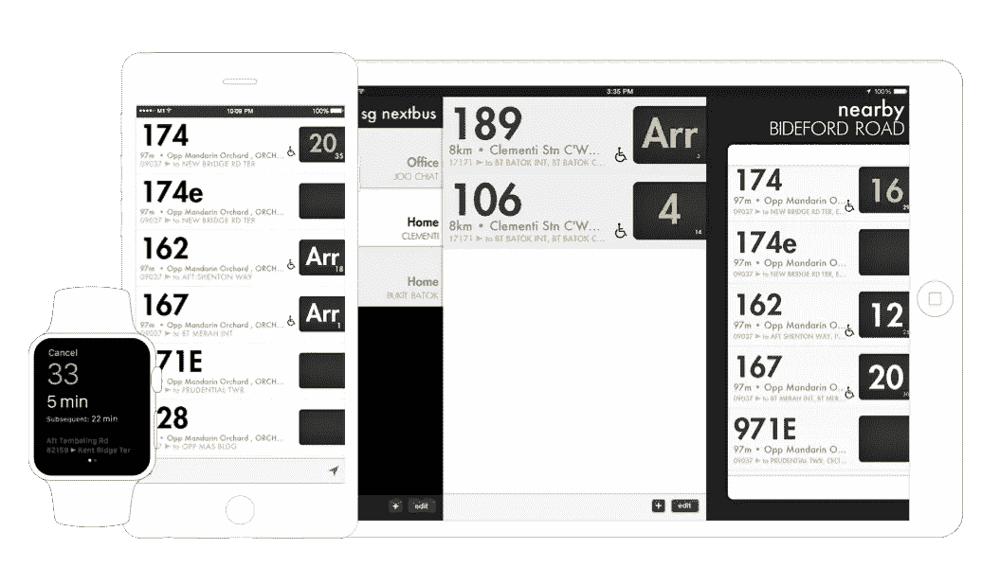

# 使用谷歌主页和亚马逊 Echo 的 SG NextBus 智能家居

> 原文：<https://medium.com/hackernoon/a-smart-home-with-sg-nextbus-using-google-home-amazon-echo-704342089727>

如果你有一部手机，并且经常乘坐公交车上下班，那么你很有可能使用过或者至少听说过[SG bus](https://itunes.apple.com/sg/app/sg-buses-singapore-bus-guide/id384353741?mt=8)或者 [SG NextBus](https://appsto.re/us/nxm6w.i) 。

SG NextBus in iOS and watchOS

它们最常用于查明下一辆公共汽车何时到达车站。它们也是首批在 *iOS* 、 *Android* 、 *Windows Phone* 、 *Blackberry 10* 、 *Pebble Watch* 和 *Apple Watch* 上推出的应用之一。

有了公交车到达时间，通勤者可以做出明智的决定，决定是乘公交车还是乘 *MRT* (我们的地铁版本)更快到达目的地。他们也能发现哪辆公共汽车能更快地把他们带到目的地。

还有另一个用例。像新加坡的大多数家庭和办公室一样，我的家离公共汽车站只有几分钟的路程。为了避免在公交车站等车，我和我的同事会在离开办公室前快速查看公交车到站的时间。虽然这不是一个大麻烦，但这是我们几乎每天都要做的事情。

但是，如果这可以是一个更无缝的体验呢？

新加坡的一些公共汽车站有公共汽车到达时间的显示板。他们很好地一目了然地获取信息。想象一下，在家里/办公室里有一个显示面板，你只需扫一眼就能知道你是否应该现在离开去赶公交车。 [SG NextBus for LaMetric](http://apps.lametric.com/apps/sg_nextbus/1351) 是我第一次尝试将我的移动应用程序应用于智能家庭/办公室。LaMetric 是一款智能时钟。由于它总是显示，它模仿这些显示面板。

*SG NextBus app for Lametric Smart Clock, showing arrival time for bus 30 at pre-configured bus stop.*

一旦您通过配套应用程序将 *SG NextBus* 安装在*lame metric*中，只需配置一个感兴趣的公交编号和公交车站，您就大功告成了。它显示你的公共汽车全天什么时候到达。这是一个免提解决方案，最大限度地减少分心。

lame metric 是一款相当小众的设备。它是在 KickStarter 上推出的[，现在公众可以购买。](https://www.kickstarter.com/projects/smartatoms/lametric-customizable-smart-ticker-for-life-and-bu)[另一方面，亚马逊 Echo](https://www.amazon.com/Amazon-Echo-Bluetooth-Speaker-with-WiFi-Alexa/dp/B00X4WHP5E) 和 [Google Home](https://madeby.google.com/home/) 更受欢迎，更有可能出现在家庭和办公室中。

它们类似于 Siri，但内置于独立扬声器中。你可以让他们控制你家里/办公室的事情，或者向他们询问信息。

随着*SG bus/SG next bus*现可用于 *Amazon Echo* 和 *Google Home* ，你也可以问他们下一辆巴士什么时候到达。

*亚马逊 Echo* 由语音助手 *Alexa* 驱动。你可以用手机上的配套 app，也叫 *Alexa* 添加 *Alexa 技能*。 [SG 巴士是可用技能之一](https://www.alexaskillstore.com/SG-Buses/15378)。

Use the mobile companion app called Alexa to find and install SG Buses Alexa Skill. If you have default bus stop set, Alexa will announce arrival time for buses at the bus stop automatically when asked. You can ask for buses elsewhere if you provide the bus stop number.

有了谷歌主页就更容易了。没有要安装的应用。问问谷歌就知道了。

> 好的谷歌，问 SG NextBus 下一班车什么时候到？

这些平台非常适合智能家居。如果你是新加坡的通勤者，现在还有一个额外的选择。

如果你有机会试用这些应用程序，请务必[将你的反馈发送给我](http://twitter.com/honcheng)。这些平台对我来说仍然是新的，如果你能帮助我了解你如何使用它们，我将不胜感激。

The first time the app is launched in Google Home, SG NextBus will guide users to setup a default bus stop and bus numbers. This requires users to give permission to the app to access user location’s to find bus stops nearby.

*On subsequent launch, the app hints how users can ask for bus arrival time.*

> [黑客中午](http://bit.ly/Hackernoon)是黑客如何开始他们的下午。我们是 [@AMI](http://bit.ly/atAMIatAMI) 家庭的一员。我们现在[接受投稿](http://bit.ly/hackernoonsubmission)并乐意[讨论广告&赞助](mailto:partners@amipublications.com)机会。
> 
> 如果你喜欢这个故事，我们推荐你阅读我们的[最新科技故事](http://bit.ly/hackernoonlatestt)和[趋势科技故事](https://hackernoon.com/trending)。直到下一次，不要把世界的现实想当然！

