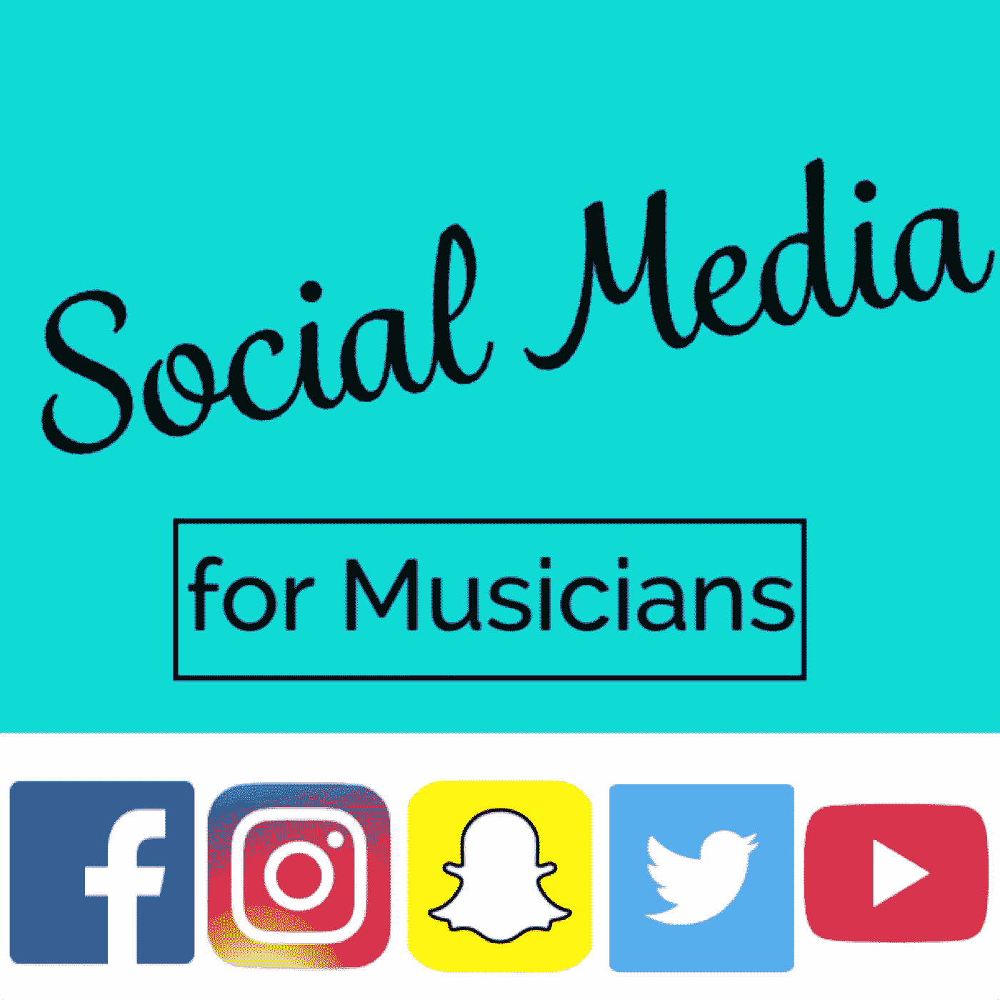

# 音乐人的社交媒体起步

> 原文：<https://medium.com/hackernoon/a-social-media-jumpstart-for-musicians-a57a7db6b36c>

众所周知，社交媒体现在比以往任何时候都更重要。每个人都在至少一个平台上。也就是说，注意到注意力在哪里，并利用它为自己服务，这是一个非常明智的决定。

在接下来的几周内，我将撰写一系列文章，介绍在各个平台上吸引和吸引受众的可靠策略。这篇文章将介绍一些适用于所有社交媒体工作的原则，所以你可能想把它收藏起来或者保存起来以备将来参考。

在我们讨论社交媒体之前，我真的想强调拥有高质量产品的重要性。如果你的 CD 和你的乐队很糟糕，伟大的营销只会暴露它到底有多糟糕。如果你的现场表演很糟糕，伟大的营销只会让更多的人谈论你的现场表演有多糟糕。不管你在营销计划中投入多少时间，垃圾产品仍然是垃圾产品。

话虽如此，我们还是开始吧。

## 被发现的社交媒体

随着如此多的人通过他们的社交平台积极地消费观点和故事，毫无疑问，你可能会接触到新的眼睛和耳朵。有这么多快速简单的策略来找到更多的观点。

首先，我想简单谈谈**内容。内容是社交媒体游戏中唯一重要的东西。如果你不生产内容，你的观众就找不到任何东西。这可能是快速视频，漂亮的图形，有趣的状态更新等。但是，要确保你追求的是质量，而不是数量。**

(我们将在后面的文章中讨论高质量的内容开发。)

第二，我们需要确保我们正在寻找创造一个有机的和自发的观众群。我们希望人们真正对我们正在进行的事情感兴趣。10 个互动并购买你的东西的真正的追随者比 1000 个忽视你的内容的追随者更有价值。还是那句话，质量，而不是数量。

假设你在生产优质内容。你如何通过社交媒体扩大你的影响力？

有三种主要的方法可以让你的内容呈现给更多的人。#标签、付费广告和分享。

**#标签**

我相信标签的力量，但前提是你知道如何使用它们。这些小家伙帮助我们将内容分组到互联网的特定区域。我们可以搜索他们和/或我们可以把自己和他们放在一起进行搜索。

例如，我经常使用#drums。我经常搜索它来寻找新的东西或者和其他鼓手一起玩。我还把它放在我的帖子里，这样其他搜索#drums 的人就会看到我的内容。这真的很简单。

花几分钟时间研究一下最新的标签趋势，看看你是否能把你的所作所为与一个正在获得大量关注的标签联系起来。这些趋势通常都是短暂的，所以当你这样做的时候，赶紧加入进来，不要犹豫，和同样使用这个标签的人交谈。

另一方面，不要费心去创建自己的标签，除非你有大量的追随者会使用它。我看到太多的乐队试图用他们的乐队名作为标签。这通常不起作用。当你可以使用更多已经引起人们注意的标签时，这也是对字符的浪费。

**付费广告**

付费广告是你在社交订阅源中看到的所有赞助广告。信不信由你，这些工作。

我见过的使用付费广告的最大陷阱是缺乏计划。

*   你的目标受众是谁？他们的兴趣是什么？
*   你想瞄准哪个地区？这对巡回乐队和外地演出来说很棒。
*   你希望这场运动持续多久？
*   你的预算是多少？
*   你希望你的观众做什么？访问您的网页？注册您的电子邮件列表？下载你的 cd？
*   你想用什么样的内容来吸引他们跟进你的行动号召？

一旦你彻底搞清楚了你的广告计划，剩下唯一要做的就是监控结果，并在此过程中进行调整。

**股份**

到目前为止最重要的。这就是社交媒体的口碑。你想创造人们想与朋友分享的内容。人们喜欢分享让他们感动的事情。它们成了辉煌的移动广告牌。我肯定你在某个时候是个活广告牌。这是被人看见和发现的最终目的。

说到分享，别忘了在你的节目和活动中提到你的社交媒体。制造一些理由，让他们想马上拿出手机跟踪你。舞台上的行动号召。

记住，扩大受众需要时间。如果你在前几周没有看到巨大的增长，不要沮丧。你的目标是让更多的人点击“喜欢”按钮。一旦你想出了如何引导你的观众进入你的社交账户，现在是时候让他们参与进来了。

## 参与和互动

社交媒体最好的部分是互动。了解我们的粉丝有助于我们了解如何更好地向他们销售产品。更重要的是，这有助于他们与我们和我们的音乐建立关系，这样他们甚至会在我们卖之前就想买我们的东西！我想出了一些指导方针来帮助你开始。

**内容**

内容是社交媒体的基础。这是每一个帖子，每一张图片，每一条推文等。没有内容，你就没有任何东西可以让人们评论或分享。你需要内容。很多。

但是我们不要就此止步。你需要有趣和吸引人的内容。让人们停下来，把宝贵的注意力放在你的帖子上几秒钟。你吸引他们注意力的时间越长，他们对你的印象越深，他们就越有可能发表评论或分享。这就是目标。

开始考虑每天的帖子。但是不要只贴垃圾。这就引出了我的下一点。

**有趣**

作为一名音乐家，我可以看到其他乐队朋友的所有社交媒体更新。不幸的是，这意味着我看到了很多真正通用的乐队帖子。这些是从 Bandsintown 应用程序共享到您的社交帐户的日历更新。一半想出来，最后一分钟“嘿，伙计们，我今晚玩…等等等等。”每日共享的 Soundcloud 链接没有说明它发布的内容或原因。

让你的帖子保持创意和趣味性。开始想一些有趣的故事来讲述你的音乐、排练、演出等等。拍摄只有音乐家才能进行的音乐冒险的迷人照片和视频。保持原创和独特，就像你在现实生活中一样，但要让它通过社交媒体被人看到。

**做人**

在寻找一个完美的产品给我们的观众的过程中，我发现有时候，我们打磨得有点过头了。当我们的粉丝向我们提问或开始与我们交谈时，我们试图给出完美的答案和回应，但通过观看世界上最伟大的表演者，我可以告诉你，成为一个真正的人会有很大的回报。

你的粉丝因为你才是你的粉丝。不是因为你可能用来阅读这篇文章的手机，不是因为你录制 CD 的电脑，也不是因为你耳朵里现场播放的帮助你的乐队保持紧密的卡嗒声。他们是你的粉丝，因为他们喜欢你为他们创造的原创思想。你歌曲中的歌词和故事。推动音乐的朗朗上口的旋律和舞曲节奏。如果他们能被这些东西联系和感动，你已经在他们的头脑中点燃了阴谋，现在他们想要更多。他们想更多地了解你，更深入地挖掘你的故事，知道你为什么做这些事情。

身为人可能是艺术家所能拥有的最可爱的特质之一。它比任何精致的产品都更畅销。

## 一些需要记住的事情

如果这是你第一次挖掘社交媒体，思考一种真正的方式来营销你的乐队或项目，我想你可能会有点不知所措。

幸运的是，这是一场马拉松，而不是短跑。有足够的时间练习和尝试。如果有些事情不像预期的那样工作，(有时它不会)，记下来，做一些调整，然后再试一次。也许做一点研究，看看其他乐队在做什么。如果他们有一个超级成功的活动，偷一些想法。

最后，在你开始大力推进你的社交媒体游戏之前，请记住，要真正成功地利用这些工具，你的音乐和产品仍然需要是你的第一要务。如果你的歌很糟糕，你的乐队很松散，你的节目很散漫，CD 不存在…那么你就没有东西可以创造内容。还是那句话，如果你没有内容，你在社交媒体上就什么都没有。没什么。

希望这能给你提供一些关于社会媒体营销的见解和方向。如果您有任何问题或意见，请随时在下方留言或通过 Snapchat 联系我，地址为@JeromyABailey。

别忘了分享！！