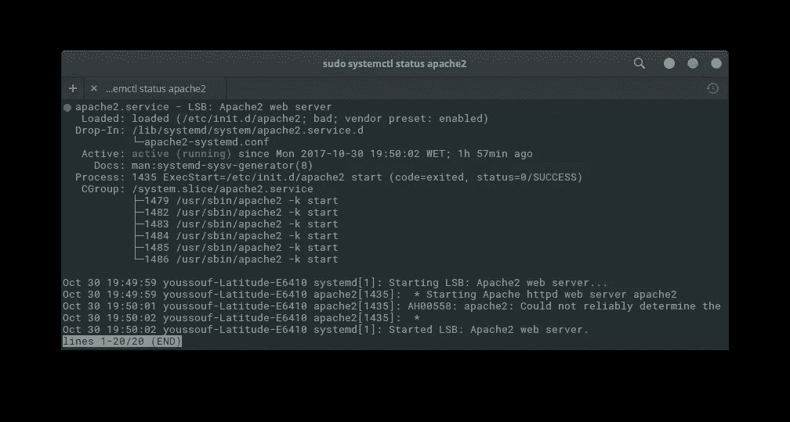
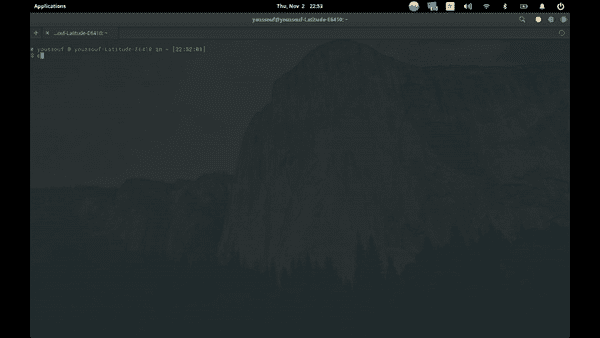
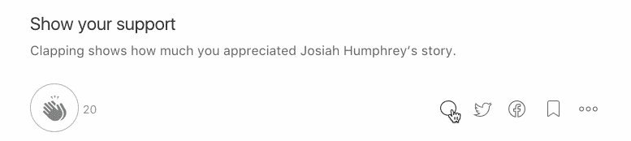

# 设置 PHP (Laravel)环境(Linux)的逐步指南。

> 原文：<https://medium.com/hackernoon/a-step-by-step-guide-to-setup-php-laravel-environment-linux-50b55a4fd15e>


本文是在 Linux 环境(Ubuntu)下开始使用 PHP 和 laravel 的一步一步的教程。通过安装 Apache2、Mysql 和 PHP，您的 LAMP 服务器就可以托管您的 PHP 应用程序了。

在这篇文章的最后，你将知道如何为你的本地环境添加你的自定义域。

如果你熟悉码头工人，请查看我的帖子: [Laravel &码头工人，船只零配置](https://hackernoon.com/laravel-docker-zero-config-with-vessel-60e1aa173ea8)。

> *我们开始吧！！！*

正如您从各种 Linux 教程中所期望的那样，您应该首先通过运行以下命令来更新和升级您的系统:

```
sudo apt-get update 
sudo apt-get upgrade
```

现在您的系统和软件包系统是最新的。

接下来，您需要安装一些基本的依赖项，以避免工作流中的各种问题

```
sudo apt-get install -y git curl wget zip unzip
```

## 安装 Apache2 服务器:

```
sudo apt-get install apache2
```

要确保服务器正在运行，您可以在终端中执行以下命令

```
sudo systemctl status apache2
```



sudo systemctl status apache2

正如你在上面看到的，服务似乎已经成功启动，你也可以通过 [http://localhost](http://localhost) 地址访问你的服务器，你会看到 Apache2 的默认主页。

知道你所有的网页内容必须在/var/www/html 目录下是很重要的。您可以检查奖金部分，使任何文件夹作为您的根网站内容，以了解如何配置。

要掌握 Appche2 配置，您需要掌握这 6 个命令行:

*   **a2 en mod**(**a**pache**2**enenable**mod**e):启用类似 Apache2 mod 的重写模式。
*   **a2 dismod**(**a**pache**2**disenable**mod**e):禁用一个 Apache2 mod。
*   **a2 enconf**(**a**pache**2**enenable**Config**):启用特定配置。
*   **a2 dis conf**(**a**pache**2****dis**able**config**):禁用一个特定的配置。
*   **a2 en Site**(**a**pache**2**enable**Site**):启用特定 app。
*   **a2 dissite**(**a**pache**2**disable**Site**):禁用某个特定的 app。

启用重写模式

```
sudo a2enmod rewrite
sudo systemctl restart apache2
```

这张 Gif 带你浏览最重要的 Apache 目录。



在这篇[文章](https://www.linode.com/docs/web-servers/apache/apache-web-server-debian-8)中，您可以了解更多关于 Apache config 和 Linux 的信息

## 安装 MySQL

```
sudo apt-get install mysql-server
```

单击 Enter 确认第一个弹出窗口，然后为您的 Mysql root 用户创建一个密码。强烈建议通过运行以下命令来保护 Mysql 服务器:

```
mysql_secure_installation
```

你可以阅读更多关于提高 [MySQL 安装安全性](https://dev.mysql.com/doc/refman/5.7/en/mysql-secure-installation.html)

为了管理数据库，有许多 SQL 客户端可以与 MySQL 一起使用，如 [MySQL Workbench](https://dev.mysql.com/doc/workbench/en/wb-installing-linux.html) 、 [SQuirreL](http://squirrel-sql.sourceforge.net/) 、 [SQLECTRON](https://sqlectron.github.io/) 或伟大的 Google 扩展[**Chrome MySQL Admin**](https://chrome.google.com/webstore/detail/chrome-mysql-admin/ndgnpnpakfcdjmpgmcaknimfgcldechn?hl=en)。

## 安装 PHP:

```
sudo add-apt-repository -y ppa:ondrej/php
sudo apt-get updatesudo apt-get install -y php7.1 php7.1-fpm libapache2-mod-php7.0 php7.1-cli php7.1-curl php7.1-mysql php7.1-sqlite3 \
    php7.1-gd php7.1-xml php7.1-mcrypt php7.1-mbstring php7.1-iconv
```

正如你在上面看到的，这个大命令将安装 php、php-cli 和最重要的 php 库。

## 安装作曲者:

```
curl -sS https://getcomposer.org/installer | sudo php -- --install-dir=/usr/local/bin --filename=composer
sudo chown -R $USER $HOME/.composer
```

现在，您已经准备好创建您的第一个 Laravel 应用程序。

## 测试 web 服务器

要测试 LAMP 服务器，只需在 Apache2 根目录下创建一个 Laravel 应用程序。

```
cd /var/www/html
composer create-project --prefer-dist laravel/laravel lara_app
```

打开浏览器，您可以通过以下方式访问您的应用:

```
[http://localhost](http://localhost)/lara_app/public
```

# 奖金

在本节中，您将发现如何在 apache2 目录之外使用自定义域名创建 Laravel 应用程序。

首先在/etc/apache2/sites-available 目录下创建一个配置文件。

```
cd /etc/apache2/sites-available
sudo touch lara_app.conf
```

使用文件中的应用程序文件夹粘贴和更新文档根目录和目录。

```
<VirtualHost *:80>.ServerName lara_app.devServerAdmin webmaster@localhost# Your Custom folder 
DocumentRoot /media/disk2/Work/lara_app/public/<Directory /media/disk2/Work/lara_app/public/>Options Indexes FollowSymLinksAllowOverride NoneRequire all granted</Directory>ErrorLog ${APACHE_LOG_DIR}/error.logCustomLog ${APACHE_LOG_DIR}/access.log</VirtualHost>
```

接下来，授予您的自定义文件夹执行权限

```
chmod -R 755 /media/disk2/Work/lara_app/public/
```

然后禁用默认站点，启用新的 lara_app 站点。

```
sudo a2dissite 000-default
sudo a2ensite lara_app
```

最后，您可以通过将这一行添加到/etc/hosts 文件中来配置 lara_app.dev 域名。

```
# /etc/hosts
127.0.0.1 localhost
127.0.0.1 lara_app.dev
127.0.1.1 youssouf-Latitude-E6410
```

现在，您可以通过自定义域名 http://lara_app.dev 访问您的应用程序

如果你熟悉码头工人，请查看我的帖子: [Laravel &码头工人，船只零配置](https://hackernoon.com/laravel-docker-zero-config-with-vessel-60e1aa173ea8)。

# 如果你熟悉 React，请查看我的帖子:

[](https://hackernoon.com/introducing-reactjs-popup-modals-tooltips-and-menus-all-in-one-227de37766fa) [## reactjs-popup 简介🎉—模态、工具提示和菜单—集于一身

### 本文将向您简要介绍使用 reactjs-popup 可以做什么，以及如何有效地使用它。

hackernoon.com](https://hackernoon.com/introducing-reactjs-popup-modals-tooltips-and-menus-all-in-one-227de37766fa) 

感谢阅读！如果你认为其他人应该阅读这篇文章，请为我鼓掌，发微博并分享这篇文章。记得在 Medium 上关注我，这样你就可以得到关于我未来帖子的通知。

> ***阅读更多故事***[](https://elazizi.com/)

**