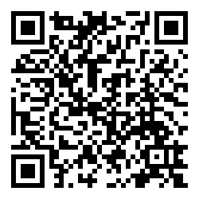

# 美国比特币的一步一步计划

> 原文：<https://medium.com/hackernoon/a-step-by-step-plan-for-american-bitcoin-7b019d36f5fa>

现在美国有了一位亲美的总统，他想把美国放在所有贸易安全和繁荣事务的首位，这就是唐纳德·j·特朗普，我们对美国政府应该做些什么来使美国成为所有比特币商业、研发和利润的中心有一些建议。

*我们说，像其他市场行为者那样*[*B*](http://www.coindesk.com/uk-treasury-committee-mp-bitcoin-doesnt-need-new-laws/)*it coin 不需要新的法律。如果唐纳德·j·特朗普(Donald J. Trump)兑现他的“每通过一部新法律就有两部法律”的承诺，取消所有比特币监管，比特币服务将遍布美国，并最终遍布世界，因为每个人都会追随美国的脚步。*

## 第一步

***让美国从数字货币中受益将该软件的显著优势带到美国市场，使不同群体受益，即消费者、企业、政府和更广泛的经济。***

为了实现第一步，需要澄清比特币的真正本质，它是由中本聪的基本创新*“区块链”*构建的工具产生的。

政府中未透露姓名的人所做的区分是错误的，他们认为“虚拟货币”不同于“数字货币”。被描述为“*”虚拟货币“*”的货币通常由它们的开发者发行和控制，这一事实与“*数字货币”没有什么不同。这两款产品都是软件开发商设计的软件*。

就比特币而言，虚拟社区和对它的控制是全球性的，它不局限于单个领域、个人或公司。以林登实验室在他们的专有游戏《第二人生》中使用的林登币为例，虚拟社区和对其货币的控制被限制在单一域名下的服务器上的互动。在这两种情况下，软件的使用在所有意图和目的上都是相同的；这是一个经济模拟，目前有几个正在进行中( [**1**](https://medium.com/p/new-post#sdfootnote1anc) )。模拟的规模与活动的性质以及如何定义无关。比特币只能在特定的比特币用户社区内部和成员之间使用，就像林登币只能由林登实验室创建的虚拟世界的成员使用一样。

你不能说林登实验室超出了这一信息呼吁的范围，而没有准确解释为什么林登美元不同于比特币；除了记录交易的方式和范围之外，它们不是。这两种制度的性质和目的是*相同的*；记录谁拥有在封闭系统中可兑现的任意令牌。

通过政府声称虚拟货币和数字货币之间存在人为区别的行为，林登实验室将游戏货币中运行的软件切换到比特币是不可能的，因为比特币更有效，从林登实验室的服务器上移除了林登美元的大部分管理和安全。如果政府监管比特币，从不太安全的模式转向更安全的模式将使林登实验室面临任意监管。让人们变得不安全不应该是政府的目标。无论希望使用区块链的公司是谁，无论是游戏开发商还是提供其他服务的公司，这种副作用都是真实的。

区块链和比特币的好处很多，而且才刚刚开始显现。区块链是一个分布式可编程数据库，正是这一点将成为任何监管的对象。你不能单独监管比特币，也不能脱离区块链的功能。说，*“我喜欢区块链技术但不喜欢比特币”*是完全不理智的，说这话的人出卖了一个很深的计算机盲。

有许多软件开发人员正在为区块链开发前所未有的应用，在这些非常早期的日子里，不可能预测这些创新可能会产生什么。现代互联网诞生五年后，YouTube 还不存在。在 20 世纪 90 年代，没有人能够预测 YouTube 现在的样子。Twitter 和其他现在正在运行的“Web 2.0”服务也是如此。因此，几乎不可能预测数字货币和区块链的商业模式和好处。

我们可以绝对肯定地说，仅从我们现在所能想象的来看，潜在的好处将是非常显著的。可以说，任何能够在整个经济中节省时间和费用的新工具或软件都会带来显著的好处，这是比特币至少会做到的。

对于消费者来说，以便士为单位的微支付现在已经成为可能，改变了在全球范围内为在线内容付费的方式。这将意味着企业可以以以前不可能的方式收取服务费用，因为移动小额资金的方式过去会产生费用，使微支付变得不经济。

地方政府也将从比特币中获益，能够以精细的方式对服务收费。停车只是一个例子；停车收费的方式将有可能消除从机器上收取现金的需要，而不需要信用卡及其天文数字的费用。比特币的用途和所有经济活动一样多种多样。

至于收益如何根据不同的数字货币而变化，这个问题的前提是数字货币之间存在差异。没有区别。作为原始比特币源代码的衍生物的各种“硬币”中的每一个都是货币替代品上下文中的货币载体；比特币本身并不是货币。每种不同的“硬币”都有能力携带相同数量的钱；它们之间唯一的差异是“硬币”的数量与其持有的货币数量的比率。在任何情况下，它都是一个任意的数字，完全由市场决定，这是对每个“硬币”效用的衡量。有多少人接受，上面写了什么软件等等。才是最重要的。

## 第二步

***确保政府不干预支持美国数字货币及相关业务和技术的发展和使用。如果政府不应该干预，它不应该采取任何行动，除了执行现有的基本消费者法律。***

政府不应该干预支持数字货币的发展和使用。它应该做的是**宣布在 150 年内暂停立法，该立法涉及任何从事数字货币买卖的个人或公司，或从事任何涉及数字货币的软件开发的个人或公司**。通过暂停新的法律或法规，这种在这个迅速崛起的领域不干涉的方法可以绝对保证美国的主导地位，这已经是特朗普/彭斯平台的一部分。

英国对香港 150 年的租借期就是效仿的模式。由于英国人的远见卓识，毗邻共产主义中国、低税收、低监管的香港岛是一个展示经济应该如何运行的橱窗。在数字时代，公司可以在任何司法管辖区注册，如果美国希望成为商人开展比特币业务的首选目的地，它必须让自己对企业家具有吸引力。即使在今天，像*Brawker(*[***2***](https://medium.com/p/new-post#sdfootnote2anc)*)*这样的创新型消费区块链公司也在香港注册成立，尽管香港已经回归中国。

如果你不采取这一措施，所有的比特币初创企业都将避开美国，就像它们已经避开纽约及其臭名昭著的“比特币许可证”一样。Skype 是全球流行的网络电话公司，在爱沙尼亚( [***3***](https://medium.com/p/new-post#sdfootnote3anc) )成立，而不是美国。这种情况会再次发生，美国将会在现在开始的数字货币革命中错失良机。

律师会坚持认为，需要有专门针对区块链和比特币的法律，但这是一个错误。法典上有足够的法律来涵盖每一个可以想象的比特币纠纷，当然，区块链使各种新形式的可执行合同成为可能。这里唯一相关的特殊利益是美国自身的利益。通过允许比特币公司在美国蓬勃发展，美国将全面受益。这应该是特朗普政府的最终目标，暂停监管将有效实现这一目标。

还要记住，所有在美国注册的比特币企业都将为他们将要处理的数千亿比特币交易支付公司税。这些交易可以在*任何司法管辖区处理。这对美国在全球经济中的未来地位至关重要。我们希望美国成为中心，而这唯一可能的方式，就是让企业家在这里自由创新。*

## 第三步

***不对数字货币进行监管，无论哪种类型的数字货币都在台面上。不要创建定制的监管制度；现有法律已经足够。监管不可避免地会带来意想不到的后果，而且这不符合美国精神。***

联邦政府不应该监管数字货币。为了理解我为什么做出这样的断言，你需要精确地理解什么是数字货币。

数字货币是在互联网上流动的文本。它们无非是文本，而且永远是文本。如果你相信你可以监管数字货币，那么你没有理由不能监管 Twitter 上的推文。除了显示的上下文之外，推文和比特币交易没有什么区别。货币使用背景下的区块链，比特币，*看起来*是一种货币形式，但其实不是。正是这种深刻的困惑引发了很多讨论和政府的关注；如果不是这样的话，人们就会要求对 Twitter 用户进行审查，询问他们是否应该接受定制的监管制度。没有一个头脑正常的美国人会建议这样的事情，因为这是公然反美的，但这些人也不能准确地说为什么 Twitter 不同于比特币。

目前对区块链的误解是由一小撮人推动的，他们以监管的副作用为生。比特币受到监管符合他们的利益；这将意味着他们可以专门从事比特币初创企业的咨询、关联、认证和许可，并为其服务收取费用。这些人并没有把美国的最佳利益放在心上；他们只想从强制实施的监管中获利。另一方面，软件开发商对监管不感兴趣。他们把用户的最佳利益放在最优先的位置。监管只会让开发商将业务转移到不同的司法管辖区，从而损害开发商的利益。开发商和美国在这方面有共同的事业。美国绝不能模仿阿联酋这样的区块链敌对管辖区。

非理性监管的意想不到的后果，除了制造进入壁垒和巨大的、不必要的合规成本，将是创造出完全排除政府参与比特币和社会部门的软件类别。这种新软件不会只来自个人黑客，而是会出现在像苹果和谷歌这样价值数十亿美元的公司中。

苹果刚刚发布了 iOS8，明确排除了安全服务可以访问 iPhone 用户数据。苹果 FaceTime 和 iMessage 工具中内置的军用级加密是公司如何应对比特币监管的很好例子。FaceTime 通话和 iMessages 信息是加密的，除了发送方和接收方，任何人都无法破译。谷歌已经对其安卓软件进行了修改，以提供类似的保护。随着比特币的增长，绝对可以保证所有手机都会默认加入比特币客户端，就像现在默认加入电子邮件一样，与语音通话和短信并列。这些公司将以完全排除政府访问的方式将比特币嵌入其产品中。这是无法阻止的，也是不可避免的，但政府能做的是从这种转变中获利，让自己的辖区变得更有吸引力。

尽管苹果公司不让政府使用其手机，但它仍赚取了数十亿美元的利润，这些利润并没有汇回国内。如果经济条件是正确的，苹果会把他们的钱和制造业带回家，但政府将再也无法侵入人们的手机。这些手机是哪里制造的并不重要；这是永远不会消失的新现实。对美国来说，从这一新的现实中获利更好，而不是失去每个人的通信渠道*和*失去销售这些设备的税收收入。

如果所有比特币交易的起点和终点都是布鲁克林，那么美国将收获价值数亿美元的交易收益。它还将受益于软件开发人员的高需求，以及使他们达到标准所需的培训。连锁反应和后果将是多方面的，每一方面都将是另一方面的倍增器。我们可以肯定的是，如果有另一个国家，一个更好的国家，企业家和开发商可以在保证他们的工作不会受到人为阻碍的情况下扎根，这种情况在美国发生的可能性将被摧毁。

区块链还有其他副作用，必须充分了解这些副作用，才能正确确定什么是合理的，什么是不合理的，甚至在监管方面是可能的。

多重签名交易( [***4***](https://medium.com/p/new-post#sdfootnote4anc) ) ( *多重签名)*是需要一个以上钥匙持有人同意的交易。这使得完全在区块链上发生的交易成为可能，而无需商家在本地控制的钱包中“接收”和“存储”比特币，就像在执行货币功能模拟一样。我将“接收”和“存储”这两个词放在引号中，因为这两个动作在比特币交易中从来不会发生。

Purse.io 网站就是一个很好的例子。Purse.io 是一项将比特币所有者和信用卡持有者联系在一起的服务。如果你想从亚马逊(不接受比特币)买东西，你可以使用 purple . io 找到愿意用他们的信用卡为你购买商品的人，你用比特币支付给买家。purple . io 就像一个媒人一样促进交易。

在 purple . io 系统中，比特币从来不会直接转给他们存储。相反，他们使用*比特币多重签名交易*将比特币“存储”在区块链上。当货物交付时，买家在交易上签字，Purse.io 也是如此(一种“三分之二”的交易)，信用卡持有者收到她的比特币。Purse.io 是这样描述的:

"*当你在 purple . io 创建账户时，你不需要存入任何比特币。取而代之的是，你的资金将通过一个多重签名地址，该地址至少由三把不同的钥匙中的两把控制。比特币的消费者得到一把钥匙，买家得到第二把，布劳克得到第三把。转账需要两把钥匙。你控制你的私人钥匙，用你的密码保护它。这是什么意思？交易涉及的资金不是由 Purse.io 控制，而是由交易双方控制。Purse.io 介入只是为了解决争端。”* ***-钱包. io***

在这种情况下，purple . io 不负责任何比特币，也从未收到过比特币或任何货币；它只充当媒人。任何金融监管都不可能适用于它们，即使立法者错误地将比特币描述为货币；purple . io 从不控制用于购买任何商品的比特币。

像这样的多签名交易确保所有参与者都是诚实的，它消除了供应商作为存款持有人控制比特币的需要和风险。区块链就像是交易的无声自动守护者；完全中立，诚实可信。没有钱易手，即使你错误地认为比特币就是钱。

这仅仅是由于比特币而开始出现的许多新可能性中的第一个。显然，立法无法考虑到软件开发商和企业家将利用比特币这一沉默的自动化守护者的无数方式。

在我刚刚引用的上述真实世界的例子中，计算机盲会声称哪个实体应该被监管？信用卡公司和卖家已经受到严格监管，正常运营。Purse.io 无法受到监管，因为它不接受比特币、商品或货币，只是一个撮合者，对交易没有任何权力或参与交易。比特币网络本身不是一个法律实体，它无处不在，不在一个司法管辖区内，不能仅仅因为这个原因而受到监管，更何况它只是一个账本。

即使是“比特币是对文明的威胁”的最热情、最强烈的支持者也没有建议比特币的所有人都应该获得许可，这是多元化世界中唯一的选择。Purse.io 证明了创建一个在现有规则之内或之外根本无法监管的服务是可能的，因为它的组成部分没有一个可以被认为是在任何法规之下。

最后，当在香港注册时，美国政府对像 Purse.io 这样的公司的立场完全无关紧要。如果公司决定放弃香港，搬到康涅狄格州哈特福德，政府对公司的行动只有发言权，如果政府在比特币和区块链业务上采取错误的行动，这永远不会发生。

## 第五步

***消除在美国设立数字货币业务的所有障碍，首先是纽约州在特朗普“二合一”放松管制计划下的比特币许可证，并发出信号，任何联邦或州政府都不应采取行动来监管比特币业务，超越正常法律。***

任何人开始比特币业务都没有障碍。任何人都可以开始区块链或比特币业务，然后将其推向市场。这完全是应该的，所有比特币公司中最大最伟大的 Qkos，英国注册成立的“区块链([***5***](https://medium.com/p/new-post#sdfootnote5anc)*)”*的创造者，iPhone 和 Android 的近乎完美的比特币钱包就是一个很好的例子。

Qkos 现在是全球最大的比特币钱包提供商。他们的软件产品极具创新性，这是许多其他公司所没有的。Qkos 恰恰展示了比特币企业家能够创造出什么，如果特朗普政府从长计议，承诺在几代人的时间内暂停任何涉及比特币的立法，我们可以期待更多这类创新来自美国。

## 第五步

***通过禁止监管来释放这种分布式账本技术的巨大优势。***

区块链不仅仅是一个促进新形式的货币、数字易货或无记名工具或投资的平台，正如非软件开发商所声称的那样。区块链是一种(在许多其他事情中)识别某人拥有某物的方式，而不必依赖第三方。

车管所、出生和死亡登记处以及任何其他集中管理的登记处使用的数据库可以完全被比特币取代。这样做的潜在好处很多。有了比特币作为支柱，一旦注册成功，伪造所有者注册就变得不可能。随着人们使用比特币支付和验证注册，整个经济将节省大量资金。可靠、廉洁、公开和安全的分布式账本改变了任何东西被证明为拥有的方式；它是头衔的最终仲裁者。

显然对政府来说有潜在的好处，但是需要编写能带来这些好处的软件应用程序。它们可以在伦敦或旧金山创作。从英国的角度来看这个问题。几十年来，英国政府被迫使用微软 Windows 及其“Office”套件，因为每个人都被反复告知，“这是标准”。这款美国软件尽管有很多缺陷，包括内置监控，但如果鼓励一家有能力编写这款软件的软件公司在英国起步，它完全可以被一款 100%英国版的软件所取代。现在，开源的*Libre Office(*[***6***](https://medium.com/p/new-post#sdfootnote6anc)*)*正在慢慢取代微软 Office，Windows 正在全球被 GNU/Linux([***7***](https://medium.com/p/new-post#sdfootnote7anc))取代。比特币将在另一个司法管辖区扎根，并最终通过一家外国公司进入美国；这是绝对不可避免的，除非这些公司是在美国成立的。

最终，分布式账本技术的好处是作为点燃美国比特币革命的鞭炮引线。美国有人才，这是至关重要的因素。

## 第六步

***对数字货币给用户带来的风险进行适当分类，认识到它们并不重大。让市场选择赢家，让法律惩罚欺诈者。***

任何暴露给用户的软件都有风险。几十年来，微软视窗系统使其用户暴露在严重的风险之下，直到今天，由于视窗操作系统，数百万人遭受木马和病毒、外国企业间谍、银行账户和信用卡账户被盗以及其他电脑入侵。然而，尽管存在这些公认的缺陷，信息经济的繁荣还是成功地改变了美国每个人的交流、工作甚至购物方式。

比特币用户会遇到问题，就像微软 Windows 的用户一样，但这些问题都不如该软件带来的好处那样大规模和改变社会。区块链技术本身是安全的。当在安全的平台上使用时(在运行 Linux 的计算机上使用使用*区块链*比特币应用程序或*multi bit(*[***8***](https://medium.com/p/new-post#sdfootnote8anc)*)*的 iPhone)，风险远远低于在 Internet Explorer 的网络表单上输入信用卡信息，或在微软 Windows 平台上进行网上银行业务。

这是描述数字货币相关风险的正确方式。风险总是会有的，但比特币完全消除了一大类风险，使它们的采用成为一个显而易见的选择。“持卡人不在场欺诈”在信用卡交易中普遍存在。本文的读者将会意识到，在一些市场上，信用卡信息被出售给欺诈者。比特币将彻底消除这种活动。target([***【9】***](https://medium.com/p/new-post#sdfootnote9anc)*)*和 SONY([***【10】***](https://medium.com/p/new-post#sdfootnote10anc)*)*，仅举两个例子，就有超过 1 亿条信用卡信息从他们的服务器上被复制。用比特币作为支付方式，这是绝对不可能的。

比特币将使信用卡信息被盗成为历史。没有人会再成为犯罪分子对其信用卡收费的受害者。仅比特币的这一副作用所带来的节省就将达到数十亿美元。一旦比特币成为网上购物的默认方式，所有保护信用卡交易的努力都将付诸东流；这是因为比特币的所有转账都保证来自下单者。 **比特币彻底杜绝支付者欺诈。因此，接受比特币的企业无需执行如今困扰信用卡用户的昂贵的检查和自动反欺诈程序，所有这些看起来都是比特币世界中最荒谬过时的废话。**

当十亿人使用一种技术时，不可避免的法律风险将会出现，这些风险都可以通过现有的立法来解决。欺诈就是欺诈，不管是接受比特币的商家还是其他任何形式的支付。当一个商人承诺根据合同做一些事情时，该合同不会因为他以比特币支付而无效。对基本法律原则和美国主义的理解对于形成对比特币的正确看法至关重要，对比特币是什么的正确理解也是如此。

## 第七步

政府不应该干预比特币的风险，而应该尽快废除任何可能影响比特币的法律。不对比特币采取任何行动是正确的做法；市场和现有法律将能够自行解决这些风险。

如果联邦政府干预以解决想象中的风险，这将是一个巨大的破坏性错误。首先，没有办法知道真正的风险是什么，因为未来软件开发的形式会自动减轻那些风险是不可知的。Multisig 就是这一过程的完美例子。

多签名交易要求在比特币交易发生之前有多人批准。这些交易在新形式的信用证和其他尚不存在的工具中是有用的。政府不能监管不存在的，或者不了解的；我这么说并不是暗示联邦政府不能理解这些应用的影响；*没人知道*，因为应用程序才刚刚开始成为 alpha 阶段软件的可能性和潜力。

现在的现状是“低下头，坚持下去”。开发商和企业家绞尽脑汁，冒着时间和金钱的风险，试图制造出无人能想象的东西。他们不需要被法规和立法的威胁所干扰，这些法规和立法将削弱和阻碍他们想要发挥想象力和软件的富有成效的方向。

市场完全可以自行管理、减轻和解决任何风险。多重签名交易就是一个很好的例子。当价值数百万英镑的比特币存在一个公司账户中时，以前任何有权使用钱包的人都可以将比特币转移到任何地址。现在，如果比特币在一个多重签名地址中，大多数董事(例如)必须批准来自该钱包地址的任何交易。可以证明的是，他们同意转移到一个在法庭上站得住脚的证明标准。这是企业透明度和责任方面的一个显著创新，它是在没有政府指导的情况下**实现的**；这样做是因为这符合比特币公司的最大利益。

如果联邦政府早点干预比特币，Multisig 可能就不会出现，因为开发者和用户会声称他们总能依靠 FDIC 弥补任何损失。联邦政府现在在比特币和区块链的早期阶段进行干预将阻止未来像 Multisig 这样的工具被开发出来，至少在美国是这样，这最终将通过降低比特币活动的安全性来伤害企业和消费者。

## 第八步

***政府不应该为了保护用户而监管数字货币。它不应创建定制的制度，而应通过现有的反欺诈法律进行监管。有许多可能的意想不到的后果(例如，由于无价值的合规成本而造成的进入壁垒)将扼杀美国的比特币企业，并将它们转移到海外。联邦政府应该依靠自由市场来监管比特币。***

我引用英国政府*“我们打电话询问(比特币)信息的 5 个理由”*页面:

监管机构的安全网可以给企业提供在英国开展业务所需的保证，并确保消费者和企业得到保护。”

除了承诺不会对企业进行监管或干预之外，政府无法以任何其他方式向企业提供保证。它没有软件方面的专业知识，事实上它把这方面的所有需求都外包出去了。他们没有资格判断什么样的比特币业务或工具是合理的，这没有错；微软视窗是一个完美的例子，一个完全不受监管和根本有缺陷的软件服务，这是非常有益于全球社会。

政府无法通过监管保护用户，也无法提供安全网。美国政府无法通过联邦存款保险公司(FDIC)让所有在银行业危机中损失惨重的人恢复元气，也无法让所有因企业家或开发者在比特币上的错误而遭受打击的人恢复元气。从联邦政府拿钱来充实犯了错误的比特币用户或企业家的钱包是不道德的。

如果政府想要赔偿并使所有比特币用户(本质上是软件用户)受益，他们必须解释为什么他们不会赔偿所有微软 Windows 用户因病毒和由此导致的信息被盗而导致的任何损失。如果不将逻辑扩展到所有软件工具和开发人员，你就无法证明比特币企业是合格的。比特币不是货币，它是*软件执行货币模拟*作为它的许多可能功能之一。

比特币用户面临的风险与微软 Windows 用户面临的被黑风险一样。没有法律可以阻止 Windows 用户受到危害；如果政府的目的是保护用户，那么立法和监管就不是保护用户的工具。

具体来说，数百万微软视窗系统的用户经常受到病毒的侵害。这种情况已经持续了几十年，然而，人们仍然使用这种众所周知极易受到攻击的软件来成功地进行所有的计算。反病毒软件公司已经建立了数十亿英镑的业务( [***11***](https://medium.com/p/new-post#sdfootnote11anc) )，唯一的任务就是保证 Windows 用户的安全。比特币也不会有什么不同，保护消费者比特币的措施将随着时间的推移而发展，很可能是由专门保护微软 Windows 用户的同一家公司开发的。加密你的钱包和使用 Multisig，或者避免将你的比特币放在开箱即用的机器上，都将降低消费者的风险。

此外，还有像分别来自捷克共和国和法国的公司的*Trezor(*[***12***](https://medium.com/p/new-post#sdfootnote12anc)*)*和*Ledger Wallet(*[***13***](https://medium.com/p/new-post#sdfootnote13anc)*)*这样的设备，它们制作专用的硬件钱包，使比特币免受微软 Windows 的风险和针对它的攻击。没有一个政府能够预测什么样的软件和硬件创新即将到来，如果政府决定尝试并监管区块链，任何一种创新都可能无法在英国发展。

## 第九步

***政府应该忽视与数字货币相关的犯罪风险；与利益相比，它们是微不足道的。所有软件的风险都是一样的，不仅仅是比特币。应该利用自由市场和现有法律来控制这些软件产品。***

比特币作为犯罪工具的风险与人类活动中使用的任何工具的风险是一样的。作为所有无害合法活动的一部分，这种风险非常低。目前，关于使用比特币购买非法药物的问题闹得沸沸扬扬。将这一点放在上下文中可以帮助我们确定采取适当的立场。

在整个美国，禁酒时代正在结束。15 年后，没有一个州的大麻种植和消费是不合法的。在未来，丝绸之路*逮捕事件将会看起来像是最高级别的闹剧；美国现在不应该制定影响比特币发展的法律，这些法律是建立在未经思考的观点和糟糕的法律基础上的，这些法律被公众普遍鄙视，并在全球范围内被废除。*

美国必须放眼未来，在未来，这些问题将不复存在。禁酒令正在结束；现在立法好像永远不会结束是不明智的，也不能反映社会正在发生的现实。记住；目标应该是让美国再次伟大，成为所有比特币公司和创新的家园。这意味着着眼于*趋势*并规划未来，而不是陷入今天的歇斯底里。

与数字货币相关的唯一风险是，美国可能会错失通往繁荣和全球影响力的百年一遇的良机。这是最重要的因素，像这样耗费时间和精力的杂念是无益的。

这个问题不会被问及互联网本身，或电脑或 iPhones，所有这些都被用于犯罪。没有人会建议这些公司的制造商应该接受定制的制度，因为从统计数据来看，使用他们的工具实施犯罪的歹徒数量微不足道。犯下罪行的罪犯本身应该受到惩罚，而不是完全无辜和正常地使用工具的普通用户。

## 第十步

***联邦和州政府不应该干预解决这些风险。不采取行动会带来巨大的积极后果，而试图控制比特币只会带来消极后果。***

干预比特币和区块链应该是不可能的。联邦政府应该通过保证在长期未来不会出现监管意外来鼓励区块链企业在美国注册。

软件开发很难做，而且全世界有许多竞争者，都在同一个领域工作，很难交付不会在一夜之间被取代的产品。在一个既要与全球其他开发商竞争，又要与当地政府对抗的司法管辖区，宝贵的资源被白白浪费掉，对任何人都没有好处。

美国应该为开发商提供一个公平的竞争环境，保证环境不会改变。企业家们会在这里定居，因为他们知道自己最有可能专注于自己的产品，而不考虑其他任何事情。这将导致美国不断涌现出最好的产品。这将是任何涉及比特币或区块链的立法暂停 150 年的效果。

不采取行动、任由不良法律存在的后果是，美国可能会幸运地成为比特币活动的中心。如果立法的威胁一直存在，人们会犹豫是否投资在美国管辖区成立公司。为什么有人会冒险，在经过 4 年 11 个月的发展后，5 年后美国将出台一项荒谬的“比特法律”，扼杀创新的商业模式，迫使人们逃离这些海岸？任何有理智的人都不会冒这个险。理性思考的企业家会选择最好的长期基础，无论它在哪里，而不是冒险陷入一个可以自发选举出反商业政府的国家。

## 步骤 11

***联邦政府不应该采取任何行动来解决被想象和夸大的金融犯罪风险。它应该立即废除像 BitLicense 这样的定制制度，并通过现有的法律进行监管。***

比特币和其他任何工具一样；它可以用于好的目的，也可以用于坏的目的。比特币不是货币，因此它不能被用于金融犯罪，其方式不同于在转移犯罪所得时交换任何商品或信息。这种想法偏离了比特币本质的重要核心主旨。有少数声音会说这些问题很关键；任何了解软件历史的人都会知道它们不是。

美国不应该引入监管来试图控制比特币。如果联邦政府引入监管，比特币企业家将在其他国家注册。在上面的其他回答中已经详细说明了监管的缺点，包括意想不到的后果，其中最不重要的是由于合规成本而造成的进入障碍，这是很容易避免的。事实上，这就发生在澳大利亚，比特币公司 CoinJar。

纽约“FinCEN”对数字货币的影响已经导致所有非美国人经营的比特币企业将美国从其可能的基地名单中删除。特别是纽约格外有毒，因为它正在引入一种当地的、绝对荒谬的“比特许可证”，这暴露了灾难性的计算机文盲和对区块链的误解。美国是一个主权国家，应该只做合理的、符合自身最大利益的事情。其他人在他们自己国家所做的不应该成为美国人民所做的基础；事实上，这是一个抓住美国企业家并让他们融入自己国家的机会。

任何关于比特币监管对其他司法管辖区的影响的讨论，都应该在美国如何超越其他国家的背景下进行，而特朗普的去监管化计划，而不是它应该如何盲目模仿它们，复制其他国家的错误。

## 步骤 12

***用数字货币消除困难。忽略对金融制裁的虚构影响。***

我们现在正进入一个许多旧政策工具将不再发挥作用的世界。金融制裁是需要放弃的工具之一，取而代之的是有效的工具。政府不能指望一切都永远不变，包括它目前经常使用的政策工具。

比特币将使金融制裁失去效力；我提供了可能的未来场景，描述了它可能的样子:

*俄罗斯和美国都在为他们的共同利益而努力，并且都完全接受比特币。现在不可能阻止所有国家的资金流入和流出。随着世界上大多数人使用比特币转移资金，SWIFT 在很大程度上已被抛弃。*

金钱的流动无法停止。每天有数十亿的比特币交易。没有办法跟踪他们所有人，即使每一个人都是绝对安全的，并在公开可见的区块链中被跟踪。

旧的金融制裁工具已经被抛弃，取而代之的是禁令和其他阻止货物和人员流动的工具。正在转移的资金现在完全不受任何政府的控制。

*纽约是所有比特币交易的中心，在软件和技能方面处于领先地位。多亏了特朗普，美国出现了前所未有的经济繁荣，他认定干涉他人事务无利可图。*

因为在瑞士，失业率是百分之几。繁荣触及美国社会的每一个部分。对制裁和烦人的国际事务的旧担忧，现在留给了那些没有接受比特币的国家，这些国家收获了时间和技能投资的好处，这种投资对美国来说非常好。

自从全球非刑罪化和合法化以来，制裁不再重要，就像禁毒不再重要一样。

*日期是 2018 年*

这正是政府应该思考的问题；不是关于今天的狭窄窗口事件，而是关于快速到来的未来，在未来，它应该计划成为所有区块链企业家的“头号目的地”。比特币中介的未来即将到来。这是必然的。唯一的问题是，一旦它全面展开，美国在其中的地位将会如何。

## 第十三步

***忽略货币对货币和金融稳定构成的小风险这些风险与收益相比并不显著。***

比特币不是货币，它是将货币从 A 地转移到 b 地的一种*手段*，只有政府有权征税，有权宣布什么是法定货币，什么是可以接受的纳税方式。这意味着，无论发生什么，对美元的需求总是存在的。

*理货棒(*[***14***](https://medium.com/p/new-post#sdfootnote14anc)*)*就是一个很好的例子，事实上是比特币的近似模拟物。理货棒是一根大约三英尺长、一英寸见方的普通木棒，沿其长度方向有一个锯齿形切口，形成两个独特的两半，完美地配合在一起。一半被“花”到了经济中，另一半由国王的国库保留。这直接类比于现代密码学中的公钥和私钥，是英国人发明的，比计算机出现早七百年( [***15***](https://medium.com/p/new-post#sdfootnote15anc) )。

财政部只接受了一些计数棍作为税款。因此，投入到经济中的那半根计数棒非常有价值，而且它本身也沿着它的长度被劈开，并作为黄金出售。理货棒是世界上单一形式政府货币运行时间最长的例子。

现在，在 21 世纪，为计数棒提供动力的相同想法是比特币设计的根本；为保护区块链的公钥加密提供动力的分割密钥。今天的不同之处在于，政府发行美元，并且只接受美元纳税，而不是发行纸币。因此，它对经济有一个非常深刻和强大的控制机制，人们选择用什么作为货币并不重要；他们最终必须获得美元来纳税。

有了这种强大的强制力，美元的价值将保持非常稳定，就像计数棒在 700 多年里保持稳定和有用一样。除非美联储另有决定，否则美元不会走。因此，比特币不会给金融稳定带来风险。真正的风险是试图*控制*比特币，随着比特币流入、流出和离开美国，美国将失去领先地位。

## 结论。

未来将与今天大不相同，就像印刷前的世界与印刷后的世界不同一样。众所周知的银行业将成为过去；无中介、点对点的资金转移将成为常态。

尽管如此，人们仍然需要一个有形的地方来生活。他们需要服务。这些服务如何付费以及由谁提供是个问题。很难知道这个问题的答案是什么，但可以肯定的是，将会有一个过渡时期，在此期间，旧的制度将转变为新的制度。

在比特币时代，作为资金储存库的银行处于重塑自我的有利位置。他们拥有为民众服务的基础设施，这不应该因为一时兴起而被抛弃。

如果这里部分描述的服务成为现实，比特币在另一个领域找到了归宿，你可以肯定，这里的银行仍将被彻底淘汰，不留任何痕迹。想想曾经是美国每条主要街道特色的伍尔沃斯商店，现在已经不存在了。如果全球比特币活动的中心设在另一个司法管辖区，主街银行和拥有它们的公司，以及作为主要金融中心的纽约，也将遭遇同样的情况。

无论未来是什么样的，我们都希望它在美国生根发芽，茁壮成长，了解美国历史的美国人非常清楚实现这一目标的方式。为期 150 年 **的比特币监管禁令**将实现这一理想的结局。试图控制和塑造比特币开始出现的东西，将是一种强烈的诱惑。特朗普总统，你必须抵制这种诱惑，允许比特币在美国流通。

我在这里描述的影响已经开始扎根。正如我前面提到的，澳洲刚刚才知道( [***16***](https://medium.com/p/new-post#sdfootnote16anc) )我说的是真的；澳大利亚比特币钱包初创公司 CoinJar 刚刚决定从墨尔本搬到伦敦。这是澳大利亚政府将比特币误认为货币，并强制对所有购买比特币的行为征收 10%的增值税(在澳大利亚称为“GST”)的直接结果。此外，澳大利亚信用卡持有者一直通过上网并在美国 *CoinBase* 注册购买比特币来规避这一税收，完全切断了澳大利亚商业和澳大利亚政府。

如果澳大利亚政府采取了理性的不干涉方法，CoinJar 就永远不会离开墨尔本，澳大利亚人就会有一家本地公司需要处理，就会避开 CoinBase，政府就会对 CoinJar 的利润征税。现在澳大利亚政府将一无所获，澳大利亚消费者继续在全球使用比特币，无视任何不合理的当地法律。

监管只有在切实可行的情况下才能发挥作用。在比特币领域，实施监管是不切实际的。在任何情况下，监管都是由一名被蒙住眼睛的弓箭手向一个速度快得不可思议的隐形目标射出一支箭，而这名弓箭手只有在击中目标的情况下才能最终射中自己。

联邦政府现在必须要么以软件开发人员的理解、技术未来学家的洞察力、拥有水晶球的预言家和企业家的意图，试图理解并完全掌握比特币不可知的未来影响，要么必须后退一步，做出一个简单的信念飞跃，即软件企业家精神是 21 世纪进步和繁荣的最终引擎。

如果做不到这一点，美国将会错过 21 世纪的第一次重大技术突破和机遇，这一突破的规模类似于印刷机或家用电脑的发明。这一突破是一种改变世界的新技术的出现，将我们无法想象的财产、金钱、事物和流程的所有登记和转移，转移到一个中立、可靠、廉洁的“交易的无声自动化监护人”，即最终的公正见证人。**比特币。**

The most important footnote of all. Buy me beer.

[***1***](https://medium.com/p/new-post#sdfootnote1anc) 大型网站利用网上伪币的例子:
*卡通玩偶商场【卡通美元】*[http://www.cartoondollemporium.com/prepaidcard-finder.html](http://www.cartoondollemporium.com/prepaidcard-finder.html)
*DD 坦克【硬币】*[http://ddtank.game321.com/guides/interface/shop/505.html](http://ddtank.game321.com/guides/interface/shop/505.html)
*盖亚在线【盖亚现金】*[http://www.gaiaonline.com/payments](http://www.gaiaonline.com/payments)

[***2***](https://medium.com/p/new-post#sdfootnote2anc) 钱包. io:[https://www . p](https://www.brawker.com)urse . io

[***3***](https://medium.com/p/new-post#sdfootnote3anc)

[***4***](https://medium.com/p/new-post#sdfootnote4anc) 什么是多重签名交易？[http://bit coin . stack exchange . com/questions/3718/what-are-multi-signature-transactions](http://bitcoin.stackexchange.com/questions/3718/what-are-multi-signature-transactions)

[***5***](https://medium.com/p/new-post#sdfootnote5anc) 区块链—比特币钱包:[https://itunes . apple . com/us/app/区块链-比特币-钱包/id493253309？mt=8](https://itunes.apple.com/us/app/blockchain-bitcoin-wallet/id493253309?mt=8)

[***6***](https://medium.com/p/new-post#sdfootnote6anc) 自由办公室，以前叫“开放办公室”[http://www.libreoffice.org/](http://www.libreoffice.org/)

[***7***](https://medium.com/p/new-post#sdfootnote7anc)Ubuntu 桌面 Linux:[http://www.ubuntu.com/desktop/take-the-tour](http://www.ubuntu.com/desktop/take-the-tour)

[***8***](https://medium.com/p/new-post#sdfootnote8anc) 多位比特币客户端:[https://www.multibit.org](https://www.multibit.org)

[***9***](https://medium.com/p/new-post#sdfootnote9anc) 漏报警和 4000 万被盗信用卡号:塔吉特是如何搞砸的:[http://www . business week . com/articles/2014-03-13/Target-Missed-Alarms-in-epic-hack-of-Credit-Card-data](http://www.businessweek.com/articles/2014-03-13/target-missed-alarms-in-epic-hack-of-credit-card-data)

[***1***](https://medium.com/p/new-post#sdfootnote10anc)***0***PlayStation 网络黑客访问 7700 万用户数据:[http://www . the guardian . com/technology/2011/apr/26/PlayStation-Network-hacker-data](http://www.theguardian.com/technology/2011/apr/26/playstation-network-hackers-data)

[***1***](https://medium.com/p/new-post#sdfootnote11anc)***1***op swat 反病毒市场份额报告:[https://www . op swat . com/about/media/reports/Anti Virus-2014 年 1 月](https://www.opswat.com/about/media/reports/antivirus-january-2014)

[***1***](https://medium.com/p/new-post#sdfootnote12anc)***2***Trezor 比特币保险箱:[https://www.bitcointrezor.com/](https://www.bitcointrezor.com/)

[***1***](https://medium.com/p/new-post#sdfootnote13anc)***3***总账钱包:[https://www.ledgerwallet.com/](https://www.ledgerwallet.com/)

[***1***](https://medium.com/p/new-post#sdfootnote14anc)***4***分裂理货贴英格兰:[http://en . Wikipedia . org/wiki/Tally _ Stick # Split _ Tally _ in _ England](http://en.wikipedia.org/wiki/Tally_stick#Split_tally_in_England)

[***1***](https://medium.com/p/new-post#sdfootnote15anc)***5***纪录片《金钱大师》:[https://www.youtube.com/watch?v=iDtBSiI13fE&feature = youtu . be&t = 18 m36s](https://www.youtube.com/watch?v=iDtBSiI13fE&feature=youtu.be&t=18m36s)

[***1***](https://medium.com/p/new-post#sdfootnote16anc)***6***coin jar 从澳大利亚搬迁至英国，不再收取 GST[http://qntra . net/2014/12/coin jar-Relocate-From-Australia-To-UK-No-Longer-Charging-GST/](http://qntra.net/2014/12/coinjar-relocate-from-australia-to-uk-no-longer-charging-gst/)

> [黑客中午](http://bit.ly/Hackernoon)是黑客如何开始他们的下午。我们是 [@AMI](http://bit.ly/atAMIatAMI) 家庭的一员。我们现在[接受投稿](http://bit.ly/hackernoonsubmission)，并乐意[讨论广告&赞助](mailto:partners@amipublications.com)机会。
> 
> 如果你喜欢这个故事，我们推荐你阅读我们的[最新科技故事](http://bit.ly/hackernoonlatestt)和[趋势科技故事](https://hackernoon.com/trending)。直到下一次，不要把世界的现实想当然！

