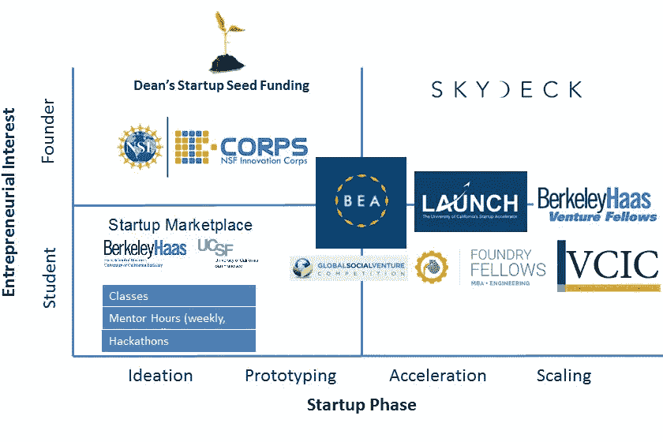

# 加州大学伯克利分校创业生态系统学生指南(2018-19 更新)

> 原文：<https://medium.com/hackernoon/a-students-guide-to-uc-berkeley-s-startup-ecosystem-a50df21d6da6>

## 加州大学本科生创业者可用资源的综合列表

Photo Credits: [Eric Quach](https://www.facebook.com/EricQuachPhotography/)

当我来到加州大学时，我对校园的创新精神感到兴奋，并知道我想创办自己的公司。然而，尽管有大量的机会，我们大校园的分散性质使我很难找到我需要的资源。在过去的三年里，我花了很长一段时间才相互认识。通过这篇指南，我希望让现在的和有抱负的学生创业者更容易浏览伯克利的创业生态系统，并利用下面列出的绝佳机会。

***快速注释:***

1.  本指南是为本科生设计的，但是这些资源中约 60%也可供研究生和校友使用。关于加州大学所有可用资源的广泛概述，无论课程状态如何，请查看 [*伯克利创新之门*](http://begin.berkeley.edu) *。*
2.  *因为之前的版本太受欢迎了(超过 7000+阅读量！！！)，我在 2018 年 5 月更新了这篇帖子，纳入了 2018–2019 学年的相关信息。*

> ***目录:***
> 
> 一、本科课程
> 
> *二。资助(VC &竞赛)*
> 
> *三。孵化器&加速器*
> 
> *四。学生组织*
> 
> *五、事件*
> 
> *六。杂项*

# 一、本科课程

大多数关于科技创业的本科课程都是由[苏塔佳科技创业中心](http://scet.berkeley.edu/) (SCET)教授的，该中心是工程学院内[工业工程&运营研究](http://www.ieor.berkeley.edu/) (IEOR)下的一个项目。本科生在完成理查德·牛顿系列讲座后，有资格通过 SCET 获得**技术和创业证书**，外加 5 个额外单元( [*更多信息请点击*](http://scet.berkeley.edu/undergrad/cet-certificate-requirements/) )。

**你可以在这里** 找到 SCET 课程描述、课程编号和单元计数

**在纪念体育场 SCET 大楼的对面是哈斯商学院和伯克利-哈斯创业项目(BHEP)。BHEP 和 SCET 一样，提供科技创业方面的本科课程，但不提供自己的证书。**

****你可以在这里** 找到 BHEP 课程描述、课程编号和单元计数**

****除了 SCET 和 BHEP，柏克莱的其他系也提供学生可能会觉得有用的课程。其中包括:****

*   ****工程经济学原理(ENGIN 120) | [埃里克·弗里德曼](https://www.linkedin.com/in/eric-friedman-619a493b/)****
*   ****工业设计和人的因素(IEOR 170) | [肯·戈德堡](https://www.linkedin.com/in/goldbergken/)和[塞西莉亚·阿拉贡](https://www.linkedin.com/in/ceciliaaragon/)****
*   ****领军人物(UGBA 105) | [詹姆斯·林肯](http://facultybio.haas.berkeley.edu/faculty-list/lincoln-james/)****
*   ****企业家的知识产权(UGBA 190T) | [乔恩·梅茨勒](https://www.linkedin.com/in/jonmetzler/)****
*   ****集成设备设计(CS 294–84)|[比约恩·哈特曼](https://www.linkedin.com/in/bjoern-hartmann-189a793/)****
*   ****产品开发介绍(Mec Eng 110) | [爱丽丝·阿戈吉诺](https://www.linkedin.com/in/agogino/)****
*   ****创新和企业家精神:社会和文化背景(社会学 121) | [Szonja Ivester](https://www.linkedin.com/in/szonja-ivester-17159721/)****
*   ****如何构建未来(CS 198) |学生导师讲授的贴花。 [*更多信息请点击*](http://thefuture.build/)****

*****你可以在*[*BerkeleyTime.com*](https://www.berkeleytime.com/catalog/)上找到课程描述、课程编号和单元计数****

****加州大学柏克莱分校还提供一个名为欧洲创业与创新 T2 的暑期留学项目 T3。通过与[欧洲创新学院](http://inacademy.eu/)的合作，伯克利的学生将在欧洲度过一个月的时间(2018 年在葡萄牙，2017 年在意大利，2016 年在法国)，向著名的励志演说家、行业领袖和连续创业者学习，并运用所学知识创办自己的公司。****

# ****二。融资(风险投资和融资竞赛)****

****伯克利令人惊奇的事情之一是学生项目可以获得大量的校内资金。以下是我遇到的一系列伯克利附属机构的资助机会:****

*   ****[The House Fund](http://thehouse.fund):The House Fund 是一个早期(pre-seed & seed)投资基金，专门面向由伯克利学生、校友和教职员工创办的创业公司。它由最近刚从伯克利毕业的杰里米未婚夫(2014 年转交)创建和管理，目前在 AUM 拥有 600 万美元，据报道，他还为第二只基金筹集了 5000 万美元。****
*   ****宿舍基金 **:** 宿舍基金 SF 是一个由[首轮资本](http://firstround.com/)支持的**50 万美元的基金**，由一个全学生投资团队运营，纯粹投资于该地区由学生运营的创业公司。投资团队由 8 名来自加州大学伯克利分校和斯坦福大学(读作:Stanfurd)的学生组成。****
*   ****[contrast Capital](http://contrarycap.com):**contrast 是一个分散的、以大学为重点的风险投资基金，面向种子期公司，在包括加州大学伯克利分校在内的 50 多个校园内开展业务。他们最近宣布了 220 万美元的首只基金，并计划削减从 5 万美元到 15 万美元的支票。******
*   ******伯克利天使网络(Berkeley Angel Network):**一个由伯克利校友、现任和前任教师组成的网络，他们对建设和投资加州大学的创业社区感兴趣。他们每季度举行一次推介会，学生们可以申请参加。********
*   ******[Cal Hacks](https://calhacks.io/) : Cal Hacks 是由世界上最大的大学黑客马拉松 UC Berkeley 主办的周末黑客马拉松，**对任何大学所有专业的本科生开放**。黑客可以自由创造任何类型的项目，激发他们的兴趣，并最终由一个行业评委小组根据“创造力、技术难度、完善程度和实用性”进行评判。来自海湾地区的科技公司为该活动提供指导，并为顶级团队提供超过**5 万美元的奖金。********
*   ****[伯克利-哈斯商学院院长的创业种子基金:](http://entrepreneurship.berkeley.edu/seed-funding/)院长的[创业](https://hackernoon.com/tagged/startup)种子基金是 BHEP 的一部分，它向哈斯商学院的在校学生(本科生或 MBA)提供 **20 笔 5000 美元的种子基金(12 月 10 笔，5 月 10 笔)以及办公场所**。*不要脸插一句:我的非营利初创企业，* [*范式转变*](http://paradigmshiftcs.org/) *，是 2016 年春季队列的一部分。如果你对申请过程有任何疑问，请随时写信给我。*****
*   ****[Pear 的](http://pear.vc)伯克利挑战赛:伯克利挑战赛是一年一度的创业竞赛，由 Pear VC 主办，面向至少有一名创始成员是当前伯克利学生或校友的初创公司。Pear 将通过股权种子融资向获胜团队投资**高达 25 万美元，获得 5%的股份，并将 10%的所有权返还给加州大学伯克利分校。**获胜者还将获得 Pear 的网络、独家活动、办公时间和位于帕洛阿尔托市中心的“黑客工作室”的使用权**。*点击* [*这里*](https://www.pear.vc/berkeley-challenge) *了解更多。*******
*   **Big Ideas @ Berkeley : Big Ideas 是一项年度竞赛，旨在为以下 9 个类别的学生项目提供资金、支持和鼓励:艺术&社会变革、能源&资源替代、金融包容性、食品系统、全球健康、硬件为善、改善学生生活、信息技术为社会服务以及扩大 Big Ideas。该项目的资金由安德鲁·弗吉尼亚·陆克文家庭基金会提供，获奖者将获得 T2 5000 到 10000 美元不等的奖励。**
*   **[全球社会创业大赛](http://gsvc.org/) : GSVC 是一项全球性比赛，提供超过**80，000 美元的资金、指导和曝光**来帮助学生创业者解决一些世界上最紧迫的社会挑战。该计划最初由哈斯工商管理硕士(Haas MBAs)于 1999 年创立，2017 年已收到来自 65 个国家的 600 份参赛作品。**
*   **[CITRIS Tech for Social Good Program](http://berkeley.techsocialgood.org/):CITRIS Tech for Social Good Program 每学期向加州大学伯克利分校的本科生、研究生和博士后学生、团体、团队或组织提供高达**2000 美元的资助**，用于开发硬件、软件或举办支持申请人社会公益技术的活动。**
*   **[学生技术基金](http://techfund.berkeley.edu/):为基于技术的学生项目提供**最高 5000 美元**。**
*   **[cal spark](https://www.facebook.com/events/342687449567149/):**[NextGen Consulting 在 Berkeley](https://www.nextgenconsulting.org/) 和 [PlayScape](https://www.theplayscape.com/home) 主办的 10000 美元创业大赛**于 2017 年首次举办。不确定这是否会是一年一度的活动。**
*   **[前沿创新奖](https://www.frontierinnovation.vc/):由 [Bee Partners](http://beepartners.vc/) 主办的区块链公司创业推介大赛。在 2018 年春季首次举办的比赛中，获胜团队[货架拍卖网络](https://www.shelf.network/)获得了超过**50 万美元的资金。****
*   **Dekrypt Capital :一家新成立的区块链投资基金，专注于隐私保护技术。由伯克利分校的应届毕业生和区块链早期成员创建。**

**除了直接接触这些机会，**的创始人也可以尝试接触学生交易球探**。交易侦察兵是那些融入学校创业生态系统的学生，他们被风险基金选为他们在校园里的耳目。在柏克莱，我们有来自 CRV 的童子军(我！)、Pear、红杉资本(Sequoia Capital)、NEA 等等，所有这些人都愿意并且能够提供反馈，如果他们认为你和投资团队中的某个人很合适，就帮你联系。我汇总了[一份过去](https://hackernoon.com/student-investors-at-uc-berkeley-182341e0b1a8)所有伯克利交易球探的名单，但这份名单可能有些过时了。一个简单的 LinkedIn 搜索“Deal Scout”或类似的东西，并由加州大学伯克利分校过滤，应该会产生一个更新的列表。**

****

***BHEP’s Entrepreneurship Ecosystem Map. Some of these programs are exclusive to Haas-MBA students and are not mentioned in this post.***

# **三。孵化器和加速器**

**除了风险投资和竞赛，学生们还可以利用**众多学生运营的孵化器和加速器**为他们的公司获得资金和指导。**

*   **LAUNCH 是伯克利的领先加速器，旨在将早期创业公司转变为可投资的公司。这是一个为期三个月的项目**,公司与连续创业者导师配对，组建团队，保护知识产权，与行业专家联系，将最少的可行产品送到客户手中，证明他们的可扩展商业模式，向投资者推销，并成为可资助的。至少有一名团队成员隶属于任何加州大学校园的公司都有资格。**在发布演示日获胜的团队通常会获得大约 50，000 美元。** *选择投放公司:TubeMogul (acq。由 Adobe 以 5.4 亿美元收购)、*[*Byte Foods*](http://www.bytefoods.co/)*(550 万美元种子由*[*Bessemer Venture Partners*](https://www.bvp.com/)*)、*[*Xendit*](https://www.xendit.co/en/)*(YC S15)。下面是今年的发布演示日，供感兴趣的人参考。*****

*   **[SkyDeck](http://skydeck.berkeley.edu/about/) : SkyDeck 是伯克利附属加速器和风险基金，位于伯克利市中心最高的建筑内。它为初创公司提供至少一名隶属于伯克利、UCSF 或劳伦斯伯克利国家实验室**的成员的工作空间、编程、演讲者系列和导师**。有两种途径:群组(为期 6 个月的完整项目)和热桌(更灵活，针对早期阶段的公司或已经获得资金的公司)。选择 SkyDeck 公司:Ensighta Security (acq。火眼)、Lendsnap (YC S16)、民用地图(660 万美元种子)。**
*   **[CITRIS Foundry](http://citrisfoundry.org/#about) :该 Foundry 是一家位于伯克利校园的创业公司 UC 加速器，至少有一名成员隶属于 UC 校园。这是一个为期**一年的**加速器计划，被录取的团队将获得**5000 至 10000**美元的现金，外加**价值高达**50000 美元的实物基础设施和服务，以及空间和指导。**
*   **[房屋居住权](http://thehouse.build/) : 房屋居住权是房屋基金的孵化器部分。伯克利的学生、教师和校友将获得**创办公司所需的空间、指导和基础设施资源**。加入这一常驻项目的公司还将从众议院基金获得高达 2 万美元的资助。**
*   **[Free Ventures](http://freeventures.org):**Free Ventures 是一家由加州大学伯克利分校学生运营的加速器，面向学生创业，位于[教学楼](https://www.google.com/maps/place/The+House,+2560+Bancroft+Way,+Berkeley,+CA+94704/@37.8688033,-122.2576917,16z/data=!4m2!3m1!1s0x80857c2f651e18eb:0x8660b7702f923af)。**学生创业者可以获得 2 个学术单元、基于需求的资助、导师和工作空间来实现他们的想法。** *选择自由风险投资公司:Blitz Esports(前身为 Instant eSport，YC S15，来自 KPCB Edge 的 2M 种子& Greylock Partners)，Dot(在 KickStarter 上筹集了 115401 美元)*****
*   ****[CITRIS 发明实验室](http://invent.citris-uc.org/) **:** 从技术上来说，它不是一个孵化器，而是一个供学生**设计和原型创意**的校园资源。对所有伯克利的学生开放。****
*   ****[Qb3 Garage@Berkeley](http://qb3.org/qb3-garageberkeley-detail) : QB3 孵化器为**生物技术初创公司**提供了进入实验室的空间。QB3 Garabge@Berkeley 位于斯坦利·霍尔**，拥有 800 平方英尺的潮湿实验室空间和 8 个工作站**。****

*****区内还有非加州大学伯克利分校附属加速器&孵化器，包括*[*The Batchery*](https://batchery.com/)*和* [*伯克利创投*](http://www.berkeleyventures.com/) *，值得一探究竟。*****

# ****四。学生组织****

****校园俱乐部和独立的学生组织是创业者拓展人脉、寻找合作者和讨论想法的好地方。这里有一些值得一看的好地方:****

*   ****[参议员办公室 Will Wang:](https://www.facebook.com/ASUCSenatorWilliam/) Will 在加州大学联合学生(又名本科生学生会)中代表伯克利的创业社区。跟随他的[脸书页面](https://www.facebook.com/william.wang.798?ref=br_rs)，加入他的办公室，关注他即将推出的项目都是观察伯克利生态系统发展的好方法。****
*   ****[伯克利创新](https://berkeleyinnovation.org/) **:** 以人为中心[设计](https://hackernoon.com/tagged/design)顾问。****
*   ****[伯克利领导网络](https://berkeleyln.com/):组织重点活动，发布目录和出版物，为学生创业者充当连接者。****
*   ****[伯克利区块链](https://blockchain.berkeley.edu/):对加密和区块链技术感兴趣的学生社区。[这是他们的公共空间](http://berkeleyblockchain.slack.com)，请*高度推荐*对这个空间感兴趣的同学加入。****
*   ****蓝图:非营利性的公益软件开发。****
*   ****[CodeBase](http://codebase.club/) :高成长创业公司技术咨询俱乐部。****
*   ****[计算机科学大学生协会:](https://www.csua.berkeley.edu/)社区，举办讲座、黑客马拉松、信息会议、研讨会和一年两次的[创业博览会](http://www.ucbstartupfair.com/)。****
*   ****[伯克利数据科学协会](https://dss.berkeley.edu/):专注于数据科学社区教育、职业发展和社区建设的大学生组织。****
*   ****[DiversaTech Consulting](http://diversatech.org/) :面向各种背景学生的技术咨询俱乐部。****
*   ****Eta Kappa Nu :国家 EECS 荣誉协会。****
*   ****[FEM Tech](http://femtechberkeley.com/) :各种背景的女性技术专家组织。****
*   ****[创新伯克利](https://www.facebook.com/innovateberkeley/):举办研讨会和创新黑客马拉松，以缓解解决校园相关问题。****
*   ****[Launchpad](http://callaunchpad.org/#/) : ML/AI 项目开发俱乐部。****
*   ****[ML@Berkeley](http://ml.berkeley.edu) :加州大学的机器学习社区****
*   ****伯克利的移动开发者:一个移动应用开发者社区。****
*   ****凤凰咨询集团:为生物技术公司提供咨询。****
*   ****适马 Eta Pi:男女同校的企业家联谊会。****
*   ****SCET 学生协会:连接学生、组织和外部合作伙伴的伯克利创业社区协会。****
*   ****[TAMID Group](http://www.ucbtamid.com/) :为以色列创业公司提供咨询的非营利组织。****
*   ****[风险战略解决方案](http://www.berkeleyvss.com/):湾区创业公司战略咨询。****
*   ****[虚拟现实@伯克利](https://vr.berkeley.edu/) : Cal 的 VR 社区。****

****点击这里查看伯克利的所有学生组织。****

# ****动词 （verb 的缩写）事件****

****伯克利分校有很多科技/创业活动，所以这里没有一一列出，而是提供了一些订阅频道来了解最新动态:****

*   ****[伯克利创业协会 FB 小组](https://www.facebook.com/groups/BerkeleyEntrepreneursAssociation/?ref=group_browse_new)****
*   ****[伯克利创业公司&企业家 FB 集团](https://www.facebook.com/groups/266956550065892/?ref=group_browse_new)****
*   ****20xx 官方 FB 组类( [2019](https://www.facebook.com/groups/UCberkeleyclassof2019/?ref=group_browse_new) 、 [2020](https://www.facebook.com/groups/1622352324670275/?ref=group_browse_new) 、 [2021](https://www.facebook.com/groups/UCB2021/?ref=br_rs) 、 [2022](https://www.facebook.com/groups/1993297350955377/?notif_id=1527207188127767&notif_t=group_r2j_approved) )****
*   ****[伯克利 FB 集团的区块链](https://www.facebook.com/BlockchainatBerkeley/)****
*   ****[创业公司@柏克莱 FB 集团](https://www.facebook.com/groups/yaystartups/?ref=group_browse_new)****
*   ****[创新者@加州论坛 FB 小组](https://www.facebook.com/groups/innovatorsatcal/?ref=group_browse_new)****
*   ****[苏塔佳中心的餐饮组](https://www.facebook.com/SutardjaCenter/)****
*   ****[EECS 事件日历](http://events.berkeley.edu/index.php/calendar/sn/eecs.html)****
*   ****[CITRIS Research Exchange 研讨会系列](http://citris-uc.org/spring-2017-citris-research-exchange-seminar-series/):每周三(太平洋标准时间中午 12 点开始)的免费每周对话，强调社会规模技术挑战方面的领先声音。 ***免费午餐提前提供 RSVP。*******

# ****不及物动词混杂的****

****最后，这里有一些有用的链接，不太适合其他地方:****

*   ****[BerkeleyBase](https://airtable.com/shry2zpy6LtbpkEWX/tblHF9T1bTPsD2tLh?backgroundColor=cyan&layout=card&viewControls=on) :最详尽的伯克利创业公司公共数据库(*归功于*[黄若尘](https://www.linkedin.com/in/ruochenhuang/) *)。*****
*   ****[BearFounders](https://www.bearfounders.com/login/?next=/) :帮助用户建立创业关系，例如在伯克利生态系统中寻找联合创始人、投资者、实习生等。****
*   ****StartU :类似 TechCrunch，但由大学生运营，专门报道校园附属创业公司。于 2018 年初推出，目前涵盖了来自伯克利、斯坦福、哈佛、麻省理工和宾夕法尼亚大学的创业公司。这是一个很好的方式去了解全国其他学生企业家在做什么。****
*   ****CalFounders :也是加州大学伯克利分校校友的创业公司创始人团体。****
*   ****我订阅了 20 多份科技和创业相关的时事通讯。这是了解最新技术趋势和其他雄心勃勃的创始人在做什么的好方法；以下是我最喜欢的一些:****

1.  ****[加速版](https://confirmsubscription.com/h/j/CB584AB655958850):每周简讯，由[贾丝汀](https://www.linkedin.com/in/justine-moore-21437262/) & [奥利维亚](https://www.linkedin.com/in/olivia-moore-19191961/)摩尔、 [CRV](https://www.crv.com/) 的投资者运营，涵盖趋势、新闻、实习和技术领域的全职职位空缺。****
2.  ****[AVC](https://avc.com/subscribe/) :来自 [USV 的](https://www.usv.com/) [弗雷德·威尔森](https://www.linkedin.com/in/fredwilson)纽约市生态系统的多产投资者****
3.  ****[Crunchbase Daily](https://static.crunchbase.com/daily/content_share.html) :通用技术新闻的每日简讯****
4.  ****[黑客简讯](http://hackernewsletter.com.):每周简讯，包含 Y Combinator 的博客黑客新闻精华。充满了有趣的文章和链接。****
5.  ****代币经济:每周自以为是地回顾区块链最有趣的新闻。****

************************

> ****[黑客中午](http://bit.ly/Hackernoon)是黑客如何开始他们的下午。我们是 [@AMI](http://bit.ly/atAMIatAMI) 家庭的一员。我们现在[接受投稿](http://bit.ly/hackernoonsubmission)并乐意[讨论广告&赞助](mailto:partners@amipublications.com)机会。****
> 
> ****如果你喜欢这个故事，我们推荐你阅读我们的[最新科技故事](http://bit.ly/hackernoonlatestt)和[趋势科技故事](https://hackernoon.com/trending)。直到下一次，不要把世界的现实想当然！****

********