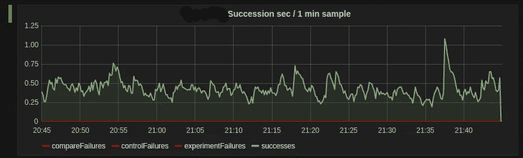

# Java 的继承库

> 原文：<https://medium.com/hackernoon/a-succession-library-for-java-3beeab7acf9c>

在去年的某个时候，我们看到 Zach Holman 的帖子"[进展很快，没有打破任何东西](https://zachholman.com/talk/move-fast-break-nothing/)"关于 GitHub 如何能够以最小的破坏风险替换部分代码库。在工作市场，我们正在从整体应用向微服务迁移。我们想以一种安全的方式将我们的整体构件提取到新的架构中。所以今天，我们介绍 1 月 20 日的[。](https://github.com/workmarket-oss/jan20)

继承的思想是你可以同时并行运行旧的“快乐的”路径代码和新的代码。比较两个代码路径的结果，以记录任何不希望的偏差。然后，返回这些结果中的一个(稍后将详细介绍)。这样，您可以确保您的新代码像旧代码一样运行，并且风险最小。有些变化你不能真的这样做；实验性地发送来自新旧代码的电子邮件对最终用户来说是一种可怕的体验，会得到所有内容的副本；但是对于许多种类的改变，它真的工作得很好。

我们四处寻找一个针对 [Java](https://hackernoon.com/tagged/java) 的实验/继承[框架](https://hackernoon.com/tagged/framework)，但是没有找到任何可以接受的选项。所以我们写了一个。我们现在已经“成功”推出了五项微服务，并取得了巨大成功，目前还有两项正在进行中。有了这些成功，我们已经到了可以分享的地步。所以今天，它将是我们在工作市场上希望发布的许多开源软件中的第一个。

# 一些准备工作

虽然它被编写成可以在 Java 7 中使用，但由于我们的 monolith 目前在 Java 7 中，继承框架的许多方面看起来更干净，如 Java 8 lambdas 等。它还利用了 [RxJava](https://github.com/ReactiveX/RxJava) 库，因为我们在我们的微服务及其客户端库中广泛使用了它。继任库本身使用 [DropWizard 度量](http://metrics.dropwizard.io/3.1.0/)(又名 Codahale 度量)报告度量。

# 控制(或实验)的本质

控件或实验的执行路径都是可调用的，返回结果类型的可观察值，或者简单地说，是可调用的<observable>>。然后，控件和实验调用被传递到试验中，同时传递的还有 IsEqual 和实验名称。</observable>

举个例子，让我们看看替换我们验证用户名和密码的方式的情况。假设我们的旧 API 已经返回了 Observables，您会得到如下结果:

# 对于一些平等的定义…

现在我们需要准确定义“这些行为是否相同”的含义。为了定义“相同”的阈值，有一个 IsEqual 接口。为什么不直接用可比？为了审判的目的，我们不在乎任何一种排序，我们只在乎平等。为什么不用？等于()？通常，实验的平等概念和你想要的并不一样。等于()。这方面的一个例子是，新 API 返回两个不同的可能枚举值，而旧 API 只返回一个。或者可能只有少数领域对平等有意义。通常，时间戳字段在两个系统之间并不精确。拥有一个不同的 IsEqual 允许您灵活地定义什么是“足够接近”。

对于一个实验，实际上有两件事情要检查，结果(在下面的例子中，是一个布尔值)，但是也有可能控件或实验会抛出一个异常。对于我们遇到的大多数情况，我们真的只关心要么两者都有，要么控制和实验都没有。但是在某些情况下，您可能想要检查抛出了什么类型的异常和/或它们的其他属性。但是对于两者都有或者都没有的情况，IsEqual 应该是这样的:

它可以像返回结果一样简单，但是当做这样的实验时，当结果不匹配时，你想知道它们有什么不同。在我们的代码中，我们将与 [Kafka](http://kafka.apache.org/) 的不匹配记录为 JSON 对象，以便我们可以调查不匹配。我们没有为此编写 Kafka 消费者，我们只是使用 Kafka 控制台消费者来获取主题的内容，并将它们转储到一个文件中。但是您可以用您当前使用的任何日志框架来记录它们。

为了让 IsEqual 实际检查结果，我们要做这样的事情:

这里有一点，让我们打开它。对于一个布尔值来说，这有点过了，但是当你有一堆要比较的字段时，这就方便多了。这允许你创建一个字符串列表来表示不匹配的地方。startCompare 返回一个 EqualChain，它有许多不同的方法来“使事物相等”。在这里，你可以看到。正如你所想的一样平等。还有 doubleEquals 使用==代替，compareTo 使用 compareTo 方法(假设你的类型实现 Comparable)。它也足够聪明，可以让你知道(你的 IDE 不支持警告，对吗？)如果您尝试使用 double 或 float 执行上述操作之一，那么您应该使用一个三参数版本来指定 delta。

整个过程的输出是不匹配元素的列表，当您在对不匹配数据进行排序，以及它们最终是否相等时，如果您有多个字段，这将非常方便。

有了这两样东西，我们就可以为实验做准备了。

Trial.makeIsEquals 实际上只是为您结合了两个 IsEquals。给你。pairwiseEqual 是因为 Observables 可以返回不止一个元素，所以在这种情况下，它在控制和实验之间进行成对比较，如果一个返回的项目比另一个多，显然会失败。我们的大多数 API 返回要么发出一个元素要么发出一个错误的 Observables，但情况并非总是如此。

# 试用代码

现在，最好能进行试验并得到结果。

除了最后一个，论点是什么应该很明显了。“检查密码”将是报告指标时使用的名称。结果值将是调用控件或实验返回的结果。

# 设置好一切

但是这如何报告度量，以及如何决定返回哪个(或者甚至运行哪个？).这都是在我们实际构建运行试验的试验实例时设置的。

metricRegistry 是一个常规的 Codahale 度量注册表。第三个参数是度量的根名称，在这个名称下，单独的试运行将创建它们自己的后继度量。因此，在上面给出的试验示例中，继任度量将在“password . succession . check password”下进行。

第四个论点是供应商<whichreturn>告诉试验返回哪一个，是对照组还是实验组。你也可以返回只运行控件或实验，而不运行另一个的值。因此，如果 whichReturn 供应商返回控制，控制将在调用线程中运行，实验将在后台线程中运行。如果供应商返回实验，实验将在调用线程中运行，而控件在后台运行。无论哪种方式，在后台运行的线程都不会阻塞调用者，也就是说:我们不会在进行比较之前阻塞两者都完成；当两者都完成时，在后台线程中进行比较。</whichreturn>

最后两个参数是试验包装器。当你需要为运行在主线(两个参数中的第一个)或后台(最后一个参数)的任何东西专门安排事情时，就使用它们。在这里的例子中，我们没有为前台的情况做任何事情，但是我们有一个试验包装器，它确保 hibernate 上下文被正确地设置为在后台运行的任何一个控件/实验。

这就剩下线程池了。您需要一个线程池来运行将在后台运行的任何东西。为什么有限制的遗嘱执行人会这样？如果在后台运行的代码相对于主线代码来说停滞不前或者运行时间过长，我们不希望阻塞我们的客户端，也不希望有无数的线程被阻塞。鉴于这仅包括可调用代码的执行，管理可观察位的东西可能会遇到它自己的问题，但无论哪种方式，我们都希望 whichReturned 代码不受阻碍地返回，不管 non-whichReturned 代码做什么，并且在后台出错时对整个应用程序的影响最小。如果 executor 中的队列已满，将在指标中报告。通常，当我们开始继承时，我们将队列大小设置为 1，并在必要时进行调整。

此外，在主 repo 中有一个演示目录，包含如何运行试验的简单示例，以及如何触发每个不同指标的示例案例。

# 怎么样了？

试验会产生许多指标，比如尝试的次数、成功和失败的次数、是否在尝试开始试验时抛出异常，以及线程池是否已经满了。最后，它允许您制作类似这样的图表(它没有显示试验报告的所有指标):

这个图表实际上很无聊，因为一切都在工作，但这真的是理想的，不是吗？但当事情变得不顺利时，你可以知道。

# 哦，你真的想用它？

哦，对了，你是怎么得到它的？它被称为 1 月 20 日(指美国总统继任发生的时间)，在这里可以找到。

如果我不给[马特·约特](https://github.com/myott)适当的信任，那我就失职了，他是我在这件事上的犯罪伙伴:)

> [黑客中午](http://bit.ly/Hackernoon)是黑客如何开始他们的下午。我们是 [@AMI](http://bit.ly/atAMIatAMI) 家庭的一员。我们现在[接受投稿](http://bit.ly/hackernoonsubmission)并乐意[讨论广告&赞助](mailto:partners@amipublications.com)机会。
> 
> 如果你喜欢这个故事，我们推荐你阅读我们的[最新科技故事](http://bit.ly/hackernoonlatestt)和[趋势科技故事](https://hackernoon.com/trending)。直到下一次，不要把世界的现实想当然！

