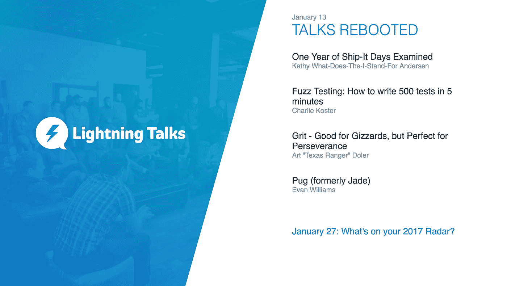

# 足够复杂的 Elm 应用程序

> 原文：<https://medium.com/hackernoon/a-sufficiently-complex-elm-application-c457d4373291>

The “All Hands” page of the Lightning Talk App

当我开始成为一个中级的 Elm 程序员时，我渴望更多实际的和产品化的 Elm 例子。外面没几个。

幸运的是，[我的雇主](http://aviture.us.com/)定期举办一个名为 [Codefest](https://hackernoon.com/tagged/codefest) 的活动，我们提交内部项目，自我组织成团队，为了娱乐和学习新的东西，继续进行我们选择的项目。我提交了一个项目来构建一个 Elm 应用程序来管理我们的闪电对话。

如果你想直接跳到这里，这是代码。

那次代码节是在两个月前，在三天的时间里，我们开发了 lightning talk 应用。从那以后，我们一直在对它进行迭代，以提高代码质量，修复错误，并为公开发布和未来的开发做准备。

我称之为*足够复杂*是因为它足够大，不是一个人为的“TodoMVC”示例，但在 2000+ LoC 时又足够小，可以在几次会议中消化。

该应用程序目前具有以下功能:

*   查看即将举行的闪电讲座
*   查看过去的闪电谈话
*   创建或编辑对话
*   修改一轮会谈的主题
*   查看“所有人”页面。我目前使用此页面将一张图片复制/粘贴到所有人的幻灯片中。

当我们最初构建应用程序时，它可以做更多的事情。早在 11 月份，我们就把它嵌入到了电子公司内部，并可以在 Mac 和 PC 上发布。它有用户认证。此外，我认为利用 Electron 来构建我们自己的**可回放生产 bug**功能会很棒，我在这里演示了这一功能:

不幸的是，为了从项目中移除 Electron，我们不得不在重构过程中临时移除可回放的 bug 功能。然而，在生产中提交 bug 报告(在没有调试版本的情况下)，小心混淆敏感数据，以及有条件地重放 cmd 是一个非常有用的功能。因此，我们将在未来几个月内重新实现无电子功能！

希望有人会发现[这个库](https://github.com/ckoster22/lightning-talk-app)有用。也许它会向您介绍管理数据的新视角。或者这可能是你第一次看到 Elm 作为一个单页应用程序。无论你的收获是什么，我希望它对你使用 Elm 的旅程有所帮助。

特别感谢 [*希斯*](https://twitter.com/HeathCarranza)*[*安德鲁*](http://andrewwirick.com/) *【迈克·凯兰】* [*瑞恩*](https://www.linkedin.com/in/ryanrasmussen05)*[*乔*](https://twitter.com/joeaulner) *，以及* [*埃文*](https://twitter.com/angular_evan) *对本申请的帮助。我仍然很惊讶上面的视频代表了一个小团队可以在 3 天内完成的事情。***

************

> **[黑客中午](http://bit.ly/Hackernoon)是黑客如何开始他们的下午。我们是 [@AMI](http://bit.ly/atAMIatAMI) 家庭的一员。我们现在[接受投稿](http://bit.ly/hackernoonsubmission)并乐意[讨论广告&赞助](mailto:partners@amipublications.com)机会。**
> 
> **如果你喜欢这个故事，我们推荐你阅读我们的[最新科技故事](http://bit.ly/hackernoonlatestt)和[趋势科技故事](https://hackernoon.com/trending)。直到下一次，不要把世界的现实想当然！**

****