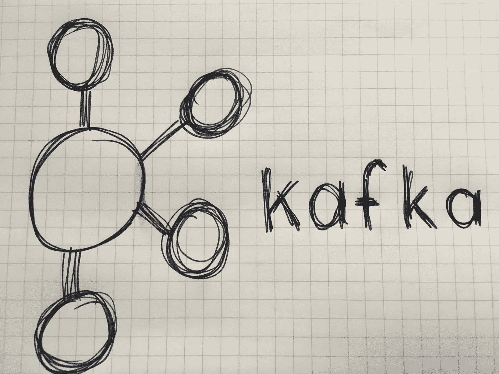
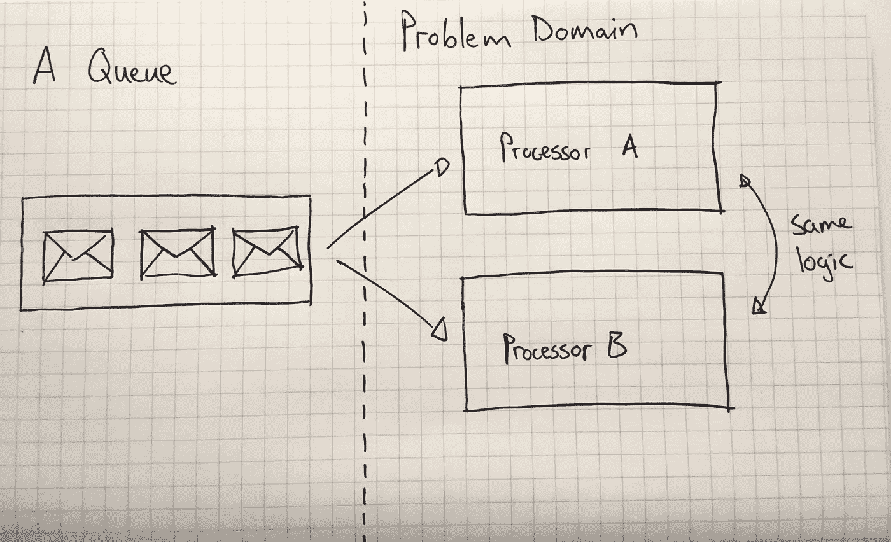
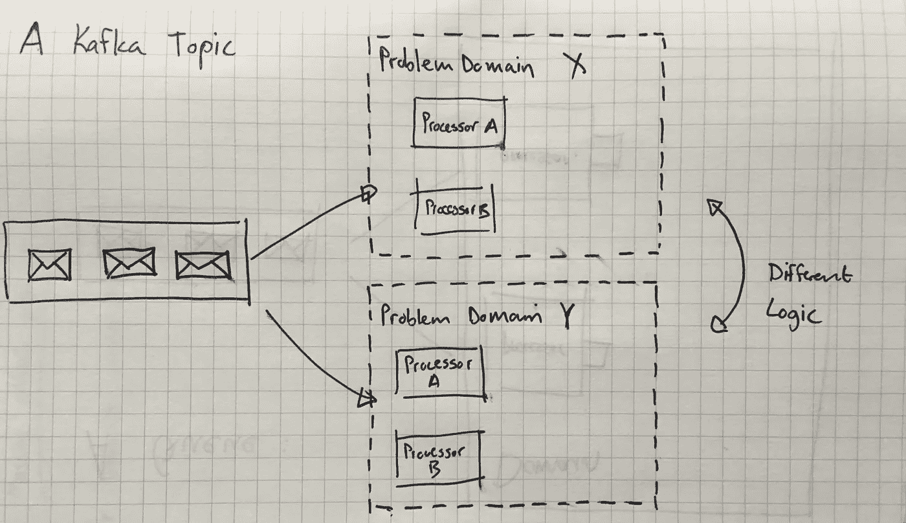

# 卡夫卡和消息队列的快速对比

> 原文：<https://medium.com/hackernoon/a-super-quick-comparison-between-kafka-and-message-queues-e69742d855a8>

这篇文章的目的是给你一个关于卡夫卡如何与队列相关的快速概述，以及为什么你会考虑使用它。

Kafka 是最初由 Linkedin 的人开发的一项技术。简而言之，它有点像一个消息排队系统，稍微做了一些改动，使它能够支持发布/订阅、跨多个服务器扩展以及消息重放。

当你想采用**反应式编程**风格而不是**命令式编程**风格时，这些都是需要考虑的问题。

# 命令式编程和反应式编程的区别

命令式编程是我们都开始使用的[编程类型。发生了一些事情，换句话说，一个事件发生了，你的代码被通知这个事件。例如，用户点击了一个按钮，您在代码中处理该事件的地方，您决定该动作对您的系统意味着什么。您可以将记录保存到数据库，调用另一个服务，发送电子邮件，或者所有这些操作的组合。这里重要的一点是，该事件与正在发生的特定行为直接相关。](https://hackernoon.com/tagged/programming)

反应式编程使您能够对发生的事件做出响应，通常是以流的形式。多个关注点可以订阅同一个事件，并让该事件在其领域中产生影响，而不管其他领域中发生了什么。换句话说，它允许松散耦合的代码可以很容易地扩展更多的功能。在不同堆栈中编码的各种大型下游系统可能会受到一个事件的影响，甚至是在云中某处执行的一大堆无服务器功能。

# 从排队到卡夫卡

为了理解 Kafka 会给你的架构带来什么，让我们从讨论消息队列开始。我们将从这里开始，因为我们将谈论它的局限性，然后看看卡夫卡如何解决它们。

消息队列允许一群订阅者从队列末尾提取一条或一批消息。在取出消息时，队列通常允许某种级别的事务，以确保在消息被删除之前执行了所需的操作。

并非所有的排队系统都具有相同的功能，但是一旦消息被处理，它就会从队列中删除。你想想，这很像命令式编程，发生了一些事情，始发系统决定某个动作应该发生在下游系统。

即使您可以在队列中向外扩展多个使用者，它们都将包含相同的功能，这样做只是为了并行处理负载和消息，换句话说，它不允许您基于同一事件启动多个独立的操作。队列消息的所有处理器将在同一个域中执行相同类型的逻辑。这意味着队列中的消息实际上是适合命令式编程的命令，而不是适合反应式编程的事件。

With queues, you generally execute the same logic in the same domain for every message on the queue

另一方面，使用 Kafka，您可以将消息/事件发布到主题，它们会被持久化。当消费者收到它们时，它们不会被移除。这允许您重放消息，但更重要的是，它允许大量消费者基于相同的消息/事件处理逻辑。

您仍然可以向外扩展以在同一个域中获得并行处理，但更重要的是，您可以添加不同类型的使用者，这些使用者基于同一事件执行不同的逻辑。换句话说，有了 Kafka，你可以采用反应式发布/订阅架构。

Different logic can be executed by different systems based on the same events

由于信息被保留的事实和消费者群体的概念，这在卡夫卡那里是可能的。当卡夫卡的消费者群体就某个话题寻求信息时，他们就认同了卡夫卡。Kafka 会记录哪些消息(offset)被传递给了哪个消费群体，这样就不会再把它端上来了。实际上，它比这要复杂一点，因为你有一堆配置选项来控制它，但是我们不需要完全探究这些选项，只是为了在高层次上理解卡夫卡。

# 摘要

Kafka 还有很多，例如它如何管理向外扩展(分区)，可靠消息传递的配置选项等等。但是我希望这篇文章足够好，让你明白为什么你会考虑采用[卡夫卡](https://hackernoon.com/tagged/kafka)而不是好的消息队列。

# 感谢阅读！:)如果你喜欢它，请点击下面的心形按钮表示支持。💚

> [黑客中午](http://bit.ly/Hackernoon)是黑客如何开始他们的下午。我们是 [@AMI](http://bit.ly/atAMIatAMI) 家庭的一员。我们现在[接受投稿](http://bit.ly/hackernoonsubmission)并乐意[讨论广告&赞助](mailto:partners@amipublications.com)机会。
> 
> 如果你喜欢这个故事，我们推荐你阅读我们的[最新科技故事](http://bit.ly/hackernoonlatestt)和[趋势科技故事](https://hackernoon.com/trending)。直到下一次，不要把世界的现实想当然！

