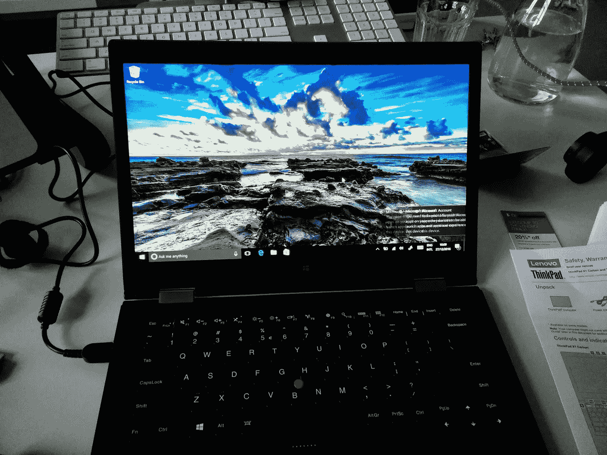
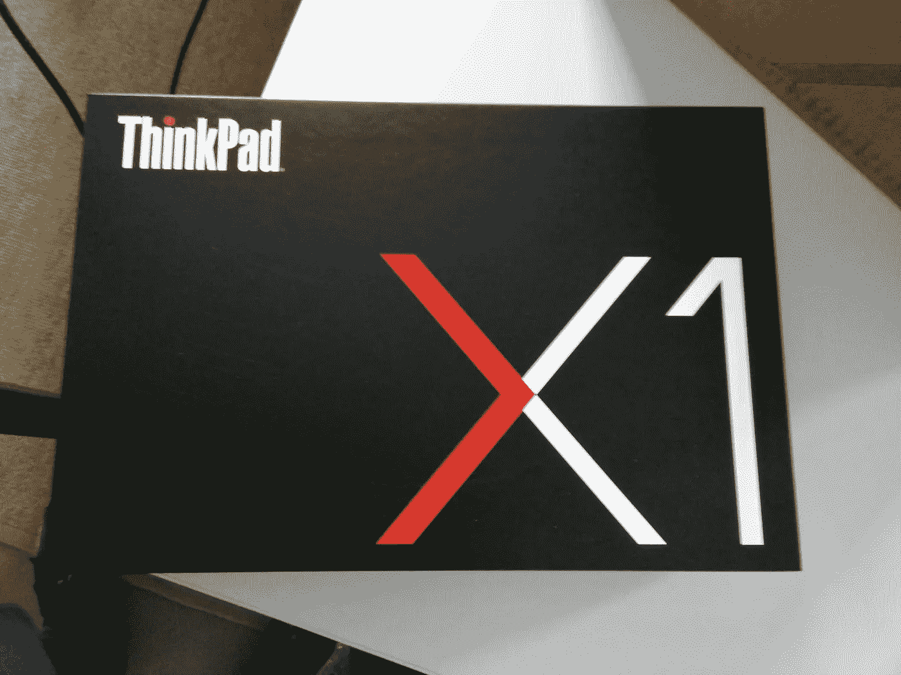
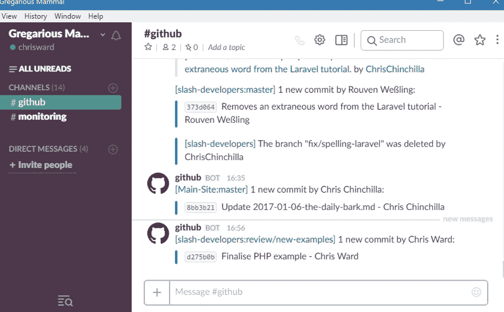
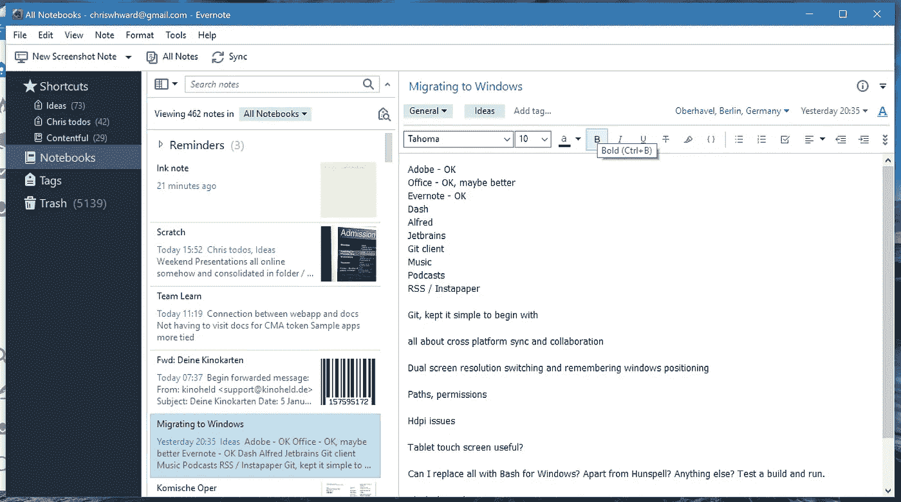
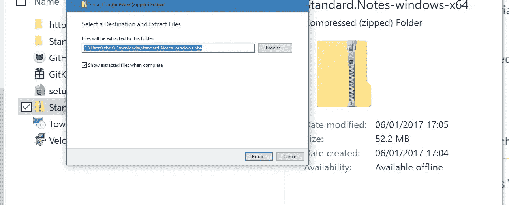

# 转辙者的故事——我的窗户一周

> 原文：<https://medium.com/hackernoon/a-switchers-tale-my-week-with-windows-612ea605291>

我第一次接触电脑是在 19 年的时候，我父亲的旧 Commodore 商用机器。我玩了一些随机的基于文本的游戏，学了一点基础知识。几年后，我拥有了一辆闪亮的 Amiga 1200，我玩游戏，做音乐，写故事，享受每一分钟。

多年后，在完成学业后，我获得了一台[苹果 Mac Performa 6200](https://en.wikipedia.org/wiki/Power_Macintosh_6200) (配有精彩的 [OS 7.5](https://en.wikipedia.org/wiki/System_7) )并且再也没有回头。除了(在大学时)被迫尝试过几次 Windows 和(在工作时)Linux 之外，我使用 Mac 已经超过 20 年了。无论是在困难时期，还是在好的时候。在 21 世纪初，我甚至从事 Mac 支持工作，帮助用户完成 OSX 的艰难推出，等等。

这一切在 2016 年发生了改变。在苹果发布了一系列声明和产品后，我加入了切换器的行列。

让我们先把事实搞清楚。我没有突然戒烟。个人工作还在用 2013 款 MacBook Pro，2017 年会升级。但是工作欠我一台电脑，所以这是我尝试其他操作系统的绝佳机会，看看它们提供了什么，获得新的视角，打破我的假设。

这是到目前为止这段旅程的故事。

## 预购

作为一名苹果用户，你习惯了在硬件和软件配置上几乎没有选择。当你研究 Windows 和 Linux 机器的世界时，你会被选择淹没。选择通常被认为是一件好事，但缺乏选择往往会迫使你做出决定，而当你试图在几乎没有差别的配置之间做出决定时，过多的选择会让你变得犹豫不决。

当你做决定时，除非你选择越来越多的微软品牌设备，否则购买体验不会像苹果那样流畅。在喜欢上我目前使用[联想 Yoga Book](http://127.0.0.1:4000/hands-on-with-the-yoga-book) 的体验后，我选择了[联想 Thinkpad Yoga X1](http://shop.lenovo.com/Thinkpad/X1-Yoga) 。我想，如果我要偏离 Mac 的道路，我还不如一直走苹果永远不会支持的形式因素。

我住在德国，但想要一个 QWERTY 布局，对于苹果来说这不是一个典型的问题，虽然联想提供了这个选项，但它是一个按单生产的选项，需要六周才能到达。我忘了我已经订购了笔记本电脑，直到它到达平安夜，我已经离开办公室去度假了。

## 拆箱和设置

大多数主要的电脑制造商都提升了他们的游戏体验，联想也不例外。所有东西都包装在一个折叠式红色盒子里，配有一个基本的保护套、清洁布和几个基本的适配器(打苹果)。开始使用 Windows 比以前简单多了，我唯一的困惑是我个人混合使用了德国单位格式、美国键盘布局和英国拼写。这导致我的大部分电脑混乱。虽然我知道新款 MacBook Pros 有指纹识别器，但这是我第一次使用指纹识别器，设置也很流畅。在几次下载和重启之后，Windows 已经准备好运行了。

## 使用 Windows

我在这里会尽量表现得有建设性，不会抱怨为什么我不喜欢某样东西，因为我更习惯 macOS 而不是 Windows。更确切地说，这些对我来说有用或没用。

## 显示处理

我对 Windows 最大的不满之一是显示处理。这是 macOS 擅长的一个领域，然而苹果很少宣传他们操作系统的这些小而惊人的功能。

Windows 的双屏设置正如您所料，连接到无线显示器也很简单。然而，与 macOS 不同，Windows 经常忘记每个屏幕上的窗口位置，在重新启动之间，甚至在屏幕保护程序运行之后，它们都不会保留。每天早上，我都要花时间在屏幕上重新分配应用程序窗口。

我可以应付这一点，因为我经常改变主意，无论如何我要把 windows 放在哪里，但我最大的不满是 Windows 处理高分辨率屏幕的方式。*注意，如果你不在高分辨率屏幕上观看这些图像，你不会注意到我在说什么*。

第一个示例来自内置(雇佣)屏幕上的 Slack 运行:

请注意应用程序窗口内可怕的渲染。显示控制面板可以让你缩放屏幕元素，让像我这样的盲人也能看得懂。但是无论控制面板中的设置是什么，应用程序中的文本呈现看起来都是这样的。

深入研究后，我发现 Windows 将处理招聘屏幕的责任交给了软件开发人员，而 macOS 则为开发人员处理。我想这是操作系统之间的一个基本区别，一个可以依赖它将运行的硬件配置，但另一个运行在无数不同的配置上。

Slack 是建立在[电子](http://electron.atom.io/)之上的(以及其他遭受同样问题的应用)，由于它是一个开源项目，它不太可能有任何人已经内置了这种支持。尽管这让我很痛苦，但我会给它留有余地。

下面是一个来自 Evernote 的截图，这是一个本地应用程序:

同样的问题。好吧，也许他们有其他的优先考虑。但这里有一个来自 Windows 本身的截图:

这不是唯一的例子。如果连微软都没有在其操作系统中内置对高分辨率屏幕的支持，为什么第三方开发者要费心呢？

## 重新启动、重启、重复

应用程序和 Windows 需要重启很多次。更改设置，windows 要重新启动。安装更新，Windows 要重新启动。macOS 过去也是这样，但现在通常只有当你添加低级功能时才会这样。纯粹出于心理原因，我每周关闭一次 MBP，但我不需要这样做。我假设这与 macOS 基于内核的架构有关，但我猜 Windows 以一种根本不同的方式工作。这是可以忍受的，但是会让你对设置做过多的尝试。

## 触摸和平板电脑模式

我大胆地走上了 Windows 之路，因为我已经享受了平板电脑上的 2 合 1 体验，并想看看它在电脑上的感觉。来回翻转笔记本电脑以切换模式效果很好，我在侧柜中找到的手写笔非常适合在屏幕上涂鸦。这是 Windows 10 擅长的领域。微软在 Windows 10 中很好地实现了这一双重目的。然而，我想知道我会在现实中使用多少模式，以及有多少应用程序是为体验而优化的。我想时间会证明一切。

## 在跨平台世界中工作

我对尝试 macOS 的替代品感兴趣的原因之一，是在苹果建造的围墙花园之外度过时光。微软已经迈出了巨大的步伐，变得更加开放，欢迎所有平台，我很想看看他们在这方面做得如何。在某种程度上，他们做得非常出色。Office 可以很好地与各种云存储解决方案集成，并且有可用的移动应用程序。Windows 现在包括基本的应用程序，如邮件和日历，适合许多普通的计算机用户。但是我发现在 Windows 上开发是一件很痛苦的事情，尽管有新的 Bash 支持，并且我试图听从我的同行的建议。

诚然，这是一个与我和那些在类似领域工作的人特别相关的问题。如果你不需要与 macOS 和 Linux 用户在混合环境中协作编码项目，那么这不会困扰你。但是我做了，并且它引起了主要的问题，记住，Linux 也包括大多数的主机、CI 和测试工具。

我经常不得不改变路径变量，这在摆弄之后，并不是什么大问题。我更大的问题是文本文件中的行尾和权限，带有 Windows 风格行尾的文件会破坏自动构建、测试等等。我在编辑器、ide 和 git 中尝试了各种设置来强制非 Windows 行尾，但是总有一些东西在覆盖它们，我也在不断地改变它们。

macOS 最好的一个方面是它是 GUI 的奇怪组合，但是有一个类似 Unix 的核心。苹果偶尔会触及这一点，引入额外的步骤让它工作，删除预装的包(例如 Apache)或者不预装最新的包(Git，Bash)。但是大多数情况下，有简单的解决方法(令人惊奇的自制软件)，你可以像 Linux 用户一样运行相同的包。

对于 Windows，我不知道从哪里开始。大约有三个家酿等价物(包括[新的 Bash 支持](https://msdn.microsoft.com/en-us/commandline/wsl/about))和多个终端替代品，但是我仍然努力用一个来满足我所有的依赖。根据什么最适合我，或者可用性，我有从本地包安装的工具，其他的在 [Cygwin](https://www.cygwin.com/) ，其他的在 Bash for Windows。当涉及到环境变量、依赖性或追踪问题的根源(比如我的行尾问题)时，这变得非常令人困惑。当然有变通办法，但是当变通办法超过你的生产力时，就会有一个临界点，我就要达到那个临界点了。

## 透过任何窗户看

对于“普通”用户来说，Windows 是一个可靠的操作系统，如果你从未接触过开发过程(记住，我是一个作家)或开发微软技术，那么它是一个不错的选择。如果你喜欢游戏，这是最好的选择之一。我甚至还没有尝试安装我积压的不能在 Mac 上玩的 Steam 游戏。有许多应用程序只能在 Windows 上使用，尤其是企业级应用程序。

我喜欢 Windows 的控制水平，你可以在默认控制面板中调整的设置超过了 Linux 的能力。我喜欢新的开始菜单和你可以用它做什么。虽然 Cortana 在美国之外受到限制，但它比 Mac 上的 Siri 更好地集成到了操作系统中。

我可以忍受上面提到的我的开发问题，虽然它们对我的生产力有影响，但我的设置将永远是我特有的，并且它不是主流用例。我觉得不可原谅的是上面提到的显示器问题，我很难理解微软是如何在用户体验非常糟糕的情况下鼓励高分辨率显示器的。在使用 Windows 的大部分时间里，我都感到头疼，我想是因为很多应用程序中的字体渲染。

这就是我与 Windows 的故事，不全是坏事，但很难相处。下周我将尝试 Linux，所以请关注这个空间。

> [黑客中午](http://bit.ly/Hackernoon)是黑客如何开始他们的下午。我们是 [@AMI](http://bit.ly/atAMIatAMI) 家庭的一员。我们现在[接受投稿](http://bit.ly/hackernoonsubmission)，并乐意[讨论广告&赞助](mailto:partners@amipublications.com)机会。
> 
> 如果你喜欢这个故事，我们推荐你阅读我们的[最新科技故事](http://bit.ly/hackernoonlatestt)和[趋势科技故事](https://hackernoon.com/trending)。直到下一次，不要把世界的现实想当然！

