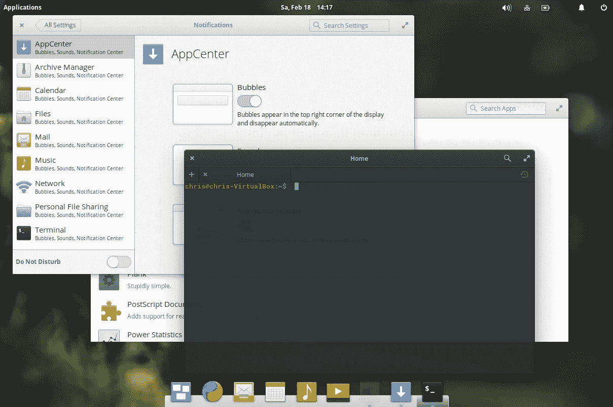

# 切换者的故事——我的 Linux 一周

> 原文：<https://medium.com/hackernoon/a-switchers-tale-my-weeks-with-linux-deededb3b635>

在我的上一篇文章中，我讨论了作为一名 20 多年的 macOS 用户，我想探索一下其他桌面操作系统能提供什么。我还讲述了我使用 Windows 一周的经历。这是一系列复杂的体验，我想借此机会补充一点，切换到 Windows 10 insider 预览版解决了我在屏幕渲染方面的许多问题，这表明微软意识到了 Windows 的缺点，并积极努力解决它们。

ElementaryOS

## 如此多的选择

介绍 Linux 的使用体验是一项艰巨的任务，因为 Linux 不是一个选项集。有多种发行版、窗口管理器和桌面环境，您可以将它们结合起来，创建您正在寻找的体验。当评估 Linux 时，很难定义体验从何开始，尽管正如我所发现的，Linux 的许多问题和优点是普遍的。

对于本文，我将涵盖我尝试过的四个主要选项，ElementaryOS(基于 Ubuntu)、带有 Unity 的 Ubuntu、Mint(基于 Ubuntu)、带有 Gnome shell 的 Fedora 和带有 Cinnamon 的 Fedora。

## 为什么会有这些选择？

在我尝试过的所有发行版和桌面环境中，都有我喜欢的特性。大多数时候，像主题和图标集这样的定制是和环境选项一起产生的，所以你可以很容易地在它们之间切换。

我最终坚持使用 Fedora，因为我发现这个社区更支持、更投入、更友好。老实说，Ubuntu 更适合 Linux 初学者，而且就直接应用程序支持而言，它最受非 Linux 社区的认可。

elementary OS 背后的开发人员和设计人员做了值得称赞的工作，创造了一个光滑流畅的界面，对于切换者来说很熟悉，但又足够不同。然而，它也面临着任何其他严格控制的操作系统的同样问题。一旦你走出围墙花园，应用程序就不能很好地适应范例和设计。我猜开发者可以添加功能来支持初级，但我想知道有多少人会这样做。

我发现 [Unity](https://unity.ubuntu.com/) 和 [Gnome shell](https://wiki.gnome.org/Projects/GnomeShell) 的易用性太过视觉干扰(特别是注意我后面提到的缩放问题)。我最终坚持使用 Cinnamon，因为它处理伸缩的能力最好(我不严格地使用这个术语),也最容易使用，是为 Windows 和 macOS 的切换者设计的。

我短暂地尝试了 KDE 和 T2 的 Xfce，但是它们都没有解决我的任何主要问题，所以我坚持使用软呢帽和肉桂。

## 探险者的梦想

在过去的十年里，桌面上的 Linux 已经走过了漫长的道路，但它仍然主要是针对技术爱好者(更重要的是，是由技术爱好者创造的)，或者那些愿意花大力气去得到他们想要的东西的人。由于大多数生产应用程序服务器运行 Linux，大多数开发工具在桌面 Linux 上运行良好，但是您经常需要熟悉命令行才能最有效地工作。有趣的是，我仍然发现许多(更现代的)开发工具在 macOS 上比在 Linux 上有更好的支持，主要是因为越来越多的开发者使用 MAC。例如， [fsevents](https://www.npmjs.com/package/fsevents) 等 npm 模块和“ [open](https://developer.apple.com/legacy/library/documentation/Darwin/Reference/ManPages/man1/open.1.html) 等命令只在 MAC 上工作。虽然从包管理器安装开发工具是一致且容易的，但并不是所有的东西都是最新的版本。一旦您安装了所有的东西并使它们工作，那么使用和更新它们就没有痛苦了，并且您可以确信所有的东西都可以在生产中工作。

## HDPI 和双屏

我在 Windows 下使用高分辨率屏幕和双屏时遇到的许多问题，我也在我尝试的每一种 Linux 版本中遇到过。问题是不同的，但仍然很难使用。对于高分辨率屏幕，除非你有惊人的视力，否则你需要启用缩放以使文本和界面可读。这基本上是可行的，但是有很多 Linux 应用程序并没有注意到这些设置，而且一些相当重要的应用程序(例如 Chrome)在启用缩放时几乎无法使用。有变通办法和调整，但就像我的 Windows 经验一样，我想花时间工作，而不是变通。即使你确实让缩放为你工作，添加第二个显示器到组合中，它不是高分辨率的，它是一个完全不同的乐趣。我不断尝试建议为每个屏幕设置不同的缩放级别，但它们从来都不太管用，而且对于许多应用程序来说，如果你将一个窗口从一个屏幕拖到另一个屏幕，那么界面会以一种糟糕的状态结束。屏幕管理器 [wayland](https://wayland.freedesktop.org/) 应该可以解决这些问题，但是我在 fedora 上使用它的经历并没有显示出这一点，甚至 Linux 社区也仍然对此持怀疑态度并存在分歧。

## 选择太多

Linux 举例说明了开源的一个首要问题(我猜你可以认为这是一个积极和消极的问题)。开源社区通常喜欢证明它能比现有的选项做得更好，而不是合作改进它们。需要一个特定任务的应用程序，你会发现许多重复的项目来完成它。但是它们经常被放弃，缺乏核心功能，或者需要时间和精力，而这些都是没有人拥有的。我知道这是开源的全部意义，这是一个“民主”的世界，任何人都可以创造或贡献他们需要的东西。但在现实中，我们知道情况并非如此，除了少数项目，实际上大多数项目都以我上面概述的场景告终。具有讽刺意味的是，虽然某些应用程序类型被过度选择，但其他类型却缺乏，这通常反映了“典型的”Linux 用户。例如，你可以找到几十个文本编辑器，但是很少有像样的 Twitter 客户端，或者 git GUIs。

## 为 Linux 开发

据我所知，Linux 开发没有“官方”方法，尽管许多开发人员忽略了 Windows 和 macOS 上的官方途径，但它们至少是存在的。这导致应用程序不一致，界面千差万别，而桌面界面的可定制性使得开发者更难处理这个问题。某些应用程序比其他的要好，而且它们往往是较老/较大的项目。

除了像 [Qt](https://www.qt.io/) 和 [GTK](https://www.gtk.org/) 这样的流行库，我发现最近的一波 JavaScript 本地应用(比如那些用 [Electron](http://electron.atom.io/) 创建的)是其中比较好的一些。也许这与 Canonical 的 [Snap](https://snapcraft.io/) 结合起来是 Linux 桌面未来有用的趋势。我希望社区支持供应商和开发者的努力。

## 选择不够

Linux 的市场份额很小([目前约 2%](https://www.netmarketshare.com/operating-system-market-share.aspx?qprid=10&qpcustomd=0) ，不知道这是否包括 Chromebooks？)，所以当然很少有商业专有开发者会为平台开发他们的应用程序。这在本质上是可以的，因为 Linux 社区中的许多人无论如何都不想要它们。如果你需要在混合操作系统的世界中与他人合作，你经常会被逼进死胡同，或者使用缺乏功能或稳定性的 web 应用程序。我还发现 Debian/Ubuntu 对 Linux 版本的支持最好，理论上，你可以自己为其他发行版构建应用程序，但前提是源代码可用。

## 现代硬件

在 Linux 中，对一些现代硬件如触摸屏和指纹识别器的支持是不一致的。在我的联想 Yoga X1 上，运行 Windows 和切换到平板模式是无缝的，而在运行 Linux 时却不是这样。这在很大程度上与设备制造商没有让开源社区创建设备驱动程序成为可能有关。同样，可用的硬件种类繁多会使社区难以跟上，默认趋势通常是复制而不是协作。公平地说，macOS 在苹果硬件上运行如此无缝的唯一原因是，使用其他任何东西都没有什么选择。

## 开阔的道路与有围墙的花园相接

作为一个操作系统，我喜欢 Windows，但由于在 Windows 上开发的痛苦，在我退出 macOS 期间，我大部分时间都坚持使用 Linux。这不是视觉上最愉悦的体验，但我从中获得了最高的效率。原则上，我想让 Linux 更好用，我想比现在更爱它。抛开我对 Creative cloud 和 Evernote 等专有应用程序的不健康依赖，缺乏电子邮件、日历或 Twitter 等像样的基本应用程序对我来说是个问题。是的，我知道有选择，但我个人认为他们不可靠，缺乏现代特征。

在我尝试替代操作系统之后，我希望苹果不会将 macOS 和 iOS 合并成一个更具限制性的操作系统。苹果可能不是最好、最进步或最有道德的公司，但在我(目前)看来，如果你正在寻找一个有用、可靠、适合开发和图形应用的操作系统，那么 macOS 是更好的选择之一。

我期待着对这句话的评论，我希望你能证明我是错的。我要求你在表达意见时要平衡合理。请记住，每个人的用例都是不同的，鼓励就如何改进问题进行建设性的对话，而不是“我们对他们”的争论。谢谢！😁

> [黑客中午](http://bit.ly/Hackernoon)是黑客如何开始他们的下午。我们是 [@AMI](http://bit.ly/atAMIatAMI) 家庭的一员。我们现在[接受投稿](http://bit.ly/hackernoonsubmission)，并乐意[讨论广告&赞助](mailto:partners@amipublications.com)机会。
> 
> 如果你喜欢这个故事，我们推荐你阅读我们的[最新科技故事](http://bit.ly/hackernoonlatestt)和[趋势科技故事](https://hackernoon.com/trending)。直到下一次，不要把世界的现实想当然！

