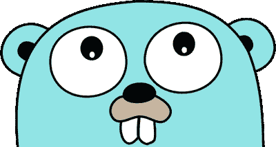
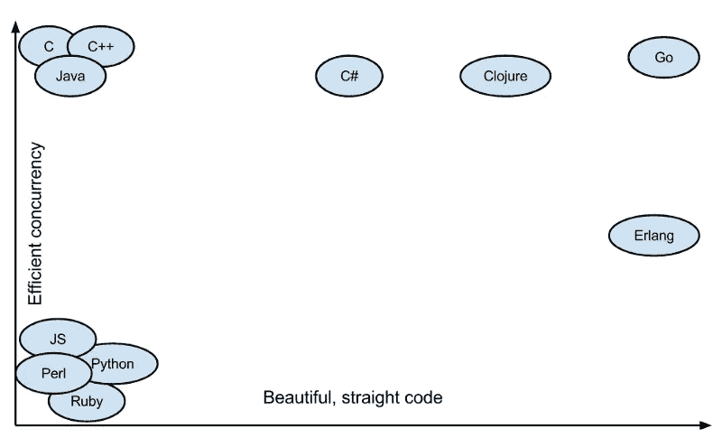
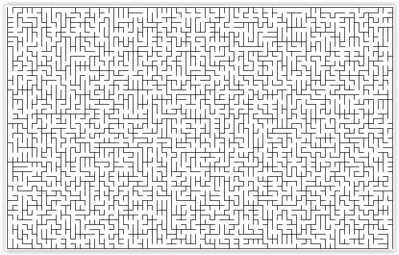

# 介绍 Golang 的并行冒险

> 原文：<https://medium.com/hackernoon/a-taste-of-go-for-javascript-hackers-e9e45f8c10bf>

## 对于 Javascript 开发人员或类似的人来说，这是一个有趣的入门，因为主要是动态类型语言体验。内在有许多链接，因为它们是我理解语言中不可或缺的链接。

Gopher-”hello human”

你很好奇。你听说过这种神秘的语言，它正在稳步攀升软件行业的排名。你知道谷歌这条难以捉摸的龙创造了它。也许你听说过 Node JS [的创建者在 i](https://www.mappingthejourney.com/single-post/2017/08/31/episode-8-interview-with-ryan-dahl-creator-of-nodejs/) t 中写道。但是最重要的是，你已经注意到了地鼠。

有一个概念你必须理解，以正确地概念化围棋。那就是……并发！

但是为什么并发很重要呢？[无可奈何](https://softwareengineering.stackexchange.com/questions/115474/why-should-i-know-concurrent-programming)。如果只有同步性，我们的计算机将会以蜗牛的速度移动。

而 Go 正在迅速成为并发[编程](https://hackernoon.com/tagged/programming)的领导者。这是因为它写得很漂亮，而且性能极好。在某种程度上，这是两全其美的。

Check [this link](http://www.cuelogic.com/blog/go-programming-and-why-should-you-learn-go/) out for further explanation

让我们通过想象来学习。你在一个平行宇宙中。生活的背景是一个迷宫。你可以复制你自己，并把这些其他的自己发送到不同的方向。生命的意义在于找到一条穿过这个迷宫的路。

A million you’s finding (their? your?) way through life.

你把你的克隆人送到每一个可能的方向。当一个人找到出口时，所有的克隆体都消失了，你变成了找到出口的克隆体。你会发现生命的意义。

首先， [JavaScript](https://hackernoon.com/tagged/javascript) 中的一个例子:

[JavaScript 事件循环](https://www.youtube.com/watch?v=8aGhZQkoFbQ)寻找出口……是的，这是一种过度简化。

Pseudo Code JS implementation

现在…走吧。

快速浏览一下，后面直接有详细解释。

Don’t be intimidated.

好吧，解释起来有点难。

让我们从小处着手；)

struct ~= JS constructor but with only properties, no methods

Struct？这类似于在 JS 中创建一个构造函数并关联两个属性。但是您必须指定属性的类型，并且您不能给默认值。

在嵌套结构上:

Notice how structs are being passed into structs ~= nesting objects

现在！嵌套结构。所以我可以做这个… `maze.Location.props.final`。

这是什么？`[][]`。意思是这样的:`[[],[]]`。就是这种类型，一个数组里面有两个数组，非常复杂。

界面上:

interfaces ~= floating method constructors

现在怎么办？把这些想象成…浮动方法构造器！在 Go 中它们被称为接口！一旦将它们与结构相关联，该结构就可以调用它们。在此之前，没有什么可以叫他们。

但是，还有另一个步骤，函数必须与结构相关联:

First parentheses is the struct associated

如评论所说。与特定结构关联的方法就是这样分类的。

但是现在有了函数，那么*？你肯定听说过指针，但它对围棋来说意味着什么呢？如果你在别处写这个:`&c.goDifLocation(...)`克隆类型的变量，在这里是 c，是…突变的！听起来熟悉吗？如果你想了解更多关于突变的内容:[在 Go](https://dave.cheney.net/2017/04/29/there-is-no-pass-by-reference-in-go) 中没有按引用传递。

回到函数！参数:`(l string)`。是的，还必须给它一个特定的类型。此外，在 Go 中给参数名取短名称是很常见的，因此 l 代表位置。

接下来，更详细的功能:

Adding function to struct, specific parameter, specific return value

1，2，3，4 件事？是的，这就是现实。

1.  `(c clone)` Ex。somethoftypeclone . find exit…
2.  `findExit` —这是功能的名称
3.  `(m Maze)`例如 somethoftypeclone . find exit(somethoftypemaze)
4.  最后，返回值！`TheMeaningOfLife`

整体功能:

The meaning of life

现在是函数。查看第一行:`var currentLocation string`。再次，永远记住:类型是必要的。

注意我是如何在 if 语句中初始化 currentLocation 的？听起来熟悉吗？[词法范围](https://kuree.gitbooks.io/the-go-programming-language-report/content/24/text.html)！如果你不知道，这个链接有一个很好的解释。

而 if 语句呢？不允许有括号！很棒，不是吗？完全双倍平等。还是那句话，比 JS 好看多了。但是要知道，花括号是必需的。如果你加入一个 else 语句。简单解释:[按例走:If/Else](https://gobyexample.com/if-else) 。基本上，应该知道的是 else 或 else if 必须在结束括号的同一行— `} else {...`

以及对特定指数的复杂理解。我简单说一下，找到一个 1 到 3 之间的数。rand 是一个库，math 也是，必须在文件开头导入。好奇的话一个链接:[包](https://www.golang-book.com/books/intro/11)。虽然在围棋中抓取随机数[有点复杂](https://gobyexample.com/random-numbers)。

到主函数上:

main is the main man in town

Main 是当你打开文件时执行的所有内容，就像在中一样，这个函数中的所有内容将是输出或返回的内容。

`:=`讲的是什么？[隐式类型](https://tour.golang.org/basics/10)。是的，函数返回值的方式和 JS 类似。`Maze{ mazeData }`正在创建以`mazeData`为关联值的结构。

假设`mazeData`是这样的:

Nested objects do not hate you

结构所需的每个值都已填写。或者如果不是，则给出零值。

至于:`make([]Clone, 1000000)`。这被称为[切片](https://tour.golang.org/moretypes/13)。创建了一个数组，其中填充了 1000000 个此结构的类型，但所有类型都是空的！

Concurrency!

最后一点代码。`for := range`类似于克隆数组的 forEach。尽管第一个参数总是索引，第二个可以是实际的实例。我正在设置每个克隆的 id，并且…

Go 套路！！！！！

你输入这个，每一个克隆体都会进入它自己的进程，在迷宫中寻找出路。所有人都朝着不同的方向前进，但却朝着同一个目标前进！简而言之就是并发性。

Busy gophers

就像上面的地鼠，都在做同样的事情，一件非常可怕的事情…烧书。但还是！每一个都是一个单一的实体，目标相同。

现在，这是对 Go 语言的介绍。希望你旅途愉快。如果您想了解更多信息，请访问:

> [举例说明](https://gobyexample.com)
> 
> [围棋之旅](https://tour.golang.org/welcome/1)
> 
> [Go Koans](https://github.com/cdarwin/go-koans)
> 
> 肯定是这个[视频](https://www.youtube.com/watch?v=ytEkHepK08c&t=2s)！而[这一个](https://www.youtube.com/watch?v=f6kdp27TYZs)被主谋走了！
> 
> 谢谢大家！
> 
> 尿壶