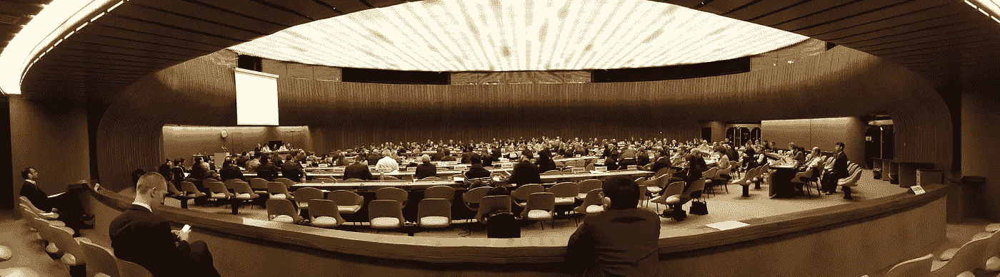
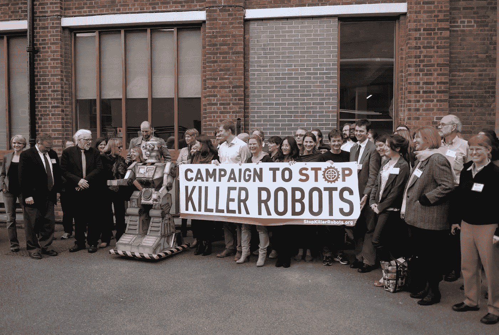
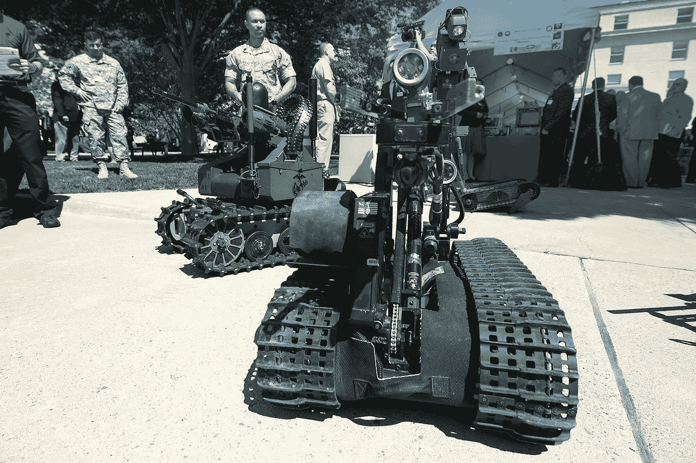
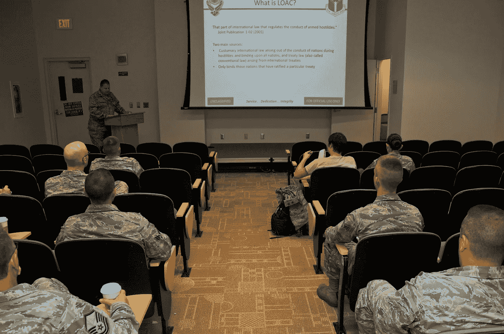

# 解除武装的技术呼叫

> 原文：<https://medium.com/hackernoon/a-tech-call-to-disarm-d6e111208d04>

一封由 116 名人工智能和机器人公司创始人签名的新[公开信](https://futureoflife.org/autonomous-weapons-open-letter-2017)似乎在不少新闻网站的[科技](https://hackernoon.com/tagged/tech)版块引起了轩然大波(这里[这里](http://www.bbc.co.uk/news/technology-40995835)和[这里](https://www.theguardian.com/technology/2017/aug/20/elon-musk-killer-robots-experts-outright-ban-lethal-autonomous-weapons-war?CMP=share_btn_tw))。这是几年前人工智能和机器人研究人员发表的一封公开信[的后续。](https://futureoflife.org/open-letter-autonomous-weapons)

不幸的是，埃隆·马斯克(Space X 和特斯拉的创始人)似乎已经被[归结为](https://www.theguardian.com/technology/2017/aug/20/elon-musk-killer-robots-experts-outright-ban-lethal-autonomous-weapons-war?CMP=share_btn_tw)背后的主要人物。他不是。努力获得所有签名的人是新南威尔士大学人工智能教授托比·沃尔什。

Toby Walsh, 2008\. Photo by Avobronte. Used under CC3.0 License.

尽管马斯克可能是科技流行文化中继续鼓吹人工智能危险的最大名字，但他一直因对它的理解而受到批评(这里[这里](https://www.wired.com/story/elon-forget-killer-robots-focus-on-the-real-ai-problems/)和[这里](https://www.facebook.com/zuck/videos/vb.4/10103911836230631/?type=2&theater)【大约 50:00】——并且[批评了](https://twitter.com/elonmusk/status/889743782387761152)其他人)。然而，这封信特别关注自主武器，而不是具有自我意识的人工智能接管的不太可能的威胁。

这封信应该与今年在日内瓦联合国召开的“致命自主武器系统政府专家组”的两次会议中的第一次相吻合。但是，因为许多国家没有支付他们的联合国账单，这个会议被取消了。因此,《特定常规武器公约》( CCW)的账户减少了大约 50，000 美元，活动人士希望该公约能在年的新议定书下禁止自主武器。

[去年我在联合国参加关于致命自主武器系统的非正式专家会议时，之前的公开信被多次提及。一些州谈到了它，但主要是在反对自主武器的活动家的演讲中。这些团体中的大多数都是非政府组织联盟“T4 阻止黑仔机器人运动”的一部分。](https://lawofkillerrobots.wordpress.com/2016/04/18/united-nations-meeting-of-experts-on-lethal-autonomous-weapon-systems/)

Panaorama of the UN CCW Conference room, 2016\. (Photo by Author.)

当然，大部分提到前一封公开信以及反对自主武器的演讲和文章的事实并不令人惊讶。但是，少数几个州已经声明反对这些系统，这对于禁令来说并不是一个好兆头。

大多数州没有对禁令提出任何异议。[有些是死反对](http://www.telegraph.co.uk/news/2017/08/21/britain-will-not-support-pre-emptive-ban-killer-robots-mod-says/)。然而，没有人明确表示他们完全赞成这种武器。当涉及到禁令的可能性时，这就引出了三个真正的问题。第一，世界上所有的活动家都可以支持禁令，但如果《特定常规武器公约》的缔约国不想要禁令，它就不会发生。到目前为止，只有 19 个缔约国呼吁禁止。这是《公约》121 个缔约国中的一个，另有 5 个国家已经签署但尚未批准。因此，缔约国的势头显然不支持禁令。

Campaign to Stop Killer Robots meeting 2013\. Used under CC2.0 license.

第二，在我看来，虽然参与辩论的每个人似乎都承认自主武器存在重大的危险、风险和伦理问题，但它们在未来的冲突中也可能极其有用。在我看来，潜在的效用是各州不希望禁止它们的原因。如果大国(甚至是中等国家)之间爆发全面冲突，准确、快速、不危及自身安全地消灭敌军的能力将会非常有利。

这种冲突似乎不太可能发生，但主要大国保留核武器以应对彼此之间不太可能(或许几乎不可能)的冲突。因此，为不太可能发生的未来冲突采用自主武器并不难想象。事实上，可以说自主武器提供了单独摧毁可能被一枚核弹攻击的多个目标的能力，从而减少了附带损害。

Master Gunnery Sgt. Joseph Perara guides a robot during the Department of Defense Lab Day at the Pentagon, May 14, 2015\. Perara is assigned to the Marine Warfighting Laboratory. (US DoD photo by EJ Hersom.)

第三，支持禁止的论点经常提到武装冲突法无法处理自主武器。但是，没有理由不能。武装冲突法规定了战斗人员必须遵守的某些要求。主要原则是不以平民为目标，尽一切可能减少附带损害，不发动可能造成与获得的军事优势不相称的附带损害的攻击。《武装冲突法》没有规定这些必须如何做，所以没有理由自治系统不能在法律上履行这些义务。从技术上讲，每个人都承认，当前的系统无法理解他们的环境、潜在目标或平民，以至于无法准确识别平民和人类目标之间的差异。但是，这并不意味着未来的系统不能做到这一点。如果未来的系统能够符合法律要求，那么法律就没有问题，唯一的问题是当前的系统不够完善。任何不完善的系统都是非法使用的，因此永远不会被部署。因此，武装冲突法为未来的平民提供了足够的保护。事实上，那些认为这还不足以保护平民的人或许应该开始主张重新谈判武装冲突法，而不是专门反对自主武器。

US 911th Airlift Wing law of armed conflict training, Aug. 11, 2012\. (U.S. Air Force photo by Senior Airman Joshua J. Seybert/Released)

因此，我认为各国不太可能谈判一项禁令。即使各国同意制定一项关于自主武器的附加议定书，我也不认为它会超出对使用的最低限度限制。即使这是可以控制的，我认为如果两个拥有武器的自治国家之间爆发高强度的国家间冲突，它也会遭到蔑视。所以，禁止的可能性很小。即使一项国际法律文书可以谈判达成，我也不指望它能有多大作用。

直到下次