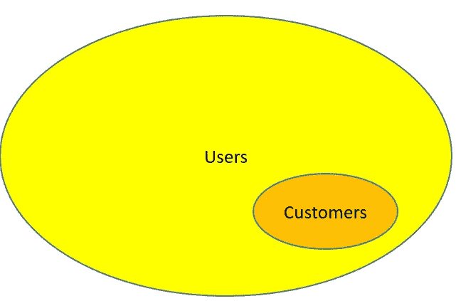
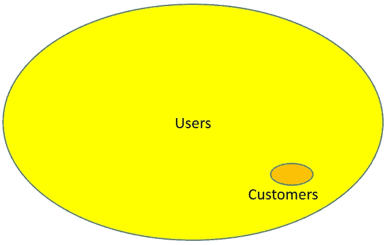
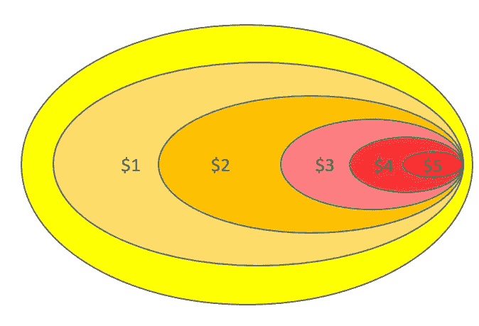

# 免费增值模式的理论

> 原文：<https://medium.com/hackernoon/a-theory-of-the-freemium-model-4090e9c760fd>

在过去的几天里，我很难入睡。所以在挣扎着睡了 6 个小时后，我决定起床把它们写下来。我一直在思考的一件事是关于免费增值定价模式的理论。

首先，我想澄清一下，我完全没有使用免费增值模式的经验。所以这篇文章中写的一切都是纯粹的猜测。然而，我是免费增值产品的常客，所以我相信我的理论有一定的依据。
***更新:我们的初创公司现在实际上正在建立一个免费的 Saas 平台，我正在遵循我一年前在这篇文章中提出的许多原则。***

所以现在开始。

根据维基百科，

> **免费增值**是一种定价策略，通过这种策略，产品或服务(通常是数字产品或应用，如软件、媒体、游戏或网络服务)免费提供，但对专有特性、功能或虚拟商品收取费用(溢价)

这种定价策略很有趣，因为它涉及到仅仅使用你的产品的用户，以及为你的产品付费的用户(也称为顾客)。因此，你基本上有两个目标市场。然而，问题在于客户是用户的子集，他们很容易被混淆。

让我来演示一下:

Product A with 10% paying customers

Product B with 2% paying customers

如您所见，产品 A 和产品 B 的用户群规模相同，但产品 A 的利润更高，因为他们可以将 5 倍多的用户转化为付费客户。危险的是，如果你用用户总数作为衡量成功的标准，你会得到完全相同的数字！事实上，如果产品 B 拥有两倍的用户，它将会获得两倍的成功，尽管它的利润不到产品 a 的 50%，这就是为什么我们看到许多使用免费增值定价模式的创业公司亏损，尽管他们拥有庞大的用户群。因此，在这种情况下，避免这一问题的最佳方法是使用收入而不是用户群作为可衡量的指标。

这是否意味着获得大量用户群毫无意义？不完全是。这是我们更深入研究如何评估用户群价值的地方(纯粹通过收入)

Different user conversion for different prices

在上图中，假设您有一百万用户。你可以将 80%的用户转化为付费用户，如果他们都支付了 1 美元(我认为这对于免费增值产品来说是一个高得离谱的转化率)，如果他们支付了 2 美元，转化 60%，如果他们支付了 3 美元，转化 35%，如果他们支付了 4 美元，转化 15%，如果他们支付了 5 美元，只转化 5%。那么这个用户群的价值就是 120 万美元，因为溢价 2 美元会给你带来最好的回报。免费用户的客户转换率为 60%,基本上每 5 个新用户就能获得 6 美元，这意味着每个用户的平均收入为 1.2 美元！因此，只要你真的深入研究，找出正确的溢价，一个庞大的用户群真的可以非常有利可图。如果你有病毒式的用户增长，它本质上是一台赚钱机器。

问题是，当你有一个用户群，他们不会以任何价格购买任何东西。当你的产品的核心价值是“免费”时，就会出现这种情况。我个人对 Dropbox 有这种感觉。几年前，我从 Dropbox 的所有促销活动中获得了超过 80 Gb 的存储空间，并在上面存储了我所有的文件。Dropbox 是一个不错的产品，对我来说基本上是免费存储。去年，当我的免费空间到期时，我完全停止使用它。为什么？还有其他免费的替代品！当我有 80+ Gb 的时候，与 OneDrive 和 Google Drive 等其他公司相比，这已经很好了，one Drive 和 Google Drive 的空间要小得多，但现在，Dropbox 提供的空间与其竞争对手相比要小得多，为什么不干脆换成免费的，而不是支付更多的费用呢？

解决方案是从你的产品中找到合适的特性，让你的一些用户愿意为此付费。比如从《糖果粉碎》购买额外生命，或者从《英雄联盟》购买新的冠军皮肤。

尽管如果你没有意识到它的风险，免费增值可能是一个危险的定价模式，但它确实有几个显著的好处。

1.用户获取就简单多了。让人们尝试免费产品比让人们为付费产品付费要容易得多。人们喜欢免费的东西。

2.你可以更好地控制如何开发你的产品。你没有义务像回应付费产品一样回应免费产品的用户请求。比起付费产品，人们会更加宽容免费产品。

3.你正在建立你自己的市场，有一个直接面向所有人的渠道。这方面最好的例子是波动会计。Wave 创建了一个令人惊叹的免费会计系统 [SaaS](https://hackernoon.com/tagged/saas) ，它对初创公司、自由职业者和小企业主非常友好。而且它的所有功能都是永远免费的(至少根据他们的网站是这样的)。“溢价”来自于他们附带的薪资服务。我觉得这很聪明，因为他们本质上是在用免费产品为自己做有针对性的广告。由于[的初创公司](https://hackernoon.com/tagged/startup)用免费产品做所有的记账工作，一旦他们开始招聘，他们可能也需要一个工资单服务(或者对于自由职业者和小企业来说，他们从在线支付中赚钱)。 ***更新:这正是我们所做的。我们现在用 Wavesapp 发工资，太棒了！那么，有什么比与你的记账平台完全集成的薪资服务更好的呢？在我看来，这是拥有免费增值模式而不是直接付费使用产品的最大优势。***

因此，决定收取额外费用的最佳方式是把它当作一个独立的产品，把免费产品的用户当作一个销售渠道。这样，你就能让你的用户满意，并从转化的客户那里获得收入。

总之，为了有效地使用免费增值模式，需要仔细选择高级功能。弄清楚你的用户愿意为什么付费，并设定一个合适的价格，而不是做一个好的免费产品，挑选你认为用户会付费的功能。最后，不要把所有的精力都花在获取用户上，陷入“大规模用户群”的陷阱，而是把你的成功指标建立在收入上。这样你就可以变得有利可图，而不需要依靠投资者的钱来维持自己。

> [黑客中午](http://bit.ly/Hackernoon)是黑客如何开始他们的下午。我们是 [@AMI](http://bit.ly/atAMIatAMI) 家庭的一员。我们现在[接受投稿](http://bit.ly/hackernoonsubmission)并乐意[讨论广告&赞助](mailto:partners@amipublications.com)机会。
> 
> 要了解更多信息，[请阅读我们的“关于”页面](https://goo.gl/4ofytp) , [喜欢/在脸书给我们发消息](http://bit.ly/HackernoonFB)，或者简单地，[发推文/DM @HackerNoon。](https://goo.gl/k7XYbx)
> 
> 如果你喜欢这个故事，我们推荐你阅读我们的[最新科技故事](http://bit.ly/hackernoonlatestt)和[趋势科技故事](https://hackernoon.com/trending)。直到下一次，不要把世界的现实想当然！