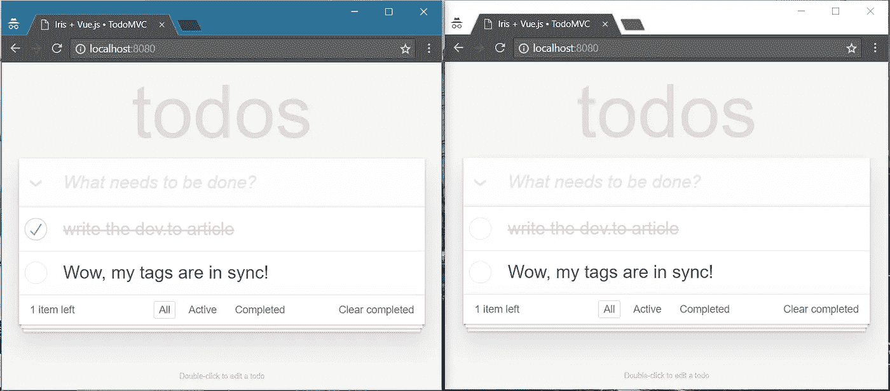

# 使用 Iris 和 Vue.js 的 Todo MVC 应用程序

> 原文：<https://medium.com/hackernoon/a-todo-mvc-application-using-iris-and-vue-js-5019ff870064>

使用 Iris MVC 和 Vue.js 编写一个快速现代的迷你 todo 应用程序

Vue.js 是一个使用 javascript 构建 web 应用的前端框架。它有一个非常快的虚拟 DOM 渲染器。

Iris 是一个后端框架，用于使用 Go 编程语言构建 web 应用程序(免责声明:作者在此)。这是目前最快、最有特色的 web 框架之一。我们想用这个来提供我们的“待办事项服务”。

# 工具

编程语言对我们来说只是工具，但我们需要一种安全、快速且“跨平台”的编程语言来为我们的服务提供动力。

[Go](https://golang.org) 是一种[快速发展的](https://www.tiobe.com/tiobe-index/)开源编程语言，旨在构建简单、快速、可靠的软件。看看[这里](https://github.com/golang/go/wiki/GoUsers)哪些伟大的公司使用 Go 来增强他们的服务。

## 安装 Go 编程语言

Maybe [Windows](https://www.youtube.com/watch?v=WT5mTznJBS0) or [Mac OS X](https://www.youtube.com/watch?v=5qI8z_lB5Lw) user?

> 这篇文章不包含对语言本身的介绍，如果你是一个新手，我建议你把这篇文章收藏起来，[学习语言的基础知识，以后再回来。](https://github.com/golang/go/wiki/Learn)

# **依赖关系**

过去，已经有很多文章引导开发人员不要使用 web 框架，因为它们是无用的和“糟糕的”。我必须告诉你，没有这样的事情，它总是取决于你将要使用的(web)框架。在生产环境中，我们没有时间或经验来编写我们想在应用程序中使用的所有代码，如果我们可以，我们能肯定我们比其他人做得更好、更安全吗？简而言之:**好的框架对任何开发者、公司或初创公司都是有用的工具，而“坏的”框架显然是浪费时间。**

您将需要两个依赖项:

1.  Vue.js，用于我们的客户端需求。从[这里](https://vuejs.org/)下载，最新 v2。
2.  Iris Web 框架，用于我们的服务器端需求。可以在这里找到[的](https://github.com/kataras/iris)，最新的 v12。

如果您已经安装了 Go，那么只需执行`go get github.com/kataras/iris/v12@latest`来安装 Iris Web 框架。

# 开始

如果我们都在同一个页面上，是时候学习如何创建一个易于部署和扩展的实时 todo 应用程序了！

我们将使用 vue.js todo 应用程序，它使用浏览器的本地存储，没有任何用户指定的功能，比如浏览器标签之间的实时同步，你可以在 vue 的[文档](https://vuejs.org/v2/examples/todomvc.html)中找到原始版本。

*   web/public/js/app.js
*   web/public/index.html
*   todo/item.go
*   todo/service.go
*   web/controller/todo _ controller . go
*   web/main.go

*阅读源代码中的注释，它们可能会非常有用*

# 客户端(vue.js)

## 让我们添加我们的视图，html。

# 服务器端(iris)

我们的视图模型。

我们的服务。

我们将在这里使用 iris web 框架的一些 MVC 功能，但是您也可以使用标准 API 来完成同样的操作。

最后，我们的主应用程序结束了。

从您当前的路径(% GOPATH %/src/% your _ folder %/web/)运行您刚刚通过执行`go run main.go`创建的 Iris web 服务器。

```
$ go run main.go
Now listening on: [http://localhost:8080](http://localhost:8080)
Application Started. Press CTRL+C to shut down.
_
```

在以下位置打开一个或多个浏览器标签:http://localhost:8080 尽情享受吧！



# 下载源代码

整个项目，你在本文中看到的所有文件都位于:[https://git hub . com/kataras/iris/tree/master/examples/tutorial/vue js-todo-MVC](https://github.com/kataras/iris/tree/master/_examples/tutorial/vuejs-todo-mvc)

# 参考

[https://vuejs.org/v2/examples/todomvc.html](https://vuejs.org/v2/examples/todomvc.html)(使用浏览器的本地存储)

[https://github.com/kataras/iris/tree/master/_examples/mvc](https://github.com/kataras/iris/tree/master/_examples/mvc)(MVC 示例和特性概述库)

# 再次感谢你

新年快乐，再次感谢您的光临:)不要犹豫，发布任何问题并提供反馈(我是一个非常活跃的开发人员，所以你会在这里被听到！)

别忘了查看我的个人资料和推特，我也在那里发布了一些(有用的)东西:)

*   [https://medium.com/@kataras](/@kataras)
*   [https://twitter.com/MakisMaropoulos](https://twitter.com/MakisMaropoulos)