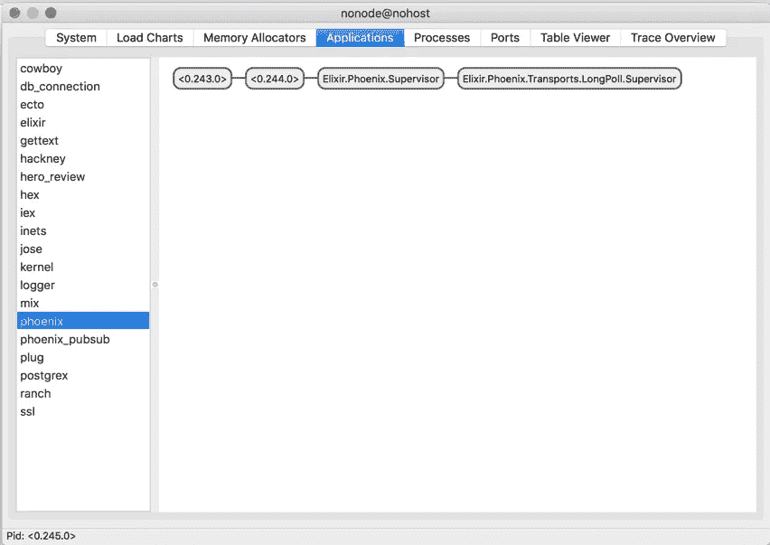
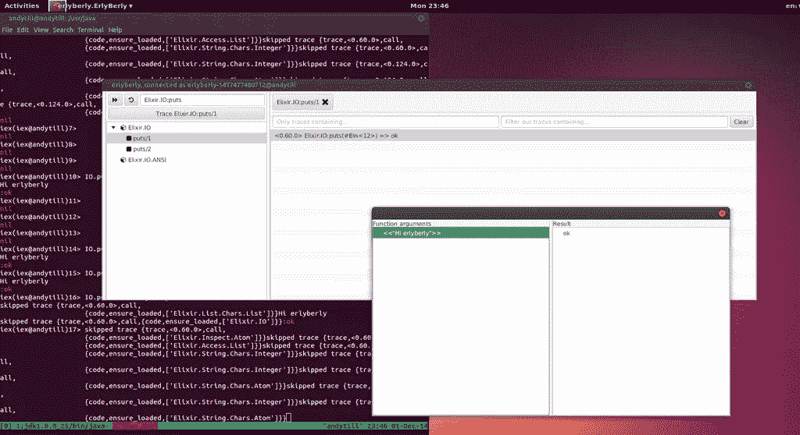

# Elixir 性能和监控工具之旅

> 原文：<https://medium.com/hackernoon/a-tour-of-elixir-performance-monitoring-tools-aac2df726e8c>


[NASA Mission Control Room](https://www.flickr.com/photos/nasa2explore/10352415865/in/photolist-gLNQyH-axB2m8-fh7uFh-fgSeWX-aYNiur-fh7uKS-cLdGCG-fgSfH6-fh7uoL-7gen7Y-8F6YCW-fgSfEz-7hMmS6-fh7um9-mfmWNX-PKdsT-fh7ufm-7F1c8L-fh7utW-fgSfvK-a5ndVV-9Tt1RW-9xdj52-fbbuD1-aYPr34-6iESHq-dXP2YJ-9thy5Z-9gY15J-nGtCYw-7F96Kp-7DMwnz-7F96et-kwBTxc-fgSfwT-fgSf78-fh7uzS-fgSfJ4-fh7u9Y-fgSfuk-nsTceK-4YDEcH-9MbsEM-hHabGn-fWFsuV-gTzjT2-oE2Vqt-6oCWSV-6oH7Kw-6oH74C)

*2017 年 4 月 23 日更新:AppSignal 已经退出测试版，Scout 发布了一个测试版代理。*

你正在钻研长生不老药，并且即将发布你的第一个长生不老药应用。您如何在生产中分析和监控它？

下面是今天在灵药生态系统中可用的一个游览。请注意，许多工具都是基于 Erlang 的，您可以通过 Elixir 访问这些工具。

# 度量收集

通用指标收集是应用程序的传感器阵列:这里是用户注册的计数器，那里是收集关键 HTTP 调用的平均调用时间，等等。这些服务帮助收集和聚合指标，并将指标发送给另一个服务(例如:Graphite、InfluxDB、Datadog 等)进行可视化和警报。

## 外测速仪

Ulf Wiger 和 Magnus Feuer 的 [Exometer](https://github.com/Feuerlabs/exometer) 是事实上的 Erlang 仪器包。Exometer 有几个部分:

1.  **记录指标**:您可以告诉 Exometer 更新值，并让 Exometer 以您选择的时间间隔运行函数来记录值。
2.  **存储指标**:原始指标存储在 Beam VM 的 via ETFs 中。
3.  **报告指标**:指标被聚合，然后转发到外部系统，如 Graphite、AMNQ 或 StatsD。

下面这个由# Key will be: prefix.dev.timers.timed.function
@timed(key: "timed.function")
def function_that_is_timed do
OtherModule.slow_method
end

# 波束资源使用

有几个工具可以监控 BEAM VM 的资源使用情况，它运行您的 Elixr 和 Erlang 应用程序。BEAM 感觉上更像一个操作系统，而不是典型的虚拟机，它的监控工具有与之匹配的复杂性。

## 观察者



默认的 goto 是 [Observer](http://erlang.org/doc/man/observer.html) :它可能已经安装在你的电脑上了。尝试通过 iex 启动 Observer:

```
iex(9)> :observer.start
```

观察者也可以连接到远程系统。

## 袋熊

一个全功能的操作和维护框架， [Wombat](https://www.erlang-solutions.com/products/wombat-oam.html) 是通过 Erlang Solutions 提供的商业软件。

## 侦察

Recon 是 Erlang Recon 应用程序中的一个模块。该模块提供对 Beam VM 的高级资源使用信息的访问。

例如:

```
iex(11)> :recon.info(self)[meta: [registered_name: [],
memory_used: [memory: 143208, message_queue_len: 4, heap_size: 10958,
total_heap_size: 17730,
garbage_collection: [max_heap_size: %{error_logger: true, kill: true,
size: 0}, min_bin_vheap_size: 46422, min_heap_size: 233,
...
```

# 应用程序监控

应用程序性能监控(APM)服务检测您的 Elixir 函数调用，并通过事务跟踪提供性能分析。大多数 APM 工具都是以监控 web 请求和一般性能监控为导向的。

## AppSignal

AppSignal 有一个官方支持的[应用监控代理](https://github.com/appsignal/appsignal-elixir)用于 Elixir。

## 侦察

在我的日常工作中，我们已经发布了一个针对 Elixir 的应用程序监控代理。[了解更多](https://scoutapp.com)。

## 新遗迹

New Relic 没有官方支持的代理，但是有几个社区开发的代理可用:

*   [新版本](https://github.com/TheRealReal/new-relixir)
*   [new _ relic](https://github.com/romul/newrelic.ex)—`new_relic`模块的作者(
    21:52:36.972711 #PID<0.88.0> String.strip/2 --> "es"

    ## 厄尔利

    Elyberly 提供了一个 GUI 界面，用于调试和分析 Erlang 和 Elixir 应用程序。除了跟踪之外，Elyberly 还收集关于进程和内存使用的信息。这并不是说 Elyberly 不打算跟踪生产系统，因为它没有过载保护。

    

    Plataformatec 的人有一个很棒的《爱丽舍宫的[入门指南。](http://blog.plataformatec.com.br/2016/04/how-to-trace-elixir-nodes-with-erlyberly/)

    ## 沙蚤

    [Redbug](https://github.com/massemanet/redbug) 是 Erlang 的一个生产安全调试/跟踪工具。Roberto Aloi 在他的博客上有一个很棒的红虫教程。

    ## DBG

    DBG 是一个用于追踪的 Erlang 模块。DBG 周围还有一种薄薄的仙丹包装纸，叫做… [DBG](https://github.com/fishcakez/dbg) 。

    # 异常监控

    许多现有的异常监控服务已经支持 Elixir。Elixir 和 Erlang 对异常有独特的理解，因此了解每个服务的异常逻辑如何满足您的需求非常重要。

    一些选项:

    *   [蜜獾](https://github.com/honeybadger-io/honeybadger-elixir)
    *   [哨兵](https://github.com/getsentry/sentry-elixir)
    *   [滚动条](https://github.com/elixir-addicts/rollbax)

    > ***我的观点*** :我更喜欢使用他们在生产中监控的语言的服务，因为他们对监控的痛苦有第一手的经验。HoneyBadger 在他们自己的生产应用程序中有使用酏剂的经验。

    [](http://bit.ly/HackernoonFB)[](https://goo.gl/k7XYbx)[](https://goo.gl/4ofytp)

    > [黑客中午](http://bit.ly/Hackernoon)是黑客如何开始他们的下午。我们是阿美族家庭的一员。我们现在[接受投稿](http://bit.ly/hackernoonsubmission)并乐意[讨论广告&赞助](mailto:partners@amipublications.com)机会。
    > 
    > 如果你喜欢这个故事，我们推荐你阅读我们的[最新科技故事](http://bit.ly/hackernoonlatestt)和[趋势科技故事](https://hackernoon.com/trending)。直到下一次，不要把世界的现实想当然！

    