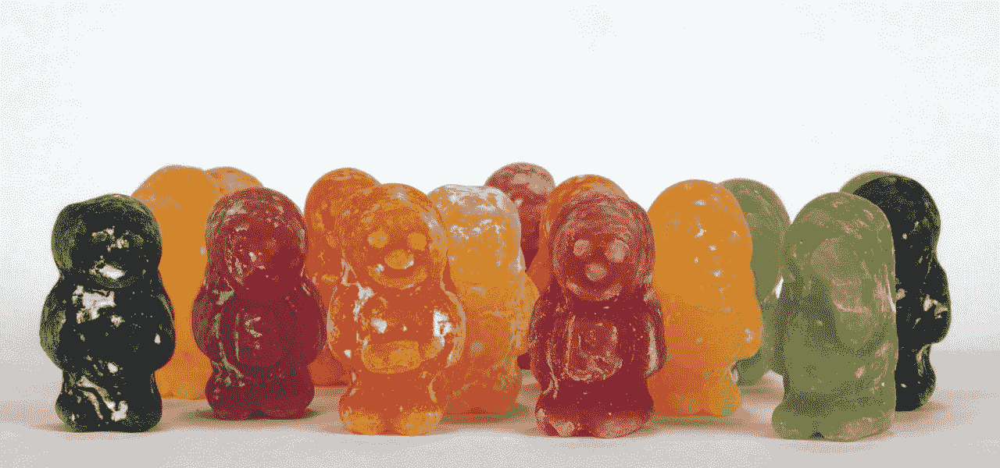

# 不同人群的独特组合

> 原文：<https://medium.com/hackernoon/a-unique-collection-of-diverse-people-91b2b537e22b>

鉴于所有围绕移民问题的讨论都进入了科技界，我想我应该借此机会强调一个对 Originate 非常重要的价值观——多元化。虽然我不认为这是我分享[政治观点](https://goo.gl/ejcfUk)(我将在后面解释)的地方，但工作场所多样性和包容性的价值与政治无关。这是一个重要的核心价值观，包括政治家在内的所有人在做决策时都需要理解。

和我一起工作过的人都知道，我会不遗余力地保护公司的文化。虽然[我们的文化](/@robmeadows/the-originate-way-2017-aaffd63e5256#.kqjqlhu0v)包含许多真正重要的价值观，但有一点我永远不会妥协:

> 创造一个包容的环境，培养不同人群的独特集合。

我们有一个雄心勃勃的使命，每天都要解决新的难题。解决新的难题需要非凡的创造力。非凡的创造力来自于将来自各种背景、信仰、宗教、家庭、国籍、种族、性别、取向和政治观点的了不起的人聚集在一个包容、开放和安全的环境中。就这么简单。

> 我可以写一整篇关于为什么多元化造就成功的公司的文章，但是我会给你看我们自己的 Presley Pizzo 的这个伟大的[演讲](https://docs.google.com/presentation/d/1IzZrcOEMgIUSyafMrO5bA8N5yRZb2_tLVo3bDGJUWcs/edit)。

我们为我们的多样性感到自豪，并不断努力创造更多。这意味着培养和支持包容的工作环境，鼓励不同的意见和观点。我们不容忍歧视，我们通过以人为本和相互倾听来打击歧视。这为所有人创造了一个安全和有同理心的空间。

“我知道这个候选人通过了所有的面试，但他们是一个来自未知国家的紫色食蚁兽，有着奇怪的宗教和模糊的性别，并使用 Windows…”真棒！听起来他们会给团队增加一个很棒的新观点。作为领导者，我们的工作是创造一个环境，让每个人都感到受欢迎、被包容、自在地做自己和表达自己的想法。

这就是为什么我不分享我的政治观点。如果我作为一名首席执行官开始表达我的个人政治观点，那就开始为那些不同意我的人创造一个非包容性的环境。每一个真实的事实周围总有至少两种对立的观点(非真实的事实周围甚至有更多的观点！)当每个人都试图理解那些不同的观点时，不管他们是否同意，一个公司都会变得更加强大。我想在这样一个组织里工作，在那里你可以相信任何你想相信的事情，并且感到安全。这就是包容性的意义所在。

那么，作为商业领袖，我们应该做些什么呢？由于公司是由[不同](https://hackernoon.com/tagged/diverse)的人组成的独特集合体，我认为领导的工作就是 100%支持公司内每个员工/团队的个人信念，即使有相互冲突的观点。我们通过提供无限的带薪休假来做到这一点，这样人们就可以认识到假期、原因、抗议或其他他们相信的事情。我们赞助公司员工热衷于支持的外部活动。我们给每个人 20%的时间，这样人们就可以做自己感兴趣的项目。我们鼓励并主持员工组织的论坛、聚会，甚至是围绕他们的目标的冥想。最重要的是，我们保持了一种支持所有这些的文化。

所以，走出去，团结在你热爱的事业周围，为世界做出积极的改变。我可能不总是完全理解，甚至不同意你的观点，但我会永远支持你！

> [黑客中午](http://bit.ly/Hackernoon)是黑客如何开始他们的下午。我们是 [@AMI](http://bit.ly/atAMIatAMI) 家庭的一员。我们现在[接受投稿](http://bit.ly/hackernoonsubmission)并乐意[讨论广告&赞助](mailto:partners@amipublications.com)机会。
> 
> 如果你喜欢这个故事，我们推荐你阅读我们的[最新科技故事](http://bit.ly/hackernoonlatestt)和[趋势科技故事](https://hackernoon.com/trending)。直到下一次，不要把世界的现实想当然！

