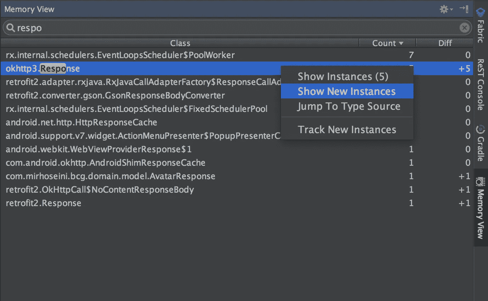
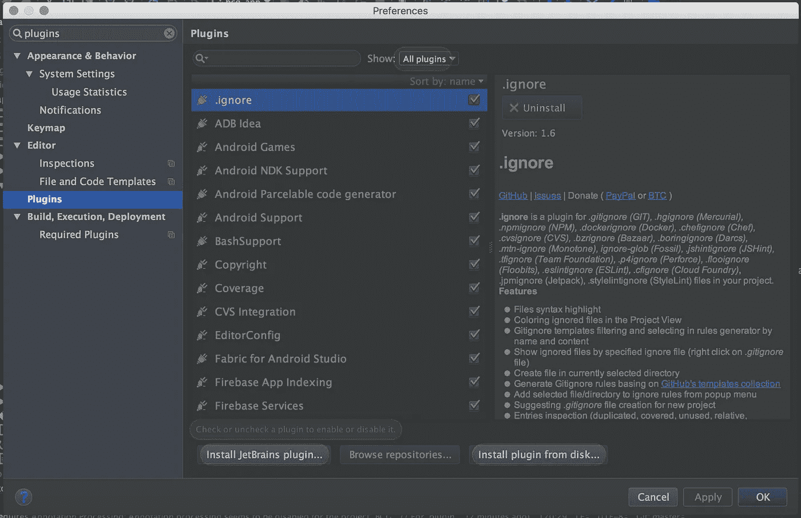
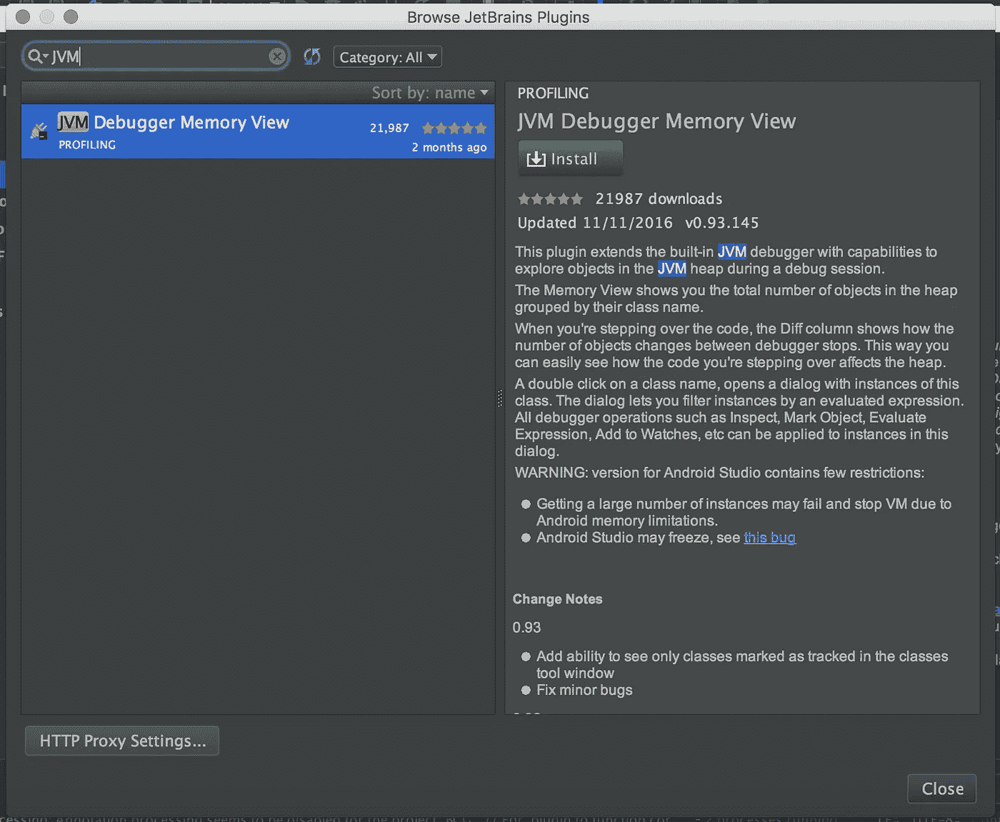
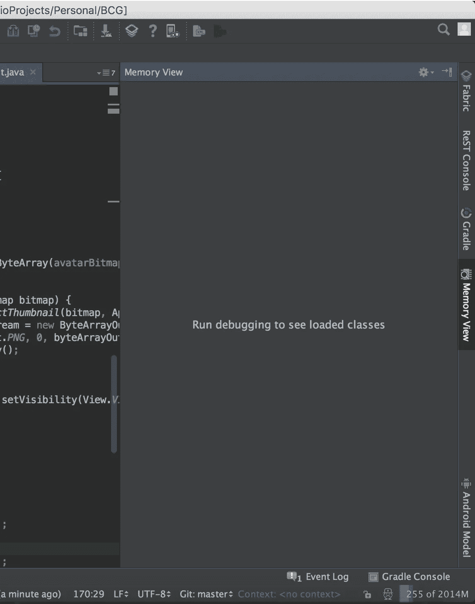
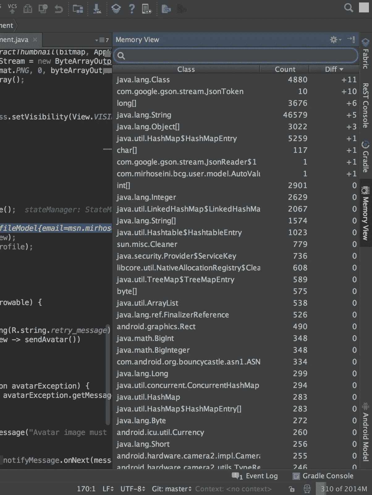
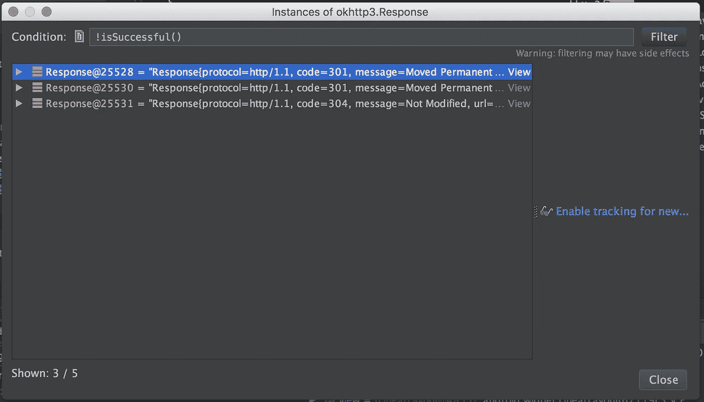
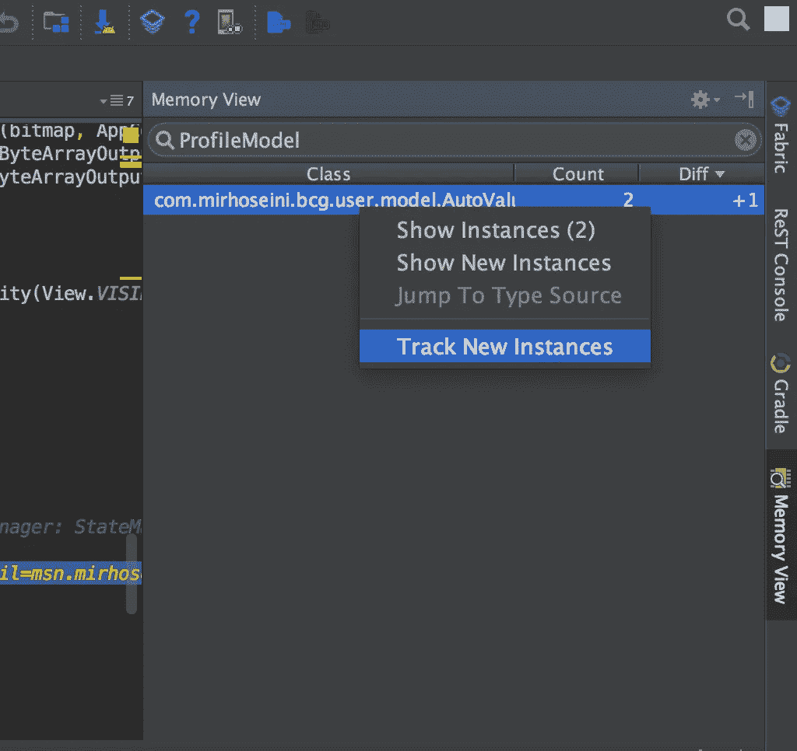
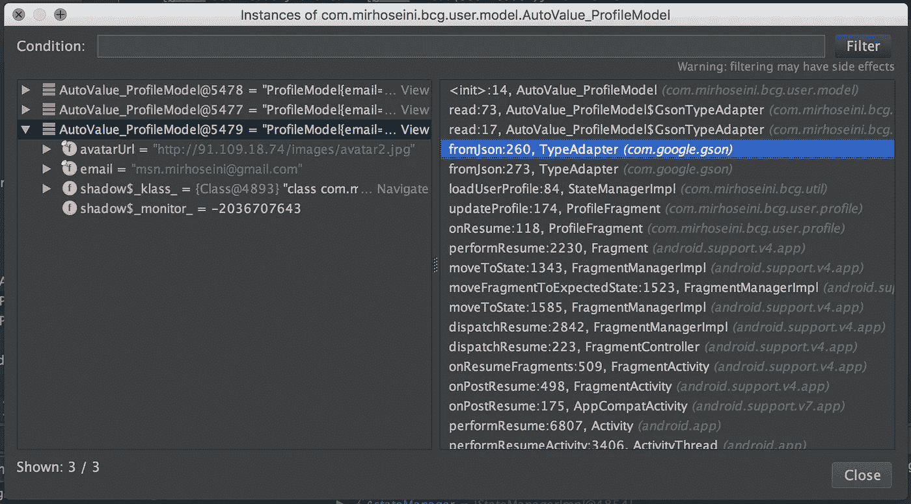

# 一个有用的 Android Studio 内存调试器插件

> 原文：<https://medium.com/hackernoon/a-useful-memory-debugger-plugin-for-android-studio-2d9d95bddc24>

## JetBrains **JVM 调试器内存视图**插件

JetBrains JVM Debugger Memory View plugin

在我最近的 R&D 活动中，我寻找新的工具来改善我的开发体验，并使使用 [Android](https://hackernoon.com/tagged/android) Studio 的生活更容易，我发现了一个我以前从未听说过的有用插件。这就是为什么我决定写这个强大的[工具](https://hackernoon.com/tagged/tool)以及它如何帮助我调试应用程序的内存。

# 这个插件是关于什么的？

显示[插件页面](https://plugins.jetbrains.com/idea/plugin/8537-jvm-debugger-memory-view):

> 这个插件扩展了内置的 JVM 调试器，使其能够在调试会话期间**探索 JVM 堆中的对象**。
> 
> Memory 视图显示了堆中按照类名分组的**对象总数。**
> 
> 当您单步执行代码时， **Diff 列显示了调试器停止**之间对象数量的变化。通过这种方式，您可以很容易地看到您所跳过的代码是如何影响堆的。
> 
> 双击一个类名会打开一个对话框，里面有这个类的实例。该对话框让您**通过评估表达式**过滤实例。所有调试器操作，如检查、标记对象、计算表达式、添加到监视等，都可以应用于该对话框中的实例。

因为所有的**粗体**句子真的很有趣，我理解如果你想去下载这个插件来拥有你自己的经历，而不是在这里阅读更多…

# 如何安装这个奇妙的插件？

打开 Android Studio **插件**页面:

*   ***快捷键:*** *按* ***命令/ctrl****+****shift****+****A、*** *键入* ***插件*** *然后按* ***回车***
*   或者打开**首选项/设置:** (Mac: Android Studio - >首选项 **/** Windows & Linux:文件- >设置)找到**插件**页面:

按下**安装 JetBrains 插件…** 按钮，搜索 **JVM 调试器内存视图**和**安装**。

然后你得重启 Android Studio。

## 乍一看:

回到 Android Studio 后，你会发现**内存视图工具窗口**被添加到工具栏的右侧。

Memory View Tool Window

> 如果没有看到内存视图，要打开工具窗口，使用主菜单:*视图* → *工具窗口* → *内存视图*。

首先，该工具仅在应用程序在*调试模式*下运行并且您使用*断点*暂停运行时工作并显示数据。

其次，我不得不提到的是，我阅读了一些关于 Android Studio 可能发生的警告和错误，这是我在体验过程中没有面对的。

> **警告**:Android Studio 版本包含的限制很少:
> 
> -由于 Android 内存限制，获取大量实例可能会失败并停止 VM。
> 
> - Android Studio 可能会死机，见[这个 bug](https://code.google.com/p/android/issues/detail?id=198940&q=subcomponent%3DTools-debugger%20label%3ASubcomponent-Tools-debugger&colspec=ID%20Status%20Priority%20Owner%20Summary%20Stars%20Reporter%20Opened)

# 我们来调试吧！

在调试模式下运行应用程序并在断点处暂停后，您将看到神奇的事情发生了:

这个表最有趣的一点是 **Diff** 列，当你遍历代码行时，你会看到有多少新的对象实例被创建或销毁！

我想寻找我自己的对象*(即 ProfileModel 类)*，所以我搜索它:

如你所见，我在这行代码中更新了 ProfileModel 变量，在 GC 移除旧变量之前，我得到了 Diff +1，并且还可以访问旧变量，这在以前是不可能的。通过双击该记录，我将在一个窗口中获得 ProfileModel 类的实例:

此窗口还允许您使用类方法通过求值的表达式过滤实例，例如，您可以使用 **OkHttp Response** 类的**issue success**方法过滤加载到内存中的不成功响应:

Instances filter feature

另一个有用的功能是跟踪新实例，您可以通过内存视图工具窗口中的右键菜单来启用它:

这个特性可以帮助你跟踪这个类的新实例生成的代码！

你可以在 [JetBrains 博客](https://blog.jetbrains.com/idea/2016/08/jvm-debugger-memory-view-for-intellij-idea/)中读到更多关于这个插件的内容，也可以让他们知道你可能想到的新特性或者你发现的 bug。

# TL；博士:

这篇文章是关于一个 JetBrains 插件，它可以帮助你用 Android Studio 在内存中调试你的应用程序，并在应用程序运行期间访问所有加载的对象。

感谢阅读这篇文章。请留下你的评论，和我们分享你使用这个插件的经验，以及在你自己的测试中你是如何发现它有用的。

我发现这个插件很有用，所以我决定与你分享，如果你认为有用，推荐给你的朋友，让他们也喜欢。

您也可以关注我以获取更多文章 [Mohsen Mirhoseini Argi](https://medium.com/u/6a4ed0c4dd2c?source=post_page-----2d9d95bddc24--------------------------------) 。

 [## Mohsen Mirhoseini -高级 Android 开发人员

### 我是一名资深 Android 开发人员，在计算机软件工程领域有大约九年的经验。我有…

mirhoseini.info](http://mirhoseini.info) 

> [黑客中午](http://bit.ly/Hackernoon)是黑客如何开始他们的下午。我们是 [@AMI](http://bit.ly/atAMIatAMI) 家庭的一员。我们现在[接受投稿](http://bit.ly/hackernoonsubmission)并乐意[讨论广告&赞助](mailto:partners@amipublications.com)机会。
> 
> 如果你喜欢这个故事，我们推荐你阅读我们的[最新科技故事](http://bit.ly/hackernoonlatestt)和[趋势科技故事](https://hackernoon.com/trending)。直到下一次，不要把世界的现实想当然！

