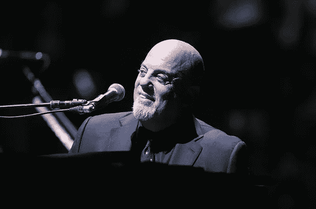
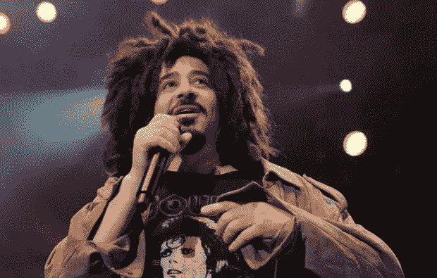
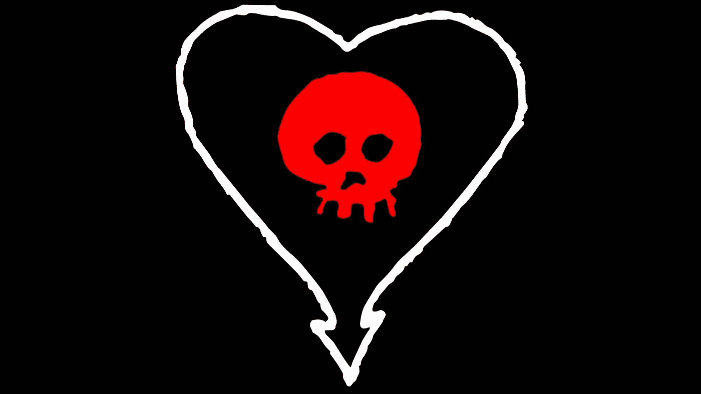
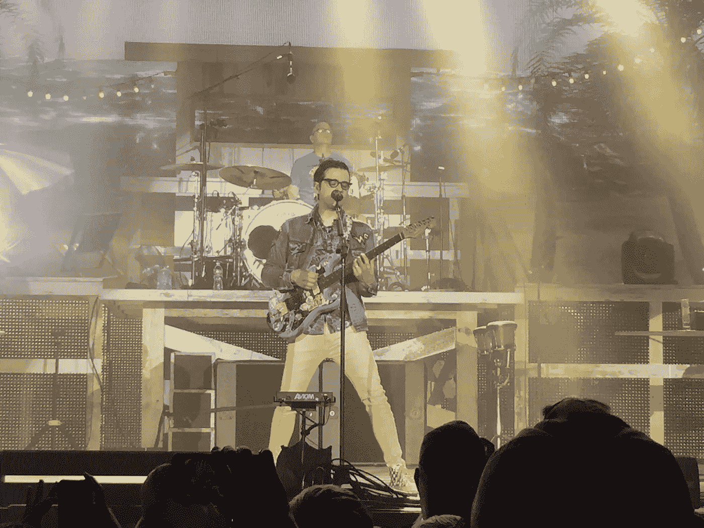
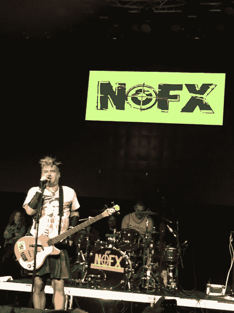
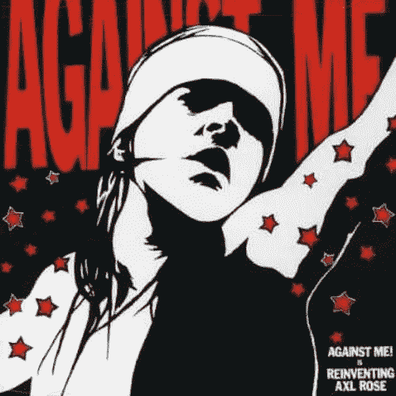
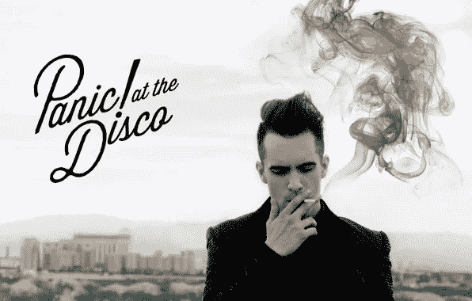

# 一个风险投资家和他的音乐

> 原文：<https://medium.com/hackernoon/a-venture-capitalist-and-his-music-f61cc7d247b3>

我以前说过，我再说一遍，我看到太多风投的博客文章，关于创始人应该做得更好的内容，他们阅读的博客，他们说他们读过的书，交易等。(我也有负罪感)

我们所不知道的是，你最喜欢(或最不喜欢) [VC](https://hackernoon.com/tagged/vc) 开夜车时播放的音乐(是的，风投们也工作到很晚)。如果你对音乐一点都不感兴趣，那就继续在社交媒体上屏蔽我吧。

对我来说，[音乐是一种激情。我可以坐在这里几个小时挖掘一个艺术家，研究他们的历史，他们的音乐，歌词，风格，他们的歌曲如何联系在一起，讲述一个专辑，十年，职业生涯的故事。艺术家是谁，他们要说什么，他们怎么说，对我来说都很重要。事实上，我不能真正对一个艺术家感兴趣，除非有足够的深度来满足搜索，以至于可以找到那些东西。](http://festivalpeak.com)

**为什么这对风险投资很重要？对我来说，调查一首歌或一位艺术家就像挖掘潜在的种子投资一样。通常创始人的故事，他/她的人生故事，发现问题的途径，问题本身，市场，以及其他许多为故事增添色彩和质感的定性因素，对我来说都很重要。爱上一个艺术家或一首歌，就像作为投资者爱上一个想法、一个创始人或一家企业一样。**

不管怎样，对于那些关心我的人来说，这里有我最喜欢的乐队和原因，还有他们最喜欢的专辑和最喜欢的歌曲的链接(在 spotify 上)。

[The Piano Man still rocks it](http://www.billboard.com/articles/columns/rock/6746248/billy-joel-joins-mets-fans-for-piano-man-sing-along-at-world-series-game-three)

# 1.比利·周

作为一个热爱纽约市并在纽约上大学的人，我不得不和一个在皇后区长大的人一起，努力获得自己的成功，与恶魔斗争，获得无与伦比的成功，并能在 3:05 讲述一个与众不同的故事——我爱这个人。我记得看过他在谢伊体育场的最后一场音乐会，那是一个多么美妙的夜晚。从西点军校毕业后(9/11 时我就在那里)，我一生都梦想住在纽约，并在那里生活了近 4 年，我对纽约的热爱与他的音乐产生了共鸣。哦，可能是有史以来最好的声音之一，但没什么大不了的。

比利·周最喜欢的专辑:[十二花园现场](https://open.spotify.com/album/58UpluZ9XMHS7xSyX8E6D2)

比利·周最喜欢的歌曲:[愤怒的年轻人](https://open.spotify.com/track/2ctxytXNCxzbOaMpidZr1Z)和[大人物](https://open.spotify.com/track/0oerDMn7hBZfHyr0PLtT4A)

[Adam Duritz — Counting Crows](http://www.ocregister.com/2016/08/01/adam-duritz-coolio-chuck-d-aug-1-celebrity-birthdays/)

# 2.数乌鸦

如果你说我可以和任何艺术家共进晚餐，亚当·杜里兹可能是我会选择的人。这家伙！迅速成名，与他的知名度进行激烈的斗争，以及一系列充满激情的生活经历，详细描述了他一路上的斗争。同样，一个热爱纽约市的艺术家，对这座城市的活力充满热情。没有人能像亚当那样让你在音乐会上忘记外面的世界 90 分钟。他是一个充满激情的人，当你深入研究他的音乐时，你可以感受到这一点。

数乌鸦最喜欢的专辑:[周六晚上和周日早上](https://open.spotify.com/album/07RHn8QzNSAJxWarDGNIqC)

数乌鸦最喜欢的歌:[最近有没有看到我？](https://open.spotify.com/track/1v6ilQqdsgXHXzSj0Qvkzn)和[华盛顿广场](https://open.spotify.com/track/2RnlcUG66KojoICSo67Nb8)

[If you have ever seen this image before, then you rock!](https://weneedfun.com/wp-content/uploads/2016/09/Alkaline-Trio-Wallpaper-4.jpg)

# 3.碱性三重奏

谁啊。没错。如果你真的知道他们是谁，或者如果你看过他们的演出，我们会成为朋友。事实上，如果你已经来到这个博客，而且你以前听说过他们，那么我想听听你的意见。他们是黑暗的，但却为此感到高兴。他们很紧张，但也很冷静，他们很生气，但不是真的生气。“所有我喜欢的歌手都偷走了我所有最好的台词”是他们的一句歌词，这句歌词概括了他们的心声——发牢骚，但很有趣，也有点阴暗。他们的歌曲中散布着最好的俏皮话。我喜欢原始的声音。它们所涵盖的主题的强度令人难以置信。我在等他们再去巡演，但是主唱今年夏天忙着给 Blink-182 弹吉他。哦好吧。

碱性三重奏最喜欢的专辑:[该死的](https://open.spotify.com/album/3bic2qlxGauU2dVSCrinLY)

碱性三重奏最喜欢的歌曲:[旧金山](https://open.spotify.com/track/2TLUVGD44qTMPjiCQTGWgK)和[我的朋友彼得](https://open.spotify.com/track/27jbQySldKEX1W17293Mto)

Photo I took at a Weezer show in Dallas (July, 2016)

# 4.威泽

是啊，毛衣歌手。那张蓝色专辑，摇滚！当我听到“在车库里”时，我有了高中最美好的回忆瑞弗斯·柯摩可能是有史以来最聪明的歌曲作者之一。他的音乐主题、声音、力度和主题的多样性使它变得非常多样化。我爱上了这种声音，但后来开始了解里弗斯，以及他所写的许多作品背后的[含义](https://hackernoon.com/tagged/meaning)，这对我意义重大。我在 2016 年夏天跟随他们，看了一些节目，他们听起来仍然很棒。以前，我听了一些生活节目，当时我觉得里弗斯的声音可能是我听过的最好的声音之一。也许它不像以前那么强壮了，但是那个家伙可以在那天把它带回来。此外，任何在高中(90 年代)震撼过我，并仍然推出新内容的乐队，也是很棒的，都会在我的名单上。

Weezer 最喜欢的专辑:[蓝色专辑](https://open.spotify.com/album/33CmI2lR8PnQwz6133Mc7l)

Weezer 最喜欢的歌:[说不是这样的](https://open.spotify.com/track/3MDmJDJlReM4fTYvgcQvy2)

Photo I took of Fat Mike in a Bush-Quayle shirt at a Dallas show (November, 2016)

# 5.NOFX

我喜欢朋克摇滚。我喜欢带有讽刺和政治评论的攻击和愤怒。我欣赏他们的自我意识和自嘲的方式来讨论他们自己的音乐。当我去看一场朋克摇滚演出，并在演出结束后发推特说歌手有多烂时，合适的歌手(胖迈克)会喜欢我的评论，因为如果你了解这些人，这是一种赞美。讽刺，激情，愤怒，让我思考。他们表达的关于世界上缺乏同理心的痛苦引起了我的共鸣。

NOFX 最喜欢的专辑:[反恐战争](https://open.spotify.com/album/579FRQBE6RnFZXn6dG0DeV)(来吧，听一听，它不会咬人)

NOFX 最喜欢的歌:[像购物车一样自由](https://open.spotify.com/track/2EophOpSBiQkq8tKm5Mva0)

[Photo credit](https://www.amazon.com/Reinventing-Axl-Rose-Against-Me/dp/B0000664EV)

# 6.反对我！

更多朋克摇滚。他们唱的很多东西都在谈论朋克摇滚界和这个圈子里明显的“无政府主义者”是如何变成一群时髦的、充满集体思维的追随者，而他们自己却不会思考。他们谈论了很多关于两党制如何让我们失望，以及很多社会问题。这位主唱在几年前转型成为一名女性，并写了一整张关于性别焦虑的专辑。她转行前后的很多歌，讲的都是做真实的自己，有自己独到的想法，表达自己，思想自由等等。几乎每首歌都让我很感动。为了追随愤怒的人而对机器大发雷霆是愚蠢的，但寻求改变一个压迫性的系统并以原创的思想这样做，这就是劳拉·简·格雷斯所说的。

反对我最喜欢的专辑！: [23 现场性行为](https://open.spotify.com/album/6ky5MHIMbC8ZN5ypZLtjV4)

最喜欢的歌曲由反对我！:[我是一个十几岁的无政府主义者](https://open.spotify.com/track/5UwGMbEKlvXFj7DXI1d0P1)

[Photo credit](https://en.wikipedia.org/wiki/Too_Weird_to_Live,_Too_Rare_to_Die!)

# 7.慌！在迪斯科舞厅

好吧，在过去的 12 个月里，我看过他们三次演唱会(没什么大不了的)。每场演唱会的平均年龄，14 岁。我不感到羞耻。你听过这家伙唱歌吗？我听过的现场最好的声音。我见过的最好的表演者之一。热爱音乐，真正喜欢布伦登·尤里。我对这家伙百看不厌。

恐慌乐队最喜欢的专辑！:[单身汉之死](https://open.spotify.com/album/6twKQ0EsUJHVlAr6XBylrj)

恐慌乐队最喜欢的歌曲！:[不要用美好的时光来威胁我](https://open.spotify.com/track/2fh3bZ8jZhMxOcfESE9nQY)，还有[拉奉献者](https://open.spotify.com/track/2fmCA13dwQQOGBIbIOWRiJ)

好吧，我想是时候回去工作了。但是当我回去工作的时候，我会放其中一个播放列表:

[Bro Bra 播放列表](https://open.spotify.com/user/stephenrhays/playlist/4cBMzUMEJ7PpeIDFthb1LZ)(由我的好哥们，另一个 VC 创建)

[Punker Than Me](https://open.spotify.com/user/stephenrhays/playlist/2zEDaW4IuXvXM302z5fheS) (混合了我喜欢的朋克摇滚歌曲——一直在进步)

[电子霾](https://open.spotify.com/user/stephenrhays/playlist/4qceCYNyh6eeF8sjTF4YJ1)(所有 EDM 和 House——大冬会运动播放列表)

[飞行的艺术配乐](https://open.spotify.com/user/nyplockadkiwi/playlist/0WoFljdaPB52U7GFGJQHGY)(有史以来最好的电影之一)

[完全反对我！](https://open.spotify.com/user/stephenrhays/playlist/6gxFGSxZlzCfZNKTDSK5Je)(制作这个播放列表是为了缓解一些朋友对我的反对，但你真正应该听的是这张现场专辑: [23 场现场性爱表演](https://open.spotify.com/album/6ky5MHIMbC8ZN5ypZLtjV4))

偷偷溜出去 1999(让我想起 1999 年偷偷溜出去参加音乐节的歌曲)

[在 Twitter 上关注斯蒂芬](https://twitter.com/hazesyah)

[联系深空风险投资](http://deepspacevc.com/)

> [黑客中午](http://bit.ly/Hackernoon)是黑客如何开始他们的下午。我们是阿妹家庭的一员。我们现在[接受投稿](http://bit.ly/hackernoonsubmission)并乐意[讨论广告&赞助](mailto:partners@amipublications.com)的机会。
> 
> 如果你喜欢这个故事，我们推荐你阅读我们的[最新科技故事](http://bit.ly/hackernoonlatestt)和[趋势科技故事](https://hackernoon.com/trending)。直到下一次，不要把世界的现实想当然！

