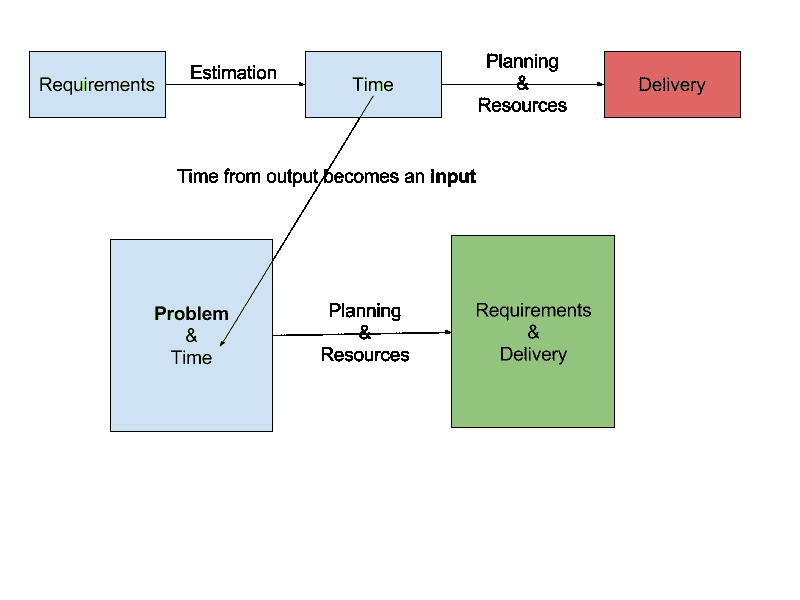

# 一种无需微观管理的敏捷方法

> 原文：<https://medium.com/hackernoon/a-way-to-be-agile-without-micromanagement-e12476e8e4f1>

现在每个人都说他们敏捷地开发软件:个人和交互、工作软件、客户协作、对变化的反应。谁不会同意。

但真正的复杂性在于实践，在实践中，这些原则不断受到挑战。

经过一年多在 Adbrain 管理 6 周班的经历，我想分享一些经验。

# 敏捷如何掩盖微观管理

企业喜欢控制，这是 it 的本质:收入预测、成本效益分析、交付期限——悦耳的音乐。但是工程师是有创造力的，热爱自由:原型、设计模式、重构——“只要一个星期就能完成”。

敏捷运动有助于在这场拉锯战中找到更好的平衡，并在过去 15 年的主流采用中被证明是有效的:软件交付更快，开发人员更高兴，最终创新加速。

但是随着方法的成熟，有一种趋势是越来越关注过程而不是原则。如何更好地评估用户故事的任务？TDD 和 BDD 的最佳用例是什么？这样的例子不胜枚举。

Scrum 已经被改进以增加可预测性，例如通过一个燃尽图，你可以更好地理解交付的速度。如果你构建类似的软件，这种方法非常有效，但是激进的创新是可以预测的吗？

看板的优点是保持焦点，减少工作和时间的浪费。但大局往往被忽视，对影响的认识被淡化。这就像走在一个五彩缤纷的中世纪村庄里:你可以看到漂亮的房子，五颜六色的鲜花，你会非常清楚如何在迷宫中定位。但是只有你去它旁边的山上，你才能体会到它的壮观。

有时我有这样的印象，开发人员被困在一个[货物崇拜](https://en.wikipedia.org/wiki/Cargo_cult)中，被引入敏捷的仪式，这将带来“给工程师自由&力量”的神话般的梦想，而没有意识到方法可以成为一个更复杂、更具侵入性的[微观管理工具](https://michaelochurch.wordpress.com/2015/06/06/why-agile-and-especially-scrum-are-terrible/)的聪明绝招。

玩规划扑克真的是最有趣的贡献方式吗？作为一名开发人员，你难道不渴望有比[两周冲刺计划](http://mikehadlow.blogspot.co.uk/2014/06/heisenberg-developers.html)更有意义的影响吗？

有一种方法可以授权自治团队，而不需要董事会成员登录来检查代码行:一种*新敏捷*方法。

# 使命、时间限制和责任

远离微观管理的关键是以结果为导向，明确资源和限制，并相信你的团队能完成工作。

该系统的核心是一个存在于业务和交付团队之间的结构，即“团队”:**一个自治的跨职能团队，有 6 周的时间来完成任务**。

似乎每个人都在做什么，或者至少[在说](https://news.ycombinator.com/item?id=8662634) [在做](http://movio.co/blog/squadification-key-learnings-team-building-squadification/)。但是我们发现了一系列改变游戏规则的特征:使命、时间限制和责任。

我认为这些为期 6 周的团队是 Spotify 团队的一个分支，是为了更小、更快的规模和资源受限的环境而重新设计的。

# 任务。具体点。而是给出问题，而不是解决方案

这项任务是该队成功的三大基石之一。它针对需要改进的特定领域，明确需要解决的问题。但是它没有提供要实现的解决方案，团队的责任是找出如何实现它。

一个有效的使命是以结果为导向的，当使命完成时，它预示着成功的图景。它需要是现实的，并在 6 周的机会可以实现。它还需要足够窄，以保证重点，但足够广泛，以远离细节。

例如，如果你的问题是一个产品正在获得牵引力，但需要大量的工程师操作，你可能会试图给出一个基于解决方案的任务:“为产品 XYZ 添加一个管理和监控 UI”。但是你可以有一个结果驱动的任务:“简化 XYZ 流程，让客户服务团队以可靠和自动化的方式独立地为我们的客户服务”。

现在，它清楚地说明了问题所在，并允许队员们在 6 周内找出解决问题的最佳方法。与产品负责人一起，团队将找出实现任务的最佳折衷方案:他们可能会为你的极客 CS 团队构建一个命令行工具，而不是 UI。你会对他们的解决方案感到惊讶，你甚至没有想过！

你创造的效果是双面的:企业有足够的可见性来看到工程工作是如何对成功做出贡献的，放松了控制狂的本能，这种本能通常来自于对团队正在关注的事情缺乏理解。另一方面，工程师清楚要实现的业务目标是什么，并且在没有故事点或其他非常透明的工具的情况下实现最佳解决方案的自主权。

任务变成了 [*许诺解决问题*](/uie-brain-sparks/themes-a-small-change-to-product-roadmaps-with-large-effects-a9a9a496b800) ，而不是打造特色。一种人人都能理解和理解的无处不在的语言。

# 时间盒，更长&实际

从[项目管理三角](https://en.wikipedia.org/wiki/Project_management_triangle)中我们都知道，你只能解决三个属性中的两个:资源、时间和范围。但是三角形没有告诉我们的是三者的有效结合:有多少人在一起工作得很好？授权给人们的持续时间是多长？你希望需求有多精确？

尽管您使用的是方法论，但现实世界大多数时候都是这样的:您从要构建的事物的一组详细需求开始，您在评估工作上投入了大量精力，然后您计划资源以按时交付。你总是无法兑现承诺。

我们引入了我称之为“控制反转”的概念:不是基于估计来预测时间，而是将时间作为一个固定的元素。您将需求替换为需要解决的更高层次的问题，并将详细的估计替换为数量级复杂性评估。然后你让团队既**定义**需求，又**构建**需求！

还有另外两个因素使系统运行良好:更长的持续时间和与中断的隔离。

我们决定用六周的时间，因为这是一个允许跳出框框思考、设计原型并为重要问题提供解决方案的时间。它也足够长，为内部迭代留出空间，但又足够短，不会给人一种结束时间太长的错觉。开始就能看到结束。

你还想保护小队免受干扰和环境切换。有一个名为“解决方案”的特别小组每周轮换工作，这是第一道防线:除其他职责外，它还处理生产缺陷修复和任何紧急的客户需求。这保证了在为期 6 周的培训中花费的时间是可预测的，并且通常不受干扰，同时解决方案团队保证为您的客户提供一流的服务。

你最终会改变态度，从"*我们需要尽快获得这些功能；需要多长时间？实施它们，直到它们“真正”完成*“到”*我们有这个问题，你有 6 周的机会获得最佳的折衷方案，去做吧！*”。它防止敏捷带来的范围蔓延和定义“完成”的问题。

# 责任:不完成任务，完成使命

当一个团队控制了范围和执行时，他们就被赋予了成功的力量，他们是自己命运的主人。这是让人们对彼此负责并培养协作环境的关键。

让我们假设您的软件交付度量是基于您处理的票据数量和您打开/关闭票据的速度。如果你的团队中有人需要帮助，即使你能帮忙，你也可能决定不帮，因为你正专注于完成**你自己的**任务。

但是对于球队来说，没有人会以这样的标准来衡量，球队的成功被认为是一个整体。然后你可能想帮助别人完成他们的工作，因为这将帮助你完成任务。

你也阻止了单干的牛仔行为，我将独自拯救世界。一种相互依赖的自主性出现了，当其他人成功时，你也成功了，当你能够自主地帮助团队时，其他人也会成功。这带回了个体的重要性，它防止了[敏捷将个体开发人员再次变成机器的齿轮，在一个或多或少匿名的过程中制造一次性克隆](https://dzone.com/articles/why-engineers-despise-agile)。

你要尊重并利用技术领导的资历，因为数量级复杂性评估只能由多次看到其决策的长期影响的人来有效完成——发展必要的直觉以保护团队不走捷径，他们很快就会[后悔](http://firstround.com/review/shims-jigs-and-other-woodworking-concepts-to-conquer-technical-debt/)。

权力越大，责任越大。好消息是聪明、有能力的人是可以信任的。

# 不仅仅是铃铛和口哨

对这种新敏捷方法的改进持续了一年多，这也让我们了解了它的缺点。

该任务在确定*【什么】*方面非常有帮助，但在提供关于*【为什么】*该任务很重要以及它如何影响公司成功方面缺乏更多的背景信息。产品负责人付出了很大的努力，以确保在启动会议上，以及在整个团队的持续时间里，对*为什么*和*什么*一样清楚。我坚信背景和知识共享是增强团队力量的关键。

您还观察到了以瀑布式方法发布“最终全部”的趋势。这听起来违反直觉，但任务是相当雄心勃勃的，被授权的人想要成功！人们有一种本能，想尽可能多地挤进去，幻想着“我们能做到”。我们没有在内部发布中强加节奏(例如，sprints)，而是要求团队在开始时就 MVP(最小可行产品)达成一致——这代表应该中途完成的事情。

即使 6 周小组在授权方面改变了游戏规则，它们也可能被视为一种短视的工具:它们可以被归因于商业请求和技术决策中的短视规划和权衡。但是要小心陷入责备工具的陷阱:团队有 6 周的机会在公司成功的商业目标上取得进展。如果你努力将一个更大的问题分解成更小的可实现的里程碑，或者你没有给出足够清晰的长期愿景，这主要是计划和缺乏背景的问题。

例如，在某些时候，我们需要显著提高堆栈中某个区域的效率。我们意识到这是一个巨大的努力，如果一个四人小组能在 6 周内解决这个问题，这几乎是一个奇迹。但是我们接受了风险，我们还是继续前进。最后，需要一个“后续”小组来处理同样的问题。

这是团队的失败吗？这绝对不是，这是一个计划错误。我们没有尊重其中一个核心角色——任务必须是现实的和可实现的——而且我们没能进一步解决这个问题。

让每个人都参与理解并在规划和路线图的每个阶段都有发言权，为要优先考虑的计划提供一种自下而上的方法，这方面也有很大的改进空间。

# 无处不在的系统

6 周团队可以让你从交付一系列东西——称之为用户故事、需求、特性…——转移到更高层次的问题，以解决公司中每个人都能理解和涉及的问题。它可以是一个客户问题，一个工程挑战，一个成本优化努力:每个人都将理解技术团队在做什么，以及它如何为公司的成功做出贡献。

优先级排序是一种权衡练习，大部分时间都是隐藏的，让企业产生错觉，以为在某个时刻*一切都会实现*。当滴答作响的时钟打破泡沫时，这引发了控制狂的本能。

对于团队，权衡从一开始就暴露无遗。没有必要微观管理，因为你只谈论实现的实际工作。

业界有一些著名的成功创新敏捷方法的例子，比如 Spotify 或 Transferwise。但是在大型团队和后期产品中是有效的。

6 周小组以较小的规模(12-20 人)工作，并在更高适应性需求的背景下工作。您可以设法快速创新，向客户提供价值，但不要忘记为增长打下坚实的基础。没有微观管理的工程师。

> [黑客中午](http://bit.ly/Hackernoon)是黑客如何开始他们的下午。我们是 [@AMI](http://bit.ly/atAMIatAMI) 家庭的一员。我们现在[接受投稿](http://bit.ly/hackernoonsubmission)并乐意[讨论广告&赞助](mailto:partners@amipublications.com)机会。
> 
> 要了解更多信息，[请阅读我们的“关于”页面](https://goo.gl/4ofytp)，[在脸书上点赞/给我们发消息](http://bit.ly/HackernoonFB)，或者简单地说， [tweet/DM @HackerNoon。](https://goo.gl/k7XYbx)
> 
> 如果你喜欢这个故事，我们推荐你阅读我们的[最新科技故事](http://bit.ly/hackernoonlatestt)和[趋势科技故事](https://hackernoon.com/trending)。直到下一次，不要把世界的现实想当然！