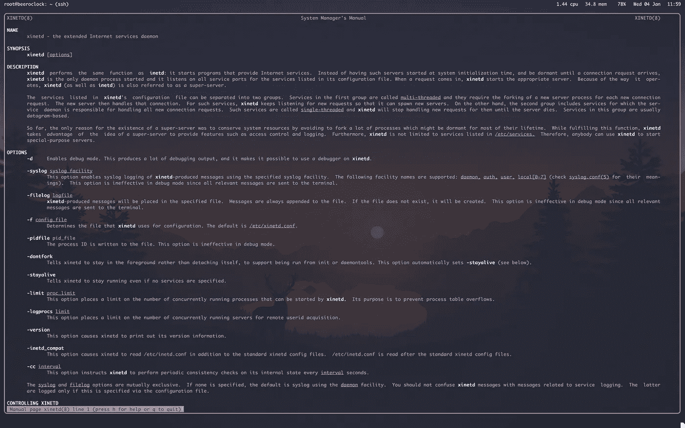
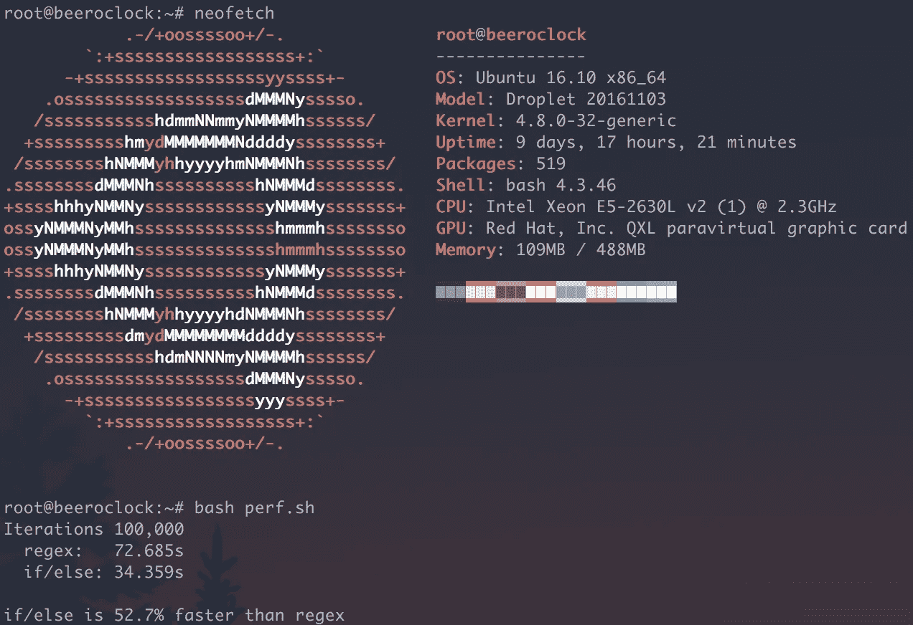

# 用纯 Bash 编写的 Web 服务。

> 原文：<https://medium.com/hackernoon/a-web-service-written-in-pure-bash-2af847902df1>

## 现在是啤酒点了吗？

在[@胡萝卜](http://twitter.com/carrot)我们使用 Go 和 Node 构建了许多 API，其中一些托管在 DigitalOcean 上，并利用了 Docker 容器，但我们也使用了[亚马逊](https://hackernoon.com/tagged/amazon)堆栈，如 Lambda、S3 和 Cloudfront with Apex&server less。我们有很多工具可以帮助我们启动项目，比如开发静态网站时的 [Spike](https://github.com/static-dev/spike) 或者在 [Github](https://hackernoon.com/tagged/github) 上建立仓库时的 [ash-github](https://github.com/carrot/ash-github) 。在开发 ash-github 的时候，我开玩笑说所有的东西都应该用 bash 编写。我和我的同事越是开玩笑，这个想法就越是在我的脑海中成长，很快这个想法就实现了。

## 泥土

这项服务目前运行在 DigitalOcean 的 Ubuntu 16.10 droplet 上。为了暴露我的服务，我需要打开一个与外界的连接，并且最初使用 netcat，因为它预装在大多数*nix 机器上。这个任务对我来说一点也不熟悉，但是我无法读取传入的请求，也无法处理两个用户同时连接。我研究了 inetd，除了手册页之外，它缺少文档。继续我的研究，我发现 [xinetd](https://github.com/xinetd-org/xinetd) 是 inetd 的一个更安全的版本。我还找到了更多关于创建服务的文档和用户指南。安装 xinetd 后，我开始构建我的纯 bash 服务的原始版本，名为 beeroclock。

xinetd man page

## 代码消化

当发出请求时，它被消费，头被解析，直到我们找到一个回车，表明我们已经到达了主体，然后正确地将每一部分分配给一个变量。在这种情况下，我们只关心 GET 请求和路径名是否正确。该服务响应两个路径和一个查询参数。

> #基于路由的响应
> /ock—text/plain
> /ock . html—text/html
> /ock . JSON—application/JSON
> 
> #基于查询参数的响应
> /ock？type=plain — text/plain
> /ock？type=html — text/html
> /ock？type=json —应用程序/json
> 
> # favicon
> /favicon —啤酒表情符号
> /favicon.ico —啤酒表情符号

如果您请求上面列出的路线之外的任何路线，您将被重定向到/ock。您还会看到有三种内容类型:文本/普通文本、文本/html 和应用程序/json。路由和查询参数消费的逻辑最初很简单，纯粹使用正则表达式，尽管响应时间很慢。我为正则表达式和条件创建了一个性能脚本，并在本地和服务器上进行了测试。if/else 条件语句比正则表达式快大约 52.7%，这是一个显著的差异！因此，我使用条件进行了重构，但遗憾的是，在请求时间上只有 100-200 毫秒的差异，没有明显的性能提升。

[Bash Performance Test — Regex vs If/Else](https://gist.github.com/hhsnopek/c89c578cde44f09613859a44b1aca8e2)

响应本身是使用一些函数构造的，其中一些是:beertime 和 response。beertime 函数处理时间计算和要在正文中使用的消息。后者构造并回复适当的响应，同时只使用两个参数:content-type & body。为了计算您的时区，当然是为了正确地消费啤酒，我向一个单独的服务发送了一个请求，该服务包含请求者的 IP 地址，该地址以您的时区作为响应。然后，我在执行 beertime 时生成的子 shell 中设置环境变量 TZ。beertime 的输出由另一个名为 respond 的函数使用，该函数设置标头并将整个响应回显到客户机。

## 概括一下…

Bash 可能仍然是一种脚本语言，但是像任何语言一样，我们应该探索并找到方法来弯曲它，直到它崩溃。我真的很喜欢建造 beeroclock，并且总是喜欢问我的同事现在几点了。源代码可以在这里找到 [hhsnopek/beeroclock](https://github.com/hhsnopek/beeroclock) 并且我欢迎贡献来改善这个项目——干杯！

> [黑客中午](http://bit.ly/Hackernoon)是黑客如何开始他们的下午。我们是 [@AMI](http://bit.ly/atAMIatAMI) 家庭的一员。我们现在[接受投稿](http://bit.ly/hackernoonsubmission)并乐意[讨论广告&赞助](mailto:partners@amipublications.com)机会。
> 
> 如果你喜欢这个故事，我们推荐你阅读我们的[最新科技故事](http://bit.ly/hackernoonlatestt)和[趋势科技故事](https://hackernoon.com/trending)。直到下一次，不要把世界的现实想当然！

