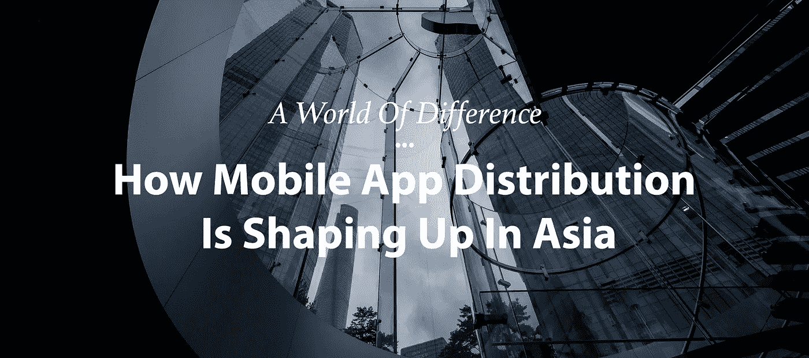

# 一个不同的世界:移动应用分发在亚洲是如何形成的

> 原文：<https://medium.com/hackernoon/a-world-of-difference-how-mobile-app-distribution-is-shaping-up-in-asia-62d806d2b8a0>

*Photo by* [*Evgeny Tchebotarev*](/@tchebotarev)

当加州的一家初创公司想要开发一款新的移动应用时，一群人聚在一起开始工作。当要发布一款新出炉的应用时，手段总是一样的——在产品搜索上发布，也许在 Reddit 上做一个 AMA，并希望获得 TechCrunch 或 Recode 的报道以增加下载量。

完成后，需要一些希望和祈祷(和一些增长黑客)来确保应用程序足够病毒化，以获得有机下载。大概就是这样。

Google Play 和苹果 App Store 都是围墙花园。围墙花园的效果创造了一些新类型的代理机构，专注于 ASO(应用商店优化)。就像更传统的 SEO 商店一样，但没有明确的参与规则，两家商店不时改变他们如何对待这些“优化”，根据标题垃圾邮件、关键字垃圾邮件等移动应用程序的排名。

为了理解我们今天为什么在这里，我们需要回到过去。从电信市场到软件市场的转变发生在过去的十年里。电信公司失去了控制他们可以在消费者手机上放置什么的能力(通常是*无*)，而谷歌和苹果能够将他们的参与规则强加给市场。这座围墙花园首先由苹果公司建造，随后由谷歌公司建造，将其他所有人拒之门外。

高调的分手，比如把谷歌地图扔出苹果商店，也影响了很多小玩家。比如 500px 被[踢出 App Store】一周。一些应用被禁止或者被完全移除，比如 F.lux，作为围墙花园的一个例子。](https://www.google.com.tw/url?sa=t&rct=j&q=&esrc=s&source=web&cd=11&ved=0ahUKEwjGrpXh9MjRAhWMxbwKHThvC7k4ChAWCBkwAA&url=http%3A%2F%2Fwww.digitaltrends.com%2Fapple%2Fsorry-apple-all-these-apps-allow-people-to-access-nudity-too%2F&usg=AFQjCNFmalMjaY18WSs0TC3Np8_M2b9log)

这吓坏了很多大型应用开发商，包括脸书和微信。因此，他们在自己的应用中建立自己的应用商店，比如 Messenger 的游戏和 gif，以及微信的迷你程序。

当然，大玩家并不害怕被踢出 App Store，而是他们明白应用发现完全被打破了，需要转移到一个人们可以潜在地发现新事物的地方——通过更自然地聊天和分享。这是结束现有王者谷歌和苹果主导地位的一步。

然而，在中国和东南亚，事情并不是以同样的方式进行的。首先，有几个应用商店可以替代 Google Play，Google Play 在 Mainland China 的应用非常有限。

这些中国应用商店的名字听起来会很熟悉:百度应用商店、腾讯应用宝石、小米应用商店、华为应用商店、豌豆家等等。

> 这些中国应用商店的名字听起来会很熟悉:百度应用商店、腾讯应用宝石、小米应用商店、华为应用商店、豌豆家等等。

多个应用商店的原因有两个。首先，Android 是免费的，并且正在成为一种商品，因此制造商被迫派生出一个版本的 Android，并用自己的应用程序商店来补充它，以改善他们销售硬件的日益减少的利润。一般来说，除了苹果和三星，这个行业的其他公司都在硬件上赔钱。拥有自己的应用商店让手机制造商可以通过两种主要方式赚钱:付费应用，收入分成，以及预装，将特定应用直接推送到手机上。

对于较小的参与者，如印度的 Micromax 或印度尼西亚的 Advan，运营自己的应用程序商店非常昂贵(使用开放手机联盟的原始 Android 意味着硬件上没有利润，服务上没有利润)，所以他们转向第三方 Android 制造商，他们将与应用程序制造商、智能手机制造商和他们自己三方分享收入。

我第一次听到这种风声是在 2012 年左右，当时一家大型智能手机制造商与 500px 接洽，处理 2000 万部手机的预装交易。我们拒绝了这个提议，但我没有意识到这只是冰山一角——制造商现在开始扮演国王的角色，同时向数亿部手机推广应用。

这种方法就像是颠覆了硅谷——这些公司不是花费每次下载 1-5 美元([里程数可能不同](https://www.quora.com/What-is-the-average-user-acquisition-cost-for-an-app-install-on-iOS-and-Android))来获得用户，而是进行收入分成交易，但不必花费前期资本来获得数百万用户，在他们意识到发生了什么之前就有效地粉碎了竞争。

随着越来越多的中国手机制造商开始向发展中市场扩张，如印度尼西亚、印度、巴西、俄罗斯等，我们将看到更多本地化的方法来控制应用商店、应用分销，以及通过积极的分销协议来打造王者。

*Evgeny Tchebotarev 是 9m+强社区* [***这五件事***](https://medium.com/u/5075e6960d1#.m5qywyddt) *帮助公司成功。他在台湾台北工作。你可以发电子邮件到 e@e15v.com 找他。*

## 如果你喜欢读这篇文章，请点击下面的心❤图标。它帮助其他像你一样的人发现好的故事。

> [黑客中午](http://bit.ly/Hackernoon)是黑客如何开始他们的下午。我们是 AMI 家庭的一员。我们现在[接受投稿](http://bit.ly/hackernoonsubmission)并乐意[讨论广告&赞助](mailto:partners@amipublications.com)机会。
> 
> 如果你喜欢这个故事，我们推荐你阅读我们的[最新科技故事](http://bit.ly/hackernoonlatestt)和[趋势科技故事](https://hackernoon.com/trending)。直到下一次，不要把世界的现实想当然！

