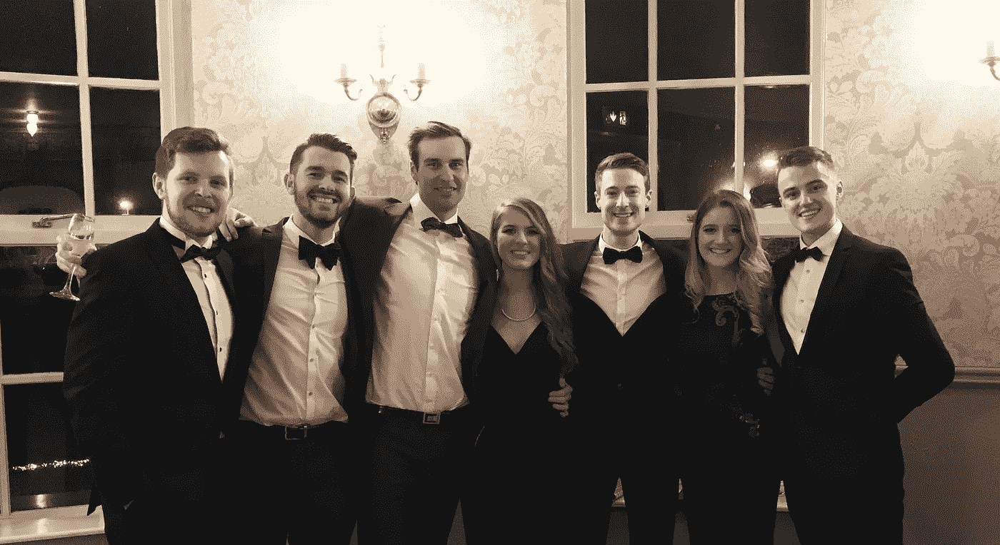
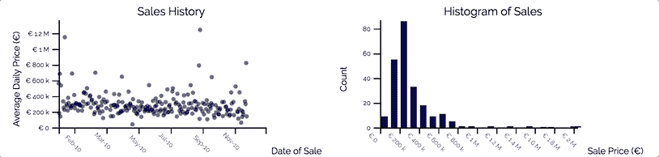
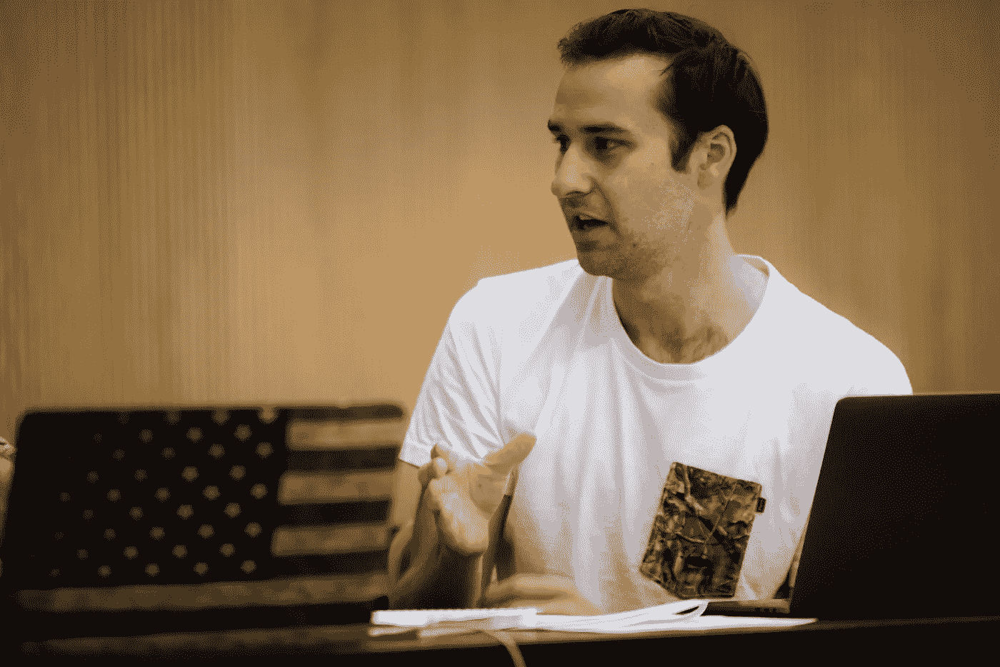
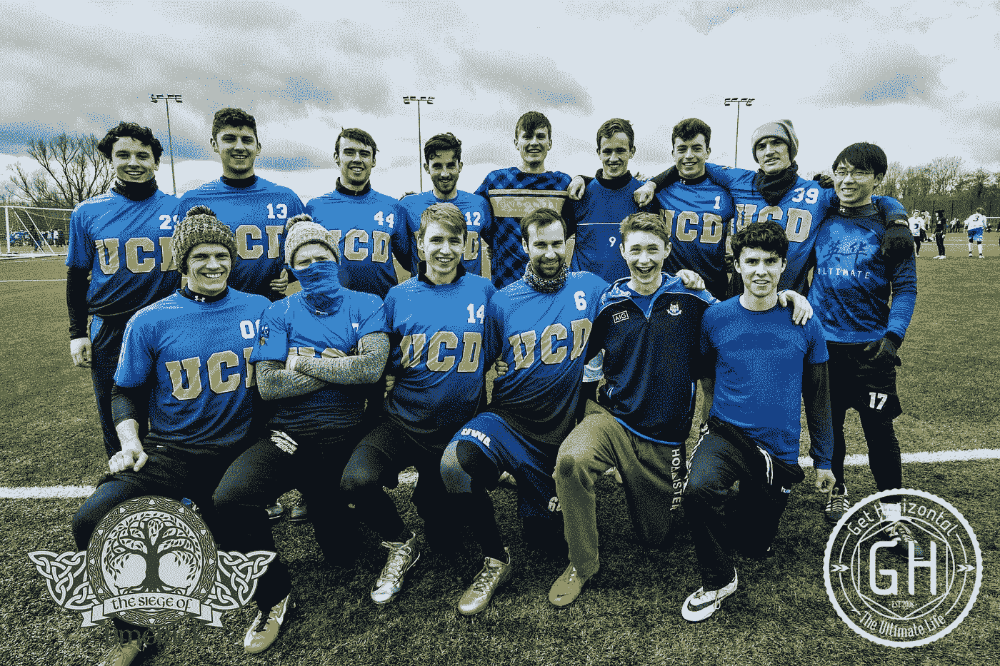

# 在 UCD·斯默菲特商学院学习一年的商业分析

> 原文：<https://medium.com/hackernoon/a-year-in-business-analytics-at-ucd-smurfit-school-of-business-e4a151843aa2>

本文应 [datsciawards.ie](https://www.datsciawards.ie/) 的要求而写，为 2017 年爱尔兰顶尖数据科学家颁奖。我没有被提名，但你绝对应该看看那些被提名的优秀的人。

他们还与 [UCD 迈克尔斯默菲特商学院](http://www.smurfitschool.ie/)合作，为一名欧盟学生提供 2017/18 年度商业分析硕士全额奖学金。如果你正在考虑进入数据科学领域，我可以强烈推荐这门课程。更多信息请点击查看[。](https://www.datsciawards.ie/tickets/)

The highlight of the Smurfit Social Calendar, the Smurfit Ball

2015 年初，由于油价持续低迷，我获得了一年的假期，离开了我在挪威的钻井工程师工作。我被安排在我发现的时候去度假，所以在我离开挪威之前，我有两周的时间来考虑下一步该做什么。在我看来，我有三个选择:

*   找一份石油和天然气方面的工作，或者尝试进入另一个领域；
*   回到大学，获得一套新的技能；或者
*   旅游、探险、聚会；

那个时候没有什么石油工作，我也不想马上回去工作(尽管经济低迷，我们在挪威还是很忙，直到我们很忙)。旅行本来会很棒，但是如果我在休假结束时没有工作，我就会处于危险的境地。

> 离开了大学，随之而来的是一个问题:学什么？

我被迫思考我喜欢的工作到底是什么，我意识到我做过的最具挑战性和最令人愉快的项目都涉及数据操作和处理。当时，我不知道数据科学是一个东西，但阅读它真的打开了我对这个新世界的视野，我意识到这是我想去的地方。

我开始接触数据是在 14 岁的时候，当时我参加了一个课后数学挑战班。我记得我努力解决每一个涉及微积分的问题(这是所有的问题)，但是有一次我开始使用 Excel，并在我父亲的帮助下，建立了一个模型，正确地解决了问题！我被迷住了。

在高中剩下的时间里，以及我的本科学位期间，我对数据如何在一个模型内移动和关联的兴趣是我强烈的好奇心，尽管我从未意识到这是我可以全职做的事情。

我在西澳大利亚大学学习化学过程工程，我处理数据关系的技能极大地帮助了我为最后一年的项目和论文建立财务和处理模型。我在各种工程和金融机构实习，当时我想成为一名分析师。

毕业时，我权衡了自己的选择，选择了冒险，在挪威斯塔万格的[斯伦贝谢有限公司](http://slb.com)获得了一个离岸[工程](https://hackernoon.com/tagged/engineering)的技术职位。

我在 Schlumberger 的角色与数据科学相去甚远(我是一名海上工程师，负责新井的钻井和测井)，我对数据分析的兴趣和技能让我受益匪浅。当我被要求把一个新产品的一些数据输出转化成一个很好的可视化的网站给我们的客户时，我一头扎进了 Visual Basic，并且第一次尝到了编程的滋味。记录宏和从微软论坛学习让我走得很远，我最终开发了一个软件来自动化以前的手工任务，并为 Schlumberger 开辟了一个新的收入机会。

One of the many amazing views I got to experience in Norway

凭借手中的技能和经验，以及学习数据科学的决定，UCD 迈克尔斯默菲特商学院因其学术重点(而不是编码训练营之类的)和在爱尔兰的声望而脱颖而出。我申请了商业分析硕士，并被录取了。

第一学期的重点是建立坚实的数学、统计学和项目管理技能基础。最初并没有太多的注意力放在编程上，但是全日制课程的好处是我们有充足的时间在自己的时间里发展这些技能。随着学期的进行，我们以团队的形式建立了一个[布莱克-斯科尔斯期权定价模型](https://github.com/Padam-0/black-scholes_opm)，并探索和评论了 [IT 项目管理哲学](/@padam0/did-pokemon-go-try-too-hard-to-be-agile-d226456cf7a4)。

我们也获得了扎实的学术复习基础，整个冬天都在彻底探索一个文学领域。

第二学期的重点从理论转移到算法的应用。我承担的一些项目包括:

*   使用优化的数据结构，部署 [Dijkstra 和双向变量](https://github.com/Padam-0/Dykstras-and-Birdirectional-Variant)来寻找通过网络的最短路径；
*   开发一种算法来适当地[分配飞机座位](https://github.com/Padam-0/aeroplane_seating_assign)；
*   模拟一种新的[病毒式广告模式](/towards-data-science/utilising-epidemic-modelling-to-improve-advertising-click-rates-on-facebook-6f294205a43f)，以增加脸书的点击率；
*   开展聚类案例研究，优化[儿童 t 恤尺寸](/@padam0/using-unsupervised-learning-to-optimise-childrens-t-shirt-sizing-d919d3cbc1f6)；和
*   建议一级方程式比赛的适当顺序，以最大限度地减少车手的旅行时间。

对我来说，这门课程最吸引人的地方是有机会在夏天参与一个行业合作项目。我正在开发一个展示和总结爱尔兰住房行业的应用程序，以帮助 AIB 的数据科学家提供见解。

暑期实习让我们有机会运用去年学到的技能。我的包括 Python、Django、Javascript、D3、网络抓取、云计算、SKLearn 和 Google Maps API。

Working with D3.js animations to show changes in house prices around Dublin

这门课程本身是完全值得的，我提高了对算法和方法的学术理解，极大地提高了我的编码能力，并且有了大量的工具可供我解决许多问题。

这门课程也给了我足够的空间来提高我在数据科学领域的技能，例如学习 Django 来快速部署 web 应用程序和仪表板，学习 D3 来可视化数据，以及学习基于云的数据处理来推动超出我个人资源的计算可能性。

我还有机会参加 3 次黑客马拉松，每次都让我看到了我需要提高技能的地方:

*   ESB Big Energy Hack 教会了我在专注于解决方案之前了解您的数据的必要性，以及平衡多学科团队的难度；
*   AIB 数据黑客告诉我，虽然我的数据清理技能有了很大提高，但我需要更多机器学习的实践经验；和
*   Citadel Correlation One Datathon 告诉我，数据科学不仅是关于过程，也是关于正在回答的问题(我们的解决方案非常注重业务，而获胜者则追求更有趣的见解)。

At the Correlation One Datathon

Correlation One Datathon 是技能的巅峰，显示了我从课程开始以来的进步。在 6 个半小时内，我们分析了 15gb 的数据，并为优步建立了一个模型，以优化任何时间点的司机分布。作为这一方法的延伸，我研究了数据中更大的一部分，以找出纽约哪个街区的派对最热烈。

我在 UCD 的社交生活也是一大亮点，我的同学来自不同的国家，他们都欢迎我来到爱尔兰。社交日历上的亮点是蓝精灵舞会。

我也有机会代表 UCD 参加极限飞盘比赛，10 月份去比利时参加比赛，4 月份在爱尔兰大学锦标赛中获得第二名。

这是 UCD 大学伟大的一年，也是进入数据科学的伟大之旅(虽然有点曲折)。我真的很兴奋，因为我将有机会运用我所学的技能。

我强烈推荐 UCD 理学硕士商业分析课程，并真心鼓励崭露头角的数据科学家申请[奖学金](https://www.datsciawards.ie/tickets/)！

祝所有获得 2017 年爱尔兰数据科学奖提名的人好运！

如果你喜欢这篇文章，请点击❤按钮让你的追随者知道，或者让我知道你的想法。

> [黑客中午](http://bit.ly/Hackernoon)是黑客如何开始他们的下午。我们是 [@AMI](http://bit.ly/atAMIatAMI) 家庭的一员。我们现在[接受投稿](http://bit.ly/hackernoonsubmission)并乐意[讨论广告&赞助](mailto:partners@amipublications.com)机会。
> 
> 如果你喜欢这个故事，我们推荐你阅读我们的[最新科技故事](http://bit.ly/hackernoonlatestt)和[趋势科技故事](https://hackernoon.com/trending)。直到下一次，不要把世界的现实想当然！

