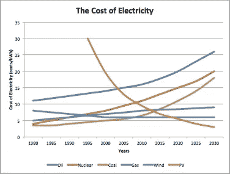
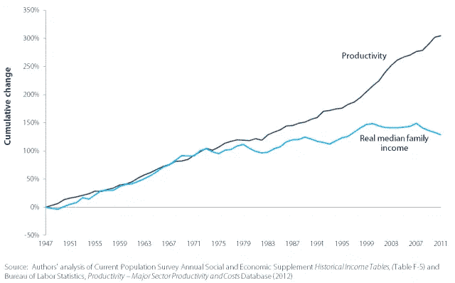
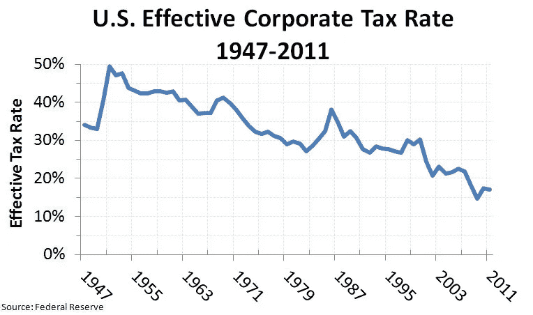

# 关于人工智能、失业和富足的未来

> 原文：<https://medium.com/hackernoon/about-ai-unemployment-and-future-of-abundance-25b5e5527b1f>

我第一次听说富足的未来是在 3 年前，开始时这并不合理，但我发现自己相信事实确实如此，大约在同一时间，一场不同的、更加悲观的关于乔布斯未来的讨论开始了，我也发现自己同意这一假设。这篇博客文章就是要把这两者结合起来，并表明它们之间没有矛盾，只是还有工作要做。

我将从为什么在我看来富足的未来是一个合理的未来开始(这是困难的部分)，继续讨论人工智能扰乱就业市场(恐惧总是容易的)，最后讨论这些如何能够很好地结合在一起。

# 一切都始于能量

我第一次意识到能源是经济的根源，是在 2009 年参加[克里斯·马滕森](https://www.peakprosperity.com/about)速成班的时候(作为我“2008 年到底发生了什么”旅程的一部分)，克里斯很好地编织了能源、环境和[经济](https://hackernoon.com/tagged/economics)之间的联系，或者他所说的三个 E。虽然我不同意他的一些预测，但我发现他的理论非常可靠和有趣。我把他的 3 E 作为基础直到今天。

我曾经听说过一本科幻小说，它将物种进步表现为能量消耗，如下所示:

*   阶段 1:生命形式正在消耗不可再生能源，包括人类和其他动物。
*   第二阶段:生命形式消耗可再生能源，这些是我们当今世界的主要植物(太阳的养料)。
*   第三阶段:生命形式是纯粹的能量。

我们今天在我们的存在中经历的变化是从阶段 1 到阶段 2，在我看来阶段 3 仍然属于科幻小说，尽管我知道有许多努力围绕着将人类意识放入机器，只要连接电源电缆，就可以使人成为纯粹的能量存在(但这是另一篇文章的讨论)。

## 可再生能源——能源成本下降趋势

我记得速成班对可再生能源的状况相当苛刻，但由于我们都没有进行指数思维，它没有估计到它们的指数增长。EROI(能源投资回报率)不断提高，我们每年都能获得越来越便宜的能源。

While non-renewable are rising, Renewables process are dropping

太阳能，其价格受硅成本和性能的影响，持续下降，仅去年就下降了 30%,我们已经达到 1 美元/瓦。预计这一趋势将持续下去，随着我们的发展，能源价格将继续下降。尽管许多事件会造成短时间的峰值(如战争)，但总体趋势是明确的。

为什么这如此重要？因为我们周围的一切都是能源和劳动力的体现，如果这两者价格下降，一切都会随之下降。

# 自动化—劳动力成本下降趋势

我们正处于人工智能时代，这是一个很大的词，但我更喜欢自动化这个词，人工智能正在做的事情本质上是自动化我们周围的一切，在未来节省大量的劳动力。

The age of autonomous machines is here

我们现在每天都在[数据循环](http://dataloop.ai)看到这些案例，自动化已经开始夺走人类的工作，这种趋势预计将在未来几年加速，这种工作淘汰过程看起来如何？以下是几个例子:

*   自动驾驶汽车将解除航运业、出租车司机、卡车司机、公共汽车司机、保险公司、汽车制造商、停车设施和许多其他人的雇佣。
*   手机将取代任何以观察事物为生的人。
*   机器人将取消支持中心，中心呼叫，在线援助
*   自然语言处理引擎将不再雇佣文档分析人员、内容撰写人员、律师以及所有以书面工作为生的人。
*   机器人技术将接管整个工业运作。
*   诸如此类…

因此，制造业正在变得廉价和自动化(成本是基于能源的)，许多维持社会运转所需的工作正在消失，随着时间的推移，我们有望获得更廉价的能源。

如果我们把自己想象成一个小村庄，那么这是一个好消息，我们将在同样的工作量下生产更多的东西，从本质上来说，我们将有更多的时间娱乐、创造和家庭。那么，为什么这是一件坏事呢？

> 生产太多有用的东西导致产生太多无用的人

## 这是一种改变

改变没有好坏之分。它为那些认识到这一点并采取行动人提供了机会，而对那些无所事事的人则是一种威胁。

我注意到，随着年龄的增长，我们越倾向于将变化视为威胁而非机遇，这是有道理的，因为年龄越大，我们适应变化的速度越慢，因此变化更像是威胁而非机遇。

好消息是，最终一切都将围绕创造力展开，在我看来，与当前的就业市场相比，创造力的年龄限制要宽松得多。

在这一点上，你们中的许多人发现很难同意，因为在我们周围很难过上体面的生活，感觉不到东西越来越便宜，而且很可能平均工作受到上述变化的威胁，那么为什么会不和谐呢？

# 生产力流动

生产率产出(增加)并没有平等地流向每个人。

我们目前的经济体系基本上有两种类型的工作，私营部门和公共部门。

## 私营部门

私营部门的结构多少年来都是一样的，少数人创造了某种形式的垄断(对资源、技术、土地)，然后通过大众为大众生产商品和服务来利用这种垄断(尽管大众这个词在历史上有不同的翻译)，其他人都扮演着工人的角色，拿着工资在这个系统中工作。

私营部门在运作中有一个很大的缺陷，生产率的提高并没有公平地惠及所有人。虽然我同意不同的技能应该有不同的补偿，但产出的提高(即衍生品)应该以比现在更平等的方式分配。

1971 is where currency left the gold standard

因此，大量的生产力产生了(而且还会增加),但它并没有流向金字塔的底部，因此，经济不平等和差距不断扩大。

由于自动化时代的到来，解决这个问题在不久的将来是一个关键点，因为生产力将不断提高，其产出应该由不同于我们习惯的思维来分配。

## 公共部门

公共部门玩着不同的游戏，它是由税收驱动的。在我看来，公共部门的主要作用是向所有公民分配商品和服务。从安全到正义和保护，这些服务是社会中每个人都需要的，我们拨出一部分收入来提供这些服务。

这个行业面临的最大挑战是，它没有在竞争中运营，因此平衡非常缓慢。如今，政府严重依赖债务和消费者税收，这种情况应该改变。政府应该更快地通过精简和高效来为未来做准备，他们可以选择这样做，或者等待市场为他们做。有了比特币和其他加密货币，人们已经建立了替代货币，如果这些货币真正发挥作用，政府将发现自己面临巨大的税收压力(表现为利率飙升和债券崩溃)。

Tax models should transform

因此，政府的税收模式应该改变，既要适应另一种选择，也要适应税收结构不能一成不变的事实。

# 一些可能的解决方案

## 政府保健

> 这是一个解决方案，政府将支付社会支票给每一个活着的人。芬兰已经开始尝试这种做法，虽然这在短期内可能会有所缓解，但从长期来看，这是一个非常糟糕的想法，基本上是直接向较弱的城市转移资金，只能在有限的范围内发挥作用。

[WWII US war production poster](https://digital.library.unt.edu/ark:/67531/metadc186/)

我经常与我的妻子分享我的想法和理论，以获得一些基本的真理(我很幸运有她作为我的制衡)，当我们几周前讨论这个选项时，她向我推荐了一句老话:xf66378

> [游手好闲是魔鬼的玩物](https://en.wiktionary.org/wiki/idle_hands_are_the_devil%27s_playthings)

*   这很好地总结了这一点，人们不想要施舍，除非不得不和ט

## 自动化税

Robotax

这一项越来越受欢迎，它涉及围绕自动化和人工智能的特殊税收。与之前的解决方案一样，这只能在有限的范围内发挥作用，自动化无处不在，监管机构要赶上这种变化并以足够快的速度公平地应用它将非常困难。一些技术已经成为关注的焦点(如自动驾驶汽车和其他自动驾驶机器)，但在我看来，这种解决方案无法快速扩展以弥补不足。这对中期来说是一种解脱。

## 税收冲销

我最近想出了这个词 [*税收倒置*](https://en.wikipedia.org/wiki/Tax_inversion) ，具有讽刺意味的是，这个词的存在和含义与我的意思完全相反，所以我将其精炼为税收逆转。我确信这个概念不是新的，但没有找到任何有力的参考。

一旦你成为雇员，这是很平常的事。c x 税随着你赚的钱越多(按百分比)，这是一个我们都觉得相对公平并接受的基本概念，但是这个基本原则。适用于企业。

作为一个企业，你越大，你交的税就越少(按百分比而不是按数量)，这需要改变。z6

在我看来，我们应该最大限度地鼓励个人和小企业，同时随着企业的发展和盈利，征收更多的税。

不要把钱给小家伙，就让他和大家伙公平竞争。如果你已经在捐钱了，那就鼓励创造力、创造就业机会和竞争。我确信，如果对小企业不征税，对垄断企业进行强有力的监管，将会创造许多就业机会。

这种解决方案的问题在于，大公司在全球范围内进行了强有力的税务规划。我不是税务专家，无法正确理解它是如何运作的，但我遵循一个简单的逻辑:你在我们的土地上赚钱，你在我们的土地上纳税，而且你越赚越多，而且是的——在某些时候，赚更多的钱不会证明你的投资是值得的，这没关系，把市场份额留给较小的参与者。

How much tax do you pay ?

# 这是每个人的共同利益

归根结底，我们都有相同的兴趣。如果人们没有工作，他们就买不到东西，经济就会放缓，大公司也会遭殃。

对个人、政府和企业来说，重新构建未来的富足和生产力收入是一个共同的目标。

# 摘要

我试图解决就业和自动化的未来之间的冲突，在我看来，解决办法是税收逆转和税收倒置的消除。

创造力很重要，这取决于我们，对我们大多数人来说，载体配方的时代已经结束了，所以换个角度思考。巨大的变化即将到来，它们蕴含着巨大的机遇，积极思考并尝试一下，同时确保你的政府代表让你的生活变得更轻松。