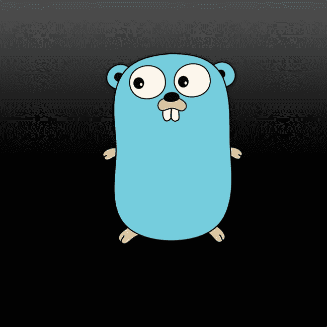
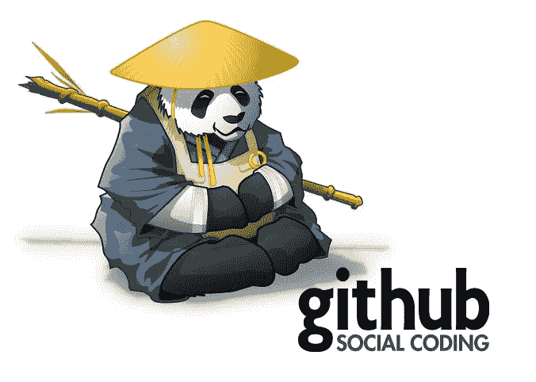
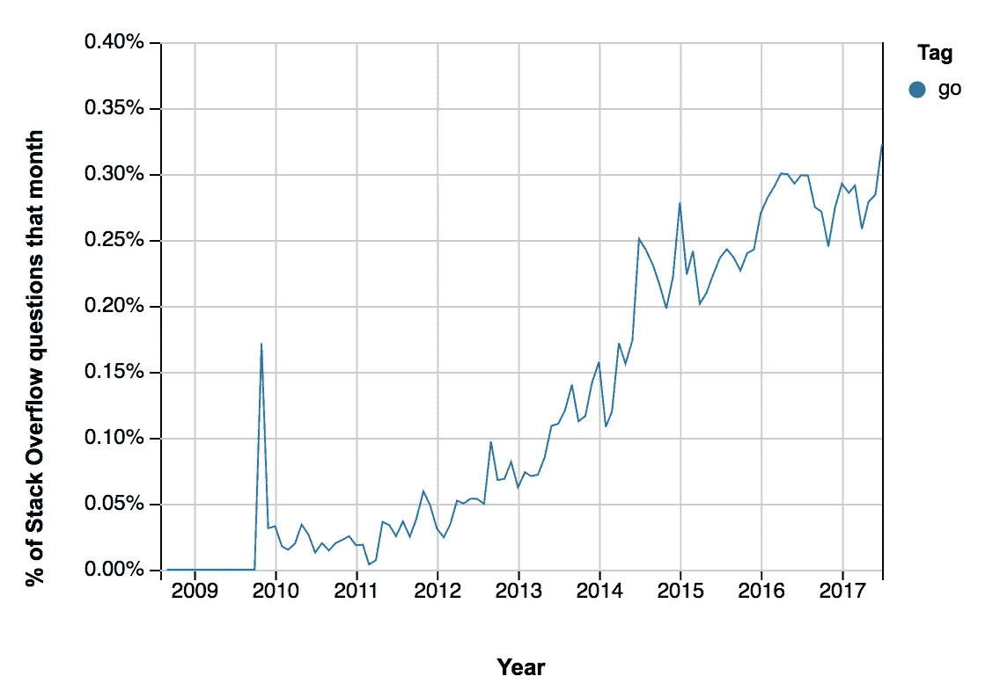
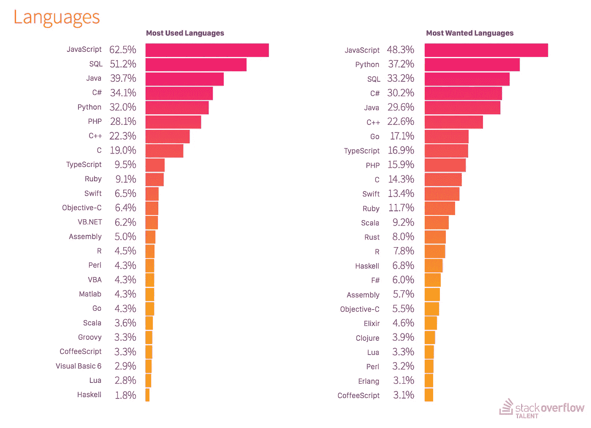
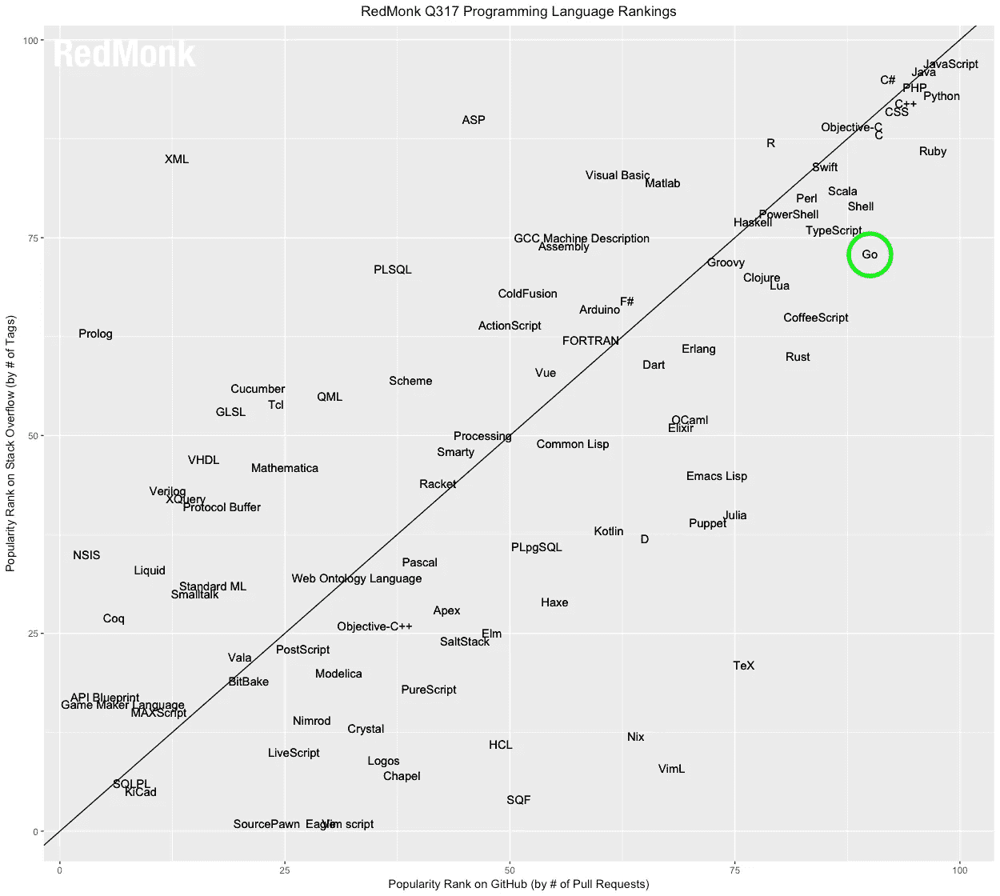
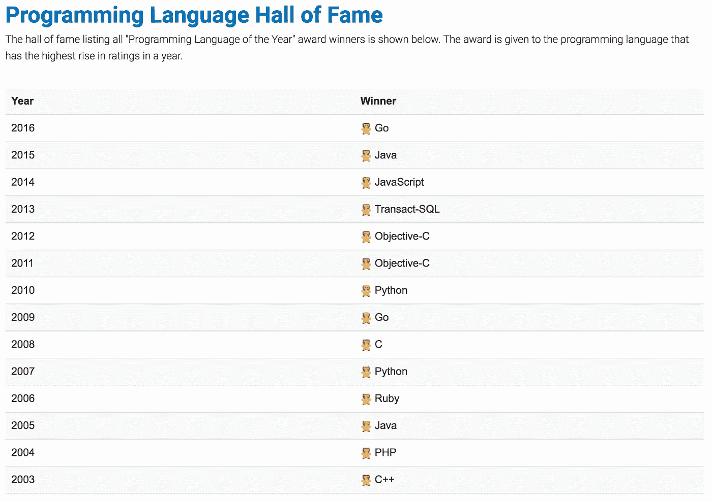
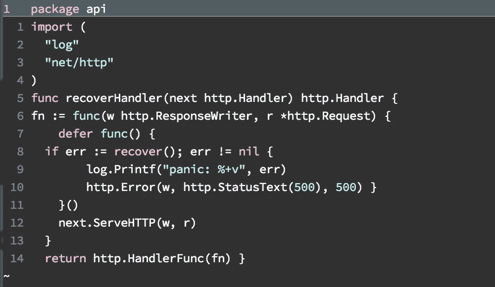
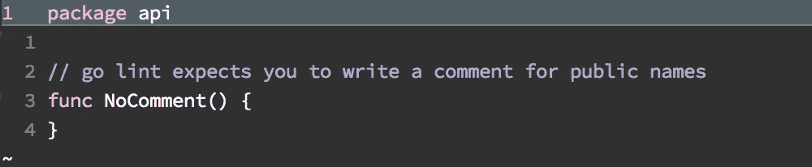
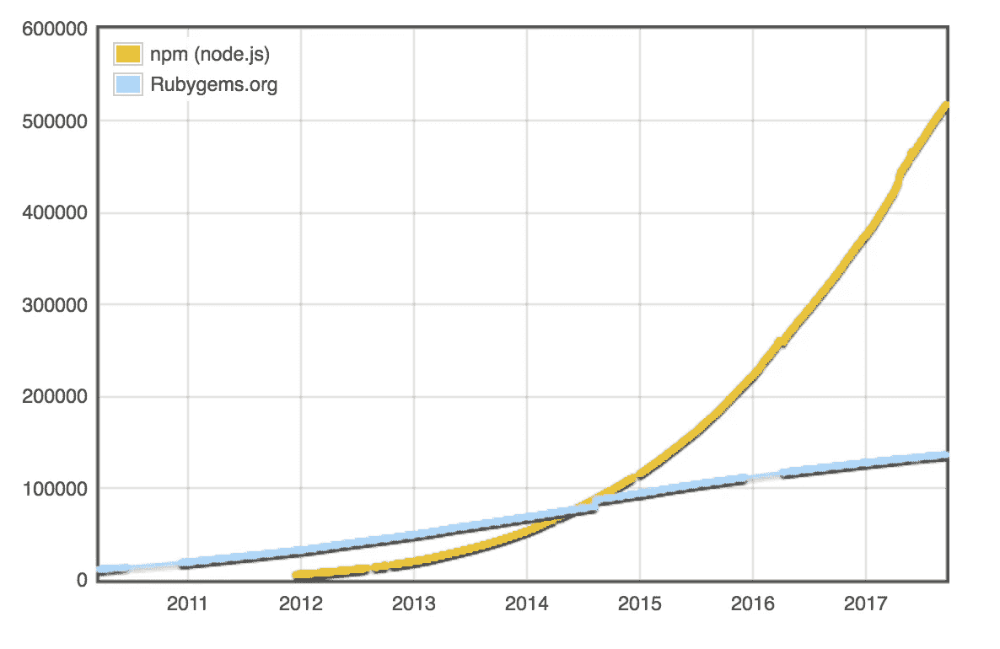

# 关于 Go 语言—概述

> 原文：<https://medium.com/hackernoon/about-go-language-an-overview-bba4b04f454b>



这将是一系列关于 Go 语言的教程。第一个帖子有点无聊，谈到了当前的围棋生态系统和这门语言的概述。以及它的优点和缺点。

*我已经和 Node.js 合作了很多年，然后在我最近的项目中和 Go 合作。我从 10 岁开始* [*编程*](https://hackernoon.com/tagged/programming) *已经 25+年了(猜猜我的年龄？).我想和你分享我学到的东西。*

在接下来的帖子中，我会在这篇帖子中详细介绍每一条信息。这篇文章的目的是给你一个 Go 的快速概述，而不是进入语言的细节和教程。



# 开源语言

这是谷歌的一种开源编程语言。在 2011 年发布了第一个稳定版本。

**它是一种开源编程语言意味着什么？**
嗯，是我说的谷歌创造的。然而，即使是你也可以通过创建新的提议，修正错误，使它更快来为它做出贡献。就像一个活物在你面前生长。如果你好奇的话，它的源代码是[托管在 Github](https://github.com/golang/go) 上。

# 谁创造了围棋？

罗伯特·格里斯默，罗布·派克和肯·汤普森。他们在 2007 年左右开始设计这种语言。该语言于 2009 年开源。在这里阅读更多。

> Go 设计灵感来自 Algol、Pascal、C、Modula、Oberon、Smalltalk 和 Newsqueak 等语言。

Go 主要继承自 Oberon 语言，其语法来自 c。Go 的 OOP 更像 Smalltalk，但在 Go 中，你可以将方法附加到任何类型。并发性主要来自 Newsqueak，这是一种也来自 Rob Pike 的语言，并受到 Hoare 关于 CSP ( [通信顺序进程](https://en.wikipedia.org/wiki/Communicating_sequential_processes))的论文的大量启发。

# 他们为什么创造围棋？

像 C 这样的 ast 语言很难使用，也不安全。编译速度、依赖性和运行时错误是巨大的。像 Java 和 Ruby 这样的解释型语言是安全的，但是它们比较慢，并且有很多依赖性，其中之一就是解释器本身，运行代码所需要的虚拟机。Javascript 和 Node.js 是野孩子；它是解释的、弱类型的、不安全的(*尽管有一些变通方法)*。

此外，作为一个例子，Java 变得太复杂和冗长。有许多关键词可以从语言在(*中构建的上下文中猜测出来，这就是所谓的推断)*。与 Ruby 一起工作很愉快，但是它不是为速度而设计的。Javascript 让你自由，疯狂，慢慢杀死你(*维护噩梦，回调地狱，没有内置的安全解决方案)*。

用 C 之类的编译语言编程并不快，因为有编译步骤。然而，使用像 Ruby 这样的解释型语言是很快的，因为它是解释型的，你可以在保存源代码后很快看到结果。

# Go 消除了所有这些障碍，比如安全性、速度和编程的简易性

*   **快速的结果:**因为快速的编译，它像一种解释语言一样工作。你不会注意到它在编译。你会觉得好像你是在用 Ruby 这样的解释型语言工作。
*   **安全**:强静态类型，垃圾回收。强类型意味着:你不能到处传递任何类型的数据。你需要明确。静态类型意味着:编译器知道每个变量的类型。
*   易于使用:它简洁明了，易于阅读。
*   **Modern:** 语言本身内置了对多核网络分布式应用等的支持。

# 围棋有成语

*   **“完成工作”**
*   **“单向做事”** : *这叫惯用 Go 码。*
*   **【显而易见】** : *显而易见，即使不干燥。有时复制是允许的。*
*   **“组合而成”** : *不要从其他事物继承，用更简单的组件组成系统。虽然，它从 Unix 哲学中“继承”了这句口头禅。*

# 谁用围棋？

> Go 社区中至少有 200 万程序员。

最著名的公司有:谷歌、Docker、Dropbox、Heroku、Medium、Lyft、优步、[和其他](https://github.com/golang/go/wiki/GoUsers)。



[Percentage of Stack Overflow questions for Go](https://insights.stackoverflow.com/trends?tags=go)



[Most used and wanted languages in 2017](https://www.stackoverflowbusiness.com/hubfs/content/2017_Global_Developer_Hiring_Landscape.pdf)



[By GitHub Pull Requests](http://redmonk.com/sogrady/2017/06/08/language-rankings-6-17/)



[https://www.tiobe.com/tiobe-index/](https://www.tiobe.com/tiobe-index/)

另见: [Go 2016 调查结果](https://blog.golang.org/survey2016-results)。

# 使用 Go 的一些优势:

Go 有史以来最可爱的吉祥物。好吧…，让我们看看真正的优势。

## 编辑

*   没有虚拟机。它**直接编译成机器代码**哪个快，快，快(*我说快了吗？*)。
*   **快速编译**。编程语言的设计从一开始就考虑到了快速编译。
*   将**跨平台**编译到 OS X、Linux、Windows、👉还有很多[其他的](https://golang.org/doc/install/source#environment)。
*   编译后只创建**一个可执行的**文件输出，没有任何依赖关系，这样你就可以把它上传到 Go 支持的任何地方并运行它。或者只是在你上传代码后编译它。

## 安全的

*   **强而静的打字。**
*   **收集的垃圾**。它在你身后清理你的污垢，并将整个垃圾收集系统集成到你的可执行二进制文件中。
*   **可靠。**你真的可以用 Go 创建一个非常可靠的软件。因为，固有的语言设计阻止你用它做可怕的事情。*例如:它有指针，但它们不像 C 语言那样危险，因为内存是由 Go 管理的，默认情况下不建议使用指针算法。*

## 范例

*   这是一种命令式语言。*这对于某些人来说是优点也是缺点。*
*   支持不同种类的**面向对象编程(OOP)。**我来自许多面向对象的语言，如 Java、C#、Ruby，但是，Go 从面向对象中获得了最佳实践，让你以 Go 的方式进行不同的编程。

> Go 希望你像在其他面向对象语言中那样编写东西而不是继承。

*   支持**接口**(OOP 中的*)*。这有助于写作。多态性有印象吗？
*   支持**功能编程(FP)。**

## 同时发生的

*   **内置并发**。*没有重线程只有* [*通道*](https://www.youtube.com/watch?v=3DtUzH3zoFo) *。*
*   几乎所有内置到**的标准库** ( *是 Go 默认自带的库)*中的东西，比如 http 抓取、json 解析和加密。所以，这让你更快，并防止生态系统中的碎片化(*大部分时间)*。

## 工具作业

*   [**伟大的内置命令行工具**](https://godoc.org/golang.org/x/tools) 。自动格式化你的代码，检查竞争条件问题，自动文档，测试覆盖报告，重构工具等等。
*   **示例工具:** `go fmt`每次保存后自动为您重新排列代码(*如果您在文本编辑器中配置了代码)*。



Before `go fmt`


After `go fmt`

*   **示例工具:** `go lint`提出改进你的 Go 代码的建议。



```
$ go lint nocomment.go
nocomment.go:3:1: comment on exported function NoComment should be of the form "NoComment ..."
```

# 使用 Go 的一些缺点:

*   **不支持泛型。**实际上，虽然我把它放在这里，但我并不认为这是一个缺点。因为，它让你创建非常明确的代码。过多的抽象带来了难以理解代码的代价。我不属于 Go 中泛型支持的阵营。*不过，* [*Go 团队还在考虑给语言*](https://github.com/golang/go/issues/15292) *增加泛型支持。*
*   关于泛型(*类)*，Shawn McGrath 有一篇关于 Doom(*游戏*)源代码之美的[文章。特别是，阅读部分:“*最小模板*”，*我完全同意。*](https://kotaku.com/5975610/the-exceptional-beauty-of-doom-3s-source-code)
*   到处都有错误。你需要明确地检查代码中每个产生错误的函数的错误。再次，对我来说，这不是一个缺点，我喜欢围棋程序的明确性。有一些改变错误处理的提议，我一点也不喜欢。

```
res, err := http.Client.Get("[http://ip.jsontest.com/](http://ip.jsontest.com/)")// there are no try-catch exceptions in Go, check errors explicitly
if err != nil {
    return err
}// ...
```

*   没有**功能过载**支持。
*   **严格的规则。**有时是优势，有时是劣势。例如:当你不断改变结构时，你会感到有点沉重。
*   **与 Node.js 和 Ruby 等其他生态系统相比，数量较少的软件包**。然而，它正在增加。


[Go packages](http://www.modulecounts.com/)



[Ruby and Nodejs packages](http://www.modulecounts.com/)

## 更多健脑食品的链接:

*   [我其他关于 Go 语言的帖子](https://medium.com/im-learning-go-golang)
*   [围棋的进化作者*罗伯特·格里斯默*](https://www.youtube.com/watch?v=0ReKdcpNyQg)
*   [围棋箴言*靠抢长枪*](https://www.youtube.com/watch?v=PAAkCSZUG1c)
*   [设计围棋*靠抢长枪*靠抢长枪](https://www.youtube.com/watch?v=KINIAgRpkDA)
*   [简单复杂*靠抢长枪*靠抢 ](https://www.youtube.com/watch?v=rFejpH_tAHM)
*   拉斯·考克斯 著[围棋的未来](https://www.youtube.com/watch?v=0Zbh_vmAKvk)
*   *[语言设计服务于软件工程*由罗布·派克*到](https://talks.golang.org/2012/splash.article)*

*你成功了！感谢阅读！*

*❤️ *请* ***加鼓掌！*** *分享到* [*推特*](http://twitter.com/intent/tweet) *！**

*🐦*我发的大多是关于围棋的推文:*[*@ incongumus*](http://twitter.com/inancgumus)*。**

## *🔥我正在创建一个围棋在线课程:[加入我的时事通讯](http://eepurl.com/c4DMNX)！*

*让我们每周保持联系，了解新的教程和我的在线围棋课程。*

**原载于*[*medium.com*](/im-learning-go-golang/about-go-language-an-overview-f0bee143597c)*2017 年 9 月 20 日在* [*【我在学围棋】*](https://medium.com/im-learning-go-golang) *刊物、* [*点击此链接订阅*](https://medium.com/im-learning-go-golang) *到刊物。**