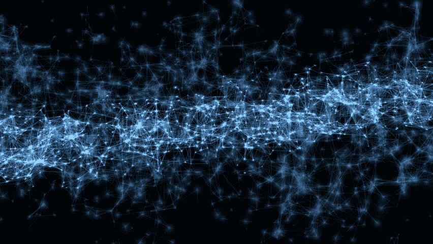
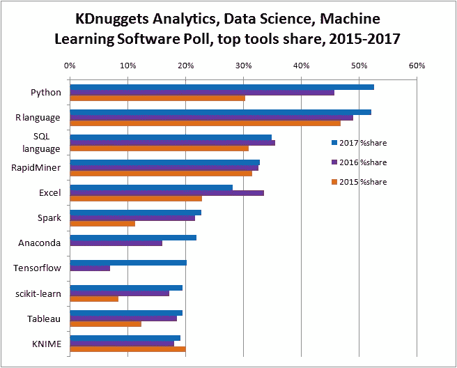

# 机器学习的绝对开端

> 原文：<https://medium.com/hackernoon/absolute-beginning-into-machine-learning-e90ceda5a4bc>

*这篇博文将帮助* ***开始机器学习的深度学习之旅。*** *我尽量让它保持简洁。*

[机器学习](https://hackernoon.com/tagged/machine-learning)是一种自动建立分析模型的数据分析方法。使用从数据中迭代学习的算法，机器学习允许计算机找到隐藏的见解，而无需显式编程去哪里寻找。本质上，它是一种教会计算机根据一些数据做出并改进预测的方法。

在过去十年中，机器学习给了我们无人驾驶汽车、实用的语音识别、有效的网络搜索，以及对人类基因组的极大了解。机器学习在今天如此普遍，以至于你可能一天用几十次都不知道。许多研究人员也认为这是朝着人类级别的人工智能前进的最佳方式。**机器学习**是 AI 的一个子集。**理论很简单，机器获取数据并为自己“学习”。**

[人工智能](https://hackernoon.com/tagged/artificial-intelligence)是机器能够像人一样做决策的一种状态。在今天的现代世界中，一台即使在最复杂和困难的环境中也完全有能力像人脑一样作出决定的机器可以说已经实现了人工智能。机器没有必要像人一样有手臂和外形。一个简单的电脑盒子也可以人工智能。

今天，人工智能的微小碎片就在我们周围。Siri 是人工智能，Alexa 是人工智能，根据房间内的人数自动关灯是人工智能。但是，当人类的思维能够被完全实现或模仿时，人工智能的完整和最终状态就会达到。这种模拟人脑的计算机会像人类一样工作，甚至可能更有效率。它会给出完全相同的答案。

**绝对初学者:**

> 如果你先从最难的事情开始，会更容易气馁和放弃，所以在学习过程中设立小的可实现的目标来保持动力。

~在我们开始学习或深入钻研 ML 之前:~

1.  **选择编程语言。**

 [## 机器学习最好的编程语言是什么？

### 克里斯蒂娜·沃斯科格鲁

medium.com](/towards-data-science/what-is-the-best-programming-language-for-machine-learning-a745c156d6b7) 

“Python 是个不错的选择”科学和数值计算(借助 NumPy、SciPy 等库。)，支持各种算法的广泛的库，并且在 ML 中有很大的社区。

2.**关于代数、微积分、概率&统计的基础数学知识:**(可选:这不是必须的，有一些关于它的基础知识会很好，因为我们可以利用像 **Numpy & Scipy** 这样的 Python 科学库，因为在学习不同的算法时，你需要对数据进行可视化&在算法的使用代数、微积分概念中使用它的属性)

 [## 线性代数|可汗学院

### 免费学习数学、艺术、计算机编程、经济学、物理学、化学、生物学、医学、金融…

www.khanacademy.org](https://www.khanacademy.org/math/linear-algebra)  [## 微积分(所有内容，第一年)|可汗学院

### 免费学习数学、艺术、计算机编程、经济学、物理学、化学、生物学、医学、金融…

www.khanacademy.org](https://www.khanacademy.org/math/calculus-home)  [## 统计和概率|可汗学院

### 免费学习数学、艺术、计算机编程、经济学、物理学、化学、生物学、医学、金融…

www.khanacademy.org](https://www.khanacademy.org/math/statistics-probability) 

3.**学习 Python 库:**:已经有*吨*的机器学习库是为 Python 编写的。一个一个学就好了。

OpenCV:有助于分析图像/视频和应用级联等等，

Numpy:有助于执行数学运算

Matplotlib:帮助在维度中可视化地绘制数学运算

熊猫:帮助收集和准备输入我们算法的数据。

*学完以上 3 个强大的库。直接跳进。*

4. **Andrew-Ng 课程**:coursera 上有一门由[吴恩达](https://medium.com/u/592ce2a67248?source=post_page-----e90ceda5a4bc--------------------------------)教授的非常棒的免费课程，这门课程是一个非常好的起点，让你了解理论上的算法和机器学习的不同概念。

 [## 机器学习|课程

### 关于这门课程:机器学习是让计算机在没有明确编程的情况下行动的科学。在…

www.coursera.org](https://www.coursera.org/learn/machine-learning) 

完成 Andrew-Ng 课程后，掌握了大量的算法理论知识。

5.**Learn Scikit-Learn Library:**(最强大的 API 之一，具有不同的算法、强大的数据编码器等)

*~现在是将理论知识运用到实践中的时候了~*

6.**我强烈建议你阅读《Python 机器学习第二版》作者** [**塞巴斯蒂安·拉什卡**](https://medium.com/u/9b6e4083c771?source=post_page-----e90ceda5a4bc--------------------------------)

 [## Python 机器学习-第二版| PACKT 图书

### 通过使用最新的尖端开源技术，用 Python 解锁现代机器学习和深度学习技术…

www.packtpub.com](https://www.packtpub.com/big-data-and-business-intelligence/python-machine-learning-second-edition) 

从不同机器学习算法和优化方法的理论(数学解释)到实际代码，涵盖了使用 Python 的各种实用算法，以及使用 Scikit-Learn API 和 Tensorflow API 重放它。

7.**小抄！！！！！！！！**

 [## 机器学习和深度学习工程师的基本备忘单

### 学习机器学习和深度学习对新手来说很难。以及深度学习库都很难…

startupsventurecapital.com](https://startupsventurecapital.com/essential-cheat-sheets-for-machine-learning-and-deep-learning-researchers-efb6a8ebd2e5) 

8.**开发 CNN(卷积神经网络)使用 TensorFlow 识别狗和猫**

9.**用 Keras 模拟自动驾驶汽车:**

10.**神经网络在 GTA-5 上的应用系列:**

这是一段非常非常漫长的旅程。很累，很烦人，而且特别费时间。如果你能完成这个列表，到最后你至少应该熟悉机器学习领域，并准备好弄清楚你下一步想学什么。祝你好运！

***~让我们来传播这种 AI 力量吧！~***

注意:*我分享的内容完全基于我在学习过程中尝试过的东西。*

***~欢迎反馈和编辑~***