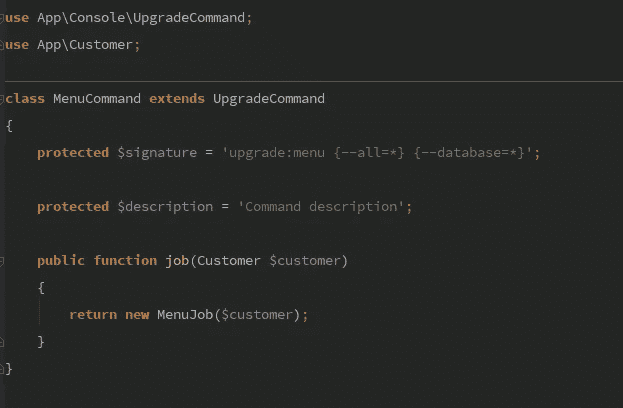

# 处理多租户上的数据迁移— Laravel

> 原文：<https://medium.com/hackernoon/abstract-upgrade-command-for-multi-tenant-71089b9a838f>



我从事的一个项目有时需要对所有客户的数据进行更改。因为每个客户都有自己的数据库，所以我们最终总是会编写一个脚本来在整个客户群中运行它。

在这些脚本开发过程中，另一件常见的事情是，您希望首先为特定的客户运行(测试数据库)，在为每个客户推广之前看到结果。在本文中，我将展示如何构建一个抽象命令来简化这些过程。

## 1-抽象命令

抽象命令将是真正实现`handle`方法的命令。它包括为特定的*租户*运行一个作业(同步),或者为每个*租户分派一个作业。*这允许在测试期间立即检查脚本的结果，同时能够在准备推出时运行多个工作线程来并行处理每个*租户*。

## 2-具体命令

一个具体的命令必须做两件事:

*   设置命令签名；
*   实例化要执行的作业；

以下代码片段是一个示例，说明创建新的升级命令是多么简单。

## 3-抽象的工作

就像 upgrade 命令一样，每个作业类都会有一些我不想复制的代码。让我们将所有这些提取到一个抽象的作业中。这项工作的职责是:

*   确保提供了租户。
*   在数据库事务中运行迁移过程。
*   定义仅尝试一次的次数。

如果您想了解我是如何建立数据库连接的，请查看本文:[使用 Laravel 的多租户](https://hackernoon.com/simple-multi-tenancy-with-laravel-b3f84fc13c39)。

## 4-具体工作

具体的工作应该扩展抽象(显然)并实现`run`方法，该方法应该包含数据迁移逻辑。

## 5-结束它

要让一切正常运行，只需确保在`App\Console\Kernel.php`类上注册`commands`，并通过 artisan 运行它。

```
php artisan upgrade:menu --database=my_test_database
```

一旦脚本准备好上线，就用`--all`旗运行它，并让工人们起来。

```
php artisan upgrade:menu --all
php artisan queue:work
```

当然，你总是可以运行多个`queue:work`来并行运行它。