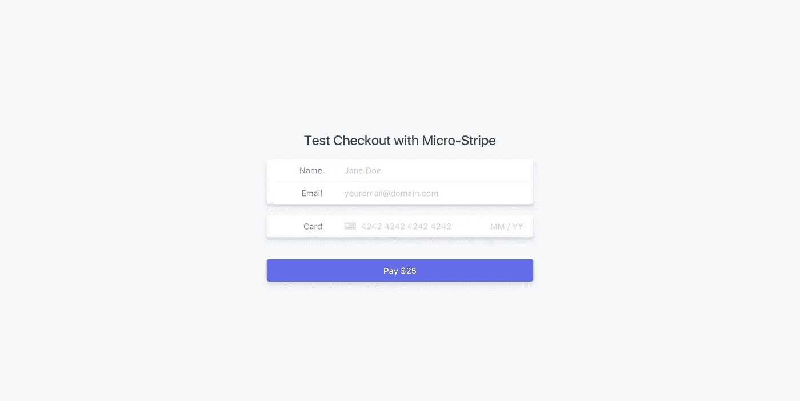
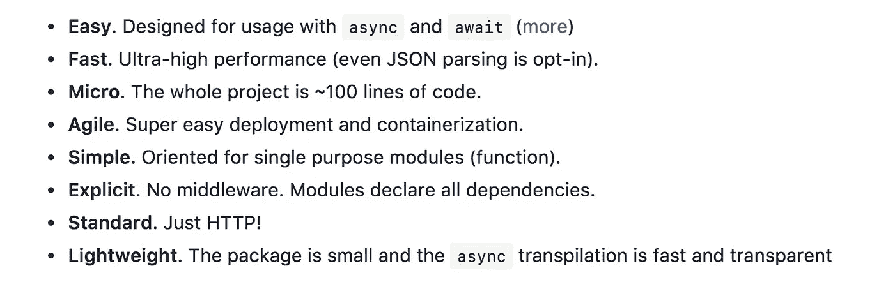
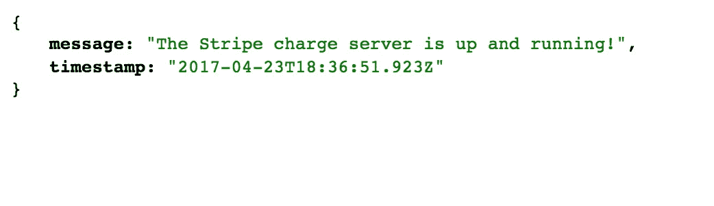
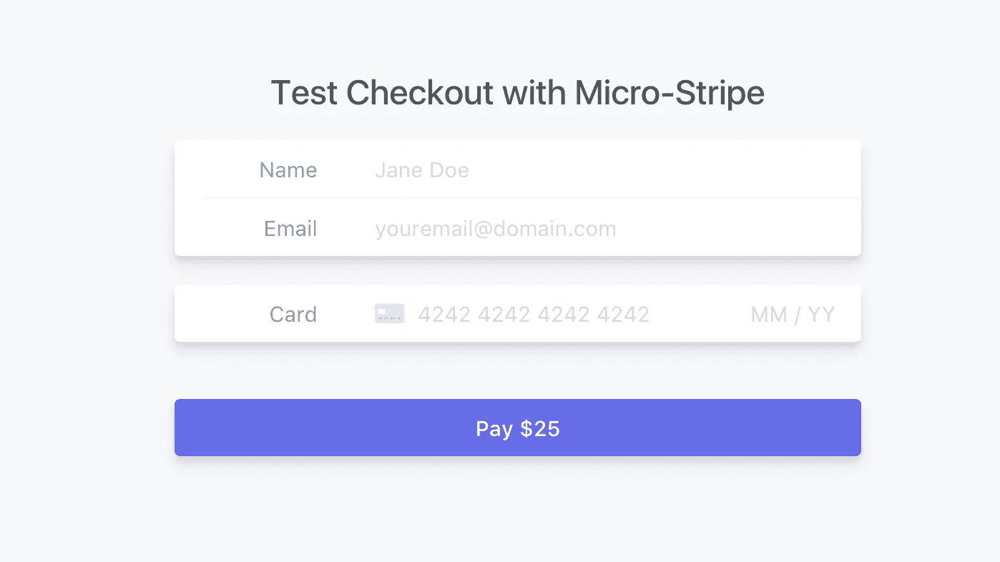
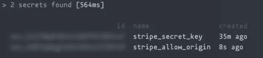
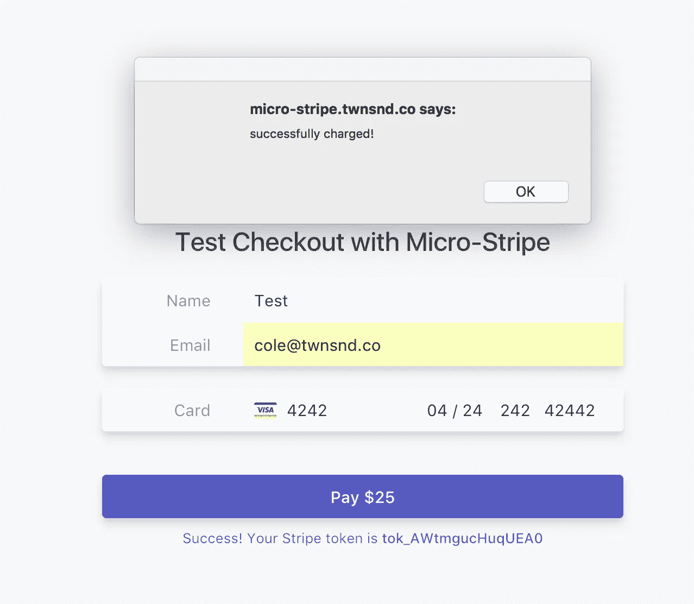

# 使用 NextJS、Stripe 和 Micro 在您的网站上接受付款

> 原文：<https://medium.com/hackernoon/accept-payments-on-your-site-with-nextjs-stripe-and-micro-371de95b22d5>

我经常创建小的副业项目，我想为单一产品收费。你可以制作自己的 stripe 服务器，而不是付费使用 Plasso 或 Gumroad！在本教程中，我将带您了解如何在您的应用程序或网站中添加支付表单。你将最终拥有一个由 Zeit 的 [micro](https://github.com/zeit/micro) 和一个功能性支付表单构建的条纹收费服务器。

## 示例:

*   [](https://micro-stripe.twnsnd.co/)**[为前端来源](https://github.com/ColeTownsend/micro-stripe-charge-example)**
*   **[**https://micro-stripe-api.twnsnd.co/**](https://micro-stripe-api.twnsnd.co/)，[来源为 api](https://github.com/ColeTownsend/micro-stripe-charge-example)**

****

**built using Stripe Elements — [**https://micro-stripe.twnsnd.co**](https://micro-stripe.twnsnd.co/),**

## **为什么条纹元素和微？**

**stripe[**Elements**](https://stripe.com/docs/elements)是一系列处理敏感卡片信息的嵌入式 UI 组件。如果你想在不使用 Plasso 或 Gumroad 等第三方服务的情况下收集支付信息，这是你最好的选择。**

****Micro** 是一个用 NodeJS 编写的瘦服务器:**

****

**这两个应用程序我们都将通过 Zeit 的服务 [**部署，现在**](https://zeit.co/now) **，**一个命令行工具。你需要一个 Zeit 账户，设置它不会花太多时间。然后，安装 cli `npm install -g now`。然后运行`now --login`。关于现在设置的更多信息:[https://zeit.co/now#get-started](https://zeit.co/now#get-started)。**

# **入门指南**

**首先，我们要设置我们的条纹支付服务器。这就是我们将使用包含条纹收费`token`的表单发出`post`请求并实际对卡收费的地方。创建一个类似`my-stripe-app`的应用程序文件夹，并在其中创建第二个名为`api`的目录:**

```
mkdir my-stripe-app && cd $_mkdir api && cd $_yarn init
yard add dotenv micro stripe
```

**关于我们的依赖性:**

*   ****dotenv** 是我们的环境变量(条带令牌)**
*   ****微**是我们的服务器**
*   ****stripe** 处理收费令牌和创建收费，并且是 Stripe API 的包装器。**

**创建一个名为`index.js`的文件，这是现在默认运行的文件。我们将从`micro`包中导入两个模块:`send`和`json`。`Send`让我们的服务器`send`做出响应，`json`让我们的服务器解析从前端应用程序的`post`请求中收到的`json`数据。**

## **邮报**

**这里需要的一个文件我们还没有:`post`。我们的大部分 post 请求和服务器逻辑将驻留在那里。继续在与`index.js`相同的目录(`/api)`)中创建一个`post.js`文件。**

**在`Post`中，我们正在导出一个接受输入函数的函数。这一点主要是建立在罗慕洛阿尔维斯的`[micro-post](https://github.com/romuloalves/micro-post)`上，但我需要更多一点的定制。我们只想接受来自我们指定域的`get`和`post`请求和`cross-origin`头，以确保安全。我们将为此使用一个`[secret](https://zeit.co/docs/features/env-and-secrets#config-files)`,这样我们就可以动态地改变它。**

***注意:我已经添加了* `*GET*` *方法，所以我们有一些指示我们的服务器正在运行的指标。你不需要这个。***

**在命令行中，运行`now secret add STRIPE_ALLOW_DOMAIN 'your-domain-here.com'`。我们将在将来将它设置为其他名称，这样您现在就不需要有一个确切的域。**

***注意:你可以用星号* `*'*'*` *将它设置为任何原点，但这并不可取，因为这会使服务器易受 XSS 攻击。因为这个服务器只接受 2 个请求，并且依赖于 Stripe，所以可能没问题，但只是暂时用于测试目的。***

## **立即部署“/api”**

**我们需要一些键来与 Stripe 的 api 交互。我们将使用`Now`存储我们的密钥。运行`now secret add STRIPE_SECRET_KEY sk_test_XXXXXX`，其中以`sk_test`开头的第二个值是您的 stripe 仪表板中的完整测试密钥。登录后，您可以在[https://dashboard.stripe.com/account/apikeys](https://dashboard.stripe.com/account/apikeys)找到该值。**

**然后在你的`/api`目录下创建一个`.env`文件。这里，我们希望为条带密钥以及我们希望允许的域添加别名。**

```
STRIPE_SECRET_KEY=@stripe_secret_key
STRIPE_ALLOW_DOMAIN=@stripe_allow_domain
```

**运行`now deploy --dotenv`来部署您的 api。访问您的域名。您应该会看到如下所示的内容:**

****

**https://micro-stripe-api.twnsnd.co**

**如果您在这一步有任何问题，请留下您的评论或发微博给我！**

# **创建前端表单**

****

**Stripe Elements library is pretty — [https://micro-stripe.twnsnd.co/](https://micro-stripe.twnsnd.co/)**

**我们的前端将处理表单输入和令牌创建。这个例子使用了全新的[条纹元素](https://stripe.com/docs/elements)，它允许你定制你的输入，但是获得了错误检查和安全的好处。**

**对于这一部分，我主要是复制 Stripe 的元素示例。在这里，我不会分解前端，而是引导您找到一个可以复制的要点。**

**在你的`/my-stripe-app`文件夹`cd app`中创建一个`/app`目录，并创建一个`index.html`来复制[要点](https://gist.github.com/ColeTownsend/2c2dbc1be1ae660c35b23cc9de9828df)。我们现在要编辑位于`index.html`文件底部的`<script>`标签中的 javascript charge 函数。我复制了下面的脚本:**

## **修改数据收集脚本**

**我们需要做一些事情来定制收费。**

1.  **将*条纹公共测试密钥*更改为在[https://dashboard.stripe.com/account/apikeys](https://dashboard.stripe.com/account/apikeys)找到的您自己的条纹公共测试密钥。**
2.  **将`createCharge`函数中的 *API url* 替换为您已经部署的 API url**
3.  **将`Authorization Bearer`中的*条带公共测试密钥*改为自己的。**
4.  **将`data`更改为您选择的充电方式。Stripe 要求美分作为`amount`，所以无论你想要多少美元，100 美分都可以。在这个例子中，我选择了`2500`，或者 25 美元。**

## **部署前端并将其绑定到我们的 API**

**对于这个部署，我们不需要任何包或特殊命令！运行`/app`目录下的`now deploy`，将这个应用部署到自己的 url。**现在**自动将此 url 复制到您的剪贴板。把它放在那里，因为我们下一步需要它。**

**将静态站点的域复制到剪贴板，运行`now secret rm STRIPE_ALLOW_DOMAIN && now secret add STRIPE_ALLOW_DOMAIN 'your-deployed-domain.now.sh'`确保粘贴静态站点 URL，其中*your-deployed-domain . now . sh .*包含单引号。**

**让我们仔细检查一下我们的钥匙。运行`now secret ls`。您应该看到终端输出，您的秘密存储在`Now`上。**

****

**This is the sort of output you should see.**

**前往你的前端领域(我的是在[https://micro-stripe.twnsnd.co](https://micro-stripe.twnsnd.co/))并尝试测试！您可以使用未来任何到期日、任何安全代码和任何邮编的测试信用卡`4242 4242 4242 4242`。你的测试付款应该出现在[你的仪表板](https://dashboard.stripe.com/test/payments)上。我还添加了一个警告，让人痛苦地明白这项服务是有效的。**

****

# **有问题吗？造点牛逼的东西？**

**在 twitter [@twnsndco](https://twitter.com/twnsndco) 上联系我，我会很乐意帮助你或者给你指出有用的文档。**

**[](http://bit.ly/HackernoonFB)****[](https://goo.gl/k7XYbx)****[](https://goo.gl/4ofytp)**

> **[黑客中午](http://bit.ly/Hackernoon)是黑客如何开始他们的下午。我们是阿美族家庭的一员。我们现在[接受投稿](http://bit.ly/hackernoonsubmission)并乐意[讨论广告&赞助](mailto:partners@amipublications.com)机会。**
> 
> **如果你喜欢这个故事，我们推荐你阅读我们的[最新科技故事](http://bit.ly/hackernoonlatestt)和[趋势科技故事](https://hackernoon.com/trending)。直到下一次，不要把世界的现实想当然！**

****