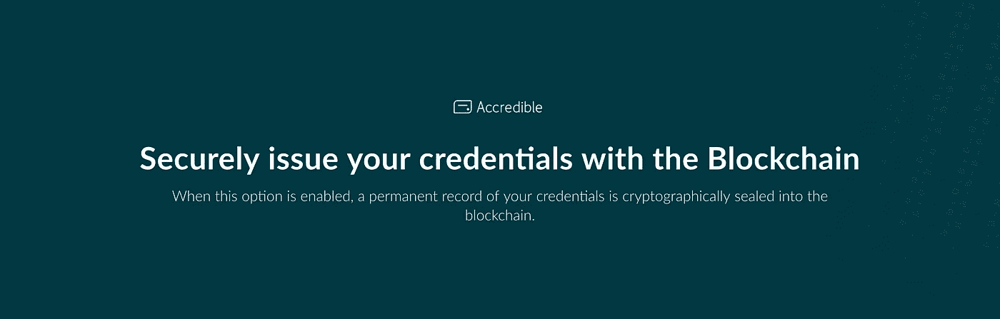
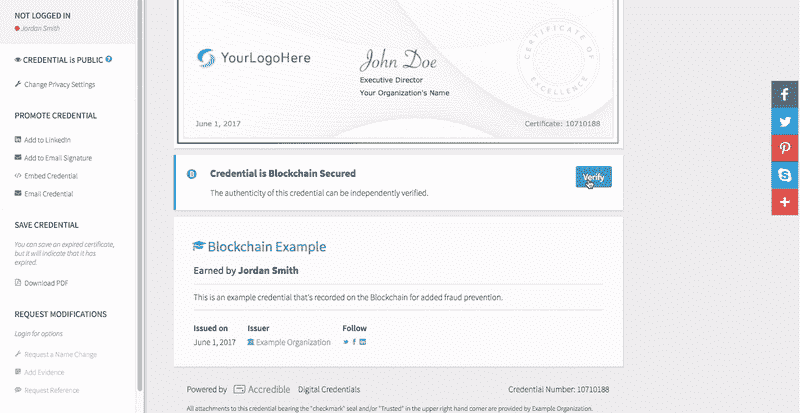
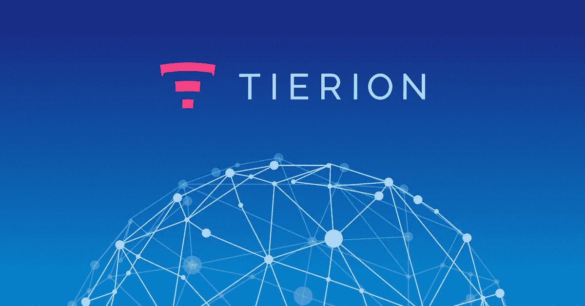

# Accredible 使用区块链来保护凭证免受欺诈

> 原文：<https://medium.com/hackernoon/accredible-uses-tierion-for-blockchain-verifiable-credentials-633c82b6ec9d>

Accredible 使得颁发和管理[数字证书](http://accredible.com)如文凭和专业证书变得容易。[可认证](http://accredible.com)使用 Tierion 创建[可验证的凭证](http://learn.accredible.com/securely-issue-your-credentials-with-the-blockchain)，这些凭证被加密密封到[区块链](https://hackernoon.com/tagged/blockchain)中。任何查看可认证证书的人都可以绝对肯定记录没有被篡改，这为欺诈提供了一个铁证。

> “我们爱提利昂。我们需要找到一个可扩展的解决方案来通过区块链颁发证书，但是随着我们探索我们的选择，我们越来越担心高昂的技术和资金成本。提利昂是完美的解决方案。从最初的实施到推广，一切都完美无瑕。”
> - **首席技术官艾伦·赫本斯塔尔**

## 可认证的区块链可验证凭证

View an [example Accredible credential](https://www.credential.net/blockchn)

Accredible 是一个典型的 [Tierion](http://tierion.com) 客户。凭证是使用 Mozilla 的 [Openbadges](https://openbadges.org/) 标准发布的。通过整合 Tierion，Accredible 能够轻松增强其现有产品的安全性。

了解更多关于 Accredible 的[区块链可验证证书](http://learn.accredible.com/securely-issue-your-credentials-with-the-blockchain)。在[推特](https://twitter.com/accredible)上关注可认证者

# 铁离子网络

在不久的将来，像 T21 和微软这样的公司将会在 Tierion 网络上运行节点。总的来说，它们将形成一个全球性的“证据引擎”,保护全世界的数据。了解更多关于 Tierion 网络的信息下载我们的白皮书。

