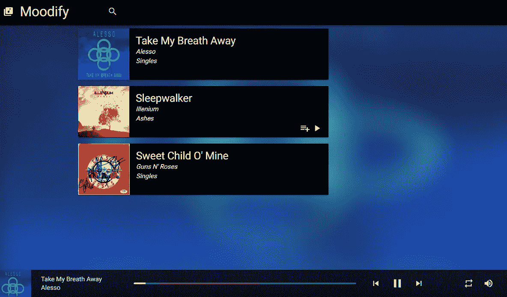
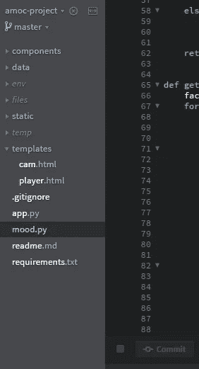
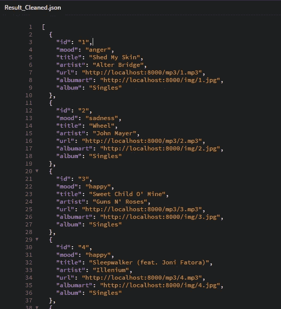
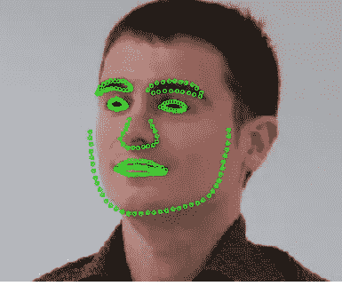
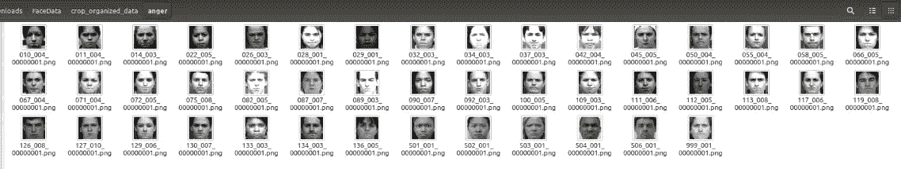

# 代码 2k17 的 ACM 月:构建修改

> 原文：<https://medium.com/hackernoon/acm-month-of-code-2k17-building-moodify-d5d9e0c52ca7>

Moodify in action

三月是一个收获颇丰的月份，这都要归功于 NIT Surat 学生分会计算机械协会举办的这次大型活动。基本上在一个月内完成你能做的，并在演示中展示出来。关键是所有方面的创新和实现，包括编程、设计甚至代码本身。

这个想法(是丹努什想出来的)是一个应用程序，它可以从拍摄的照片中识别你的情绪，并在音乐播放器中生成一个合适的播放列表。很漂亮，是吧？

# 履行

一开始，我们实际上迷失了很长一段时间，因为这个想法使用了较少记录的技术，当然我们也没有教程可以遵循。但是经过研究和实验，我们决定使用 ***OpenCV*** 和 Python 来创建可以从捕获的图像中提取情绪的脚本，并且由于编码已经用 Python 开始， ***Flask*** 被选为框架，用于将所有这一切包装为 WebApp。

# 网络应用

开发工作被分成多个部分，像照相机、音乐播放器和处理路线和数据库的服务器。所以前端用 ***AngularJS*** 编程，给它一个 app 似的流程，而 UI 设计在***Materialize***CSS 库之上。

谈到单个组件，

The Camera and the Music Player

*Camera* : WebcamJS 主要用于处理只有前端的 cam，生成的 base64 图像传入服务器。

*音乐播放器* : SoundManager 2 API，使用 AngularJS 实现，用于处理音频文件

服务器:这是一个基本的 Flask 服务器，它连接到 MongoDB 数据库并处理路由。这个应用程序的基本路线是:

*   **/index** : 重定向到 Cam-app 的主路径或初始路径
*   **/cam** :链接到相机，保存快照到服务器
*   **/player** :链接到音乐播放器，也从 URL 中获取情绪作为参数，以便从 DB 中仅获取情绪特定的歌曲。
*   **/emotion** :运行一个 python 脚本，该脚本使用 snap in server 提取情绪并返回其值
*   **/songs** : GET 请求 MongoDB 返回歌曲的 JSON 数据

WebApp file structure and Database JSON data

# 应用程序流程

你从/ **相机**开始，在那里你可以拍照、重拍并继续拍摄。这基本上是将快照保存到服务器，并转到 **/emotion** 路由来调用 Python 脚本，该脚本提取情绪并将其返回，重定向到/ **播放器**，并将情绪作为参数。/ **播放器**用情绪参数调用 **/songs** ，根据生成的情绪返回歌曲。这显示在音乐播放器中。

# 情绪识别

好吧，这部分不完全是我的，但我会试着用我理解的方式简单地解释一下。基本上，/ **emotion** route 从 cam 获取图像并将其存储在服务器中，情绪识别脚本在服务器上运行。

该脚本最初优化图像，以便最准确地进行检测，基本上只是将图像裁剪到脸部，然后转换为灰度。现在图像已经准备好了，OpenCV 分析轮廓并检测面部的特征或标志，如图所示。

Detecting facial landmarks

使用这些数据，加上机器学习，可以识别情绪。模型是通过在很多面上训练而成的。显示相同情绪的多张脸被作为训练数据输入，因此当它得到一张新脸时，它可以识别最接近的情绪。

Training data for anger mood

这是通过使用 OpenCV 实现的，更准确地说，是用于面部识别的 Haar 级联和用于面部标志分析的 dlib 预测器。

# 项目和开发商

项目的官方资源库:

 [## ajayns/amoc 项目

### amoc-project - Moodify:从面部识别情绪，在音乐播放器中生成合适的播放列表

github.com](https://github.com/ajayns/amoc-project) 

开发者:

 [## 阿杰恩斯

### ajayns 有 14 个可用的存储库。在 GitHub 上关注他们的代码。

github.com](https://github.com/ajayns)  [## 达努什卡马特(丹努什卡马特)

### dhanushkamath 有两个可用的存储库。在 GitHub 上关注他们的代码。

github.com](https://github.com/dhanushkamath) 

此外，随时联系我在 ajay.ns@outlook.com，检查我的 [GitHub](https://github.com/ajayns) 。如果你觉得有用，请推荐并分享我的帖子。