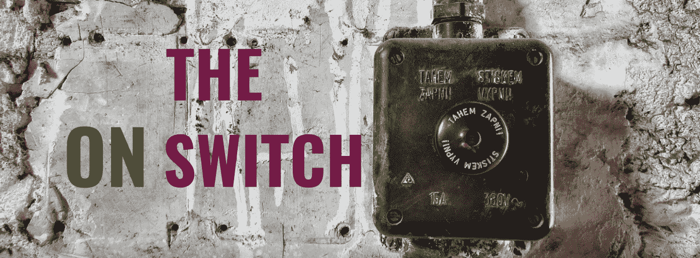
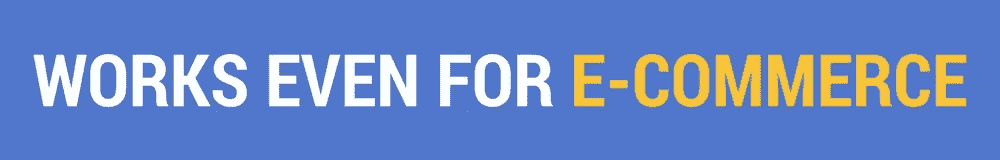

# 获取和保留。你错过了什么？

> 原文：<https://medium.com/hackernoon/acquire-retain-what-are-you-missing-out-on-6b92a0b46c64>

## 商业都是关于货币化。所以保留是有意义的。获得越来越多的客户是发展的必然要求。少了什么？

Did you turn on your acquired base? ([img](https://unsplash.com/photos/PpclG3HFh5s))

激活。这就是所缺少的。

企业面临的最大问题是，他们的转换漏斗在顶部不相称地宽。顶部总是最宽，这确实是事实(*这就是为什么它被称为漏斗*)。但是你应该始终致力于尽可能减少泄漏。

作为一名企业家，你应该始终关注转化率的最大化——从点击转化为潜在客户，从潜在客户转化为注册用户，从注册用户转化为付费消费者。每个阶段的放弃都是业务流程的一部分。但是一旦我们有了付费消费者，我们的重点就转移到留住这些消费者，让他们进行更多的交易，增加 ARPU 等等。漏斗还在继续。但是你失去的那些呢？当你看到大多数企业开展的重新定位活动时，你会发现他们的重点是让过去的消费者一次又一次地回来交易。一方面，这是有意义的——与新的潜在客户相比，已经与你交易过的人再次交易的门槛相对较低。另一方面，每一次你未能进入付费用户阶段的点击都会增加你获得付费用户的成本——破坏你的 LTV/CAC 比率。所以，也要注重激活那些潜在的消费者。

那么，如何增加这一点呢？

# 一直都是。

无论你从事哪一行，都要遵循领先的 SaaS 企业所采用的方法。如果你观察任何一家 SaaS 企业，你都会发现类似的模式。

*   他们不总是推销他们的产品，而是花时间推销对他们的观众有价值的内容。*白皮书、电子书、战略指南等。*这在三个方面帮助了他们:

1.  更高的转化率。这些*免费*商品被他们的潜在消费者视为增加了商业价值，他们最终提供了联系信息以获得这一赠品。*毕竟，有一个很好的理由，这些被称为“***。”**
2.  *他们提供的内容符合这些目标企业应该采取的经营战略，在提供这些提示和建议的同时，SaaS 企业将强调和展示他们的产品如何帮助他们的客户轻松做到这一点。*这有助于正确引导受众从潜在客户转变为免费用户。**
3.  *因为他们有了线索，他们现在可以在这里采用一个良好的滴灌营销策略，以帮助在更高的转换数字。*

*   *他们有一个免费的计划——但有限制。*
*   *然后他们会尝试激活你的保费计划。*

*以任何成功的 SaaS 企业为例，你都会注意到同样的趋势。这是因为这个策略对他们所有人都很有效。让它适应你的业务——以一种符合你的垂直市场和受众类型的方式修改它。*

**

*是啊。乍一看这似乎很荒谬，但是不管你从事哪一行，你都可以遵循类似的策略。我举电子商务的例子是因为认为这种策略对电子零售商有用是最可笑的，不是吗？*

*毕竟:*

*   *你可能推广什么内容？*
*   *免费计划？什么免费计划？你不会给他们提供免费产品的！*

*这就是修改部分的由来。*

*你的意图很简单，分三步走:*

1.  *使用销售线索磁铁来最大化点击与销售线索的比率。(*甚至可能增加你广告的点击率*)。*
2.  *获得这些线索，让他们开始考虑有朝一日成为付费客户*(*有点类似于 SaaS 产品*的免费计划用户的心理)。**
3.  **让他们交易。**

# **所以。我们举个例子。家具零售商。**

## **#第一步:销售线索磁铁**

**购买家具是一个漫长的过程——一个涉及到很多考虑、计划和思考的过程。因此，如果我们想抓住哪怕是一个潜在的客户，转化率也会非常低。但是我们能提高这个百分比吗？**

**当然可以。让我们将消费者引向装饰理念、主题和灵感，而不是购物。向他们展示名人住宅的创意，用很酷的复古主题来装饰他们的家，用很少的钱建造一个看起来很棒的家。这里有很多想法。挑几个，疯狂实验。**

## **#第二步:订婚**

**既然你已经知道是什么让你的潜在消费者热血沸腾，那么这个阶段对你来说就比较容易了。给他们更多相同主题的内容。向他们展示你是如何帮助他们获得迷人的外表，而不必舍弃一只手和一条腿。让你的名字成为他们潜意识中的知名人物。**

**如果可以的话，给他们提供个性化的家居装饰建议。**

## **#第三步:购买**

**如果你做得很好，你会很容易地看到最终与你进行交易的消费者数量增加了至少 50%。这就是你在任何情况下都渴望的。**

**奖金？与您之前的客户群相比，这些消费者的 LTV 要高得多，因为对于这些消费者中的许多人来说，您的品牌回忆甚至比您最好的广告活动所达到的要高得多。**

**所以去吧。想想作为一个 B2B SaaS 销售业务，并获得好处。如果你有任何问题，请联系我，我会帮你解决的。**

# **今天到此为止；明天见。**

******

Click here to join the mailing list.**