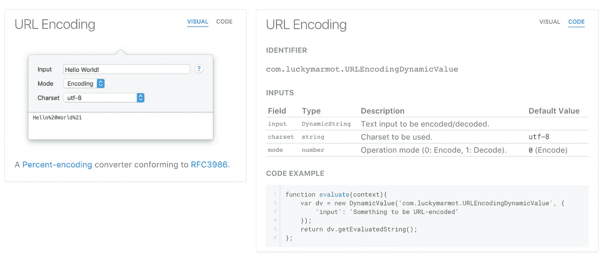

# 适应性现代产品文档

> 原文：<https://medium.com/hackernoon/adaptive-modern-product-documentation-7d792fd8696d>

## [Sphinx](http://www.sphinx-doc.org/en/stable/) 和 [React](https://facebook.github.io/react/) 加入团队，推出丰富的文档解决方案

Sphinx 是一个众所周知的非常强大的文档引擎，在 Python 社区中广泛使用。Sphinx 通常用于从一组用 reStructuredTEXT 编写的源文件中生成一组静态 HTML 页面。

对于那些不熟悉它的人来说，reStructuredTEXT 与 Markdown 相似，但是它增加了嵌套的概念。Sphinx 将这些嵌套对象称为指令，每个指令都可以接受一些选项和子内容。在我们的文档中，我们有很多使用定制指令来驱动独特的 UI 和逻辑组件的例子。每个这样的指令都可以接受一些定制的配置，用于管理它的呈现。例如，下面是我们的 HMAC 动态价值的来源。

使用了 4 种不同的自定义指令:

*   `dv`(动态值)这需要 2 个子组件来继承我们的自定义`tab`指令。
*   `dvvis`是管理可视选项卡的指令(见左下方)，这需要一个数字。
*   `dvspec`是一个更复杂的选项卡组件，呈现在右下方。

这个系统的强大之处在于，每个指令的描述可以依次包含自定义指令，父指令不需要知道，除非它需要修改或解析它。这里的`figure`指令描述包含一个链接项，图形渲染方法可能不需要考虑这一点，它只是将描述视为指令的一个子元素，这将被正常渲染，这让我们可以根据需要在这里添加任何自定义内容。

上面我们已经看了一些自定义指令，但是我们如何设置这些 Sphinx 扩展呢？

如果还需要渲染 Sphinx 默认提供的经典 HTML 版本，还需要添加一些函数来支持`TabFrameNode`的渲染。对于我们的 React 解决方案，我们创建了一个组件，它映射到这个`TabFrameNode`类，并在 React 应用程序在 AST 中遇到这个节点时被呈现。

为了允许我们在 React 中呈现这些文档，我们需要传递 Sphinx 在将其呈现到 HTML 页面之前使用的 AST。这是在[定制构建脚本](https://gist.github.com/hishnash/933ce146289faf88dd633c249eb5f228)中完成的。该脚本为每个文件生成 AST 的 JSON 转储，这些文件被上传到亚马逊 S3 桶，然后通过 AWS AWS CloudFront(一种 CDN 服务)提供给客户端。当用户浏览文档时，单页面应用程序会在需要时从 CloudFront 获取所需的 JSON ASTs。

在 React 中渲染 AST 是一个非常简单的过程[当保存 AST](https://cdn-docs.paw.cloud/v3-32-g40c79c0/dynamic-values/encoding_crypto.json) 到 JSON 时，对应的 Python `class`和`module`被保存到树中每个`Node`的 JSON 对象中。在 React 应用程序中，建立了一个映射，将`module.class`映射到一个组件。

A Code Block example from the AST, note the attributes on the literal_block object these are parsed to the LiteralBlock component.

每个组件呈现它需要的东西，然后通常呈现出子组件。在我们的例子中，我们让每个组件从基类`Node` [组件](https://gist.github.com/hishnash/fb676e226ff0f28fcc9e8b9ea7708515)继承。

The bulletList component just adds a <ul> around its children.

由于页面的内容是作为这个 AST 的一个功能直接管理的，所以我们可以很容易地从 docs 页面添加和删除内容，而不需要部署或接触我们的前端代码库。因此，我们可以通过添加一个`?version={versionid}`作为页面的 URL 参数来查看不同版本的文档，甚至在开发模式下，我们可以添加`?debug=True`来强制页面从本地服务器加载内容。作为一个例子，这里有一个我已经部署的文档的定制版本，只是为了说明这篇博客文章。请在以下位置查看此示例:

> [https://paw.cloud/docs/demo/blog?version=v3-46-g15005e7](https://paw.cloud/docs/demo/blog?version=v3-46-g15005e7)。

这个页面的源代码可以在[这里](https://gist.github.com/hishnash/43fedeb24db39e0f9ae9f3b777427cd3)找到。

我希望你对这篇文章感兴趣，在接下来的一年里，我将离开 Paw 团队，专注于为 macOS 开发其他专业级开发人员工具。

> [黑客中午](http://bit.ly/Hackernoon)是黑客如何开始他们的下午。我们是 [@AMI](http://bit.ly/atAMIatAMI) 家庭的一员。我们现在[接受投稿](http://bit.ly/hackernoonsubmission)，并乐意[讨论广告&赞助](mailto:partners@amipublications.com)机会。
> 
> 如果你喜欢这个故事，我们推荐你阅读我们的[最新科技故事](http://bit.ly/hackernoonlatestt)和[趋势科技故事](https://hackernoon.com/trending)。直到下一次，不要把世界的现实想当然！

