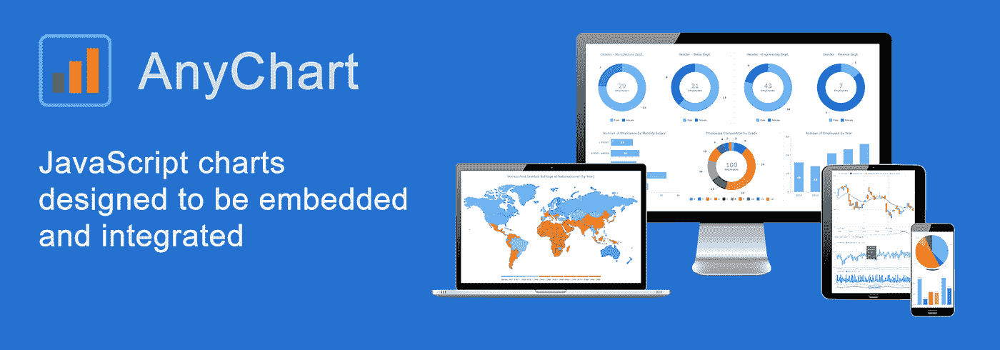
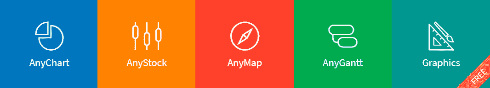
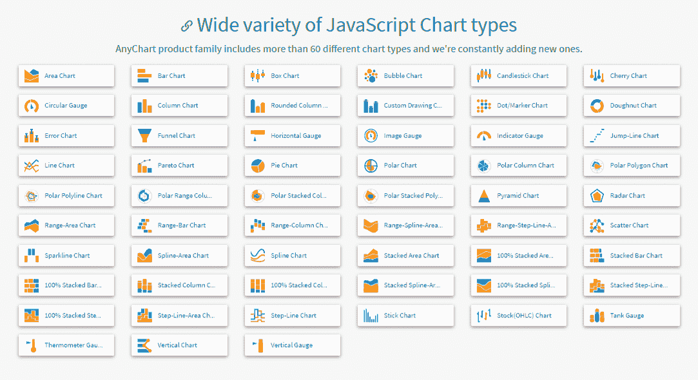
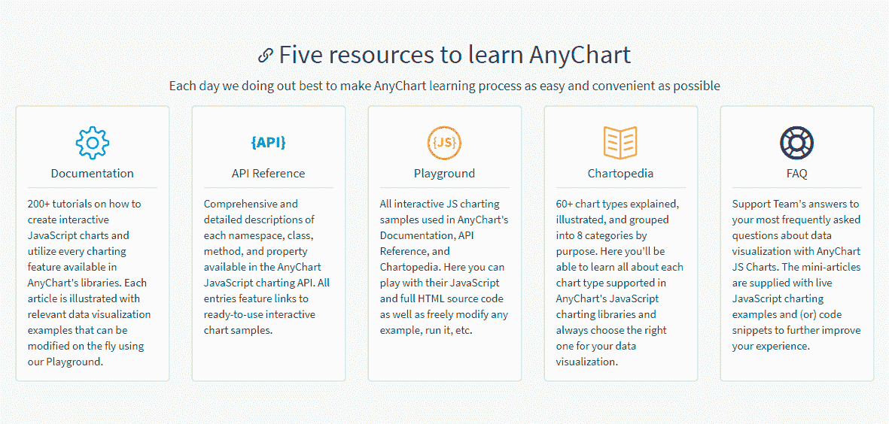
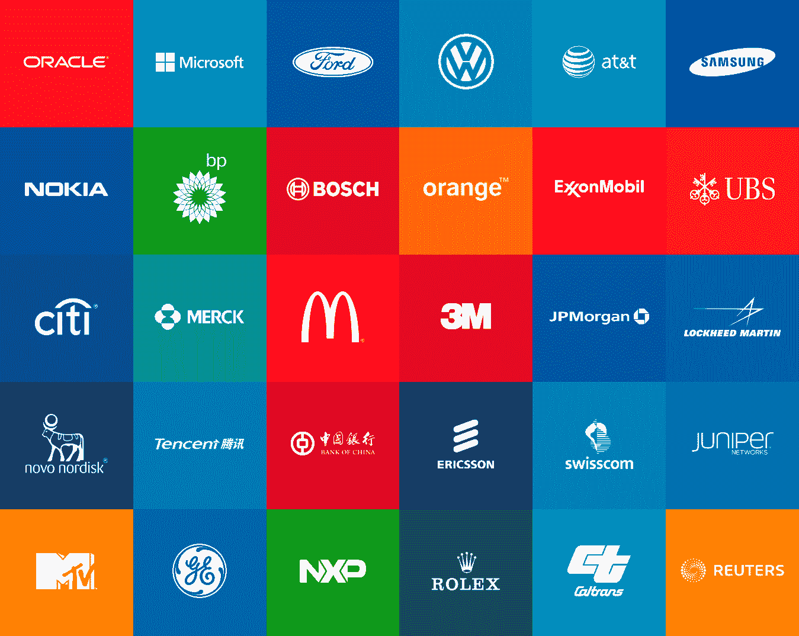
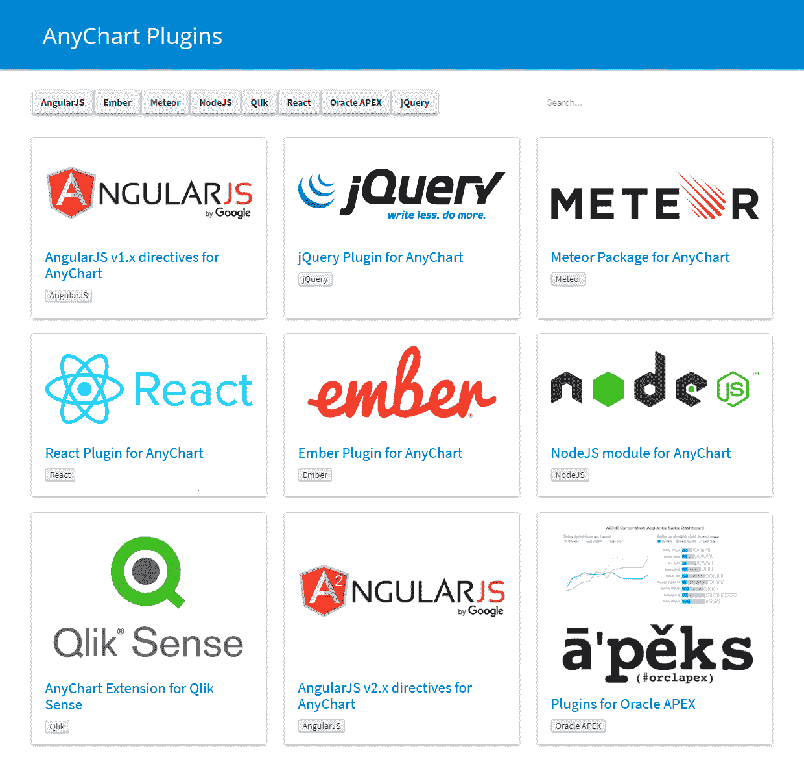

# 向您的应用程序添加跨浏览器和跨平台的交互式图表、仪表盘、图形和地图

> 原文：<https://medium.com/hackernoon/add-cross-browser-and-cross-platform-interactive-charts-dashboards-graphs-and-maps-to-your-13079bc7aaef>

[**AnyChart**](https://www.anychart.com/?) 是一个灵活的 [JavaScript](https://hackernoon.com/tagged/javascript) (HTML5)为基础的解决方案，允许您创建交互式和好看的图表。这是一个跨浏览器和跨平台的图表解决方案，面向处理仪表板、报告、分析、统计、财务或任何其他数据可视化解决方案的每个人。AnyChart 适用于任何地方，包括 PC、MAC、iPhones、iPads 和 Android 设备，帮助企业将运营数据转化为可操作的信息。

[**凯文·威廉·大卫**](https://twitter.com/kwdinc) 采访了 [**安东·巴兰楚克**](https://www.linkedin.com/in/antonbaranchuk/) 首席执行官 [**Anychart**](https://siftery.com/anychart) 了解更多。

## 嗨，安东，告诉我们你正在做什么？

我们正在构建一个用于交互式数据可视化的通用引擎，以允许从任何数据轻松创建任何图表、地图和仪表板，并确保它们在任何 web 项目、任何平台和任何浏览器中的外观和感觉都非常棒。

事实上，这就是核心的 AnyChart 解决方案，一个强大的功能丰富的 [**JavaScript**](https://siftery.com/javascript) 图表库，可以无缝地与所有主要的技术栈和数据库一起工作。你可以使用它来构建任何基于 [**HTML5**](https://siftery.com/html5) 的定制 dataviz，将其原生嵌入到网站、企业应用、移动项目、SaaS 或任何种类的 OEM 产品中。

目前，我们将 AnyChart JS 图表作为一个产品系列进行销售，该产品系列由较小的、特定用途的 JavaScript 图表库组成: [AnyChart](https://www.anychart.com/products/anychart/overview/) 用于基本图表， [AnyStock](https://www.anychart.com/products/anystock/overview/) 用于基于日期/时间的可视化，包括但不限于股票和金融图形， [AnyMap](https://www.anychart.com/products/anymap/overview/) 用于地理图和座位图，以及 [AnyGantt](https://www.anychart.com/products/anygantt/overview/) 用于项目甘特图、资源图和 PERT 图。但本质上，它是一个基于我们自己的获奖开源库的通用数据可视化工具。

## 请多告诉我一些你想解决的问题？

如果我们从图形和数据的角度考虑数据可视化，这似乎是一件非常简单的事情。对于特定于一种或另一种编程环境的开发人员来说，有许多组件，因此在 VB、Visual C 等等中创建条形图或饼图从来都不是什么大问题。然而，当涉及到企业信息系统、公司报告、分析和商业智能时，情况就复杂多了。一般来说，开发人员事先并不知道在数据方面会发生什么样的确切情况:正确或错误的数据、小或大的数据等等。与此同时，向查看者提供清晰、明确的图片是至关重要的，在这些图片上，数据才是真正能说话的。那是我们从一开始就接受的惊心动魄的挑战。

我的意思是，好吧，任何人都可以找到一种方法，在特定的视觉或编程环境中，基于特定的数据来构建特定的图表。我们 AnyChart 一直在构建的是一个先进、全面的数据可视化解决方案，可以基于任何环境中的任何数据创建任何图表。这正是企业为其多种多样的数据注入活力所需要的，而我们正是来为他们卸下数据可视化的全部负担的。事实上，AnyChart 是为用任何数据创建任何图表而设计的。

## 你是怎么开始的？你的简史是什么？

我们从 2003 年开始，在那个时代 [**Adobe Flash**](https://siftery.com/adobe-flash) 和 XML 的开端。我们意识到可以从任何来源提取 XML 格式的数据，然后将其显示为基于 Flash 的图表，然后在 AnyChart 中实现了这个想法。Flash 无处不在，所以 AnyChart 作为一个万能的数据可视化工具获得了成功。

在 Flash 不再是一个普遍使用的环境后，我们添加了 SVG 支持，发布了我们的 JavaScript 图表库的第一个版本，并完全转向 HTML5 数据可视化。我们仍然在我们的图表组件中支持 Flash，但这部分工作已经很小了，并且随着越来越多的客户坚持使用 HTML5(现代网络的主干技术),这部分工作还在继续减少。

## 谁是你的主要竞争对手& any chart 与市场上已有的产品有什么不同？

我们的主要竞争对手是 [**Highcharts**](https://siftery.com/highcharts) ， [**amCharts**](https://siftery.com/amcharts) 和 [**FusionCharts**](https://siftery.com/fusioncharts) 仍然在蚕食我们的目标受众，即 web 开发人员和数据专业人员，只是还没有。

AnyChart 的关键优势足够清晰，肉眼就能看出来。我们用于数据可视化的 JavaScript 库独立于平台、浏览器、数据库和技术框架。它们支持大量开箱即用的重要而独特的功能:数据映射和 all in all 多个选项来[处理数据](https://docs.anychart.com/Working_with_Data/Overview)(在 JavaScript API、XML、JSON、CSV、Google 电子表格和 HTML 表格中)、众多的[图表类型](https://www.anychart.com/features/#chart-types)、精心权衡的[可视化设计](https://docs.anychart.com/Appearance_Settings/)、[交互性](https://docs.anychart.com/Common_Settings/Interactivity)和[定制绘图](https://docs.anychart.com/Basic_Charts/Custom_Drawing)功能、强大的[导出](https://docs.anychart.com/Common_Settings/Exports)和[共享](https://docs.anychart.com/Common_Settings/Sharing)引擎、智能

基本上，AnyChart 中的一切都是高度可定制的，我们有一个高级的内置图形引擎——开源 JavaScript 绘图库 graphics js——允许 web 开发人员无限制地修改图表。而且，AnyChart 的全部源代码现在已经在 GitHub 上开放[。](https://github.com/AnyChart/AnyChart)

## 拥有众多功能和选项，您的解决方案易于使用吗？

AnyChart 易于配置、集成和定制。我们拥有独一无二的全面而详细的[图表文档](https://docs.anychart.com)和 [API 参考](https://api.anychart.com)，无数的 [JS 图表演示](https://playground.anychart.com)，包括现成的[仪表盘样本](https://www.anychart.com/solutions/)、[插件](https://www.anychart.com/plugins/)，以及所有主要堆栈的[技术集成模板](https://www.anychart.com/integrations/)。

此外，我们为我们敬业的[支持](https://www.anychart.com/support/)团队感到自豪，该团队保证全天候快速周到的响应。

此外，非常重要的是，任何人都可以访问由 AnyChart [提供支持的图表](https://www.anychart.com/accessibility/overview/)，因为我们遵守了 W3C 的 Web Accessibility Initiative 的 accessibility best practices，Section 508。

## 谁使用 AnyChart？您的客户在他们的公司中担任什么样的角色？

我们引以为豪的是，我们已经赢得了超过 70%的财富 1000 强成员和超过一半的全球 1000 强软件供应商。总的来说，[有数千家公司和组织使用 AnyChart](https://www.anychart.com/company/customers/) ，包括企业巨头如 [**三星**](https://siftery.com/company/samsung)[**微软**](https://siftery.com/company/microsoft)[**甲骨文**](https://siftery.com/company/oracle)[**大众**](https://siftery.com/company/volkswagen)[**博世**](https://siftery.com/company/bosch)[**劳力士**](https://siftery.com/company/rolex)[**麦当劳**](https://siftery.com/company/mcdonalds)

****

**我们的客户来自各个行业:医疗保健、媒体、软件、电信、银行、零售、石油等等。嗯，数据可视化在每个进行数据分析和制作 BI 报告的公司中都是必不可少的，现在所有主要领域的业务都变得越来越受数据驱动。**

**谈到特定的人，AnyChart 最常见的客户是 CTO、CIO、项目经理、首席开发人员——基本上是负责产品开发和软件工程的所有人。**

## **您的客户如何使用 AnyChart？你能分享一些不同的使用案例吗？**

**在数据可视化市场的这些年里，我们确实获得了许多不同的用例。**

**首先，Oracle 将 AnyChart 集成到 APEX 中，APEX 是一个非常受欢迎的基于 web 的应用程序开发工具，全球超过 200，000 名开发人员使用它来制作图表。**

**领先的端点 DLP 解决方案开发商 [**DeviceLock**](https://siftery.com/company/devicelock) 使用 AnyChart 来可视化其软件活动的统计数据，以便信息安全官可以快速评估系统保护的当前状态和潜在威胁。**

**[**汽车音响领域的全球领导者 Rockford Fosgate**](https://siftery.com/company/rockfordfosgate) 在行业首个在线低音扬声器建模应用 Box Advisor 中实现了 AnyChart，以显示实时更新的动态图表和仪表。**

**欧洲领先的气象服务之一 [**Meteomedia**](http://www.meteomedia.com) 借助 AnyChart 显示复杂的天气地图和预报。**

**这些是我首先想到的用例。可视化医疗保健数据、产品销售、股票市场价格变动、报告应用中的各种报告——由 AnyChart 支持的图表和仪表盘的使用范围非常非常广泛。**

## **有没有任何图表的独特用例是你没有想到或预料到的？**

**是的，有时人们和公司会以一种意想不到的方式使用我们的数据可视化解决方案。也许这里最突出的例子是 AnyChart 被用来可视化核反应过程。这是一个出色图形的惊人例子，在这方面，我们不能公开分享这一点是非常遗憾的，你知道。所以 AnyChart，一个商业工具，被应用于并且似乎适合于可视化物理过程——这是一个惊喜！**

## **有什么早期的“成长秘诀”或策略促成了你现在的成功吗？**

**与大公司的合作一直是 AnyChart 最有影响力的驱动力之一。这里我要特别指出的是我们与 Oracle 的合作，Oracle 是我们图表解决方案的首批大规模采用者之一。**

**一旦我们将 AnyChart 集成到 APEX 中，我们就开始收到大量有用的反馈、大量用例以及许多其他好处，这些都激发了我们在支持、产品开发以及整体业务方面的巨大飞跃。**

## **在早期构建产品时，最大的挑战是什么？你是如何解决的？**

**2003 年，Flash 和 XML 还是新技术。结果，我们收到了许多错误报告，面临着 Flash 本身的安全和相关问题，等等。—嗯，并不是一切都取决于我们。**

**在像 Oracle 这样的大型企业成为我们的客户的后期阶段，我们开始处理来自几千名开发人员的大量问题和报告，他们不在乎您实际上不能立即用详细的解释来答复他们。为了解决这个问题，我们彻底重新安排和加强了支持活动。**

**一个更困难的挑战是从 Adobe Flash 到 HTML5 的过渡。你记得苹果公司不允许在他们的 iPhones 上使用 Flash。然后，在很长一段时间里，就普遍性而言，什么技术将是它的继任者仍不清楚。最后，HTML5 赢了，我们被迫几乎从零开始构建一个全新的解决方案，并且在过渡期间完全支持 Flash 和 HTML5 版本。那是艰难的时期，但我们最终成功地应对了所有这些。**

## **你加入的最有趣的整合是什么？有什么对你特别有影响的吗？**

**在这里我要提一下针对 [Oracle APEX](https://www.anychart.com/plugins/oracle-apex/) 、 [Qlik Sense](https://www.anychart.com/plugins/qlik-charts/) 、 [Angular](https://www.anychart.com/plugins/angularjs-v2x-charts/) 、 [Ember.js](https://www.anychart.com/plugins/ember-charts/) 、 [jQuery](https://www.anychart.com/plugins/jquery-charts/) 、 [Meteor](https://www.anychart.com/plugins/meteor-charts/) 、 [Node.js](https://www.anychart.com/plugins/nodejs-charts/) 和 [React](https://www.anychart.com/plugins/react-charts/) 的 AnyChart 插件。基本上，所有这些都非常有影响力，并使许多相应解决方案的用户成为我们的客户。**

**与 [**Qlik Sense**](https://siftery.com/qliksense) 的集成是最近的故事之一。也许它特别有趣，因为该产品已经有图表，但尽管如此，AnyChart 已经因为更广泛的交互式数据可视化功能而在 Qlik Sense 用户中非常受欢迎。**

****

## **在我们结束之前，你运营公司所依赖的顶级产品是什么&你如何使用它们？**

**我们已经使用 [**Atlassian 的 JIRA**](https://siftery.com/atlassian-jira) 很久了，那绝对是追踪任务和项目的必备。**

**此外，我想强调一下 Desk.com 的**是支持活动的绝佳环境，而 XMind 的**是制作思维导图的便捷工具。******

******我们也是 [**Salesforce**](https://siftery.com/company/salesforce) 、 [**GitHub**](https://siftery.com/github) 和 [**Google**](https://siftery.com/g-suite-formerly-google-apps-for-work) 的产品如 GMail、Docs 和 Hangouts 的活跃用户，我相信每个阅读这篇文章的人都非常了解它们。******

*****最初发表于*[*siftery.com*](https://siftery.com/stories/add-cross-browser-and-cross-platform-interactive-charts-dashboards-graphs-and-maps-to-your-applications)*。*****