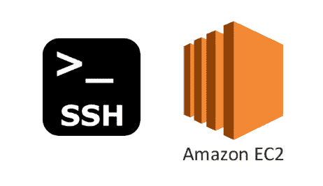
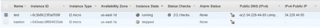
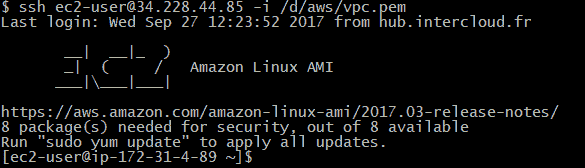
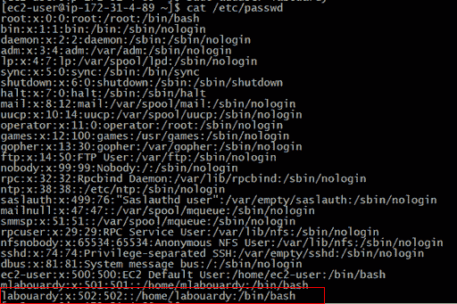
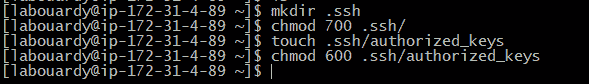
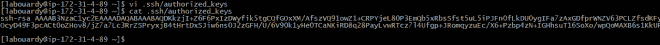
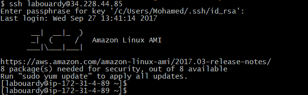

# 向 EC2 添加新用户，并授予 SSH 密钥访问权限

> 原文：<https://medium.com/hackernoon/add-new-users-to-ec2-and-give-ssh-key-access-d2abd084f30c>

在这篇快速的帖子中，我将向您展示如何使用您自己的**私钥**向 **EC2 实例**和 **SSH** 添加新用户，而不是使用由 **AWS** 生成的私钥进行认证。

使用其**公共 IP** 通过 **SSH** 连接到您的实例:

接下来，使用以下命令创建一个新用户:

sudo adduser labouardy

接下来，我们将 shell 会话切换到新帐户:

sudo su labouardy

创建**。ssh** 目录，并将目录权限改为 **700** (只有文件所有者可以读取、写入或打开目录):

|mkdir。嘘

|chmod 700。嘘

注意:确保您位于新用户的主目录中(例如: **/home/labouardy** )

在**中创建一个名为 **authorized_keys** 的空文件。ssh** 目录，并将其权限更改为 **600** (只有文件所有者可以读取或写入该文件)

|触摸授权键

|chmod 600 授权密钥

最后，编辑 *authorized_keys* 文件并在你的公钥中粘贴:

一旦你完成了这些，回到你的机器，然后尝试使用你创建的新凭证和用户帐号进行 SSH:

我们现在以用户 **labouardy** 的身份登录