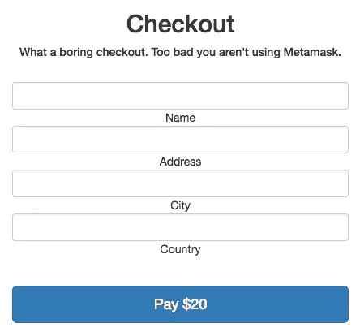
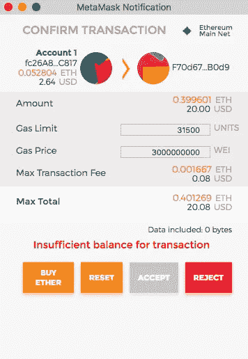
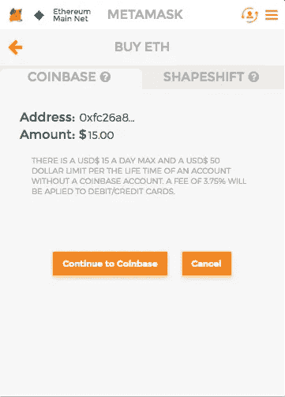

# 向任何网站免费添加安全、免费的一键式支付

> 原文：<https://medium.com/hackernoon/add-secure-fee-less-one-click-payments-to-any-website-for-free-12e721eec5d8>


我已经在网上输入我的信用卡信息几百次了。同一张信用卡。我厌倦了每次买东西都掏出钱包，所以我向电子商务界发出呼吁:请不要再逼我了。

在这篇文章中，我将为允许使用[以太坊](https://hackernoon.com/tagged/ethereum)和 Metamask 的替代支付提供案例，除了设置时间之外，您的业务没有任何成本。你应该听我说完，因为**支付处理不应该花你一毛钱**，而且我肯定它目前花了你很多钱。

我的上一篇文章是关于使用以太坊和元掩码登录任何没有密码的网站——我建议你先读一下那篇文章。请注意，虽然本文的重点是电子商务，但你可以将这些支付按钮贴在任何网站上(也许是你的艺术博客的提示框？)并且只有 Metamask 用户才能看到它们。你的主流观众不会注意到有什么不同。

# 为什么支付处理器如此糟糕

这对任何人来说都不应该是一个惊喜，但支付处理器是为了赚钱而存在的业务。以下是一些不喜欢它们的理由:

*   他们收取费用(通常是 2-5%)
*   他们的欺诈率很高(例如，客户收到货物后要求退款)
*   你的资金需要几天才能到达你的手中
*   用户*仍然*需要填写信用卡信息(拜托伙计们，都 2017 年了)
*   你的账户随时可能被冻结(如果出于某种原因，他们怀疑你不怀好意，账户就会被冻结)

糟糕的是你必须使用它们，因为没有其他选择。哦，等等，有！

# 以太坊为什么牛逼

就像任何其他[加密货币](https://en.wikipedia.org/wiki/Cryptocurrency)一样，以太坊可以作为一种交易媒介**没有中央权威，秒结算，没有退款，收款方 0%费用** *。以太坊实际上不仅仅是一个交换媒介，但那是另一天的话题。*

好的，我希望你感兴趣。让我们写一些代码。

*你可以跟着一起进入* [*这个回购*](https://github.com/alex-miller-0/metaPay) *，在这里我已经构建了一个简单的结账组件。*

# 如何使用以太坊作为支付处理器

还记得[元掩码](http://metamask.io)吗？我们将建立一个显示超级秘密结账的网页，只有拥有元掩码插件的用户才能看到*。同样，这是因为 Metamask 将 [web3](https://github.com/ethereum/wiki/wiki/JavaScript-API) 注入到你的浏览器中。其他人将继续看到你的正常网站，没有人知道你已经成为 web 3.0 的弄潮儿。*

```
render(){
  if (web3){
    return (<metamaskCheckout/>);
  } else {
    return (<checkout/>);
  };
}
```

到目前为止，如果我们在浏览器中检测到 web3，我们所做的就是呈现一个 *metamaskCheckout* 组件。如果没有，我们呈现常规的结帐，如下所示:



正如我在上一篇文章中提到的，以太坊地址可以用作一种用户名。每当用户签署任何类型的交易时，他们就证明了该地址的所有权。这个以后会派上用场的。

**components/MetaPay.jsx**

```
let { pay } = this.props;
return (
  <Row><Col md={4}></Col><Col md={4}><center>
    <h2>Checkout</h2>
    <h5>Horray! You're a Metamask user.</h5>
    <p>We'll give you the good stuff.</p>
    <div>
      <form>
        <br/>
        <FormGroup>
          <FormControl type="text" value={pay.name} onChange={this.updateName.bind(this)}/>
          Name
          <FormControl type="text" value={pay.address} onChange={this.updateAddress.bind(this)}/>
          Address
          <FormControl type="text" value={pay.city} onChange={this.updateCity.bind(this)}/>
          City
          <FormControl type="text" value={pay.country} onChange={this.updateCountry.bind(this)}/>
          Country
        </FormGroup>
      </form>
      <br/>
      <Button bsStyle="primary" bsSize="large" onClick={this.sendTxn.bind(this)}>
        Pay ${this.props.pay.usd_amt}
      </Button>
    </div>
  </center></Col></Row>
);
```

该组件将呈现一个表单，要求用户的物理地址(这可以通过 *this.props* 预先填写，如果用户以前与你一起购物-额外的功能！).


当用户点击*这个*支付按钮时，它会格式化一个以太坊交易，并将其发送到 Metamask，供用户在其浏览器中签名。发送乙醚的数量将基于当时乙醚的现货价格(例如，如果乙醚为 50 美元，产品为 20 美元，则交易读数为 0.4 乙醚)。这是用户看到的样子:



当然，如果用户没有足够的乙醚，他们将无法支付你。\_(ツ)_/

虽然他们可以买乙醚…



…用信用卡(哦，讽刺的是)。

无论如何，请注意，用户支付 1-10 美分的固定交易费来发送以太网，而您无需支付任何费用。如果你感兴趣，你可以在这里找到用户为什么要付费。

**actions/metaPay.js**

```
sendTxn(web3, ether, nonce) {
  return (dispatch) => {
    let user = web3.eth.accounts[0];
    let wei = ether * Math.pow(10, 18);
    let gasPrice = 3 * Math.pow(10, 9);
    let gasLimit = 30000;
    let rawTx = {
      nonce: `0x${nonce.toString(16)}`,
      gasPrice: `0x${gasPrice.toString(16)}`,
      gasLimit: `0x${gasLimit.toString(16)}`,
      from: user,
      to: this.owner_address,
      value: `0x${wei.toString(16)}`
    };
    web3.eth.sendTransaction(rawTx, (err, txHash) => {
      if (err) { console.log('Error sending txn:', err); }
      // Save the transaction hash
      yourAPI.saveOrder(rawTx, txHash);
    })
  }
}
```

一旦用户签署了事务，就会调用一个回调，该回调获取事务散列并将其存储在数据库中供以后使用。它还存储街道地址，因此用户下次不需要填写任何内容。

至此，用户大功告成！没有账单地址。没有信用卡信息。只需点击一下“接受”按钮。

# 装运前

可能值得注意的是，虽然退款是不可能的，但你需要确保交易确实进入了以太坊区块链。这通常需要 10-30 秒，但我认为一个好的过程是在打印运输标签之前简单地检查(通常在几分钟到几小时后完成)。

*通过 hash 得到一个事务，可以使用* [*以太扫描 API*](https://etherscan.io/apis#transactions) *(或者，如果你想成为一个好的以太坊公民，运行你自己的节点)。也许我会在以后的文章中更多地介绍如何与以太坊交互——我还不想因此失去太多读者。如果你在实现这个过程中遇到困难，请随时联系我。*

**admin/shipping.jsx**

```
function printMetamaskShippingLabel(order_id) {
  // Get the order info related to this transaction from your system
  var order = api.getOrder(order_id);
  // Make sure the transaction is on the blockchain and is legit
  var on_chain_order = api.getMinedOrder(order.txHash);
  if (!order || order.value != on_chain_order.value) {
    return (<txNotMinedComponent>);
  } else {
    // Record that you printed the shipping label
    api.logShipment(data); 
    // Show screen that can be printed
    return (
      <div>
        format your shipping label here...
      </div>
    );
  }
}function render() {
  var id = this.props.order_id;
  var metamask_order = this.props.metamask_order;
  if (metmamask_order) {
    return printMetamaskShippingLabel(id);
  } else {
    return printShippingLabel(id);
  };
}
```

准备装运的任何人都可以看到该组件。为了防止任何欺诈，如果交易尚未开采或发送了错误数量的乙醚(记住，您的系统之前记录了正确的数量)，您的托运人将会看到警告。否则，运输详细信息将正常显示。

在这一点上，你可以 100%确定你得到了报酬，你可以展示标签，打印它，并运送你的产品。最棒的是。没有中间人从你的利润中提成。

# 但是我该怎么处理这些乙醚呢？

这是一个公平的问题。你可能已经注意到你没有得到任何报酬——你得到的是以太的报酬。你可能也知道加密货币是出了名的不稳定。

虽然我个人会建议以乙醚支付(参见:[乙醚历史价格](http://coinmarketcap.com/currencies/ethereum/))但我知道每个人的风险承受能力是不同的。

这就是为什么存在允许你接受加密货币并以美元支付的公司。不幸的是，这些公司收费也很高，除非他们带来大量新客户，否则没有理由使用它们。但是记住，我告诉过你这是免费的。

事实证明，你实际上并不需要使用这些服务。你可以自己做这件事，只需很少的工作，几乎没有成本。这是我下一篇文章的主题。敬请期待！

—

如果你喜欢这篇文章，[在 Twitter 上关注我](https://twitter.com/ethereum_alex)或者加入 https://reddit.com/r/ethereum.的社区[你也应该看看我的公司，](https://reddit.com/r/ethereum.) [ConsenSys](https://twitter.com/ConsenSysLLC) ，因为我们做的东西很棒。

此外，如果你实现了我所说的任何东西，发微博给我，我会让社区知道。

—

当你在等待我的下一篇文章时，我建议你在[*meta mask . io*](https://metamask.io)*获得元面具插件，并前往*[*ether play . io*](https://etherplay.io?)*获得一些街机游戏。没有注册是必需的，如果你击败了高分，你赚钱！如果你想知道，我不从事这两种产品。*

*“用元蒙版付款”图像贷记 Vlad Todirut*

[](http://bit.ly/HackernoonFB)[](https://goo.gl/k7XYbx)[](https://goo.gl/4ofytp)

> [黑客中午](http://bit.ly/Hackernoon)是黑客如何开始他们的下午。我们是 AMI 家庭的一员。我们现在[接受投稿](http://bit.ly/hackernoonsubmission)并乐意[讨论广告&赞助](mailto:partners@amipublications.com)机会。
> 
> 如果你喜欢这个故事，我们推荐你阅读我们的[最新科技故事](http://bit.ly/hackernoonlatestt)和[趋势科技故事](https://hackernoon.com/trending)。直到下一次，不要把世界的现实想当然！

