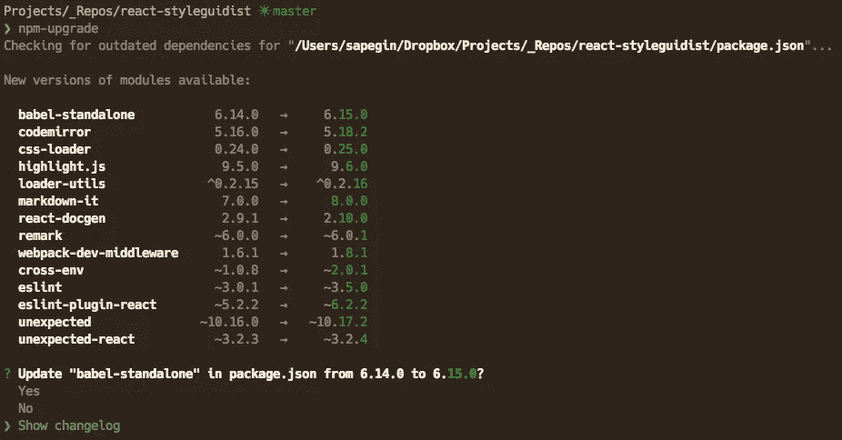

# 添加他妈的更改日志

> 原文：<https://medium.com/hackernoon/add-the-fucking-change-log-3d82d758d8b0>

每次我使用 [npm-upgrade](https://github.com/th0r/npm-upgrade) 升级我的项目的依赖项时，如果它找不到变更日志，我就会创建一个名为“添加变更日志”的问题。他们中的大多数都被忽略了，有时维护者会回答一些意味着“滚蛋”的问题，他们很少听。

一个好的变更日志为项目用户回答了这些问题:

*   我的项目在新版本中有什么新价值？
*   有哪些突破性的变化？
*   如何将我的代码库迁移到新版本？
*   我的问题解决了吗？

**变更日志是一个帮助你决定是否升级以及评估升级的收益和成本的工具。**

一个好的变更日志是:

*   为人类而写，不是为计算机。
*   用户可以理解，而不仅仅是贡献者。
*   不是 Git 提交日志。
*   由项目维护人员编写——不要提出拉取请求。

你应该阅读这篇[的精彩指南](http://keepachangelog.com/en/0.3.0/)，并在今天就给你的开源项目添加一个变更日志。

> [黑客中午](http://bit.ly/Hackernoon)是黑客如何开始他们的下午。我们是 [@AMI](http://bit.ly/atAMIatAMI) 家庭的一员。我们现在[接受投稿](http://bit.ly/hackernoonsubmission)并乐意[讨论广告&赞助](mailto:partners@amipublications.com)机会。
> 
> 如果你喜欢这个故事，我们推荐你阅读我们的[最新科技故事](http://bit.ly/hackernoonlatestt)和[趋势科技故事](https://hackernoon.com/trending)。直到下一次，不要把世界的现实想当然！

