# 使用 AppAuth SDK 将 OAuth2 添加到移动 Android 和 iOS 客户端

> 原文：<https://medium.com/hackernoon/adding-oauth2-to-mobile-android-and-ios-clients-using-the-appauth-sdk-f8562f90ecff>


通常与 [OpenID-Connect](http://openid.net/connect/) 结合使用的 OAuth2 是一个流行的授权框架，它使应用程序能够保护资源免受未授权的访问。它将用户身份验证委托给授权服务，然后授权第三方应用程序代表用户访问受保护的资源。OAuth 2 为 web 和移动应用程序都提供了授权流。

[AppAuth](https://appauth.io/) 是一款面向原生 Android 和 iOS 应用的开源 SDK，它以平台友好的方式实现了最佳实践 OAuth2 和 OpenID-Connect 规范。

一个在 Android 中实现的示例应用程序提供了一个使用 AppAuth 授权访问私有资源的具体示例。图书应用程序使用 Google Books API 和 *Google* 登录服务来搜索图书(受 API key 保护)，并显示登录用户最喜欢的图书选择(受 OAuth2 保护)。开源项目可在 github.com/approov[获得。](https://github.com/approov/AppAuth-OAuth2-Books-Demo)

# OAuth2 授权授予流程

在 OAuth2 授权流中，资源授权与资源访问是分开的。只有授权服务器需要处理用户凭证，因此这些用户凭证永远不会向客户端或资源服务器公开。

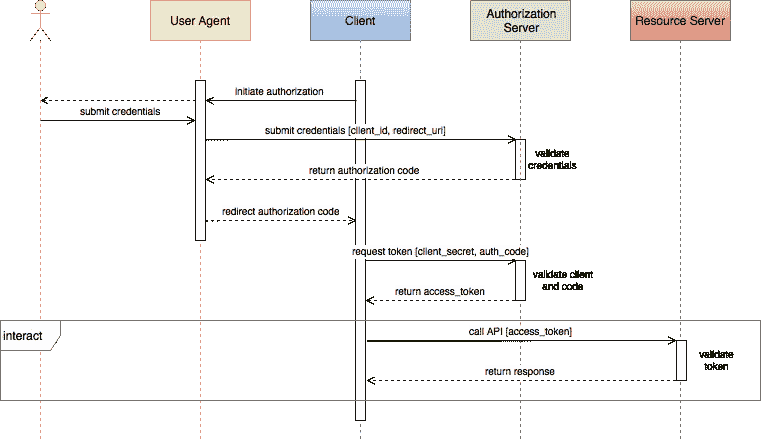

当客户端通过重定向将称为资源所有者的用户发送到授权服务器的网站时，授权开始。本地用户代理(通常是浏览器)获取并提交用户的凭证，并要求用户授予权限。授权服务器验证凭证，并通过用户代理将访问令牌重定向回客户端。

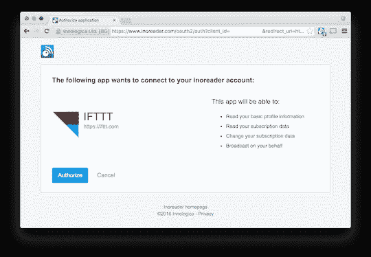

在授权码授予流程中，授权分为两个步骤。在第一步中，如果授权服务器对用户凭证进行了身份验证，则向客户端返回一个授权代码。客户端使用授权代码和某种形式的客户端身份验证(通常是客户端机密)回调授权服务器。如果客户端通过了身份验证，授权服务器将直接向客户端返回访问令牌和可选的刷新令牌。通过将授权过程分为两个步骤，访问令牌不会流经用户代理。

从客户端传递到资源服务器的访问令牌可以由资源服务器使用用于签名它们的相同秘密来验证。授权服务器和资源服务器共享这个秘密，但是这个秘密永远不会暴露给客户机或用户代理。访问令牌具有有限的生存期，因此刷新令牌可用于请求新的访问令牌。

要更深入一点，请参见[移动 API 安全技术，第 2 部分:API 令牌、Oauth2 和消失的秘密](https://hackernoon.com/mobile-api-security-techniques-fc1f577840ab)

# 移动客户端与 Web 客户端

授权码授权流对于 web 和移动客户端是常见的。在代码交换步骤中，web 和移动流程之间的差异经常会显现出来。

在授权服务器将代码交换为访问令牌之前，授权服务器必须确保客户端就是它所声称的那个人，这一点很重要。这通常是为使用 HTTP 基本身份验证的 web 客户端完成的，客户端 ID 和机密保存在应用服务器上。

在移动客户端上，相同的客户端机密将静态保存在本机应用程序中。静态客户端机密通常很容易从您的应用程序中提取，这使得其他人可以假冒您的应用程序并窃取用户数据。不幸的是，在移动客户端上，仅使用公开可用的客户端 ID 将授权码交换为访问令牌是很常见的。使用容易窃取的秘密进行认证和不使用秘密进行认证哪个更好？

授权码通过用户代理重定向返回给移动客户端。最初向授权服务注册移动应用程序时，开发人员可能会限制授权服务将接受的重定向 URL。这有助于防止恶意参与者将授权代码重定向到不相关的 URL 地址。

由于在代码交换期间不需要秘密，任何能够截获授权代码的人都可以用代码交换访问令牌。[用于代码交换的证明密钥](https://tools.ietf.org/html/rfc7636) (PKCE)已经被许多 OAuth2 提供商采用。使用普通 PKCE，客户端应用程序通过对授权服务器的初始用户代理调用生成一个随机状态值。服务器保存该值。当客户端应用程序执行代码交换时，它会将原始状态值与代码一起发送，除非两个状态值匹配，否则授权服务器不会将代码交换为访问令牌。恶意参与者现在必须观察初始状态值和访问代码来获取令牌。

在一种更强形式的 PKCE 中，客户端应用程序在发出授权请求时发送随机状态值的散列。在代码交换期间，它将原始状态值与代码一起发送。授权服务器将这个值的散列与它收到的原始散列进行比较。现在，观察最初的授权请求已经不够好了；黑客必须截取并修改初始散列。如果成功，客户端应用程序将无法再交换令牌，但攻击者可以。

PKCE 是一个很好的步骤，但是使用不通过用户代理的客户端秘密将是一个更安全的方法，如果它在移动设备上静态存储时不那么容易受到攻击的话。

# AppAuth

用于 Android 和 iOS 的 AppAuth 是一个客户端 SDK，它与 [OAuth2](https://tools.ietf.org/html/rfc6749) 和 [OpenID Connect](http://openid.net/specs/openid-connect-core-1_0.html) (OIDC)提供商一起工作。它将原始协议流包装到每个本机平台熟悉的实现风格中。

该 SDK 遵循用于本地应用的 OAuth 2.0 的最佳实践，包括 PKCE 扩展和定制标签浏览器。该库提供了钩子来进一步扩展基本流之外的协议。

作为一个开源项目， [AppAuth](https://appauth.io/) 拥有针对 [Android](https://github.com/openid/AppAuth-Android) 和 [iOS](https://github.com/openid/AppAuth-iOS) 的 GitHub 库，其中包括良好的文档、一个演示应用，以及与多种授权服务的集成。

# 入门指南

在 Android 上开发了一个搜索和查找喜欢的书籍的应用程序，以进一步探索 AppAuth SDK 与通用应用程序架构和支持库的使用。

接下来，从克隆 GitHub 上的图书演示项目开始，该项目可在[github.com/approov](https://github.com/approov/AppAuth-OAuth2-Books-Demo)获得。它需要一些配置，所以它不会开箱即用。至少，您需要提供一个 keystore、Google API 密匙和 Google OAuth2 凭证，我们接下来将生成这些凭证。

# Google OAuth2 和 API 注册

您将使用 [Google 的 Books API](https://developers.google.com/books/docs/v1/using) 来演示如何使用 AppAuth SDK 在 Android 上执行开放和授权的搜索。这需要一个 API 键来访问 API 的公共部分，比如开卷搜索。需要 OAuth2 访问令牌来访问 API 的私有部分，比如查找您最喜欢的书籍。

为了注册 Android 的 API 密钥和 OAuth2 凭证，Google 需要一个公钥 SHA1 指纹，它通常是签名您的 Android 应用程序包的公钥的指纹。对于这个演示，我们将创建一个新的秘密密钥库，并将相同的密钥材料用于 API 密钥、OAuth2 凭证和应用程序的签名配置。

在终端中，使用 Java keytool 生成一个“秘密”密钥库，并提取指纹。为了方便起见，您可以对所有参数使用“secret”。

```
$ keytool -genkey -keystore secret.keystore -alias secret 
    -keyalg RSA -keysize 2048 -validity 10000 -keypass secret 
    -storepass secret -dname 'CN=secret'$ keytool -list -v -keystore secret.keystore -storepass secret | 
    grep SHA1SHA1:
C5:A9:B1:F8:A3:8D:07:B3:30:D2:12:06:D2:BA:1E:CF:91:FA:60:97
```

确保 secret.keystore 位于项目的顶层目录中。

接下来进入[谷歌开发者控制台](https://console.developers.google.com)并登录。选择或创建新项目。

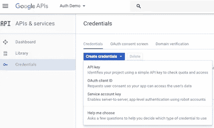

此屏幕截图中的项目显示为“验证演示”。使用秘密指纹创建 API 密钥:

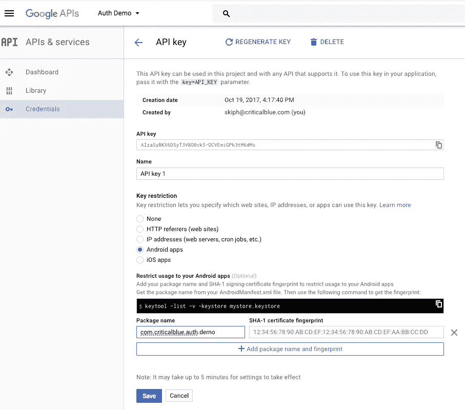

仍然在开发人员控制台中，创建一个 OAuth2 客户端 ID:

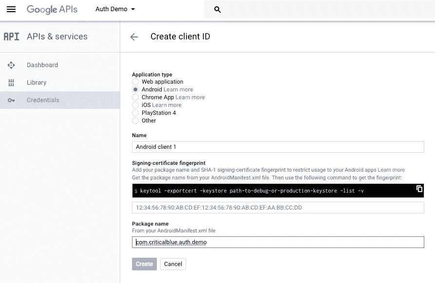

完成 OAuth2 同意屏幕:

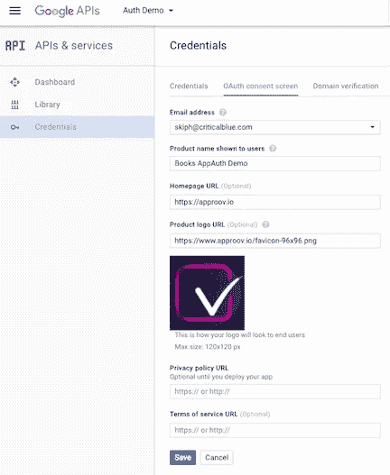

最后，进入[谷歌 API 库](https://console.developers.google.com/apis/library)页面，找到并启用谷歌图书 API。

在项目的顶层目录中，创建一个 secret.gradle 文件，该文件将保存您的配置信息:

gradle build 会在构建应用程序时将这些配置信息插入到应用程序中。git 将忽略 secret.keystore 和 secret.gradle，因此这两个文件都不会保存在您的存储库中。

现在，您应该能够成功构建并试用图书应用程序了。接下来的几节将描述如何在应用程序中使用 AppAuth 来验证用户身份，并进行需要访问令牌的私有 Google API 调用。之后，在 Books 应用程序中演示公共、登录和私有用例。

# 应用架构

图书演示应用程序使用简单的 [MVVM 架构](/upday-devs/android-architecture-patterns-part-3-model-view-viewmodel-e7eeee76b73b)，有两个活动用于搜索图书和查找收藏夹。收藏夹活动仅在通过 Google OAuth2 登录服务登录时启用。

AppAuth Android repository 的演示应用展示了许多 AppAuth 特性，但它在活动中混合了 UI、AppAuth 和网络调用。Books 应用程序将 AppAuth 服务分离到一个独立的模型层中，并将授权服务与常见的库(如 [Retrofit2](http://square.github.io/retrofit/) )集成在一起。

在 AuthRepo 类中，完整的 OAuth2 授权代码授权流被分成单独的步骤。长时间运行的功能是通过主 UI 线程上的[异步任务](https://developer.android.com/reference/android/os/AsyncTask.html)实现的。以下部分重点介绍了主要步骤。有关更多详细信息，请参考应用程序代码和 AppAuth 库。

# 配置发现

该流程从授权服务和客户端配置开始。OIDC 增加了一个[服务发现](https://openid.net/specs/openid-connect-discovery-1_0.html) y 功能，它查找并配置服务 API 端点和其他功能。如果在 secret.gradle 文件中指定了发现端点，则首先尝试发现。如果没有发现配置，则使用 secret.gradle 中直接指定的附加端点来配置服务。

客户端使用 secret.gradle 中指定的值进行配置:

# 授权码授予

图书应用程序使用自定义标签浏览器作为用户代理，独立于应用程序本身。AppAuth 生成一个定制的制表符意图，该意图被传递给搜索活动，然后搜索活动启动浏览器。PKCE 在流中得到透明的支持。

浏览器启动并要求用户提供授权凭证并授予权限。

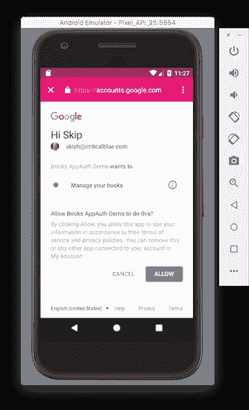

浏览器将授权服务器的响应重定向回通知授权报告继续的活动:

# 代码交换

如果重定向成功，授权报告将尝试用代码交换初始访问和刷新令牌。

# 开放和授权的 API 调用

如果授权成功，应用程序可以使用访问令牌访问受保护的 API。auth repo 提供了 [OKHTTP 拦截器](https://github.com/square/okhttp/wiki/Interceptors)来用适当的密钥和访问令牌包装 API 调用。

API 键拦截器用于开放式 API 调用。拦截器根据需要向每个 API 调用添加 API 密钥、Android 包证书和包名称。

访问令牌拦截器用承载访问令牌包装所有受保护的 API 调用。在每次调用之前，如有必要，将检查并刷新令牌。

在成功的代码交换之后，立即使用访问令牌拦截器从 Google sign in 收集用户配置文件信息。

# 持久身份验证状态

AppAuth 演示应用程序提供了一个身份验证状态管理器，它经常将身份验证状态保存到共享首选项中。这种状态在应用程序重启后仍然存在，因此应用程序的用户身份验证可以在应用程序会话之间持续存在。

每次启动时，Books 应用程序不会保持这种状态来演示新的配置发现和登录。持久性是生产中的必备特性，AppAuth 类为健壮的持久性机制提供了一个坚实的起点。

# 查找收藏夹

你的谷歌图书库中可能没有任何你喜欢的书籍。在网络浏览器中，登录你的谷歌账户，进入[books.google.com](https://books.google.com)，点击我的图书馆链接。向下浏览到收藏夹书架，通过选择右上角的设置按钮并选择高级图书搜索来添加一些图书。在搜索结果中，单击一本书，并在下一个屏幕中将其添加到收藏夹。

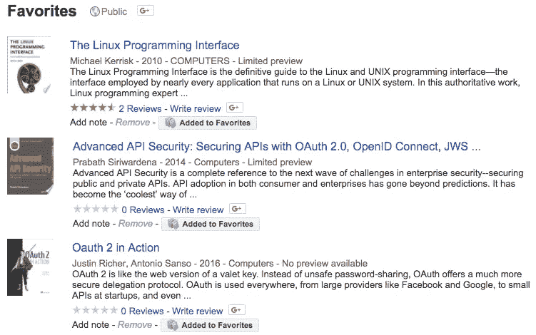

严格地说，对收藏夹书架的读取权限是公开的，这意味着您只能通过 API 键来访问它。然而，有一个问题:您必须首先知道您的 Google Books 用户 ID，它不同于您常用的 Google 个人资料 ID。要找到您的图书 ID，您必须在 API 中查询您的书架列表。这是一个经过身份验证的请求，Google API 从您的访问令牌中识别您的图书用户 ID。您可以从一个成功的 bookshells 响应中解析出用户 ID，最后您可以使用您的访问令牌、API 键或两者来查询您的 Favorites bookshelf。

# 图书应用程序(Android)

下面是几个运行中的 Books 应用程序的屏幕截图。该应用程序在没有登录和打开图书搜索对话框的情况下启动。打开的图书搜索只使用 API 键，不需要 OAuth 授权。

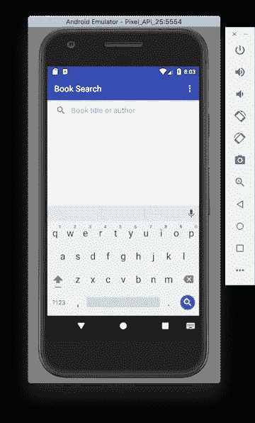

下一个屏幕显示了一些搜索结果。请注意，收藏夹未启用，因为没有用户登录。

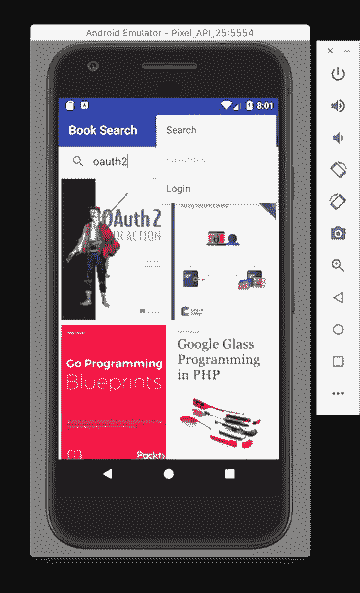

选择登录菜单项启动登录过程，启动自定义选项卡浏览器。

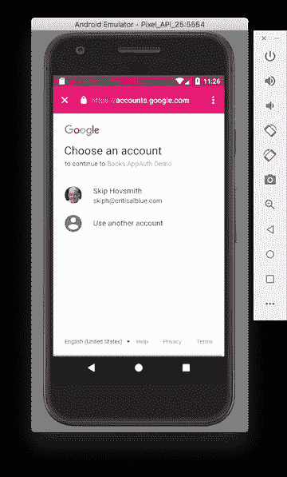

输入您的凭据后，下一个屏幕会要求您接受权限。


授权成功后，用户图标会显示在顶部栏上。您现在可以找到授权用户的收藏夹。

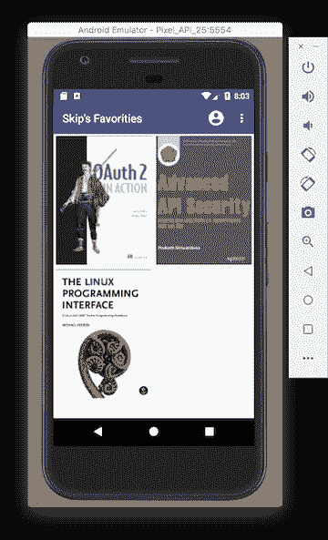

# 限制

虽然这是一个相当有限的演示，但是演示了大多数登录和用例，包括服务发现、独立用户代理授权、API 密钥和访问令牌 API 调用。模型和视图的分离有望使 AppAuth 流相对容易理解。

正如所演示的，基本的移动流在代码交换期间使用静态客户端 ID，但不使用客户端机密。虽然使用了 PKCE，但是登录安全性不如最好的 web 客户端实现那样健壮，在 web 客户端实现中，客户端 ID 和密码是从应用服务器内部使用的。

后续文章将探讨 OAuth2 的动态注册功能，该功能不会在应用程序上静态存储客户端机密，但在应用程序注册期间提供有限的安全性。这可以与动态客户端认证服务相结合，以在移动设备上实现安全和完整的 OAUTH2/OIDC 授权码授权流。

感谢阅读！有关移动 API 安全性的更多信息，请查看。

如果你推荐这篇文章(点击👏按钮)以便其他人可以找到它。