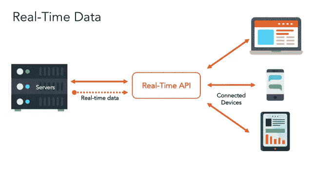

# 向您的应用添加实时数据流

> 原文：<https://medium.com/hackernoon/adding-realtime-data-streaming-to-your-app-b9b6ec034afd>

## 探索推动实时数据生态系统的技术

实时数据目前支持一些我们最喜爱的应用程序:Slack、谷歌地图、优步、Lyft……不胜枚举。对于我们这种时间敏感、被动的生活方式来说，这已经变得至关重要，在这种生活方式中，即使几秒钟的延迟也会给我们带来巨大的痛苦。实时已经成为大数据和物联网的基石，数据接收越快，处理越快，并变得可行。你的应用程序成功或失败的区别将归结于它的可靠性，功能，并最终它的速度。

> “[实时]是指在正确的时间做出更好的决策和采取有意义的行动的能力。它是关于在某人刷信用卡时检测欺诈，或者在购物者站在收银台排队时触发优惠，或者在某人阅读特定文章时在网站上投放广告。它是关于组合和分析数据，以便您可以在正确的时间和正确的地点采取正确的行动。”
> ― [**迈克·巴洛**](https://www.goodreads.com/author/show/499452.Mike_Barlow) 、 [**实时大数据分析:新兴架构**](https://www.goodreads.com/work/quotes/24504817)

在过去的几年里，硅谷通过开发实时 API 和服务，利用了对实时数据不断增长的需求。这些解决方案允许您轻松地将数据流式传输到多个客户端(电话、笔记本电脑、其他服务器等设备)，并且通常是开箱即用的基础架构服务。实时 API 可以嵌入到现有的应用程序中，并与无服务器或微服务后端配合使用。另一方面，实时应用服务更加以客户为中心，比如向应用提供实时更新。

这个列表将概述一些实时技术，并希望给你，应用程序开发人员或有抱负的企业家，更多的技术景观的洞察力。请记住，这些并没有按照任何特定的顺序列出，因为它们都取决于您特定的使用案例和堆栈。

# 阿帕奇卡夫卡

最受欢迎的分布式流媒体平台之一， [Kafka](https://kafka.apache.org/) 用于构建实时数据管道和流媒体应用。它是水平可扩展的、容错的、快速的，并且在数千家公司的生产中运行。它有两个主要用例:

*   构建实时流数据管道，在系统或应用程序之间可靠地获取数据
*   构建实时流应用程序，对数据流进行转换或做出反应

# Pubnub

Pubnub 是实时服务行业的领导者之一。他们将自己定位为全球[数据流网络](https://en.wikipedia.org/w/index.php?action=edit&redlink=1&title=Data_Stream_Network) (DSN)和实时基础设施即服务(IaaS)公司，专注于网络、移动和物联网应用的流媒体更新。PubNub 专注于使用设备的发布/订阅模型的数据流，该模型利用了浏览器中已经存在的通信模式。他们的主要优势之一是其 SDK 和集成库的广度，支持几乎任何堆栈的实时性。

# 扇出/图钉

由[种子相扑](https://tech.co/seed-sumo-doubles-funding-startup-class-2015-2015-01)、[资助的 Fanout.io](https://fanout.io) 是一个嵌入式实时 API，可以让你即时将数据推送到连接的设备上。因为它作为一个代理，可以与任何后端语言一起工作，所以您不必重新配置您当前的 API 内部工作方式。Fanout 不同于大多数实时提供者，因为它支持 API 开发，而其他的不支持。因此，该产品非常适合希望进行更高级应用程序控制的开发人员，比如将 Fanout 与他们的 API 管理工具一起使用，或者管理微服务。[图钉](http://pushpin.org)是 Fanout 的开源版本。由于 Pushpin 是一个代理服务器，后端可以用任何语言编写，这使得集成非常容易。此外，它可以很好地与任何语言或框架一起工作，包括您使用的任何现有的 API 管理服务。

# 推进器

与 Pubnub 类似， [Pusher](http://pusher.com) 专注于使用发布/订阅模式的设备的数据流。它们提供了 30 多个库来帮助集成，包括开发人员友好的调试和访问控制功能。Pubnub 和 Pusher 的一个主要区别是 Pusher 使用 websockets，而 Pubnub 不使用。你一定要问你的开发者哪种方法更适合你的应用。

# Realtime 的实时信息

Realtime Messaging 是一个基于云的消息代理，使开发人员能够构建需要设备间实时通信的跨平台应用程序。它提供了 JavaScript、Android 和 iOS 的快速入门指南，以及所有主要平台的 SDK。其中一个主要好处是，它可以为您处理自动扩展，因此您可以从 1 台设备扩展到数百万台设备。

# 巧妙地

作为 PubNub 的替代，T1 的平台可以确保使用本地实时协议的客户端和使用其他实时或排队协议的客户端之间的互操作性。巧妙地使用发布和订阅服务将应用程序中的消息流量组织到指定的通道中。客户端(笔记本电脑、电话、服务器)连接到频道来订阅消息，发布到唯一频道的每条消息都由 Ably 广播给所有订阅者。

# (电源)插座

[Socket.io](https://socket.io/) 是一个很棒的开源项目。这是一个用于实时 web 应用程序的 JavaScript 库。它有两个部分:一个在浏览器中运行的客户端库和一个用于 Node.js 的服务器端库。从系统上来说，它类似于 Pusher，因为它依赖于 websockets(以轮询作为后备)。Socket 的入门指南将向您展示如何用不到 200 行代码创建大量令人惊叹的应用程序。

# 重火力点

发展最快的实时数据库之一， [Firebase](https://firebase.google.com/docs/database/) 实时数据库是一个云托管的数据库，数据存储为 JSON 并实时同步到每个连接的客户端。所有客户端共享一个实时数据库实例，并自动接收最新数据的更新。Firebase 一种灵活的、基于表达式的规则语言(Firebase 实时数据库安全规则),用于定义数据的结构以及数据的读写时间。

# Streamdata.io

一个 SaaS API 代理工具，将标准的 API 请求转换成流 API。换句话说，它通过轮询和充当流 API 来为任何 HTTP API 提供代理服务。更具体地说，它是一个实时缓存代理，允许您轮询 JSON REST APIs 并将更新推送到客户端——保留轮询之间发生的更改修改的历史。通过这种方式，Streamdata.io 能够为您提供自上次数据请求以来发生的修改列表。

# 层

[层](https://layer.com/)为开发人员提供 API、SDK 和 UI 工具包，将实时消息集成到您的产品中。他们旨在为开发者提供合适的工具，以匹配领先的消费者信使(如 iMessage)的快速开发和用户体验。层是 100%托管的基础设施，因此开发人员可以轻松地将消息传递集成到他们的应用程序中。换句话说，他们也处理服务器、扩展、性能和加密。它们是 HIPPA-complaint，设计用于异步的、个人对个人的消息传递或者企业对消费者的用例。以下是他们提供的许多服务:

# 亚马逊 Kinesis

[亚马逊 Kinesis](https://aws.amazon.com/kinesis/) 让收集、处理和分析[实时流数据](https://aws.amazon.com/streaming-data/)变得容易，这样你就可以获得及时的见解，并对新信息做出快速反应。它允许您在数据到达时处理和分析数据，并实时响应，而不是等到收集完所有数据后才开始处理。主要优势之一是它是一个完全托管的平台，因此您无需任何基础设施管理即可运行流媒体应用。

*想开始构建实时 API 或应用程序吗？查看* [*开始构建实时 API 基础设施*](https://realtimeapi.io/getting-started-with-building-realtime-api-infrastructure/)