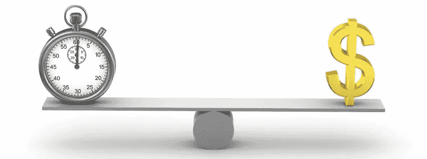
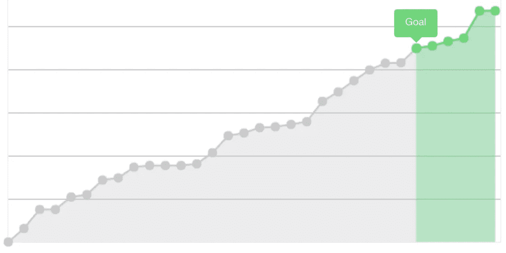
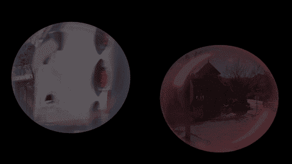
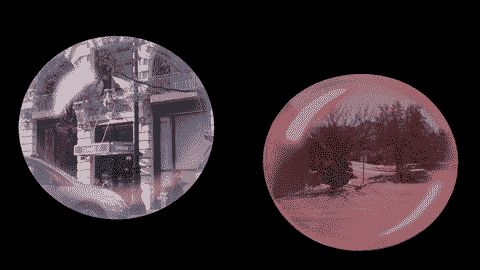
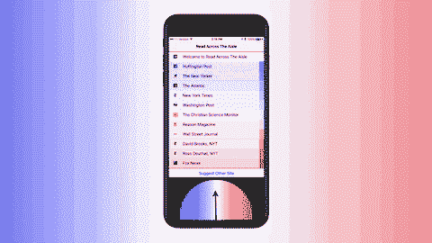

# 感谢 Keynote，为您的 Kickstarter 视频添加视觉效果

> 原文：<https://medium.com/hackernoon/adding-visual-effects-to-your-kickstarter-video-on-the-cheap-thanks-to-keynote-eb69920d90eb>

所以你想推出一个 [Kickstarter](https://hackernoon.com/tagged/kickstarter) ，但是你不确定是否值得冒这个险。一方面，你听说过诱人的成功故事，但你也听说过许多 Kickstarters 花费 1 万到 5 万美元(或更多！)专业制作的视频。你不愿意为一个可能得不到资助的项目花上几千美元买一个视频。 ***所以问题是:你能自己创作一个足够好的视频来吸引眼球并获得资助吗？***

这是我两个月前发现自己所处的位置，当时我正在考虑做一个 Kickstarter。我想我可以在我的 iPhone 7 上拍摄视频，并在 iMovie 中编辑。问题是，我知道我需要给视频添加一些特效，这样它才能从所有“我只是站在镜头前，所以请支持我的竞选”的视频中脱颖而出。拥有这些千篇一律的视频的 Kickstarters 永远不会得到媒体的报道，这使得他们更难获得资金。

然后我意识到创造性地使用 Keynote 可能是我的可取之处。虽然 Keynote 的主要目的是创建幻灯片，但它的视频导入和导出功能(支持非常高的分辨率)意味着它也可以作为一个预算友好的视频效果套件。

***最后，我没有在视频剪辑上花一分钱，我的项目得到了国内外媒体的报道(***[***BBC***](http://bbc.in/2jsrQaY)***，*** [***快公司***](http://bit.ly/2jUU5OF) ***，*** [***石英***](http://bit.ly/qzrata) 成功！

# 该过程

以下是 Keynote 如何融入视频编辑工作流程的基本要点:

1:将视频导入 Keynote 演示文稿

2:在视频上添加你想要的任何文本、动画或弹出窗口

3:将演示文稿导出到视频文件，然后插入到视频编辑器中

> 使用这三个步骤，我能够操纵我的视频的纵横比，将动态颜色过滤器应用到我的镜头，用自定义形状遮罩视频，并排排列多个视频，并在视频上和视频周围添加各种动画。

由于我已经有了 Keynote(一些 MAC 电脑免费提供，售价 20 美元)并且知道如何使用它，我节省了很多时间和金钱。

## 预期效果

我的 [Kickstarter](http://kck.st/2jJeB5n) 是关于过滤气泡的，所以我希望能够做的事情之一是展示两个视频，并排运行，并让它们出现在红色和蓝色的气泡中。这需要几种技术:

1: **视频屏蔽**

您可以创建一个“遮罩”,并将其放在视频的顶部，这样就只能看到视频的一部分。我想要一个长方形的泡泡形状，我用 Keynote 的“用笔绘制”形状生成器创建了这个形状。我建立了面具的上半部分，然后复制和翻转，使下半部分。然后我把面具放在我的视频上面(我建议把两半“组合”起来，这样更容易些)。你可以在下面看到这个样子，以及我在视频上使用半透明层对每个视频进行的着色:

2: **给视频添加特效**

我还想在视频上添加效果。在 Keynote 中，这是超级容易的。只需在幻灯片中插入新的图像或文本。若要安排时序，请将视频设定为转场后自动播放，然后指定每个新项目出现前的秒数(可以使用 0.1 秒的增量)。我发现“Pop”效果非常适合我的目的。下面是我的视频上弹出的几个图像，接着是透明层的变暗(看起来不透明度增加了，但实际上我只是在额外的红色和蓝色层中淡入):

3: **图像效果**

您也可以使用 Keynote 使图像变得强大和互动。在下面的例子中，我将我的 logo 滑过一张图片，同时移除了一个颜色渐变蒙版。花了几分钟时间来获得合适的时间，但最终它给出了一个在 iMovie 中永远无法实现的自定义效果。

4: **产品模型中的拼接**

当然，我也想展示我的 Kickstarter 产品会是什么样子，这在 Keynote 中非常容易。我使用了一张 iPhone 的图片，并在图片上内置了动画来展示这款应用的外观和操作。

## 导出到视频

完成演示后，选取“导出”→“Quicktime”。选择自定义格式，你会看到几个选项。对于分辨率，我推荐 1920 x 1080。对于压缩类型，不要使用 H.264，它是高度压缩的，因此不适合在工作流程中间使用。因为您要将导出的视频放入 iMovie 或其他编辑软件，所以您会想要选取一种压缩程度较低的格式(我使用的是 Apple ProRes 422)。

在我的 2013 款 [MacBook](https://hackernoon.com/tagged/macbook) Air 上，导出视频花了一两分钟。如果你有一台更快的机器，它将花费更少的时间！

# 其他提示

## 对低分辨率视频进行更流畅的编辑

如果你像我一样有一台动力不足的笔记本电脑，我会建议你导入低分辨率的视频，这样你就可以把时间和元素都安排好。如果您使用超高分辨率视频(如在 iPhone 上拍摄的 4k 视频)，Keynote 可能会在回放过程中断断续续，这使得很难看到您的动画定时是否正确。我发现当我并排播放几个 4k 视频时尤其如此。使用低分辨率版本可以计算出时间，此时我替换了 4k 视频并导出了最终版本。

## 衣柜+裤袜=廉价录音棚

没有录音棚吗？如果你在壁橱里录音，你仍然可以得到相当不错的音频(在壁橱里，所有悬挂的衣服都会掩盖引起回声的反射声音)。

用裤袜和衣架制作一个自制的“流行过滤器”，让事情更上一层楼。对于外行人来说，pop 过滤器是你在专业录音棚里看到的圆形网眼小玩意，就放在麦克风前面。当您说出某些单词(例如，“snap”、“crackle”和“Pop”)时，pop 过滤器会抑制冲击麦克风的气流，从而防止发出嘶嘶声和爆音。

我用我蹒跚学步的孩子的旧紧身衣做了我的流行过滤器，绷在一个金属衣架上。我把它放在我的 iPhone 前，用录音机程序录了下来。正如你可以从[最终视频](http://bit.ly/ReadAcross)中听到的，这不是专业的声音——但它没有低端录音的那种砰砰声和嘶嘶声。

## 不要将高分辨率版本上传到 Kickstarter

我花了几个小时将我的视频的 1080p 版本上传到 Kickstarter 网站。我后来知道这是浪费时间，因为他们把所有东西都缩小到 480 便士。上传 100 MB 的文件而不是 2 GB 的文件，可以节省块时间。

当然，你仍然应该把高分辨率版本放在你自己的网站上——这是我们 Kickstarter 直接流量的主要来源，因为大多数新闻报道都链接到那里，而不是直接链接到众筹页面。

## 有时候 Kickstarter 的“评论”是即时的

提交您的活动进行审核的按钮显示，您应该留出最多三天的时间进行审批。请注意，这可能会立即发生，就像它发生在我们身上一样。我不知道是什么因素触发了延长审查，但可能是以下两个因素的组合:( 1)你寻求筹集的金额,( 2)你是否通过脸书或银行凭证验证了你的身份。不是视频相关的，但一个有趣的参考！

## 活动结束后，您将无法编辑大部分页面

在你的活动之前和期间，你可以编辑你的页面上的任何东西。但是当你的活动一结束，你的页面就被冻结了 。您可以添加一些附加信息，但不能更改任何现有内容(描述、视频、图像、媒体链接)。请务必在截止日期前做出必要的修改！

# 经验教训

并非我在节俭的 kickstarterdom 的所有冒险都以快乐告终。我发现的一个重要限制是，我不能录制画外音(在我临时搭建的“录音室”)来代替我在户外拍摄的视频。我一直希望使用画外音来获得一致的音频，我已经看到专业人员使用画外音来实现这一点。事实证明，iMovie 不支持非常精细的音频同步，这是确保音频与视频正确同步所必需的。我花了一点时间试图让这项技术工作，但最终我放弃了。

相反，我使用了户外拍摄的原始音频，并在 iMovie 中调高了“降低背景噪音”设置。由此产生的人声听起来仍然与我的“录音室”中录制的音频有点不同，但一旦我添加了背景音乐(照顾[音频丛林](http://bit.ly/2m18YjH)——强烈推荐)，这不是一个大问题。

这是完整的视频，所以你可以看到这些片段是如何组合在一起的:

如果你有其他#技巧来分享如何以低廉的成本成功地开展 Kickstarter 活动，请发推特到@NickLum，或者在[这个黑客新闻讨论帖](http://bit.ly/2mLmcOS)上分享！

尼克·卢姆(Nick Lum)是《穿越走廊阅读》的创始人，也是《直线阅读》的创始人。他获得了斯坦福大学和创新技术博物馆颁发的社会影响企业家奖。

> [黑客中午](http://bit.ly/Hackernoon)是黑客如何开始他们的下午。我们是 [@AMI](http://bit.ly/atAMIatAMI) 家庭的一员。我们现在[接受投稿](http://bit.ly/hackernoonsubmission)，并乐意[讨论广告&赞助](mailto:partners@amipublications.com)机会。
> 
> 如果你喜欢这个故事，我们推荐你阅读我们的[最新科技故事](http://bit.ly/hackernoonlatestt)和[趋势科技故事](https://hackernoon.com/trending)。直到下一次，不要把世界的现实想当然！

