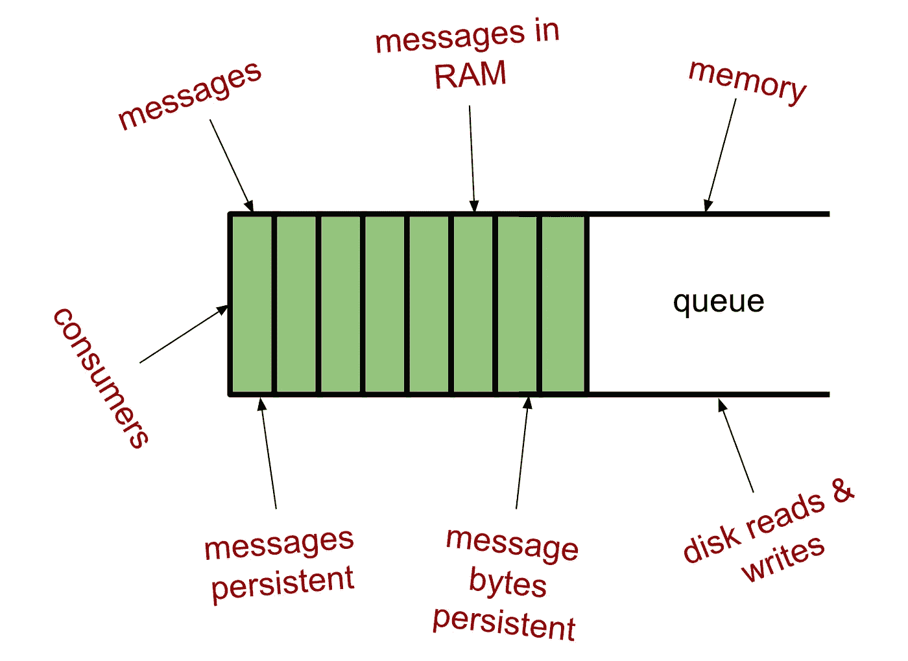
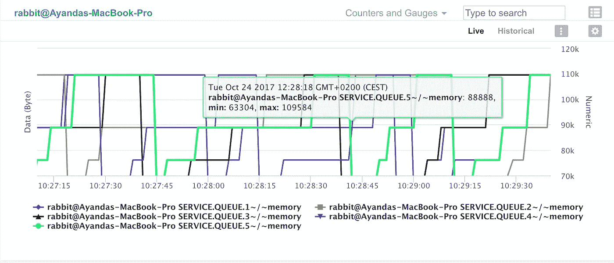
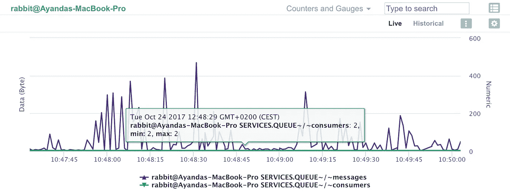
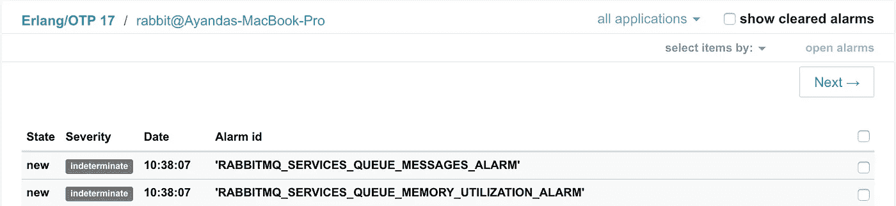

# 高级 RabbitMQ 支持第二部分:深入了解队列

> 原文：<https://medium.com/hackernoon/advanced-rabbitmq-support-part-ii-deeper-insight-into-queues-d8d7eab5d2e4>

由阿扬达·杜贝


在你继续之前，你应该知道你今天可以用 WombatOAM 3.0.0 的 [**45 天免费试用来测试 WombatOAM**](http://www2.erlang-solutions.com/l/23452/2017-12-05/56rkwh)

# 介绍

任何 RabbitMQ 安装中最重要和最关键的元素是队列。队列保留特定于不同行业(如电信、金融系统、汽车等)的不同用例的消息。队列，以及他们对 [AMQP](https://www.rabbitmq.com/amqp-0-9-1-reference.html) 的坚持是 RabbitMQ 存在的根本原因。它们不仅保留消息直到使用，而且在内部，它们也是一些最复杂机制的实现，这些机制用于保证通过结构的高效消息传播，同时满足额外的要求，如高可用性、消息持久性、受管制的内存使用等。

所以队列是通用的，是任何 RabbitMQ 安装的主要焦点。这就是为什么所有 RabbitMQ 用户和支持工程师经常发现自己必须定期检查队列，并确保他们的主机 Rabbit 节点已经过精确配置，以保证高效的消息排队操作。RabbitMQ 用户和支持工程师容易提出的典型问题有:

***…队列“A”中有多少条消息？***

***…队列“K”中有多少消息等待确认？***

***…有多少消费客户端订阅了队列“R”？***

***…队列“D”使用了多少内存？***

***…队列“F”中有多少条消息被持久存储在磁盘上？***

***……队列“E”还活着吗？***

在 RabbitMQ 中，队列的实现是多个方面的组合，例如控制其操作的行为规范(例如，在内部，称为后备队列行为)、临时/持久消息存储组件，以及最重要的，指示队列逻辑中涉及的所有逻辑和机制的队列过程。由此，存在许多属性，这些属性给出了队列当前状态的指示。其中一些队列属性如下所示:



*Fig 1: RabbitMQ Queue Attributes*

# WombatOAM

从[**WombatOAM**](http://www2.erlang-solutions.com/l/23452/2017-12-05/56rkyp)2 . 7 . 0 开始，WombatOAM-RabbitMQ 插件现在附带了一个额外的代理，即 **RabbitMQ 队列**代理。这个 RabbitMQ 队列代理经过了精确的设计和开发，允许监控和获取特定于队列的指标，并以用户友好的方式向 RabbitMQ 用户展示它们。支持两种操作模式:

动态操作:受监控节点上存在的队列，其名称与用户定义的正则表达式相匹配，由 WombatOAM 动态加载以进行监控。静态操作:按照 WombatOAM RabbitMQ 中的定义配置和监控特定的队列

# 配置

该代理运行和显示指标的方式完全取决于它的配置方式。

# 1.动态操作

监控队列的动态模式可以通过定义匹配规范来配置，根据该规范，队列名称按照如下方式进行匹配，并且每个匹配的队列具有特定的、期望的属性/度量。例如，为了监控所有队列的`memory`使用情况，可以在`wombat.config`文件中定义以下配置:

```
{set, wo_plugins, plugins, rabbitmq_queues, dynamic_queues, [{match_spec, ".*"}, {metric, memory}] }.
```

这将捕获被监控节点上的所有队列，并显示队列中的`memory`指标。



*Fig 2: RabbitMQ Dynamic Queue Metrics*

# 2.静态操作

在静态操作模式下，用户在`wombat.config`中明确指定他们想要监控的队列和相应的属性/指标。一个完整的静态配置条目将由被测量的*队列名称*、*虚拟主机*和*属性*组成。例如，为了监控`SERVICES.QUEUE`中`messages`、`consumers`的数量和`memory`的使用量，以及`EVENTS.QUEUE`中`messages`的数量，用户可以从`wombat.config`文件中指定以下配置:

```
{set, wo_plugins, plugins, rabbitmq_queues, static_queues, [{<<"SERVICES.QUEUE">>, <<"/">>, messages}, {<<"SERVICES.QUEUE">>, <<"/">>, memory}, {<<"SERVICES.QUEUE">>, <<"/">>, consumers}, {<<"EVENTS.QUEUE">>, <<"/">>, messages}]}.
```

**如果您的任务关键型队列需要持续可见的指标，如消息数和内存使用量，那么配置静态队列非常重要**

下面是静态模式的一个例子:



*Fig 3: RabbitMQ Static Queue Metrics*

# 把“事情”看得更远！

结合我们对监控队列的讨论，以及对本系列的[第一部分](http://www2.erlang-solutions.com/l/23452/2017-12-05/56rkpf)的讨论，为 RabbitMQ 操作执行**高级警报操作，想象一下通过定义特定于队列指标的警报，我们可以实现多少警报案例？**

WombatOAM 不仅为我们提供了大量我们可以处理的令人担忧的案例，还提供了有用的指标。想象一下以下警报会有多有用:

***"一个警报，当它被触发时，将向您的团队发送电子邮件通知，指示您最重要的服务中的消息数量。队列刚刚达到 500 000 条消息，没有消息被消耗的限制？”***

或者:

***“配置为当消费客户端的数量低于某个最小允许数量时发出电子邮件通知的警报，指示客户端存在影响服务的关键问题”***

或者更有趣的是:

定义此类警报可以像在`wombat.config`中配置以下内容一样简单，如此处所示。



*Fig 4: RabbitMQ Queue Alarms*

# 结论

因此，考虑到这些功能，想象一下在 WombatOAM 上进行监控可以获得多少特定于队列的指标？这个数字可能很大，并且只受您运行的队列总数以及您为监控而配置/设置的属性数量的限制。所有这些都取决于您的配置。准确地说，WombatOAM 上的每个队列总共有 16 个属性可配置，这意味着总共有 **16 x *N*** 个队列特定的指标是**可达到的**(哇！).因此，想象一下在 RabbitMQ 安装上有大约 50 个或更多的队列。可达到的度量能力的数量变得疯狂！那是大约 50 x 16 =一个惊人的 **800 度量！！！**

WombatOAM 还提供了根据需要对队列进行排序的能力，因为可用队列指标的数量可能非常大。获取指标的速率也是可配置的。如果您希望降低收集指标的频率(当您有大量队列并且配置了队列指标时，建议这样做)，只需更新配置即可。

**Erlang Solutions 提供世界领先的 RabbitMQ 咨询，支持&调优解决方案。** [**了解更多>**](http://www2.erlang-solutions.com/l/23452/2017-12-05/56rkyf)

*原载于*[*www.erlang-solutions.com*](http://www2.erlang-solutions.com/l/23452/2017-12-12/56z6fw)*。*