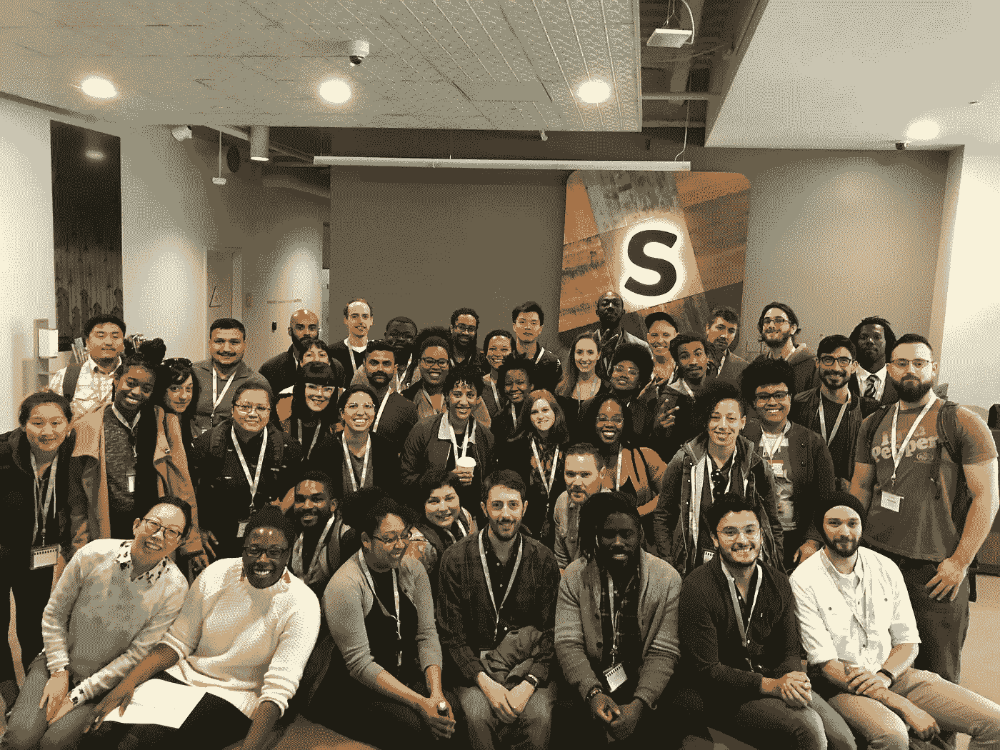
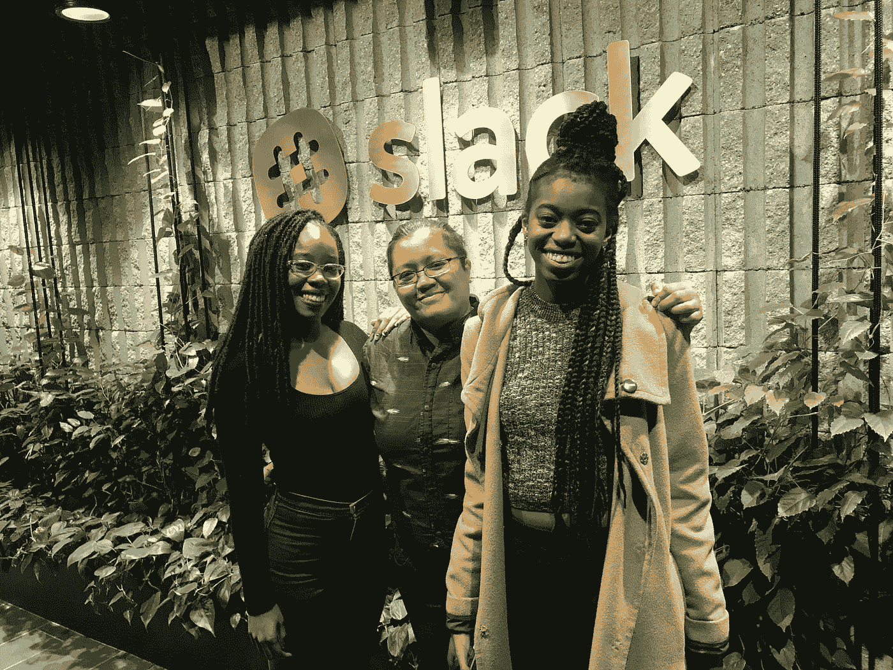
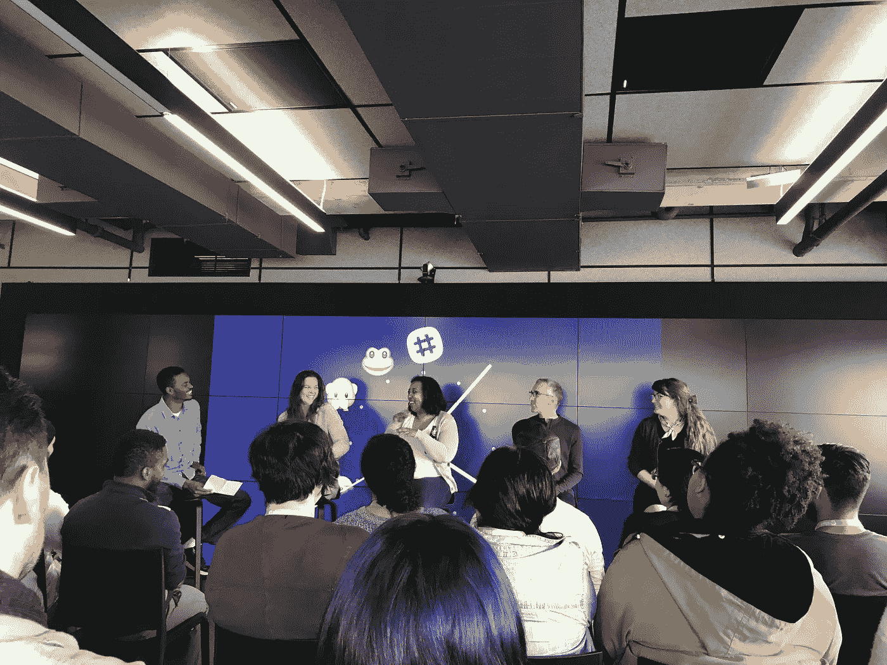
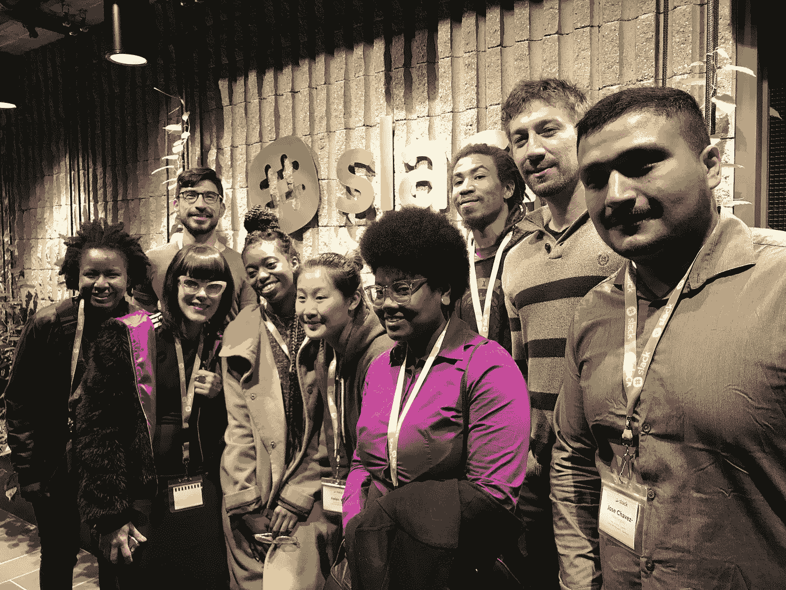

# 推进技术多元化，携手共赢

> 原文：<https://medium.com/hackernoon/advancing-diversity-in-tech-and-winning-together-7bcb7ee486c2>

学习者公会的 Slack 实地考察

Learner’s Guild at Slack

“出于极大的需要，我们都拉着手在爬山。不爱就是放手。听着，这里的地形太危险了。”

—哈菲兹

在奥克兰的一所编码学校[学习者协会](https://www.learnersguild.org/)的最后两周，我组织了一些特别的活动，这些活动标志着我在那里的怀旧和改变生活的时光。最难忘的是一次去 Slack 的实地考察。这个想法来自一位了不起的工程师、朋友和开发它的[女孩](https://www.girldevelopit.com/)分会负责人、 [Brenda Jin](https://www.linkedin.com/in/brendajin) 。喝着咖啡，我们的话题转到了性别和科技领域的多样性问题上。她不经意地提到邀请我的学校参观并问了一个问题。一个月后，多亏了 Jeunee Simon 和 Brenda，来自 Learner's Guild 的 50 名学员前往 Slack 的办公室参加为期半天的活动。

这一事件具有开创性，因为 Slack 不仅通过在招聘和保留多样化候选人的实践中成为领导者而改变了技术的面貌，而且还从整体上推动了工程的发展。他们已经证明，多元化的团队可以取得更大的成就，并成为高增长的初创企业。

> “Slack 是如何在短短两年内取得如此大的成功的？这可能与其包容性文化和企业对多样性的态度有关。” — Tobias Hardy，Launchpad

作为欠发达社区的活动家和组织者，我个人非常钦佩 Slack 如何为未被充分代表的人们提供进入科技行业的机会，这确实改变了人们的生活。他们已经建立了一个成功的品牌，并忠实于其多元化和包容性的使命。Slack 确实说到做到。

> [“有些科技公司说想要一种包容的文化，雇佣多元化的候选人，而有些科技公司就是这么做的。Slack 是后者"](http://www.launchpadrecruits.com/insight-articles/how-slack-is-doing-diversity-and-inclusivity-right)——Wayne Sutton，变革催化剂的联合创始人

学习者协会有一个相似的使命，那就是增加科技的多样性。奥克兰已经播下了希望磨练未开发的技术人才的种子。仍处于早期阶段，学习者协会积极招募不同的人才，提供资源，并使用学徒模式来开发学习者的编码技能。因此，组织一次活动，将我们这些人才与该领域的企业领导者之一联系起来，是一件令人兴奋的事情。

Learner’s Guild Students

从我们踏进 Slack 办公室的那一刻起，我们就受到了热烈的欢迎。我们参观了他们的主要办公室。我们很快注意到一些桌子旁边的气球，这是为了向新来的实习生致谢。有一种舒适的气氛。员工们可以随意停下工作问我们问题。我去过其他科技公司，那里的员工都粘在自己的工位上，这显示了专注，但也散发出一种寒冷的环境。

接下来的日程是与工程招聘经理共进午餐。两位工程经理都是有色人种。在一个安静的私人午餐室，我们可以进行小组对话。我们问了一些关于招聘流程和面试的问题，工程师们分享了他们在科技行业找到第一份工作的个人经历。这一天为我们安排得很紧，一对一的支持感觉就像和家人在一起。

Q & A with Engineers

这一天最令人惊讶的部分是问答部分，我们听到了来自非传统背景的工程师小组的问题并得到了他们的回答。我们听到了关于如何为来自相似背景的技术职业做准备，如何作为[训练营](https://hackernoon.com/tagged/bootcamp)毕业生在技术行业导航，以及如何通过有偏见的技术面试的深刻答案。当被问及女性如何通过只有男性面试官参加的技术面试时，一位小组成员给出了一条黄金建议:“找一位技术团队的女性来面试你。”

我和我的同学在旅行结束后，对我们在该行业的未来充满信心，而不是沮丧和焦虑地听到或看到只有白人或亚裔男性工程师。事实上，小组中女性多于男性。

从整个事件中最大的收获是，包容性正在成为技术领域的一个优先事项，像 Slack 这样的公司正在引领潮流，并在交付高质量软件和来自不同背景的工程师之间建立互利的关系。

就像上面哈菲兹的诗所说的，重点是我们需要彼此。在竞争激烈、利润丰厚的技术领域，为了解决技术多样性的问题，我们需要相互支持。我们需要公司优先考虑多样性，编码学校资源和磨练多样化的人才。通过我们所有人的共同努力，我们可以为所有人而不仅仅是我们中的一些人建设一个更美好的明天。