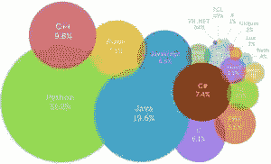
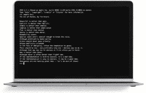
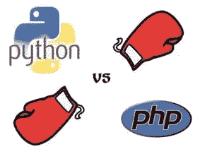

# 姜戈的优势和劣势

> 原文：<https://medium.com/hackernoon/advantages-and-disadvantages-of-django-499b1e20a2c5>

**开发最快的解决方案；姜戈-优势&劣势**

你是开发商吗？那么很明显，你要寻找最顶级的编程语言来编码。但是确定最好的语言和工具是一项艰巨的任务。你听说过姜戈吗？你知道[使用 Django](https://techeries.com/advantages-and-disadvantages-of-django/) 的优缺点吗？当你有了这个工具，一切似乎都变得非常有效和迅速。

# 为什么是姜戈？

因此，当一个特定的想法突然出现在你的脑海中，将它转换成一种语言模式并赋予它现实的形状，只需要几分钟，当你在这里做这件事的时候，[在姜戈](http://steelkiwi.com/blog/why-django-best-web-framework-your-project/)的帮助下。凭借其免费和开放的源代码，它使 web 开发过程变得非常容易，开发人员可以完全专注于设计过程并提高性能。因此，Django 成为初创公司的理想工具，这些公司需要网页设计，以展示公司的真正概念和前景。

# 聚光灯下的姜戈

它标志着它在 2005 年的诞生，并且无可争议地成为帮助开发者在几分钟内完成工作的最好的框架之一。最初，Django 将自己的旅程标记为 Python 语言的框架，使用正确的功能，很好地降低了 web 应用程序的复杂性，为它提供了一种更简化的方法。

# Python 及其受欢迎程度

众所周知，Python 是最顶尖的编程语言之一，因为它的易学性、设计性和灵活性，使它成为最令人惊叹的编程语言之一。有理由使它成为最受欢迎的选择之一。

*   *简单易学*
*   *清晰易读*
*   *多才多艺*
*   *快写*
*   *设计上没有明显的孔洞*

然而，Python 有自己的哲学，被称为“Python 的禅”。这种理念赋予了它一种其他编程语言所没有的独特形式。基于这些原则，开发人员可以创建高质量的代码。代码表示如下。

# Django 的优势

尽管关于 Python 及其优势已经说了很多，但现在让我们来关注 Django 的优势，它不仅是 web 开发的快速解决方案，它交付高质量代码和透明编写的能力也为客户、企业甚至开发者提供了正确的平台。

*   快速: *这是为了帮助开发者尽可能快地开发应用程序而设计的。从创意、制作到发布，Django 帮助实现成本效益和效率。因此，对于主要关注截止日期的开发人员来说，这是一个理想的解决方案。*
*   **完全加载:** *它的工作方式包括几十个额外的功能来帮助用户认证、网站地图、内容管理、RSS 订阅等等。这些方面有助于完整地执行 web 开发过程。*
*   **安全:** *当你在 Django 中做的时候，保证开发者不会犯任何与安全相关的错误。一些常见的错误包括 SQL 注入、跨站请求伪造、点击劫持和跨站脚本。为了有效地管理用户名和密码，用户认证系统是关键。*
*   **可扩展:** *满足最重的流量需求，Django 框架的好处可见一斑。因此，最繁忙的站点使用这种介质来快速满足流量需求。*
*   **多才多艺:** *内容管理、科学计算平台，甚至大组织，所有这些方面都通过使用 Django 得到了非常高效的管理。*

# PHP 与 Python

PHP 可能是最强大的竞争对手，两者都非常受欢迎。但是 Django 比 PHP 有很多优势，这使得前者成为开发人员最喜欢的选择。决定哪一个是最好的并不那么简单，但是这些比较将帮助你这样做。

1.  更好的设计虽然 PHP 是专门为网页设计设计的，但是 Django 基于更健壮的语言。所以，要写一个好的代码，用 python 比用 PHP 更容易。
2.  **Python 和长期** : *PHP 在*短期*比较好。然而，当你完成初始阶段时，你将需要一种深刻而持久的语言的帮助。那就是 Python 担任* *角色时的* [*。*](https://www.netsolutions.com/insights/10-reasons-why-python-scores-over-php-for-web-development/)
3.  **更好的 Web 框架** : *由于有太多伟大的框架，市场变得支离破碎。但是尽管框架有一个前期* ***成本*** *，它应该有一个长期价值。在这里，姜戈是明显的赢家。*
4.  **可读性因素:** *PHP 遵循了一种经典的方法，其中 Python 有更严格的标识实施。因此是最好的。*
5.  更简单的语法: *用 Python 来做的话，方法要简单得多，代码也很容易。*
6.  **调试工具**:*Python 包自带的工具足以处理问题。*
7.  **包管理**:*Python 很好，通过它可以编写、读取和共享包，其他开发者可以很容易地在其他应用程序中使用它。*
8.  **Python 是“通用的”**:*PHP 主要用于网页，而另一方面*Python 可以用于通用目的，你可以在线和离线工作。

# 不足之处

伴随优势而来的是劣势。下面提到的 Django 有很多缺点。

*   *使用路由模式指定其 URL*
*   姜戈太铁板一块了
*   *一切都基于 Django ORM*
*   *组件一起部署*
*   工作需要完整的系统知识。

尽管 Django 有许多优点和缺点，但是，当考虑一个有截止日期的项目时，为项目使用 Django 提供了最终的解决方案。为了进一步加快速度，可以安装自定义用户模型配置。更早的时候，开发一个代码需要很多时间；在它的帮助下，事情变得简单多了。开发成本降低了近 80%,外包被彻底粉碎。

但是等等，这样够好了吗？可以肯定的是，一些国家现在肯定会尝试外包 Django。对谁呢？嗯，低技术和价格的开发人员。

> [黑客中午](http://bit.ly/Hackernoon)是黑客如何开始他们的下午。我们是 [@AMI](http://bit.ly/atAMIatAMI) 家庭的一员。我们现在[接受投稿](http://bit.ly/hackernoonsubmission)并乐意[讨论广告&赞助](mailto:partners@amipublications.com)机会。
> 
> 如果你喜欢这个故事，我们推荐你阅读我们的[最新科技故事](http://bit.ly/hackernoonlatestt)和[趋势科技故事](https://hackernoon.com/trending)。直到下一次，不要把世界的现实想当然！

