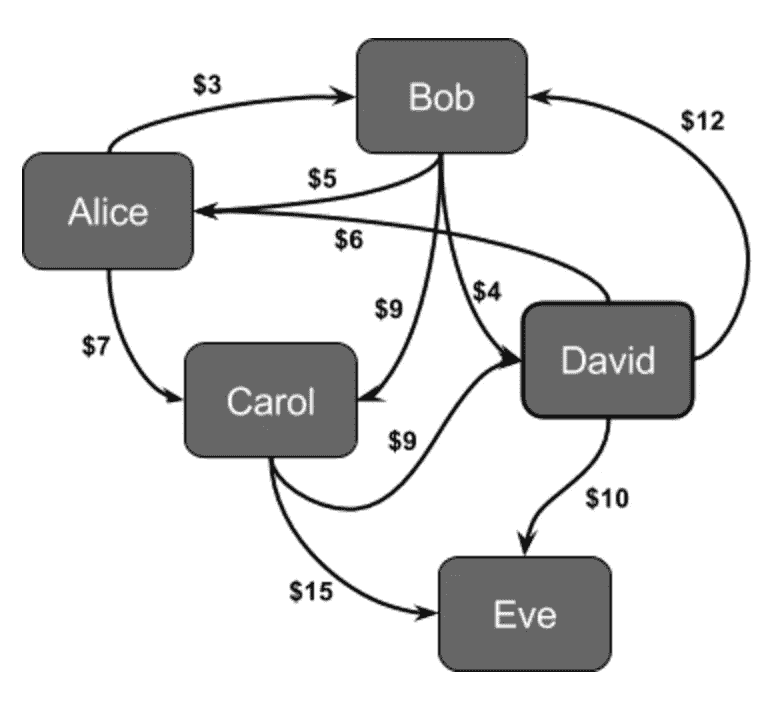
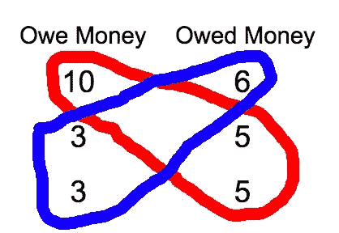
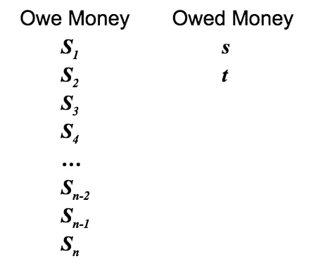
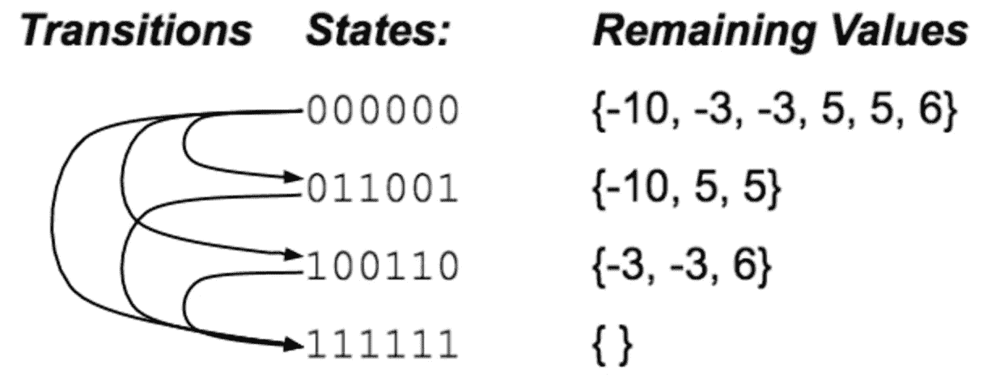
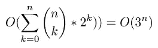

# 编程面试中的冒险:误导性(NP-)难题

> 原文：<https://medium.com/hackernoon/adventures-in-programming-interviews-misleadingly-difficult-np-hard-problem-43092597018c>

A directed graph denoting debts between five participants

当时已经很晚了，有些人会认为是晚上，我已经连续面试了五次；这家公司没有提供真正的喘息机会；一些面试官问我是否需要休息，但这些问题往往只有一个“正确”的答案。我真的很累。剩下的只是一对面试官的算法面试。

他们问了这个简单的框架问题:

> 给定一份两人之间的债务清单，尽可能减少清理所有债务所需的交易数量。

我最终得到了一份工作，但我在这次面试中表现糟糕。我最初的直觉是这是一个图形问题，也许是 NP 难的。我的第二直觉是，他们不会为一个简单的软件工程角色问一个 NP 难的问题。这是假设我的面试官完全理解他们问的问题。

# 他们的解决方案

后来，我和其中一位面试官成了朋友，并了解到他们的想法是这样的:

1.  请注意，重要的是人们接受或支付使他们变得完整所需的金额，而不是这些钱从哪里来。例如，如果爱丽丝欠鲍勃 20 美元，鲍勃欠卡尔 20 美元，那么这些债务可以通过爱丽丝给卡尔 20 美元来清偿，尽管爱丽丝从未直接欠卡尔任何钱。
2.  将每个人的债务减少到一个数字，例如，如果爱丽丝欠 3 个人每人 20 美元，2 个人欠爱丽丝每人 50 美元，那么爱丽丝被欠 40 美元(-$20 x 3 + $50 x 2 = $40)。删除债务为 0 美元的人。
3.  将欠钱的人和欠钱的人分成单独的排序列表或排序数据结构，然后从每个类别中的最高值开始，将他们配对，并重复此操作，直到列表用尽。

那天沮丧的回家，后来更深入的分析了这个问题。这个问题无疑是 NP 难的。这是一个有趣的问题，但不适合软件工程面试。

观察和还原是正确的。贪婪的解决方案不是。在上面的步骤 1 和 2 之后，考虑这个反例:

The optimal perfect groupings are drawn in blue and red

*   有三个人分别欠了 10 美元、3 美元和 3 美元。
*   有三个人分别被欠 6 美元、5 美元和 5 美元。

正确的解决方案是 4 个事务，其中 6 将与两个 3 配对，10 将与两个 5 配对。贪婪方法产生 5 个事务。

每笔交易可以消除 1 或 2 个参与者。最优解使可以消除 2 个参与者的交易数量最大化。让我们称一个**完美分组**为一组欠债务和被欠债务的参与者，它们可以被配对在一起而没有余数。每个完美的参与者分组引入一个可以消除 2 个参与者的交易。

最佳解决方案将找到两个完美的分组，($10 | $5，$5)和($3，$3 | $6)。贪婪的解决方案只会发现每个人都是一个完美的组合($10 $3 $3 | $6 $5 $5)。

# **NP-硬证明**

为了证明这个问题是 NP 难的，大家熟知的[子集和问题](https://en.wikipedia.org/wiki/Subset_sum_problem)，也就是 [NP 完全](https://en.wikipedia.org/wiki/NP-completeness)，可以[化简](https://en.wikipedia.org/wiki/Reduction_(complexity))为这个问题，从而证明这个问题至少和子集和一样难。子集和问题是一个[决策问题](https://en.wikipedia.org/wiki/Decision_problem)，其中，给定一组整数 ***S*** 和一个目标整数 ***s*** ，是否存在一个 ***S*** 的非空子集，其和为 ***s*** 。这种约简将使用子集问题的正变型，其中 ***S*** 和目标整数 ***s*** 的所有元素都是正的。

The subset sum problem reduction visualized

这是还原:

1.  将整数集合 ***S*** 转化为参与者各自所欠债务的整数值。
2.  添加两个被欠债务的参与者 ***s*** 和 ***t*** ，其中 ***t*** 是集合 ***S*** 减去 ***s*** 中所有整数之和。这确保了债务总额和欠款总额是平衡的。
3.  计算清偿所有债务所需的最小交易数。 ***n*** 是欠钱的参与者数量，例如设置 ***S*** 的大小。约化问题有 ***n + 2*** 个参与者。因为只有两个人被欠了钱，所以最多只能有两个完美的组合。如果找到 2 个，那么需要的最小事务数是 ***n*** ，并且有一个 ***S*** 的非空子集总计为 ***s*** 。如果是 ***n + 1*** ，那就没有。

通过上面的归约，这个问题可以决定子集和问题，也就是说这个问题至少和子集和一样难。这个问题是 NP 难的。QED。

# 解决方案

解决方案是最大化完美分组的数量以最小化事务的数量，因为每个完美分组将清除所有债务所需的事务数量减少 1。当没有完全匹配的严格子集时，整个解决方案就变成了一个完整的分组。换句话说，解决方案是最大化总计为 0 的不同子集的数量。

Stepping through the above counterexample to the greedy solution. Invalid states are not drawn in this visualization (there are 60 undrawn states).

这是我找到的解决方案:

1.  把每个个人的债务减少为他们欠集体的债务的一个单一数字，那些被欠债务的人把他们的债务表示为负数。
2.  删除债务减少值为 0 的人员。设 ***n*** 代表移除后剩余的参与者数量。
3.  使用一个位掩码来表示状态，它是一系列长度为 n. 0 的 0 和 1，在第**位 T5【I***第*位表示第 ***i*** *第*位参与者的债务尚未结清，1 表示第 ***i*** *第*位参与者的债务已经结清。有 2^n 这样的状态:所有的 0 代表没有清偿债务的开始状态，所有的 1 代表所有债务清偿的结束状态。
4.  每个状态映射到一个整数，表示非空子集和的最大数量。所有 0 都没有非空的子集和，因为没有已结清的债务，所以值为 0。
5.  创建一个方法，接受给定的状态，以及来自未结算参与者债务的所有子集总和。对于找到的每个子集和，将这些位翻转为 1 以表示它们已经被解决，并使用新状态递归调用相同的方法。
6.  调用初始状态全为 0 的方法。
7.  与将被高速缓存/记忆的每个状态相关联的整数值是到达该状态所花费的来自所有 0 的递归调用栈的最大深度，表示最长的链(以及找到的最大数量的非空子集和分组)。高速缓存/记忆将确保没有状态被计算两次。
8.  找出所有 1 的整数值。这个问题的解决方案是参与者的数量减去这个数字，

运行时分析:在每个状态，都需要 2^k 运算，其中 k 是要考虑的未结算参与者债务的数量。对于给定的 k，有(n 选 k)个状态。预先计算所有可能的和，并将它们存储到查找表 O(2^n).中使用预计算的查找表，每个状态有 O(2^k 运算，该算法的最大运行时间是:

很好的解释了为什么两边相等可以在这里找到[。该算法将占用 O(2^n 空间，因为存在 O(2^n 状态和 O(2^n 总和。](https://math.stackexchange.com/questions/1679305/prove-sumn-k-0n-choose-k-2k-3n)

# 然后

最令人沮丧的是，我的面试官认为这个问题比实际要简单得多，并报告说我无法在 45 分钟内解决这么简单的问题。这个特别的面试严重伤害了我收到的录用通知。不幸的是，面试过程中有很多运气，因为生活中有很多运气。最好的办法是学会不要假设面试官完全理解他们自己的问题，并就此写一篇博文。

*谢谢丹尼尔·乏色曼帮我看完这篇文章！*