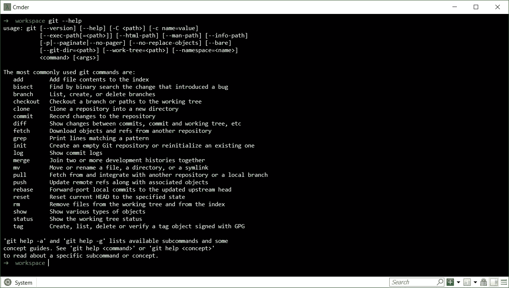
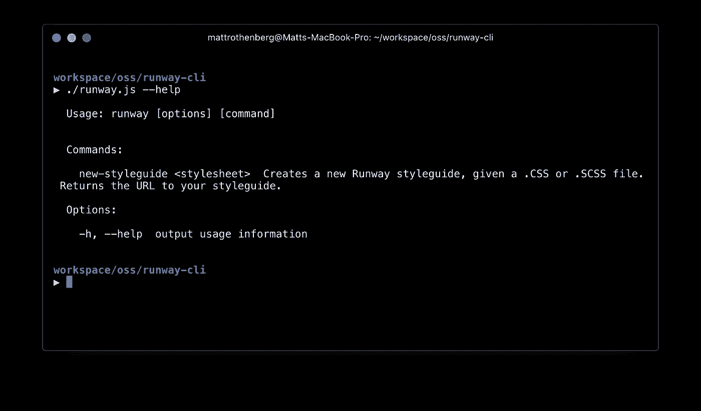
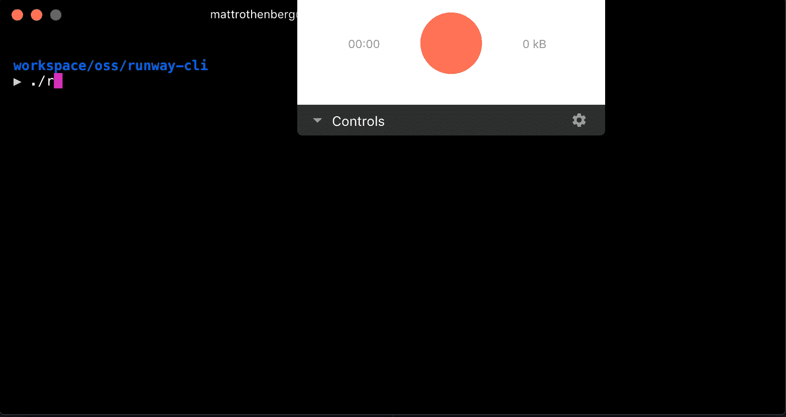
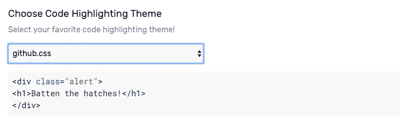
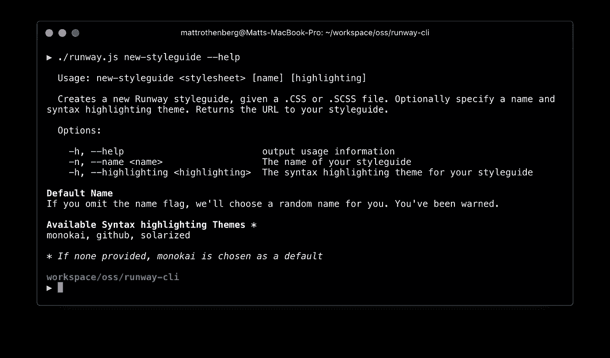
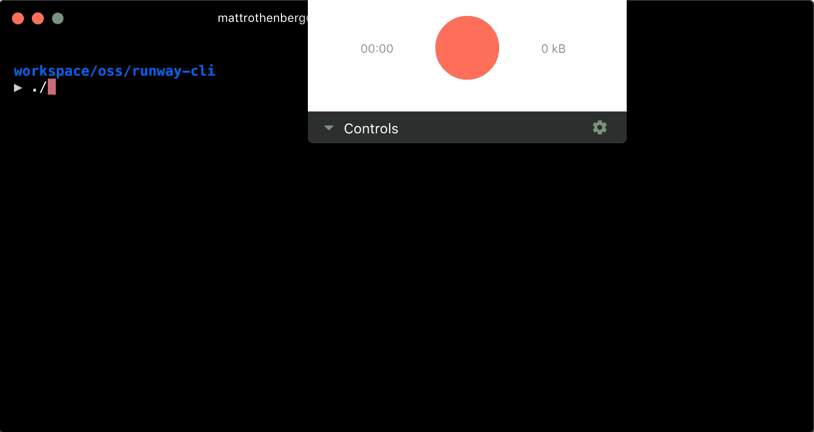

# 构建命令行界面原型的冒险

> 原文：<https://medium.com/hackernoon/adventures-in-prototyping-a-cli-e95aff625b42>

作为一名负责编写代码的“[设计师”，我积极寻找编码能够促进我工作的方法。直到最近，我一直认为代码原型是完全保留给图形用户界面(UI)设计世界的活动。](https://cdn-images-1.medium.com/max/1000/1*9-8WI6cwQ0KLFY93Qr7uHQ.png)

伙计，我错了。在收到关于我的副业项目[帮助设计师和开发人员构建生活风格指南](http://runway-app.cfapps.io) (Runway)的反馈后，我很快了解到快速原型和可用性测试的技术可以很容易地应用于任何工作流或界面，例如开发人员在工作中常用的命令行界面(CLI)。

The ‘help’ output of Git’s CLI

这是一个令人兴奋的发现。在我作为一名设计师的经历中，我享受了无数的机会来设计 ui 原型，并围绕特定的工作流程和功能进行可用性测试。然而，在此之前，我从未踏上构建和测试 CLI 工作流的旅程。不知道从哪里开始，我卷起袖子，向一个熟悉的朋友寻求代码原型，Javascript。

在这篇文章中，我将(从较高的层次上)向您介绍我对应用程序中的一个主要工作流进行原型化和测试的过程:给定一个源文件和一些配置参数，创建一个 styleguide。

> 如果一张图片抵得上一千个字，那么一个原型就抵得上一万个。原型超越了展示和讲述的力量——它们让你体验设计([原型，从业者指南:托德·扎基·沃菲尔](https://www.amazon.com/Prototyping-Practitioners-Todd-Zaki-Warfel/dp/1933820217)

## 语境

反馈是改进的生命线，自去年发布以来，t 台团队收到了大量反馈。事实上，最常被问到的问题之一是:

> " Runway 什么时候支持通过 CLI 工具或 API 创建风格指南？"

从一开始，我们就期待这个反馈。在假设*设计者*将是我们的主要用户——他们会回避完全基于 CLI 的体验(例如 [Hologram](https://github.com/trulia/hologram) )的情况下，我们特意将我们的第一次迭代集中在全面的 UI 体验上。

然而最响亮的反馈来自*开发者*，他们正在寻找一种轻量级的方式来构建生活风格指南——特别是一种可以自动化或容易集成到现有 CI/CD 设置中的方式。此外，两组用户都对 Runway 的价值主张“立即从样式表转换到样式指南”需要多少步骤感到沮丧

输入我的(无可否认的)自我放纵计划:设计一个可供设计者和开发者使用的 CLI 体验原型，并进行用户测试以评估其可行性和可用性。

## 这个计划

由于在没有用户反馈的情况下构建一个*功能性* CLI 工具既危险又昂贵(就开发工作而言),我试图做我作为一名设计师最擅长的事情:构建一个廉价的、假的“原型”,可以用来征求反馈并降低未来开发工作的风险。如果我们完全诚实的话，我知道我不具备以有效的方式构建功能性 CLI 的技术能力。面对这样的困境，我采用了一个屡试不爽的设计策略:假装直到你成功。

作为一名 Javascript 爱好者，我调查了推荐的 CLI 工具，并很快找到了基于节点的 [**Commander.js**](https://github.com/tj/commander.js/) 。使用基于节点的工具意味着我可以自由支配 NPM 的世界，使我能够使用诸如[**colors . js**](https://github.com/marak/colors.js/)**(用于花哨、多彩的终端输出)和 [**节点微调器**](https://github.com/helloIAmPau/node-spinner) (用于在模拟的异步动作中显示微调器)。**

## **入门指南**

**像大多数节点项目一样，我首先生成一个`package.json`文件，并将前面提到的三个依赖项保存到其中。根据 Commander 的自述文件，我创建了一个名为`runway.js`的文件，并准备制作原型。**

**对于上下文，Runway 用户目前可以通过上传带有特殊格式评论的 CSS/SCSS 文件来创建风格指南。他们可以给自己的样式向导起一个名字，并且能够指定:A)一个布局；以及 B)语法突出显示主题。**

**我想以迭代的方式构建 CLI 体验的原型，知道我们花了多长时间到达上述 UX。因此，我设想从一个`new-styleguide`命令开始，该命令将接受一个参数——一个样式表——并向用户返回一个 URL。**

**Commander 的机制相当简单。您定义一个`command`，提供一个可选的`description`和一组`options`，并将其映射到一个`action`(这是一个 Javascript 函数)。**

**Iteration 1**

**Commander 最酷的特性之一是它会自动构建一个`help`页面，列出所有命令及其各自的语法。因此，在我的终端中输入`./runway.js --help`,我得到了下面的输出。**

****

**HALP**

**得分！随着事情的进展，我开始着手创建一个新的风格指南来处理 UX。对于快乐之路，用户应该能够提供一个源样式表，并得到其样式指南的 URL 作为回报，格式如此`http://runway-app.cfapps.io/styleguide/:id`。使用一些 Javascript 魔法，我为 URL 的`:id`参数生成了一个随机数。**

**Stylesheet in, URL out.**

****

**Happy path!**

## **增添情趣**

**在现实世界中，创建样式指南可能需要几秒钟的时间。为了向用户保证 Runway 正在处理他们的请求，如果我们展示某种带有信息的 spinner 会怎么样？我利用了前面提到的库， [**Colors.js**](https://github.com/marak/colors.js/) 和 [**Node-Spinner**](https://github.com/helloIAmPau/node-spinner) 来实现这个效果。**

**Using setTimeout to simulate an asynchronous action**

****

**Async, methinks.**

## **越来越花哨**

**通过 Runway UI，用户可以指定他们的样式指南的名称，并选择一个语法突出显示主题。Commander 让用户可以轻松地将这些值作为`options`传递，并提供了一种机制来设置默认值(如果他们忽略了一个值的话)。Commander 还允许我们在`command`的基础上定制帮助消息，这意味着我们可以向我们的最终用户传达特定操作的复杂性(或我们所采取的自由)。**

**在这种情况下，我希望允许用户在三种语法高亮显示主题之间进行选择，即`monokai`、`solarized`和`github`，如果没有指定，则默认为第一种。但是由于这种 CLI 体验缺乏 web UI 中的启示，我觉得有必要在`new-styleguide`命令的`help`菜单中传达这个决定。令人欣慰的是，Commander 公开了一种简单明了的方法。**

****

**Selecting a syntax highlighting theme through the UI**

**What a thoughtful API**

****

**HALP, redux**

****

**Final Product**

## **用户测试**

**我仍在围绕这一体验进行用户测试，围绕以下[任务场景](https://www.nngroup.com/articles/task-scenarios-usability-testing/)设计可用性会议:**

***你团队中的设计师刚刚给你的应用程序的主样式表(main.css)添加了一些 Runway 注释，你需要为他生成一个新的 styleguide。您刚刚在全球范围内安装了* `*runway*` *CLI。***

**毫不奇怪，考虑到任务的范围，开发人员很大程度上能够轻松地生成一个样式指南。我最大的收获是开发人员非常依赖`help`菜单来熟悉这个新的 CLI 工具。考虑到基于 CLI 和命令的工具缺乏启示，这是有意义的。但是看到一些开发人员遵循*完全相同的*步骤来加快速度并最终完成任务是很有启发性的。**

**这是一次非凡的学习经历，它展示了将迭代设计、快速原型和用户测试技术应用到非用户界面的媒介上是多么容易。**

**我在这篇文章中涉及了很多内容，并且不可否认地提到了很多细节。如果您对这个工作流程的任何特定方面感兴趣(无论是编码还是流程相关)，请告诉我。我非常乐意聊天。**

**如果我在这里已经完成了我的工作，我已经表达了用代码原型化 CLI 体验是多么容易。这并不是说代码是这种努力的最佳(或唯一)工具。正如我们设计师所知，原型工具和技术*比比皆是*。最终，一个人对工具的选择应该是以下因素的函数:**

*   **为了检验一个假设而需要的设计或交互的保真度**
*   **一个人对原型制作媒介的熟练程度——可以是代码、纸张、视觉设计等。**

**虽然我没有在这个场景中探索原型的替代方法，但我相信我们可以将迭代设计的技术和严谨性应用于 CLI，就像我们对基于 UI 的体验所做的那样。**

****链接****

** [## mattrothenberg/runway-cli

### 在 GitHub 上创建一个帐户，为 runway-cli 开发做出贡献。

github.com](https://github.com/mattrothenberg/runway-cli) 

> [黑客中午](http://bit.ly/Hackernoon)是黑客如何开始他们的下午。我们是 AMI 家庭的一员。我们现在[接受投稿](http://bit.ly/hackernoonsubmission)并乐意[讨论广告&赞助](mailto:partners@amipublications.com)机会。
> 
> 如果你喜欢这个故事，我们推荐你阅读我们的[最新科技故事](http://bit.ly/hackernoonlatestt)和[趋势科技故事](https://hackernoon.com/trending)。直到下一次，不要把世界的现实想当然！

**