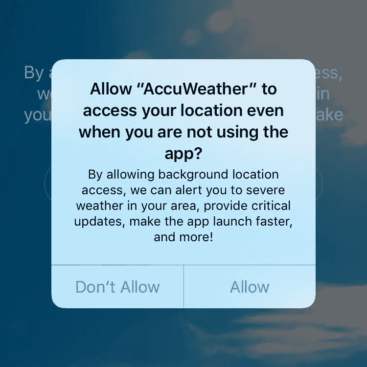

# 咨询:AccuWeather iOS 应用程序向数据货币化公司发送位置信息

> 原文：<https://medium.com/hackernoon/advisory-accuweather-ios-app-sends-location-information-to-data-monetization-firm-83327c6a4870>

Alert when requesting access to GPS information on iOS, from my [twitter thread](https://twitter.com/chronic/status/898356025262321664) on this finding

用于 iOS 的 AccuWeather 应用程序在为用户提供本地化的恶劣天气警报、关键更新和更快启动时间的前提下请求位置访问。授予对位置信息的访问权限还将导致应用程序向“[revealmobile.com](https://revealmobile.com)”发送以下信息:

*   您的精确 GPS 坐标，包括当前速度和高度。
*   您当前连接的 Wi-Fi 路由器的名称和“BSSID ”,可用于通过各种在线服务进行地理定位。
*   您的设备是否打开了蓝牙。

在 36 个小时的测试期间，特别是当 AccuWeather 应用程序不在前台时，我的测试 iPhone(位于办公楼的桌子上)向 RevealMobile 发送了 16 次上述信息，大约每几个小时发生一次。

## 什么是 revealmobile.com？他们是做什么的？

从他们的[网站](http://revealmobile.com):

> 我们将移动定位信号转化为高价值受众。不管有没有广告，你都能创造更多的移动收入。

这读起来是一个非常高层次的描述，没有任何技术信息。让我们深入了解一下。在[这一页](https://revealmobile.com/profit-data-location-mobile-shoppers/)，我们发现了另外一些有趣的说法:

> 通过将位置数据的用例扩展到购物前和购物后的体验，全新的可能性为在线和离线零售商打开了大门。价值在于理解消费者的路径以及他们一天中去了哪里。从家到工作场所、零售场所、足球训练场所到晚餐的旅行对于了解客户至关重要，并且代表了移动位置数据的新机遇。

然后…

> 位置数据还告知客户的家庭和工作位置。将该信息与现有的人口统计目标标准配对，使得零售商能够基于两个最相关的位置来锁定具有高访问倾向的消费者。

RevealMobile 提到了洞察用户在哪里生活、工作和经常去的地方的能力。如果支持此功能的数据源不清楚，请参考本[案例研究](http://www.mmaglobal.com/files/casestudies/the_location_of_black_friday_-_revealmobile.pdf)，其中 RevealMobile 提供了解释:

> 我们的技术存在于美国数百个应用程序中。它将来自这些应用的位置数据转化为有意义的受众数据。我们监听纬度/经度数据，以及设备何时“撞上”蓝牙信标。以下页面显示的数据反映了 2016 年 11 月 25 日星期五我们在零售点看到的 102，535 个选择加入的位置共享移动设备。

“来自这些应用程序的位置数据”将会是你精确的 GPS 坐标(在更合理的天气警报伪装下授予的访问权限)，以及 Wi-Fi 路由器名称/BSSID。如果您不授予 AccuWeather 访问您的 GPS 信息的权限，它仍会发送您的 Wi-Fi 路由器名称和 BSSID，提供对有关您设备所在位置的不太精确的位置信息的公开移动访问。另一家公司的这种做法似乎已经引起了联邦贸易委员会的注意。

## 嵌入了 RevealMobile 的其他 iOS 应用程序

我目前还无法确认 RevealMobile 的技术“存在于数百个应用中”。我能够识别出 40 多个嵌入了 RevealMobile 技术的应用，但在通过拦截代理运行每个应用的最新版本以分析所有发送的数据后，我只能在其中一个应用中观察到类似的对“revealmobile.com”的回调: [Frank 的 KPRC 天气预报应用 2](https://itunes.apple.com/us/app/franks-forecast-weather-app-from-kprc-2/id706099493?mt=8) 。

我将继续深入研究这个问题，并希望在未来写一篇更全面的帖子，其中将包括更多为移动应用程序提供类似基于位置的跟踪代码的公司的信息，以及嵌入这种代码的应用程序的信息。

## 雷达

rdar://problem/33975145

## 接触

如果你对这一发现有任何进一步的疑问，请随时给我发推文([慢性](https://twitter.com/chronic))或电子邮件(will@wstraf.me)。