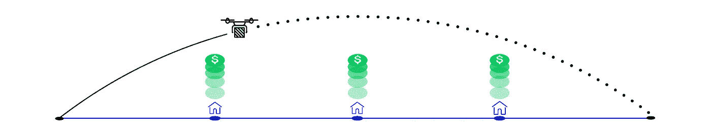
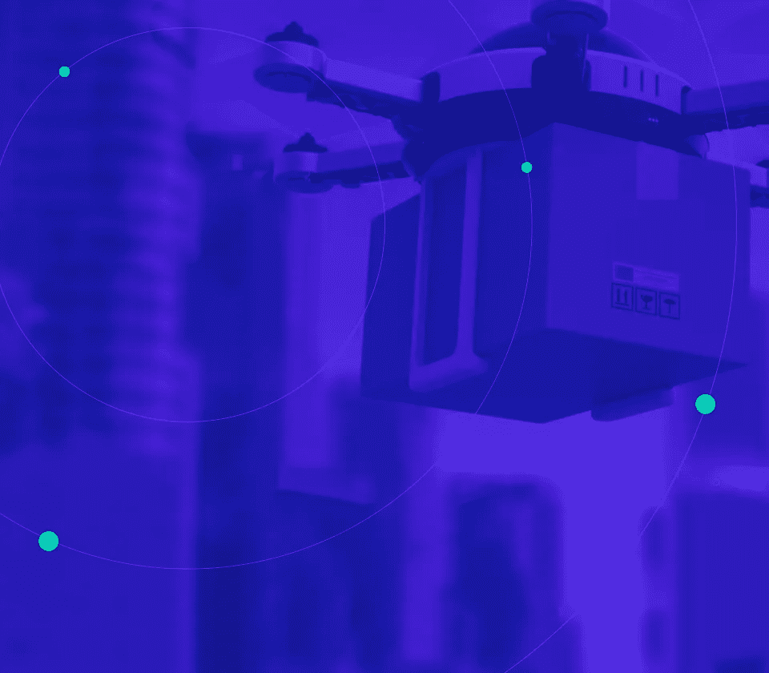
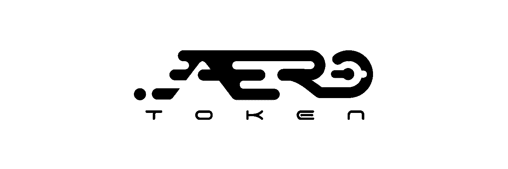

# AERO:使用区块链实现无人机高速公路

> 原文：<https://medium.com/hackernoon/aero-token-enabling-the-drone-superhighway-using-the-blockchain-ce2cf5004a10>

*使用区块链的无人机送货和飞行测绘*

AERO Token: Chain of Connectivity

在一个才华横溢、非常敬业的 [**团队**](https://aerotoken.com/team) 几个月的默默工作之后，很高兴推出 [**AERO Token**](https://aerotoken.com/) **，**一项基于以太坊的区块链技术，它将 ***在美国境内实现无人驾驶公路基础设施。***

**从空域开始，将共享经济的各个方面转移到区块链，这是对区块链的高影响力、真实世界的使用，将从根本上改变共享经济。**

> ***AERO Token 提供了缺失的技术和法律机制*** 必要的技术和法律机制，使财产所有者能够并方便地同意无人机在私人财产上空低空飞行。

## 通过利用区块链， [**AERO Token**](https://aerotoken.com/) 通过证明私有财产上的**未充分利用的资产**、*空域*可以很容易地被利用来产生收入，从而增强了共享经济。

# **问题:**

在美国，无人机操作员需要获得许可，才能在不侵犯私人财产的情况下低空飞行，并且对商业无人机服务(即包裹递送)有很大的需求。

根据纽约时报*报道，86%的美国包裹重量在 5 磅以下。并且可以由无人机处理，这将快速加速零售商到消费者的交易，同时提供缓解交通拥堵和降低物流服务环境影响的额外好处。*

# ***解决方案:***

*AERO Token 使主机(即财产所有者)能够授权其财产进行商业无人机通行权操作。*

*参与者可以通知区块链他们的空域是可用的，使他们未充分利用的资产(即空域)成为创收的来源，并使其潜在价值最大化。*

# *航空网络飞行路线和连接链*

***AERO Network** 将作为商业无人机服务提供商的可导航空域的储存库，利用区块链广播可用空域，将主机与无人机服务提供商相匹配，并确保对适当的 AERO Network 参与者进行补偿。*

*航空网络飞行路线将根据航空网络上的可用通行权来确定。无人机服务提供商可以从 AERO 网络上的菊花链可用空域绘制连续的飞行路线，实现不间断的飞行路线。*

*请参阅 Chase Perkins、Eric Wroble 和 Hayley Halpin 撰写的 [***AERO Token 白皮书***](https://aerotoken.com/aero-white-paper.pdf) 。*

# *[**航空令牌预售开始时间:2017 年 9 月 25 日**](https://aerotoken.com)*

***航空代币预售价:** 0.000085 BTC*

***航空代币固定供应量:** 1，000，000，000(“10 亿航空代币”)*

***预售期间提供:**高达固定代币供应总量的 33%*

***航空代币筹集目标:** 25，000 BTC*

**

*[**AERO Token**](https://aerotoken.com) 是一种基于以太坊的区块链技术，它使财产所有者(即主机)能够向授权的无人机服务提供商授予临时通行权地役权，以换取收入。*

**