# 情感计算:过去不完美，未来有影响

> 原文：<https://medium.com/hackernoon/affective-computing-past-imperfect-future-impactful-13e4a8836137>

卡尔·卡丽

## 情感计算的科学和商业是一个快速增长的数十亿美元的产业。这个饱受道德和隐私问题困扰的领域有着肮脏的过去和光明的未来。*情感计算*一个最近创造的术语将在未来十年内以一种戏剧性的方式颠覆许多行业，包括智能手机、客户关系管理(CRM)、安全、医疗保健以及虚拟现实(VR)和机器人行业。有一小群创业公司将帮助引领潮流。

我们被情感和理性思维所驱使。事实上，研究支持感知和决策有一个共同的关键组成部分:情绪。可以说，一个完全实现的情感计算设备将能够比我们更好地理性和感性地获取信息。

一个星际迷航的类比:在新的《星际迷航发现》中，迈克尔·伯纳姆是一个在瓦肯文化中长大的人，被教导要摆脱情感自我，支持纯逻辑。她努力接受这个概念，即她需要她的瓦肯人*逻辑*以及她的人类*情感*层来实现自我。同样，人工智能(AI)也不会达到其最高水平的有效性，直到两者都被整合到其决策中。

Figure 1: Star Trek Discovery’s Michael Burnham — harnessing her emotions and her logic

我们都能察觉到一张快乐的脸，并对此做出反应。

但是，我们中的许多人可能会错过微妙的视觉线索。我们可能会忽略训练有素的心理学家或联邦调查局官员可能察觉到的语调的细微变化。我们都会错过只有电子传感器才能捕捉到的温度、皮肤电或红外信号的微小变化。情感计算的潜力是快速处理所有情感副产品信息，并与人工智能集成以做出理性决策。

对面孔做出反应是我们已经做了很长时间的事情。

早在公元前 500 年，毕达哥拉斯就根据学生看起来有多有天赋来接受或拒绝他们。一些人认为毕达哥拉斯开创了相学——曾经解雇了一个名叫赛昂的潜在追随者，因为对毕达哥拉斯来说，他的外表表明了令人讨厌的性格。

尽管相面术有着悠久的历史渊源和受欢迎的程度，但在 1597 年它还是被认为是一种巫术。但这并不是这个术语特殊历史的全部终结，因为它已经以一种更科学的方式在现在被称为情感计算的科学中复活了。

情感是人类体验的核心。在技术出现之前，甚至在语言出现之前，我们的情感在交流、社交和决策中扮演着至关重要的角色。今天，情绪仍然是我们是谁以及我们如何交流的核心。因此，它是我们与世界互动的最自然的方式，并引导我们建立与机器交流情感的方式。这座情感桥梁将从我们的智能手机开始。

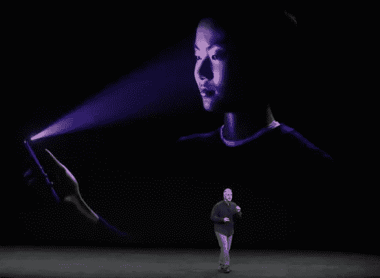

Figure 2: iPhone X Launched with FaceID Recognition as a precursor to other facial expression recognition capabilities

现代智能手机可以数字化人脸，并在专门的处理器上应用机器学习算法，以改善人类已经做了亿万年的事情——识别人脸。尤其是 iPhone X，它使用了一种 3D 人脸模型，这种模型依赖于基于固定面部特征(包括骨骼结构)的比较测量，而不是像头发或肤色这样可以随着染料和化妆而变化的特征。FaceID 使用一套传感器来绘制你的三维脸图，并用红外光照亮你的脸，同时一个投影仪向它投射一系列红外点。红外相机拍摄这些点的图像，iPhone X 根据已经存储的面部照片验证你的身份。

# 序言:创新之弧

配备高保真麦克风、高清摄像头和强大传感器阵列的智能手机，正在接受我们仅仅使用它们就为它们创造的海量数据的训练。

很快，面部情绪识别将会出现在消费者面前，他们不仅仅希望能够为他们的移动设备进行身份验证，他们还希望现有的应用程序，如脸书、Snapchat 和 Twitter，能够为他们理解图像。人们看到了什么？他们在做什么？他们在想什么？

在不久的将来，智能手机也将开始解读你的肢体语言，以确定你的感受并做出相应的反应，就像我们凭直觉彼此交流一样。情绪智能将融入我们每天使用的技术，在后台运行，使我们的技术交互更加个性化、相关和真实。

情感计算的创新弧高度依赖于一些初创公司和大型智能手机、汽车和家庭自动化公司的成功，如苹果、谷歌和三星。情感计算与数据科学和谐共存，需要相似的数据集、分析工具和 GPU 来处理。苹果收购了面部情绪检测的早期创业公司之一 Emotient。许多其他主要的技术公司都在投资情感领域，特别是亚马逊在 AWS 上的识别能力，微软的情感 API，IBM 的语气分析器都值得注意。最近，脸书收购了 Faciometrics，以增强他们将情绪分析嵌入脸书的能力。

10 月，英伟达发布了其每秒处理超过 320 万亿次运算的新驱动 PX Pegasus 芯片；这是其前身性能的 10 倍以上。英特尔正在开发新的神经形态芯片。神经形态芯片在硅中模拟大脑生物处理信息的大规模并行方式，因为数十亿神经元对视觉和听觉刺激等感官输入做出反应；比如我们大脑的神经元；它们可以调整彼此之间的联系，以适应新的任务。新的神经形态芯片由 128 个计算核心组成；每个核心有 1024 个人工神经元，总计超过 130000 个神经元和 1.3 亿个突触连接。

去年，英特尔斥资 4.08 亿美元收购了 Nervana，以加速开发用于训练和执行神经形态网络的专用芯片。使用传统 CPU 的仿真将会太慢并且消耗太多的能量而没有实际用途。

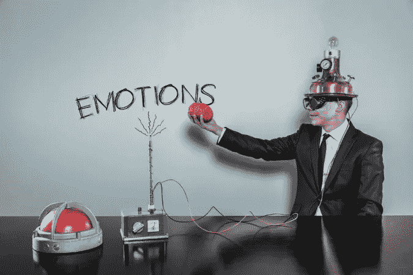

Figure 3: Emotions are crucial to perception, learning and decision making

那么，为什么我们希望计算机与我们感同身受呢？它始于人机交互效率的提高，但也渗透到许多其他领域。

低成本、可穿戴的传感器可以让公司测量环境和经历如何影响员工情绪。组织可以利用这些知识来设计更有效的工作环境和流程，以提高生产率和员工满意度。同理心可以嵌入企业软件系统中，以改善用户体验，例如，当员工对某项任务感到沮丧时，可以感知并提供反馈或帮助建议。

在医疗保健领域，医生可以更好地诊断病情和不适程度。学生可以被教导用动态调整的内容学得更快，当学生感到沮丧时，它会提供不同的解释，当学生感到无聊时，它会加快速度，当学生感到困惑时，它会放慢速度。在机场，安全系统可以识别可能携带炸弹或走私违禁品的人。对于零售店或投资公司的经营者来说，流氓行为或过度冒险的行为会被提前发现。运动员可以获得他们达到最佳表现所需的实时反馈。我们的家可以调节灯光、音乐和其他环境设置，而无需询问。

Apple Watch 等可穿戴设备已经可以对你的心率进行基本的“情绪”测量。情感感知设备的例子正在意想不到的地方出现。

# 新兴的情感经济

随着人类情感越来越多地被收集和分析，一种新兴的情感经济已经出现。因此，这里的“情感”被定义为感觉或情绪的体验。术语“情感计算”弥合了计算机和人类之间的认知-情感鸿沟，通过这样做，该技术可以解释、适应和响应人类用户的情感状态。

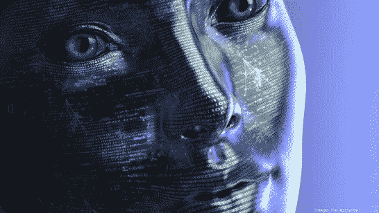

Figure 4: Will computers be able to accelerate an emotional business?

作为一种交流方式，情感确实是古老的。早在人类发明口语之前，我们就在情感层面上进行非语言交流。谚语:信息的大部分内容是通过肢体语言来传达的，一小部分是通过语气，一小部分是通过口语来传达的，这一点现在已经被研究证实了。

情感交流源于我们的生理。我们的生理学让我们能够公开表达情感:厌恶的鬼脸会提醒别人注意有毒的食物，噘起的嘴唇和拱起的眉毛会警告越来越多的侵犯，自发的微笑会传递我们的快乐和友谊。这是难以置信的疯狂，但在某种程度上，它不是。从进化的角度来说，我们被编程来读取我们同伴的面部表情，现在我们正在教会我们的机器去做同样的事情。这有错吗？

# 地貌根源

面相学的词源来自古希腊，Gnomos(性格)，nomos(规律)，Physis(自然)。虽然有些人可能认为面相是不道德的、刻板的、不准确的、不一致的和种族主义的，但在人工智能和针对深度学习和图形处理优化的芯片组的帮助下，面相的各个方面可能很快会被重新想象和重新制度化。

大约在公元前 500 年，毕达哥拉斯根据学生看起来有多聪明来接受或拒绝他们。一些人认为毕达哥拉斯开创了相学——曾经解雇了一个名叫赛昂的潜在追随者，因为对毕达哥拉斯来说，他的外表意味着劣等的性格。

1831 年 6 月 27 日，26 岁的菲茨罗伊船长被任命为为期几年的南美洲考察航行的指挥官。菲茨罗伊知道长途旅行可能会带来极度的压力、孤独和反叛。前任船长已经自杀，菲茨罗伊决心完成他的使命。

除了他的官员和船员，他的船将携带几个编外，乘客的非标准责任在航行中。这些编外候选人中有一个 22 岁的人，他的工作是对岩石和其他自然现象进行分类，当然，还要和船长及他的军官一起用餐。然而，这个年轻人的长鼻子会对他不利。菲茨罗伊船长是拉万特的忠实信徒，拉万特是著名的犯罪学家，他利用面部特征来判断人的灰色深浅，而这个年轻人的鼻子正是这次航行中不应该有的类型。

这个年轻人后来写了关于菲茨罗伊船长和他的相面术的实践，“后来，在和菲茨罗伊非常亲密的时候，我听说我因为我的鼻子的形状而被拒绝的风险非常小！他是拉瓦特的忠实信徒，并确信他可以通过一个人的轮廓来判断他的性格；他怀疑有我这种鼻子的人是否有足够的精力和决心来完成这次航行。但我认为他后来很满意，我的鼻子说错了。”⁴

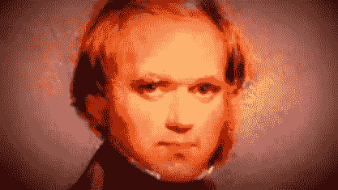

Figure 5: Charles Darwin

如果 22 岁的查尔斯·达尔文在与菲茨罗伊共进晚餐时没有得到如此高度的推荐和如此和蔼可亲，他影响科学和社会的机会就会失去。当时和现在误用面部特征是有后果的。认为性格铭刻在一个人的脸上，反映了个性和情感的观点，与现代自由意志的理想不一致，并使相面术在今天不再流行。

具有讽刺意味的是，对于科学家达尔文来说，将面部表情与情绪和性格联系起来是一个令人着迷的课题。达尔文第一个提出它们是普遍的；他关于情感的观点是他进化论的核心。达尔文认为情感的表达是生物上与生俱来的，是进化适应的，它们之间的相似之处可以从系统发育上看出来。⁵

1872 年，当达尔文写下《人类和动物的情感表达》时，书中包含了大量面部表情的照片，这些照片展示了从动物到婴儿到精神病院中的成人的原始情感的共性。达尔文注意到人类特有的表情，包括脸红和悲伤。此外，达尔文对每种面部表情的面部变形进行了分类:“悲伤时眼睛周围肌肉的收缩”，以及“思考时嘴巴紧闭。”

我们的进化和生理让我们学会在社交场合展示情感:厌恶的鬼脸会提醒别人注意有毒的食物，拱形的眉毛和噘起的嘴唇会警告预期的攻击，而自发的微笑会传递我们的友谊。

继达尔文之后，情感理论家们绘制了六种普遍的、能够表达和识别的情感状态。它们是:快乐、悲伤、愤怒、惊讶、厌恶和恐惧。这些分类构成了情感计算科学的基础。

在摄像头和大数据无处不在的时代，机器学习情感计算也可以以前所未有的规模应用。鉴于社会越来越依赖机器学习来实现日常认知任务的自动化，人工智能的开发者、批评家和用户迫切需要了解技术的局限性和面相学的历史，这是一套披着现代服装的实践和信仰。

# 情感算法

一般来说，面部表情识别系统包括四个主要步骤。首先，从背景中定位和提取人脸。然后，可以估计面部几何形状。基于此，对齐方法可以用于将局部和全局描述符的变化减少到刚性和非刚性变化。这极大地提高了对平面内旋转或头部姿态的鲁棒性。最后，或者全局地计算面部的表示，其中全局特征从整个面部区域局部地提取信息，并且模型被训练用于分类或回归问题。

情感计算经常借用心理学和神经学的研究。举例来说，大量证据表明，正在进行的大脑活动会影响大脑处理传入感官信息的方式，并且神经元在不需要任何外部刺激的情况下在大型网络中固有地放电。这些见解对有效计算的影响是深远的——也就是说，情绪似乎与认知斗争以控制行为。这意味着对情绪的经典解释，它依赖于简单的刺激:反应叙事非常怀疑是否有效。这意味着情感计算艺术的当前状态是非常新生的。我们还不了解驱动和控制情绪反应的复杂反馈循环和复杂决策。

处理速度和计算机科学、人工智能、机器学习、心理学和神经科学等学科的进步，都导致了新兴情感计算领域的新繁荣。计算机、相机和传感器可以捕捉面部的点、姿势、手势、语调、讲话甚至击键的节奏或力度以及手的温度，以记录用户情绪状态的变化。

从计算机视觉的角度来看，由于各种因素，从数字化照片或视频中进行面部表情分析是一项非常具有挑战性的任务。首先，训练集被假定为无可争议的真实。主题或观众代表他们的情感内容，这可能会引入建模或估计误差。

其他因素包括:

> 1.对主体的视角，
> 
> 2.光学条件(例如，照明、图像稳定、滤镜、阴影、方向、分辨率)
> 
> 3.脸上的结构，如胡须或眼镜，
> 
> 4.物体的部分阻碍(遮挡)和
> 
> 5.特定人的形态变形

当然，任何模型也有过拟合以及建模和估计误差的问题。⁶

令人震惊的简单和令人毛骨悚然的争议，一项早期的攻击倾向研究以简单比率(fWHR)的形式将面部宽度与高度联系起来。

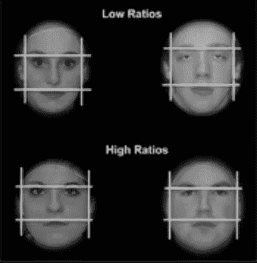

Figure 6: Seemingly Arbitrary Correlation of Aggressive Tendencies to Facial Width to Height ratio

迈克尔·哈塞尔胡恩和伊莱恩·王，“证明了 fWHR 和攻击性之间强有力的积极联系，表明 fWHR 是男性攻击性的可靠标志(和信号)。”⁷

其他人发现 fWHR 不仅与无所畏惧的支配地位呈正相关，还与以自我为中心的冲动性因素呈正相关，与整体精神变态评分呈正相关，并与睾酮水平相关。⁸也许令人惊讶的是，研究还显示 fWHR 与竞争社会环境中的成功正相关，从公司到宗教领导和运动能力。

机器学习领域的研究人员所使用的计算机语言，如 Python 和 R，通常用于展示建模的速度，以及这些算法如何运行的分析能力和速度。2017 年，一组研究人员在 Github 上发表了一篇文章，Github 是一个用于情感计算的开源存储库代码。这项名为“用深度学习预测第一印象”的研究基于支配地位、可信度、年龄和智商，考察了参与者对人们照片的第一印象。⁹ ⁰

# 情感计算中断

情感计算中断通常以系统的形式出现，这些系统能够识别、表达或合成情感，或者适应人类的情绪变化。他们能看到我们在脸上和手势中看到的东西。一个训练有素的专业人士也许能捕捉到更多的声音——瞳孔放大或语调的轻微变化。一台带有传感器的机器将能够探测到汗液或温度的微小变化。

情感计算可以颠覆许多行业，并且已经是一个规模和声望都有望增长的大行业。到 2021 年，全球情感计算市场将增长到超过 122 亿美元，超过 539.8 亿美元，复合年增长率(CAGR)为 34.7%。根据市场研究公司 Research and Markets 的调查。

事实上，该公司预测情感计算将破坏企业，特别是零售、医疗保健、政府、国防和学术界收集、组织、合作和传递信息的方式。

## 汽车颠覆

*([https://BRAIQ . ai](https://braiq.ai))是一家纽约初创公司，它正在开发一种技术，可以检测你对载着你到处跑的自动驾驶汽车的感觉。汽车制造商知道 75%的美国人实际上“害怕”自动驾驶汽车，不信任它们。BRAIQ 希望通过允许他们的技术直观地读取情绪信号来赢得这种信任，希望你享受旅程，而不是担心到达目的地。*

*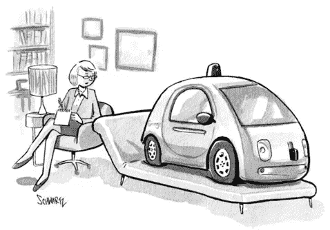*

*Figure 7: Affective Automobiles*

*达尔文需要帮助来扩展他的面部分析，使其适合像 BRAIQ 这样的公司，从而有机会获得成功。那个人就是保罗·艾克曼博士。*

## *消费者广告和产品管理中断*

*埃克曼博士曾带着照片环游世界，这些照片展示了经历六种基本情绪的面孔——快乐、悲伤、恐惧、厌恶、愤怒和惊讶。无论他去哪里，从日本到巴西，再到巴布亚新几内亚最偏远的村庄，他都让受试者看着这些脸，然后识别他们在脸上看到的情绪。为此，他们必须从埃克曼提供给他们的一系列选项中进行选择。结果令人印象深刻。事实证明，每个人，甚至是新几内亚的史前部落成员，他们从来没有见过外国人，他们把同样的情感和同样的面孔联系在一起。达尔文似乎是对的。*

*1967 年，埃克曼博士开始研究临床案例中的欺骗行为，在这些案例中，病人谎称他们没有抑郁。这些病人后来在无人监护的情况下自杀了。当病人的电影被慢动作检查时，埃克曼和弗里森看到了微表情，这些微表情揭示了病人试图隐藏的强烈的负面情绪。*

*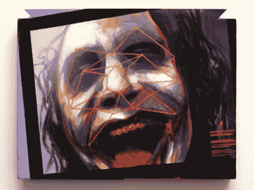*

*Figure 8: Facial Expressions*

*埃克曼博士创造了术语微表情和宏表情。微表情是隐藏情绪的典型标志，在持续时间和范围上不同于宏观表情。宏观表情通常持续 0.5 到 4 秒，涉及整个面部。如果一个人知道要寻找什么，宏表达式相对容易理解。然而，由于不同的个人，社会，甚至文化环境，人们有时会通过压抑或无意识的压抑来隐藏或掩盖自己的真实情感。然而，这些微表情是在几分之一秒内，有时快至 1/30 秒，在脸上时隐时现的表情。它们是如此之快，如果你眨眼，你可能会错过它们。在埃克曼的心目中，微表情是不由自主的，暴露了一个人的实际情绪。因此，这些微表情也适用于世界各地的每个人。*

*微表情是自发的表情，是六种基本面部表情的映射。其他人的微表情可能会在互动后留下印象，但缺乏确定性或算法验证的明确标签——这种转变使微妙的东西变成了虚拟的咆哮。众所周知，欺骗是一种棘手的表达方式和需要识别的社交暗示，但研究表明，能够敏锐识别微表情的人能够识别其他欺骗行为。*

**

*Figure 9: Shameful Deception*

*需要使用专门的算法，通过在表情变化时识别面部运动的部分并扭曲面部以推断微表情来放大表情，从而使细微的增强虚拟咆哮成为分类算法的实际应用。今天，配备了最佳情感计算算法的机器通常可以胜过面部微表情识别专家，如执法人员和心理学家。

英国初创公司***Wearehuman***([https://Wearehuman . io](https://wearehuman.io))在 4 月份筹集了一小轮资本，以扩大分析微表情的潜力。这家初创公司于 2016 年在伦敦成立，已经在英国、中国和美国设有办事处，并配备了数据科学家、心理学家和擅长机器学习技术和微表情的开发人员。*

*另一家瑞士初创公司***nViso***([http://www . nViso . ch](http://www.nviso.ch))使用 3D 面部成像分析，nViso 的复杂算法捕捉数百个测量点和面部运动，以实时映射到 43 块面部肌肉。nViso 像其他几家情感计算初创公司一样，提供了一个仪表板来分析对广告和产品的反应。*

*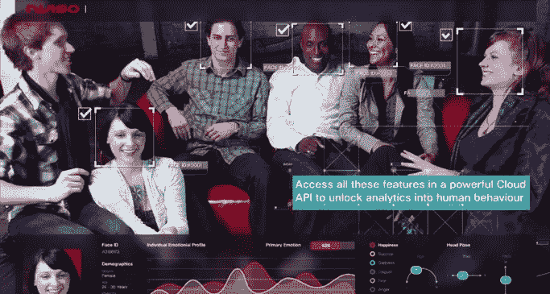*

*Figure 10: nViso Dash Board*

****Nuralogix***([http://www.nuralogix.com/](http://www.nuralogix.com/))Nuralogix 采用透皮光学成像，以非常规的方式利用常规摄像机从人脸提取面部血流信息。这家初创公司开发了一种“读取”人类情绪状态的技术，称为透皮光学成像，使用传统的摄像机从人脸下的血流中提取信息。面部皮肤是半透明的。光及其各自的波长从皮肤下包含血管和黑色素的不同层反射。像基于红外的成像一样，经皮最佳成像通常比传统图像更健壮，传统图像基本上受光强度的影响并提供独特的数据。*

**([https://skybiometry.com](https://skybiometry.com))并不是 2012 年才开始努力的创业公司。SkyBiometry 自动调整障碍物(如眼镜)和角度(如从上方)，以便在对情绪进行分类时对人群中的面部情绪进行分类和分组。**

**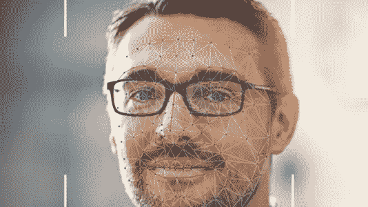**

**Figure 11: SkyBiometry**

*****RealEyes***(【https://www.realeyesit.com】[)还利用网络摄像头和复杂的机器学习算法来衡量人们在观看视频内容时的感受。伦敦初创公司 RealEyes 已经筹集了 1370 万美元。正如他们的首席执行官所反映的，“我们知道行为是由情绪驱动的，所以一个有效的视频将会产生强烈的情绪反应，”他说。“因此，衡量视频效果的最佳方式是衡量人们对视频的情感反应——因为参与度越高，观众就越有可能采取行动。例如，我们与玛氏在 35 个品牌中开展的一项研究，以 75%的把握确立了广告的情感感知与其对销售的影响之间的联系。”⁴](https://www.realeyesit.com)**

**成立于 2013 年，是一家总部位于伦敦的私人创业公司，其技术是通过绘制人类面部 43 块肌肉的运动来直观地衡量人类的情绪。BBC StoryWorks 在 2016 年的一项名为“参与科学”的研究中使用了这种技术，他们测量了 5153 人在 BBC 六个主要市场观看英语国际新闻时的每秒面部运动。**

**对于以呼叫中心为中心的个体企业，语音仍然是情感计算的前沿。例如，Humana 使用情感计算软件来关联客户声音音调的稳定上升，或代理和客户相互交谈的情况，作为关注的原因。**

## **客户关系管理中断**

**赋予计算机“看到”我们情绪的能力所引发的一个关键伦理问题是情绪控制和操纵的潜力，尽管有些人会认为一些情绪操纵可能是一件好事。根据诺贝尔奖获得者行为经济学家和心理学家丹尼尔·卡内曼的观点，许多人为错误甚至不能归因于系统原因或偏见，而是“噪音”噪音是随机的，不可预测的，也不可能解释。通过使用情感策划的算法，我们的机器可以用“训练有素的思维”来调节人类的判断，并帮助引导我们集体走向更高的自我实现之路。**

**在一个公司高度重视营销人员在我们使用的无数设备和应用程序上准确锁定人群的能力的时代，人们应该想知道我们的情感是如何被利用的。雇主应该能够读懂我们对工作的不满程度吗？民意调查者应该能够跟踪和量化我们的情绪以提高他们的预测准确性吗？脸书应该能够交流不同问题上的总体情绪状态吗？表情符号应该在我们打字或者使用 app 的时候自动检测吗？对于情感计算领域的早期进入者来说，首先必须与消费者建立信任，为他们提供分享数据的选择，并告知他们公司希望收集的数据类型，以及这些数据将如何被使用并提供给其他人。**

**Berdichevsky & Neuenschwander 关于“说服性技术”的著名讨论解决了这个问题。它提出了一个基于黄金法则的指导方针:“有说服力的技术的创造者永远不应该试图说服任何人他们不同意被说服的事情。”⁵**

**尽管存在数据隐私和情感操纵问题，但当试图为客户实现价值最大化或通过针对其身体和情感需求的广告展示购买产品的想法时，有令人信服的理由使用情感计算。**

*****Cogito***(【http://www.cogitocorp.com】)就是援人。麻省理工学院媒体实验室分拆 Cogito 在 2016 年 11 月筹集了 1500 万美元的 B 轮融资。Cogito 基于麻省理工学院人类动态实验室多年研究产生的行为科学，最初由 DARPA 资助将其用于商业用途。**

**Cogito 以实时仪表板的形式跟踪对话速度、暂停、中断、音量变化和音调等指标，以获得关于通话表现的反馈，从而形成更好的交谈习惯。cogito 仪表板中呈现的见解也可以通过它们与客户关系管理(CRM)系统的编程接口发送。**

**总部位于⁷的竹间机器人根据面部和其他形态的 22 种情绪状态进行分类。还可以检测疲劳，并可以提供有用的基于情绪学习的反馈。该公司开发的软件可以识别 400 种不同的人类“情绪”该公司现在正在将这种软件集成到呼叫中心，可以帮助销售助理实时了解客户的情绪并做出反应。**

**西班牙初创公司*(【http://www.releyeble.com/en/index.html】T4)为实体或家庭计算环境中的零售产品提供简化的实时情绪分析。***

***那么多关于我们的信息现在都可以数字化量化了；我们读了什么，买了什么，甚至我们的生命体征都可以在我们的手机上被追踪，从而让我们了解我们的长期健康状况。当然，我们的活动、网络历史和我们访问的地方都被广泛跟踪。但是，在你没有意识到的情况下，让一台机器跟踪、分析甚至回应你的情绪，你会有多舒服呢？这种情况正在发生，随着技术的发展，一些道德和隐私方面的考虑正在出现。***

***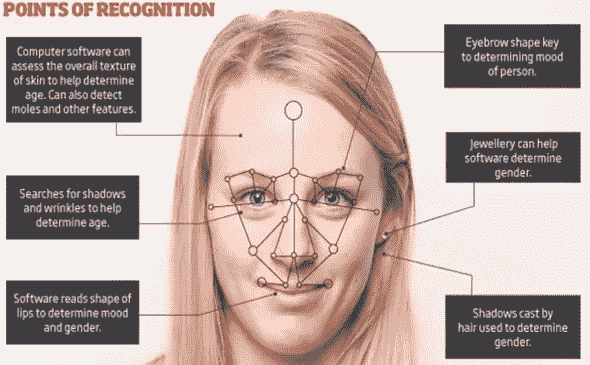***

***Figure 12***

## ***监视和犯罪学破坏***

***这些创业公司和他们的商业使命引发了人们对科幻电影《少数派报告》(Minority Report)这样的潜在场景的担忧，在这种场景中，人们可能仅仅因为预测他们会犯罪就被逮捕。《少数派报告》背后的原则可以追溯到 19 世纪 70 年代和切萨雷·龙勃罗梭的工作。***

***Lombroso 是意大利医生和犯罪学家，他普及了犯罪行为是天生的，只是部分由心理和环境条件引起的概念。简而言之，他认为有些人就是“天生的罪犯”。Cesaer Lombroso 将许多面部特征归类为退化和天生的犯罪。“高傲的”这个表达来自于这个时候，当一个人的鼻子稍微向上弯曲时，被解读为有一种轻蔑的，优越的态度。在 Lombroso 看来，虽然大多数个体都在进化，但暴力罪犯已经退化，因此构成了社会或进化的倒退。如果犯罪是遗传的，那么隆布罗索提出“天生的罪犯”可以通过身体特征来区分:⁸***

> ***大下巴，下巴向前突出，
> 低斜前额，
> 高颧骨，
> 扁平或上翘的鼻子，
> 柄状耳朵，
> 鹰钩鼻或肉唇，
> 冷酷狡诈的眼睛，
> 胡须稀少或秃顶，
> 对疼痛不敏感，
> 手臂相对于下肢较长。***

***数据的可用性和算法的交响乐是否足以挫败邪恶的活动还有待观察。但是，一个有趣的麻省理工学院实验室诞生了初创公司 humanyze([https://www.humanyze.com](https://www.humanyze.com))⁹从可穿戴徽章传感器中收集情感内容。每个徽章每天产生大约 4GB 的数据，这些数据被上传到云端，Humanyze 对其进行分析，并通过仪表板提取相关信息。可穿戴传感器也对办公室设计产生了影响,《纽约时报》讨论了这一进展，⁰***

***尽管切萨雷·龙勃罗梭等 19 世纪的面相学家关于脸型和(通常是错误的)道德行为之间的因果关系是错误的，但事实是人类倾向于将一些形态与道德和情感内容相关联。一个挑战将是消除算法结果中的偏见、种族和人种，或者以道德和法律上合理的方式处理它们。***

******凯罗斯***(【https://www.kairos.com】T4)。Kairos 通过 SaaS(软件即服务)商业模式提供视觉识别和情感识别 API，具有种族和注意力捕捉功能。***

**伦理挑战远不止是种族偏见。情感计算是一种伪科学吗？不幸的是，由于技术的发展，这种伪科学披着新衣服偷偷溜回了这个世界。如果我们训练他们放大我们的偏见，并在这样做的过程中，给我们已经正确摒弃的旧观念赋予新的生命，会怎么样？我们会知道区别吗？**

**《纽约时报》讲述了两名斯坦福情感计算研究人员的故事，他们将注意力从识别恐怖分子转移到识别性别上。**

**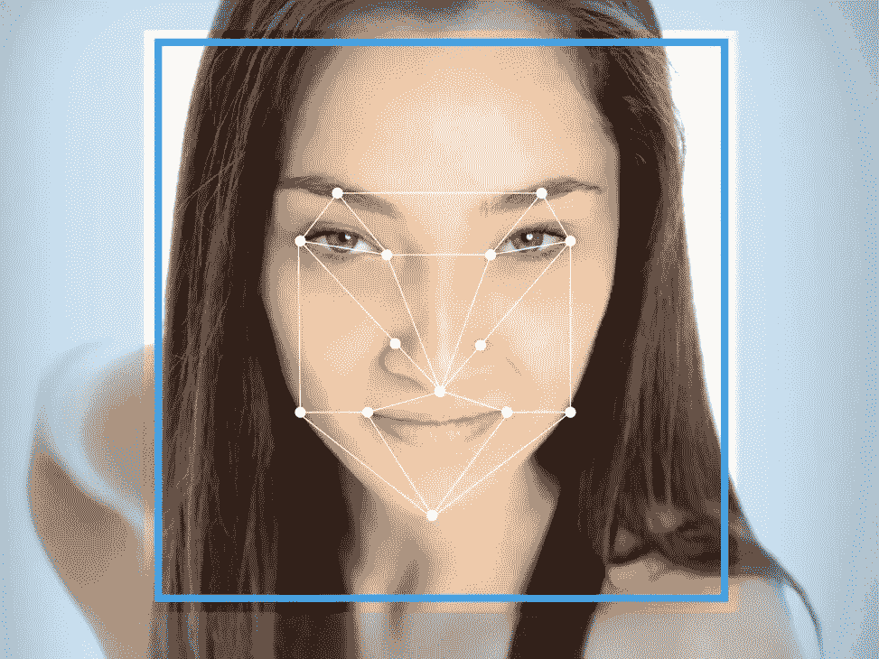**

**Figure 13: What private innformation can be gained from a face? How much of that information will be biased or based on biases or stereotypes?**

**研究人员迈克尔·科辛斯基和王一伦拍摄了超过 35000 张在美国约会网站上公开的男性和女性的面部图像，发现计算机算法在区分直男和同性恋男性时的正确率为 81%，对女性的正确率为 74%。当计算机评估每个人的五幅图像时，准确率提高到了 91%。看同样照片的人只有 61%的正确率。机器发现的另一个趋势是，同性恋女性往往比异性恋女性有更大的下巴和更小的额头，而同性恋男性比异性恋男性有更大的额头，更长的鼻子和更窄的下巴。其他分析师指出了他们的科学方法中的问题，以及混淆相关性和因果关系。**

**情感技术似乎能够根据人眼可能无法察觉的视觉线索来了解一个人最亲密的偏好。这些细节可能包括基因特征、我们的种族、民族和心理障碍，甚至政治倾向——除了声明的性偏好。如果谷歌的新镜头应用程序被训练使用类似的算法进行分析，并用结果标记我们的照片，会怎么样？谁来设计算法，训练集，减少偏差，限制合理使用？**

**一家可以按年龄、性别和性别对情绪进行分类的初创公司是 ***NTechLab*** 。([http://ntechlab.com](http://ntechlab.com))⁴·恩特奇实验室是一家俄罗斯公司，它有一款名为 FindFace 的应用程序，可以跟踪每个使用 VKontakte(俄罗斯的 Twitter)上的个人资料分析技术的人。FindFace 的神经网络接收带有面部的照片的一部分，并生成 160 个面部点特征向量。NTechLab 声称其软件可以在不到半秒的时间内搜索 10 亿张面孔的数据库。**

**另一家将情感计算技术应用于个人或人群监控的公司是 sight corp([http://sightcorp.com](http://sightcorp.com))。Sightcorp 可以同时跟踪几个人，同时绘制他们对实时内容的自发反应和兴趣，以及从监控到零售的不同现实生活应用。**

## **卫生保健中断**

**中国古代有句话，“想知道一个人是否聪明，只要看他的额头；如果你想知道一个人的名声、高贵、财富、祝福和长寿，看看他们的眉毛、眼睛、鼻子、嘴巴、耳朵和下巴。”中国最早的相面术通常被认为是鬼谷子先生(鬼谷学者:公元前 481-221 年)史昂，一位有 3000 年历史的道教实践，意思是相面(史昂)。⁵**

**就连最臭名昭著的唯一一位女性女皇武则天也被唐朝的相士袁谭认出来了，当时她还穿着中性的尿布，比她的其他兄弟都要逊色。**

**这位年轻的领主有着龙的眼睛和凤的脖子，这是贵族的最高象征！当他继续从侧面检查这个孩子时，他更加惊讶:“如果这个孩子是个女孩，那么她的职业生涯将无法估计。她很可能成为帝国的统治者。”⁶**

****

**Figure 14: Empress Wu face**

**有一些初创公司继续探索面部识别的医疗用途。**

**例如，我们可能认为微笑、亲吻或夜间闭眼的能力是理所当然的，所有这些都可能受到面瘫的影响。面瘫可能在任何时候袭击任何人。可穿戴技术可以为患者和治疗师提供实时面部肌肉信息，并可能在疾病康复方面提供显著改善。**

**英国苏塞克斯大学的初创公司 EmTeq 由整形和重建外科医生 Charles Nduka 博士共同创立，该公司正在寻求将面部表情数字化，并使用人工智能来解释它们。EmTeq 希望很快形成我们治疗面部麻痹和自闭症谱系障碍(ASD)的方法。**

*****plan extra***(【http://planexta.com/】)情绪追踪智能手环 SenceBand 使用临床级心电图(EKG)追踪技术来追踪高级心率分析，包括心率方差(HRV)和预测 64 种情绪状态。SenceHub 使用算法将原始数据转化为可操作的分析，并发送关于用户网络中人们情绪状态的通知。**

**⁷“情感计算”一词是由麻省理工学院的计算机科学家罗莎琳德·皮卡德创造的，她也是情感测量技术公司 Affectiva 的联合创始人，该公司于 2009 年从麻省理工学院的探索媒体实验室分离出来。罗莎琳德·皮卡德仍然是一名活跃的投资者，但她仍留在麻省理工学院，专注于相关医疗应用的研究。**

**Affectiva(是情感计算领域最重要的初创公司之一，已经筹集了超过 2600 万美元的风险和战略融资。Affectiva 由凯鹏华盈(Kleiner Perkins)和其他几位知名投资者出资。它的一个项目是与一家“非常大的日本汽车公司”(丰田曾赞助麻省理工学院 El Kaliouby 的实验室)密切合作，该公司正在开发一种车内情绪传感器，可以知道你何时昏昏欲睡或心烦意乱。受影响的汽车可以在紧急情况下采取行动，拨打 911 或通知朋友或家人。**

**Affectiva 汇编了一个庞大的数据语料库，其中包括从 87 个国家收集的 600 万个面部视频，允许其计算引擎针对野外的真实情感表达进行调整，并解释情感表达中的文化和其他差异。**

**Affectiva 的自动化面部编码技术捕捉面部动作单元，并识别效价和唤醒/强度以及一系列离散的情绪状态，例如，享受、惊讶、厌恶/不喜欢、困惑和怀疑。⁸**

**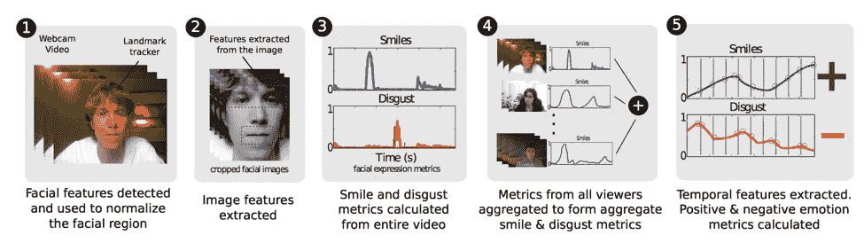**

**Figure 15: Quantify**

**为了量化情绪反应，面部表情分类算法在视频中逐帧处理，并定位面部的主要特征。运动、形状和其他上下文，或者用于识别面部动作单元，例如扬眉、假笑或撅起的嘴唇。机器学习分类器随后将面部纹理和运动映射到情绪状态。**

**当我们说话时，我们的声音有时会微妙地暗示我们的情绪。我们的声音是大还是小，或者是否有轻微的压力，都可以暗示我们内心的感受。Affectiva 最近宣布了一个新的云 API，可以发现人类语音中的一系列情感。**

**将面部、声音和生理元素混合到多模态框架中通常会引入冲突的分析结果；根据他们出现的身体环境，面部表情被认为传达了明显不同的情绪。尽管有这些结果，但许多人认为，使用深度学习技术组合感觉输入有预测前景。**

**Rosalind Picard 现在是 Empatica 的首席科学家，他们最新的设备名为“拥抱”,专注于深度学习技术在医疗级可穿戴设备中的应用。这个价值 200 美元的拥抱基于早期的移情模型 E4，该模型已经被研究人员用于与美国宇航局、英特尔、微软和麻省理工学院合作的临床研究中，研究压力、自闭症、癫痫和其他疾病。实时生物统计学数据中的移情流:温度、运动和皮肤电读数。这完全是一个惊喜，拥抱也有助于检测危险的癫痫发作。**

## **虚拟现实和机器人颠覆**

**Affectiva 的软件还支持一个名为 Chubble 的新直播应用程序，该应用程序具有情感组件，可以让你向朋友播放(假设是一场现场音乐会)，同时他们的情感通过虚拟人物传达给你。**

**瑞士十亿美元估值的独角兽公司 mind maze([https://www.mindmaze.com](https://www.mindmaze.com))开发了一款读取你的情绪的虚拟现实设备 MASK，它对虚拟现实的了解超过了它的情感计算。面罩的电极包括一个泡沫衬垫面垫，与你的头部接触。电极可以感知你的面部肌肉，并可以在你完全完成每个面部表情之前预测你的情绪。MindMaze 还被全球 50 家医院使用，他们的情感虚拟现实技术正在帮助中风患者和截肢者康复。⁹**

**机器人专注 ***表情***([https://emoshape.com](https://emoshape.com))
合成情感，这样我们的机器人就可以工作、玩耍，让我们相信它们更了解我们。**

**情感计算似乎正在以波的形式扰乱我们的生活。虽然这种颠覆浪潮形成的确切时间和速度通常难以预测，但它们通常遵循的加速增长的分层先决条件的基本模式很容易识别:技术基础、数据可用性和专门的算法。智能手机及其先进的摄像头和传感器是一个浪潮。像谷歌这样的云中摄影数据的融合似乎是另一波浪潮的一部分。算法的进步可能是当前浪潮的一部分，这可能会刺激使用和指数级破坏。彼得·迪亚曼蒂斯定义了指数的六个 d:数字化、欺骗、破坏、去货币化、去物质化和民主化，作为必要的先决条件。以这种方式重新构建情感计算的故事并不难。不管怎样，都在这里。**

**对于那些有兴趣探索情感和自然语言编程如何与情感计算结合的人来说，这本电子书是一个好的开始。我最近发了微博。**

**[卡尔卡里](/@carlcarrie)是新来的[中型](/@carlcarrie)。你也可以在 [LinkedIn](https://www.linkedin.com/in/carlcarrie/) 上找到我。也请在[推特](https://twitter.com/carlcarrie)上问好。**

****

1.  **里德威格，克里斯托普，毕达哥拉斯:他的生活，教学和影响。**
2.  **链接:[http://www . financialexpress . com/industry/technology/Intel-is-building-a-chip-the-works-like-human-brain-heres-all-you-need-to-know/877281/](http://Intel Neuromorphic Chip)**
3.  **链接:[http://www . telegraph . co . uk/technology/2016/01/21/affective-computing-how-emotional-machines-is-about-to-take-ove/](http://www.telegraph.co.uk/technology/2016/01/21/affective-computing-how-emotional-machines-are-about-to-take-ove/)**
4.  **达尔文，查尔斯·罗伯特。贝格尔号的航行。第二十九卷。哈佛经典著作。纽约:P.F .科利尔父子公司，1909 年至 1914 年；Bartleby.com，2001 年。www.bartleby.com/29/。【2017 年 11 月 10 日】。**
5.  **松本博士、凯特纳博士、盐田博士、弗兰克博士和奥沙利文博士(2008 年)。一张脸有什么？作为离散情绪信号的面部表情。在 m .刘易斯，J. M .哈维兰和 l .费尔德曼巴雷特(编辑。)，情绪手册(第 211–234 页)。纽约:吉尔福德出版社。**
6.  **巴雷特，丽莎·费尔德曼。"建构情绪理论:内感知和范畴化的主动推理解释."社会认知与情感神经科学 12.1(2017):1–23。**
7.  **哈塞尔胡恩议员，奥米斯顿我，王 EM。男性面部宽高比预测攻击性:一项荟萃分析。PLOS 一号。2015;10:e0122637。pmid:25849992**
8.  **面部宽高比的组成部分如何不同地影响对社会特征的感知。PLoS ONE，第 12 卷，2017 年第 2 期，第 e0172739 页。学术 OneFile，2017 年 10 月 2 日访问。**
9.  **Github 库:[https://github.com/mel-2445/Predicting-First-Impressions](https://github.com/mel-2445/Predicting-First-Impressions)**
10.  **McCurrie，m .，Beletti，f .，Parzianello，l .，Westendorp，a .，Anthony，s .，和 Scheirer，W. (2016 年)。用深度学习预测第一印象。arXiv 预印本 arXiv:1610.08119。**
11.  **《用深度学习预测第一印象》自动人脸和手势识别(FG 2017)，2017 年第 12 届 IEEE 国际会议。IEEE，2017。**
12.  **链接:[http://www . marketsandmarkets . com/Market-Reports/affective-computing-Market-130730395 . html？gclid = eaiaiqobchmihtttlp 63 u 1 givcappch 2 yfa-mEAAYASAAEgJDCPD _ BwE](http://www.marketsandmarkets.com/Market-Reports/affective-computing-market-130730395.html?gclid=EAIaIQobChMIhtTlp63u1gIVCAppCh2yFA-mEAAYASAAEgJDCPD_BwE)**
13.  **埃克曼博士(2003 年)。情感流露(第二版。).纽约:时代图书公司**
14.  **链接:[https://www . marketing week . com/2017/08/03/measuring-video-effectiveness/](https://www.marketingweek.com/2017/08/03/measuring-video-effectiveness/)**
15.  **链接:[http://ceur-ws.org/Vol-690/paper5.pdf](http://ceur-ws.org/Vol-690/paper5.pdf)**
16.  **链接:[https://TechCrunch . com/2016/08/16/cogito-leverages-human-behavior-to-nudge-customer-relationships/](https://techcrunch.com/2016/08/16/cogito-leverages-human-behavior-to-nudge-customer-relationships/)**
17.  **附加 Techcrunch 资源链接:[https://Techcrunch . com/2016/12/02/emotibot-wants-to-help-chatbots-know-how-you-really-feel/](https://techcrunch.com/2016/12/02/emotibot-wants-to-help-chatbots-know-how-you-really-feel/)**
18.  **链接:[http://www.newworldencyclopedia.org/entry/Cesare_Lombroso](http://www.newworldencyclopedia.org/entry/Cesare_Lombroso)**
19.  **附加文章资源:[http://tcrn.ch/2yq67pW](http://tcrn.ch/2yq67pW)**
20.  **文章链接:([http://nyti.ms/2yqexh5](http://nyti.ms/2yqexh5)**
21.  **链接:墨菲，希瑟。《为什么斯坦福研究人员试图制造一台' Gaydar '机器》，《纽约时报》2017 年 10 月 9 日[https://www . nytimes . com/2017/10/09/science/Stanford-sexual-orientation-study . html](https://www.nytimes.com/2017/10/09/science/stanford-sexual-orientation-study.html)**
22.  **链接到有争议的论文:【https://osf.io/fk3xr/ **
23.  **链接:[https://scatter . WordPress . com/2017/09/10/guest-post-人工智能-discovers-gayface-sigh/](https://scatter.wordpress.com/2017/09/10/guest-post-artificial-intelligence-discovers-gayface-sigh/)**
24.  **链接:[http://voc.tv/2idhUC0](http://voc.tv/2idhUC0)**
25.  **链接:[https://nirc.nanzan-u.ac.jp/nfile/1365](https://nirc.nanzan-u.ac.jp/nfile/1365)**
26.  **链接:(相关链接:[https://nirc.nanzan-u.ac.jp/nfile/1480](https://nirc.nanzan-u.ac.jp/nfile/1480)**
27.  **演示链接:(演示:[https://itunes.apple.com/us/app/affdexme/id971529011?mt=8](https://itunes.apple.com/us/app/affdexme/id971529011?mt=8)**
28.  **链接:[https://www . affect iva . com/WP-content/uploads/2017/03/Do _ Emotions _ in _ Advertising _ Drive _ Sales _ Use _ of _ face _ Coding _ to _ Understand _ The _ relati . pdf](https://www.affectiva.com/wp-content/uploads/2017/03/Do_Emotions_in_Advertising_Drive_Sales_Use_of_Facial_Coding_to_Understand_The_Relati.pdf)**
29.  **链接:[https://cdn . technology review . com/v/files/videoapr 11110813am _ 0 . MP4？sw=600](https://cdn.technologyreview.com/v/files/videoapr11110813am_0.mp4?sw=600)**