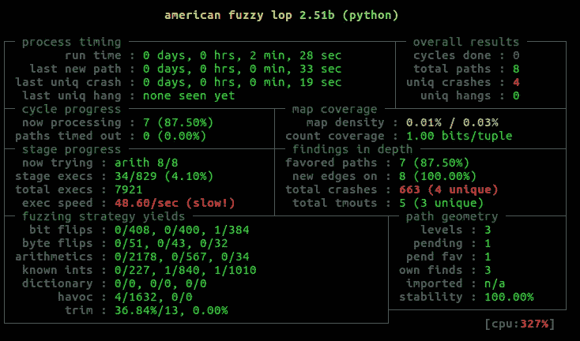

# afl-unicorn:模糊任意二进制代码

> 原文：<https://medium.com/hackernoon/afl-unicorn-fuzzing-arbitrary-binary-code-563ca28936bf>

[美国模糊 Lop (AFL)](http://lcamtuf.coredump.cx/afl/) 牛逼。这无疑是对命令行应用程序快速进行尖端模糊分析的最佳选择。但是，在通过命令行访问您想要模糊的东西并不那么简单的情况下，该怎么办呢？很多时候你可以编写一个测试工具(或者使用 [libFuzzer](https://llvm.org/docs/LibFuzzer.html) 代替)，但是如果你可以模拟你想要模糊的代码部分，并且仍然获得 AFL 的所有基于覆盖率的优势呢？例如，您可能想要模糊来自嵌入式系统的解析函数，该系统通过 RF 接收输入，并且不容易调试。也许你感兴趣的代码深埋在一个复杂、缓慢的[程序](https://hackernoon.com/tagged/program)中，你无法通过任何传统的[工具](https://hackernoon.com/tagged/tools)轻易模糊它。

我为 AFL 创造了一个新的“独角兽模式”,让你可以做到这一点。如果你可以使用 [Unicorn 引擎](https://github.com/unicorn-engine/unicorn)模拟你感兴趣的代码，你可以用 afl-unicorn 模糊它。所有的源代码(和一堆附加文档)都可以在 [afl-unicorn GitHub 页面](https://github.com/njv299/afl-unicorn)获得。

# 如何获得它

将 [afl-unicorn git repo](https://github.com/njv299/afl-unicorn) 从 GitHub 克隆或下载到 Linux 系统(我只在 Ubuntu 16.04 LTS 上测试过)。之后，像往常一样构建并安装 AFL，然后进入' unicorn_mode '文件夹，以 root 身份运行' build_unicorn_support.sh '脚本。

```
cd /path/to/afl-unicorn
make
sudo make install
cd unicorn_mode
sudo ./build_unicorn_support.sh
```

# 它是如何工作的

Unicorn 模式通过实现块边缘检测来工作，AFL 的 QEMU 模式通常会在 Unicorn 引擎中这样做。基本上，AFL 将使用来自任何仿真代码片段的块覆盖信息来驱动其输入生成。整个想法围绕着正确构建基于 Unicorn 的测试工具，如下图所示:


The only addition to normal AFL use is the Unicorn-based test harness

基于 Unicorn 的测试工具加载目标代码，设置初始状态，并从磁盘加载 AFL 变异的数据。然后，测试工具模拟目标二进制代码，如果检测到发生了崩溃或错误，就会抛出一个信号。AFL 会做所有正常的事情，但它实际上是模糊的模拟目标二进制代码！

unicorn 模式应该可以像预期的那样使用 Unicorn 脚本或任何标准 Unicorn 绑定(C/Python/Go/Whatever)编写的应用程序，只要最终测试工具使用从 afl-unicorn 创建的打补丁的 Unicorn 引擎源代码编译的 libunicorn.so。到目前为止，我只测试了 Python，所以如果你测试了这个，请向回购提供反馈和/或补丁。

请注意，构建 afl-unicorn 将在您的本地系统上编译并安装 Unicorn Engine v1.0.1 的修补版本。在构建 afl-unicorn 之前，您必须卸载任何现有的 Unicorn 二进制文件。和现成的 AFL 一样，afl-unicorn 只支持 Linux。我只在 Ubuntu 16.04 LTS 上测试过，但它应该可以在任何能够运行 AFL 和 Unicorn 的操作系统上流畅运行。

*   ***注*** :加载模糊输入数据前，至少要仿真 1 条指令。这是 AFL 的 fork 服务器如何在 QEMU 模式下启动的一个神器。可能需要做更多的工作来解决这个问题，但是现在只要模拟至少一个例子中的指令就可以了，不要担心这个问题。下面的示例演示了如何轻松解决这一限制。

# 示例使用

***注:这与回购中包含的‘简单例子’相同。请在您自己的系统上使用它，看看它的运行情况。repo 包含一个预先构建的 main()的 MIPS 二进制文件，这里演示了它。***

首先，让我们看看我们将模糊的代码。这只是一个虚构的玩具示例，很容易以几种不同的方式崩溃，但我已经将它扩展到现实世界的用例中，它完全按照预期工作。

Contrived crashing example code used to test basic afl-unicorn functionality

请注意，这段代码本身完全是伪造的。它假设‘data _ buf’的数据将神奇地位于地址 0x00300000。虽然这看起来很奇怪，但这类似于许多解析函数，它们假设将在固定地址的缓冲区中找到数据。

在现实世界中，您需要对目标二进制文件进行逆向工程，以找到并确定您想要模拟和模糊的确切功能。在接下来的博文中，我将展示一些工具来简化流程状态的提取和加载，但是现在你需要做的是在 Unicorn 中安装并运行所有必需的组件。

您的测试工具必须通过命令行上指定的文件接受输入进行变异。这是允许 AFL 通过正常接口改变输入的粘合剂。如果测试工具在模拟过程中检测到崩溃的情况，比如 emu_start()抛出一个异常，它也必须强制自己崩溃。下面是一个实现这两种功能的测试工具示例:

创建一些测试输入，并单独运行您的测试工具，以验证它是否像预期的那样模拟代码(并崩溃)。

现在测试工具已经启动并运行，创建一些样本输入并在 afl-fuzz 下运行它，如下所示。确保添加了'-U '参数来指定 Unicorn 模式，我建议将内存限制参数('-m ')设置为' none '，因为运行 Unicorn 脚本会占用相当多的 RAM。遵循正常的 AFL 惯例，用' @@ '替换包含要模糊的文件路径的参数(更多信息请参见 AFL 的自述文件)

```
afl-fuzz -U -m none -i /path/to/sample/inputs -o /path/to/results 
    -- python simple_test_harness.py @@
```

如果一切按计划进行，AFL 将启动并很快发现一些崩溃。



AFL found crashes in the sample in just few seconds!

然后，您可以通过测试工具手动运行崩溃输入(在 results/crashes/目录中找到),以了解关于它们崩溃原因的更多信息。我建议保留您的 Unicorn 测试工具的第二个副本，并根据需要进行修改，以便在仿真中调试崩溃。例如，您可以打开指令跟踪，使用[顶点](http://www.capstone-engine.org)沿途反汇编，在关键点转储寄存器等。

一旦你认为你有一个有效的崩溃，你就需要找出一种方法把它传递给仿真之外的实际程序，并验证这个崩溃在物理系统上起作用。

值得注意的是，总体模糊化速度和性能将在很大程度上取决于测试工具的速度。一个庞大、复杂的基于 Python 的测试工具运行起来要比一个紧凑、优化的基于 C 的工具慢得多。如果您计划运行大量的、长时间运行的 fuzzers，请务必考虑这一点。作为一个粗略的参考，我发现一个基于 C 的工具比一个类似的 Python 工具每秒多执行 5-10 倍。

# 从这里去哪里

虽然我最初创建这个是为了找到嵌入式系统中的漏洞(像那些由 [Project Zero](https://googleprojectzero.blogspot.com/2017/04/over-air-exploiting-broadcoms-wi-fi_4.html) 和 [Comsecuris](https://comsecuris.com/blog/posts/luaqemu_bcm_wifi/) 在 Broadcom WiFi 芯片组中发现的漏洞)，但在我的[后续博客文章](https://hackernoon.com/afl-unicorn-part-2-fuzzing-the-unfuzzable-bea8de3540a5)中，我将发布工具并描述一种使用 afl-unicorn 模糊 Windows、Linux 和 Android 进程中的仿真功能的方法。

Afl-unicorn 不仅可以用来查找崩溃，还可以用来进行基本的路径查找。在您的测试工具中，如果执行了特定的指令(或者您选择的任何其他条件)，您可以强制崩溃。AFL 将捕捉这些“崩溃”,并存储导致满足该条件的输入。这可以作为穷人对符号分析的替代，以发现深入解析逻辑树的输入。

Unicorn 和 Capstone 的制造商最近一直在[推特上发布](https://twitter.com/capstone_engine/status/925327798566129664) [图片](https://twitter.com/capstone_engine/status/899990577147633665)，暗示 AFL 支持可能很快就会到来……看看他们创造了什么功能，以及是否有任何合作机会来优化我们的工具，这将是很有趣的。

# 信用

我在俄亥俄州哥伦布市的[巴特尔](https://www.battelle.org/cyber)公司担任网络安全研究员时，开发了 afl-unicorn 作为内部研究项目。巴特尔是一个令人敬畏的工作场所，afl-unicorn 只是在那里进行的许多新颖的网络安全研究的例子之一。更多巴特尔赞助的项目，请查看[克里斯·多玛斯](https://github.com/xoreaxeaxeax)和[约翰·托特希](https://github.com/cetfor)之前的作品。有关巴特尔职业的信息，请查看他们的[职业页面](https://www.battelle.org/cyber-careers)。

当然，如果没有 [AFL](http://lcamtuf.coredump.cx/afl/) 和[独角兽引擎](http://www.unicorn-engine.org/)，这一切都是不可能的。许多额外的灵感来自亚历克斯·胡德为 IDA 开发的令人敬畏的 uEmu 插件，许多一般概念借鉴自 NCC 集团的 AFLTriforce 项目。

要继续，请查看[***AFL-unicorn:Part 2-模糊化‘不可模糊的’***](https://hackernoon.com/afl-unicorn-part-2-fuzzing-the-unfuzzable-bea8de3540a5)