# afl-unicorn:第 2 部分——模糊化“不可模糊”的事物

> 原文：<https://medium.com/hackernoon/afl-unicorn-part-2-fuzzing-the-unfuzzable-bea8de3540a5>

我在[上一篇文章](/@njvoss299/afl-unicorn-fuzzing-arbitrary-binary-code-563ca28936bf)中演示的独角兽模式表面上看并没有太大用处。它有很多限制，这使得它在大多数现实情况下使用起来笨拙而缓慢。例如，如果您想要模拟的二进制文件调用了一个导入的库函数，该库函数很可能会调用到内核中，比如 *malloc()* 或 *printf()* ，该怎么办？如果您想要模糊的代码是高度有状态的，并且需要大量内存区域(堆分配、堆栈指针、全局变量等),该怎么办？)直到运行时才知道？事实上，我发现它唯一直接的用法就是使用调试器从固件中恢复的嵌入式运行时系统内存快照。

本文介绍了我和我的同事 Parker Wiksell 为了将 afl-unicorn 应用于 Windows、Linux、Android 和 iOS 应用程序而开发的一些新工具和技术。

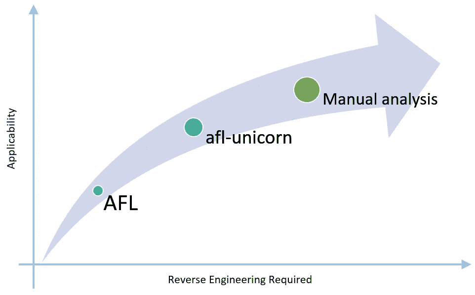

While nothing is more thorough and applicable than manual static and dynamic analysis, afl-unicorn lets you do a little reverse engineering to get all of AFL’s benefits in places it normally can’t be used.

Afl-unicorn 弥补了完全手动研究(即阅读反汇编/源代码)的彻底性和 Afl 无与伦比的易用性之间的差距。通过一点逆向工程和设置时间，afl-unicorn 允许您利用 afl 的力量快速发现您认为可疑的代码部分中的漏洞，并对它们的作用有一个基本的了解。

也许你会问自己，“如果我需要做一些逆向工程，为什么我要花时间让 afl-unicorn 启动并运行”？对我来说，这是一个简单的决定:我认为自己是一个相当不错的逆向工程师，但我不相信自己有能力发现我正在逆向处理的代码中的所有漏洞。我发现自己错过了越界内存访问、整数溢出等。在过去，所以我宁愿依靠 AFL 的变异引擎来为我寻找 bug。此外，如果你走上手工分析的道路，你无论如何都要重新跑腿，所以花一两天时间启动 afl-unicorn，然后让它在后台运行，同时你继续筛选代码，这提供了额外的低成本覆盖。

# 一般工作流程

虽然最初的博客文章描述了 afl-unicorn 如何工作背后的基本机制，并提供了一个玩具示例，但本文旨在提供一种更真实的方式来使用它对抗运行在操作系统(如 Windows、Linux、Android 或 iOS)上的应用程序。在现实中，你真的想了解 afl-unicorn 做什么，并使它适应你的具体问题，以确保你不会得到(或知道如何识别)假阳性和假阴性。

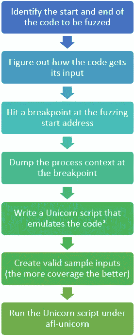

*There are some special nuances to creating a Unicorn script that works with afl-unicorn. These are described in more detail below.

第一个任务是逆向工程一些关于你想模糊的代码的基础知识。这包括确定一个好的起点和终点，以及代码如何接收您将要变异的输入。

假设您为网络数据包确定了一个顶级解析函数。该函数是否将数据包作为参数从网络中取出？这是如何传递到函数中的？最有可能的是，这将通过全局分配的缓冲区、堆栈上的指针或寄存器中的指针来实现。

您还需要(尽可能)弄清楚输入有什么约束。比如最大尺寸是多少？有没有无效字符？请确保在所选起始地址的上下文中考虑这一点，因为随着代码过滤掉无效输入并在整个输入处理过程中分配各种大小的缓冲区，这些约束可能会随着时间而改变。

一旦所有的研究都完成了，您将希望在处理有效输入的同时，在起始地址捕获流程的快照。我们通过创建一系列“Unicorn Context Dumper”脚本来实现这一点，这些脚本在位于开始地址的调试器断点处运行时，会将整个进程内存、寄存器值和架构信息保存到磁盘上的“上下文目录”中。

现在您需要编写一个 Unicorn 脚本，它加载您转储的流程上下文，加载要用从磁盘上的文件中读取的数据进行模糊处理的输入，并从起始地址到结束地址进行模拟。如果在仿真过程中检测到任何错误或崩溃，该脚本必须强制自身崩溃，以便 AFL 能够检测到它。我们已经创建了一套帮助工具，我们称之为“独角兽加载器”模块，使这些任务变得简单。“Unicorn Loader”还包括一个完整的独立堆管理器，它有助于防止模拟典型操作系统应用程序时发生的模拟错误…稍后将详细介绍。

一旦你的 Unicorn test harness 脚本可以成功地模拟从开始到结束的地址(并完成上面提到的所有其他事情)，是时候创建一些有效的、非崩溃的样本输入并在 afl-unicorn 下运行它了，如第一篇博文中所述。运气好的话，你会看到路径被发现，并希望有一些崩溃！

# 一个具体的例子:CGC 的 FSK_Messaging_Service

## 示例目标应用程序的描述

Trail 最近发布了 [cb-multios](https://github.com/trailofbits/cb-multios) ，它包含了来自 DARPA 的[网络大挑战](https://www.darpa.mil/program/cyber-grand-challenge)的挑战，以及额外的支持库，使它们易于在 Linux 上编译和运行。在这个例子中，我将演示如何使用 afl-unicorn 来模糊其中一个挑战的解析功能，该功能被特别设计为难以模糊， [FSK_Messaging_Service](https://github.com/trailofbits/cb-multios/tree/master/challenges/FSK_Messaging_Service) :

> […]一种实现分组无线电接收机的服务，包括 FSK 解调前端、分组解码、处理，并最终将其解析为简单的消息服务。

FSK_Messaging_Service challenge 是专门为挑战 fuzz 而设计的。虽然潜在的漏洞相当简单，但在对模拟模拟 RF 输入进行大量解析和解调后，这些漏洞仍然存在。此外，数据本身附加了一个简单的 16 位校验和，在执行完整解析之前必须对其进行验证。根据对挑战的描述:

> 这个[挑战二进制]向计算机推理系统提出了许多挑战。难点在于在 RF 前端之后将输入集转换成处理过的数据。由于其本身的性质**模糊化将是无效的**，因为射频接收器自然会受到噪声的影响，并且特别适合在存在噪声的情况下识别信号[……]因此，这种[挑战]被主观地认为是困难的，并且被设计为测试超出最先进的输入推理能力和解算器的状态。

下图显示了 FSK_Messaging_Service 应用程序的整体逻辑和数据流:

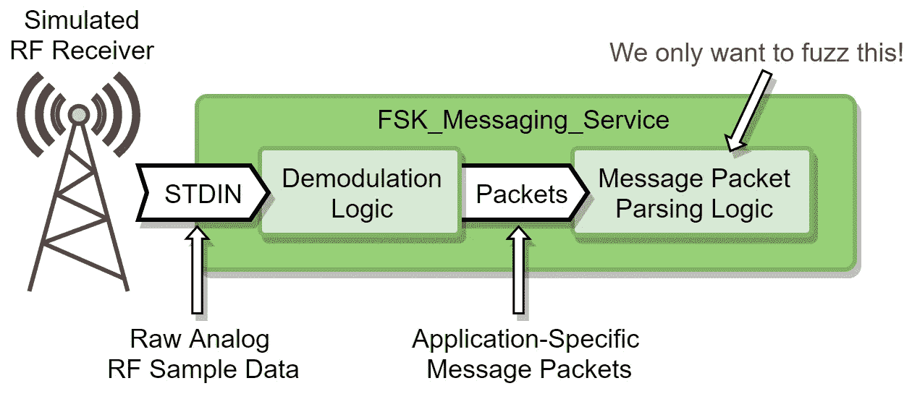

Traditional fuzzers (AFL included) would never make it past the demodulation logic. Afl-unicorn lets you directly target the code you think is most likely to be vulnerable.

## 找到我们需要模拟和模糊目标代码的内容

好的。所以我们不能模糊前门接口，但是通过对代码的一点点分析(或者反汇编，如果我们没有源代码的话)很容易找到直觉告诉我们最有可能有 bug 的函数: *cgc_receive_packet()* 在 [packet.c](https://github.com/trailofbits/cb-multios/blob/master/challenges/FSK_Messaging_Service/src/packet.c) 中找到。这个函数相当简单，它执行以下操作:

*   验证数据包缓冲区不为空，并且其长度大于 0
*   通过计算和比较 16 位 CRC 来验证数据包内容
*   循环查看数据包类型，如果匹配，调用 *cgc_add_new_packet()*
*   如果找到有效的包类型， *cgc_add_new_packet()* 实例化一个 *tSinglePacketData* 结构，并从包中复制信息

下面是一组稍微修改过的源代码片段，显示了相关部分:

当然，实际上你很可能没有源代码。相反，您必须使用传统的逆向工程方法(静态和动态分析)来了解关于目标应用程序的所有必要信息。

现在我们有了模糊目标，也知道了输入是如何给出的:

*   我们希望模糊来自 *cgc_receive_packet()* 函数
*   输入以 3 个参数的形式传递给函数:指向包数据的指针( *uint8_t *pData* )、相应的长度( *uint8_t dataLen* )和数据的校验和( *uint16_t packetCRC* )

我们还知道对输入的一个简单约束:

*   最大数据长度为 256 字节，因为 *dataLen* 是一个 8 位值

## 转储有效的运行进程上下文

现在我们想要得到整个进程内存的快照，因为这个函数被调用以使模拟尽可能简单。与更简单的方法(如由 [ripr](https://github.com/pbiernat/ripr) 或 [uEmu](https://github.com/alexhude/uEmu) 提供的就地仿真)相比，这似乎是一种高压手段，它解决了大量问题。例如，全局列表 *cgc_g_packetHandlers* 是在运行时填充的，因此除非我们有其内存位置的运行时状态，否则迭代 *cgc_packet_receive()* 中处理程序的 For 循环将在仿真期间失败。

使用“Unicorn Context Dumper”脚本来转储整个进程的内存状态和寄存器上下文。我们已经创建了几个不同的版本来支持不同的调试器，包括 IDA Pro(目前在版本 7 之前)、LLDB 和 GDB 与 GEF。目前只有 [IDA 版本可用](https://github.com/njv299/afl-unicorn/blob/master/unicorn_mode/helper_scripts/unicorn_dumper_ida.py)，但是其他版本(以及为其他调试器创建的其他版本)一旦准备好就会被推送到 GitHub。只需将 IDA Pro 的调试器附加到一个正在运行的 FSK_Message_Service 进程上，在 fuzzing 起始地址打一个断点，通过 IDA(*File->Script File…*)运行脚本。注意，我只在 IDA 的内置远程调试服务器上测试过。附加到其他调试器可能会以不同的方式呈现内存段，这可能会导致错误。

我选择在调用 *cgc_packet_receive()* 之前设置我的起始地址，在这个位置，参数方便地全部在寄存器中，而不是在堆栈中。这使得在我的 Unicorn 仿真脚本中修改它们变得更加容易。

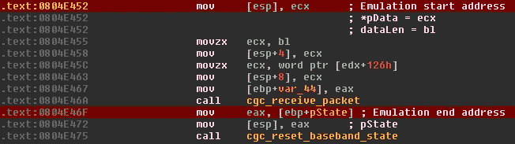

Context is dumped just before the call to *cgc_receive_packet(). The input parameters (*pData and dataLen) are sitting in registers that are easy to change here instead of on the stack.*

一旦脚本完成，它将在 IDA 数据库所在的文件夹中生成一个“Unicorn Context”目录。idb)。这个目录包含两个内容:

*   *_ index . JSON*:JSON 格式的文件，包含关于进程中所有内存段的元数据、寄存器状态和架构信息
*   大量 gzip 压缩的二进制文件，包含进程中每个内存段的内容

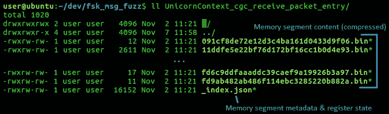

Contents of a typical ‘Unicorn Context’ directory created by one of the Unicorn Context Dumper tools

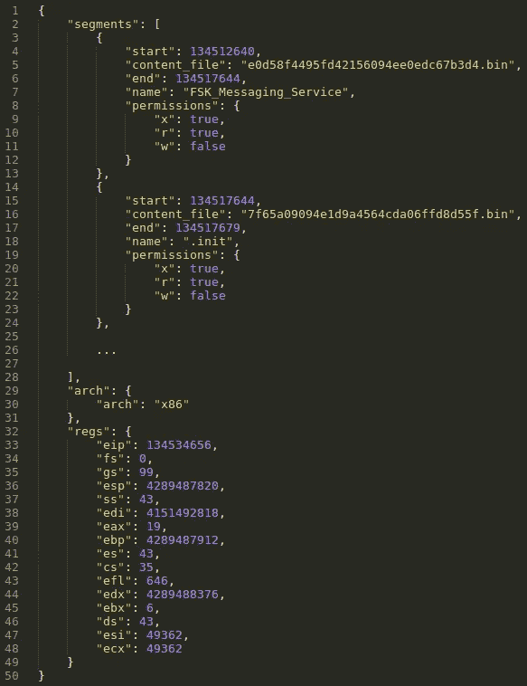

The _index.json file contains metadata for all memory segments, register context, and architecture information

## 创建一个模糊的 Unicorn 测试工具

现在我们有了一个开始仿真的起始上下文，我们编写一个 Unicorn 脚本来加载上下文(映射所有内存区域，将内容加载到其中，并设置寄存器内容)，挂接任何会中断仿真或会妨碍模糊化的内容(*【malloc()*，*【free()*)，校验和验证，等等。)，将一个新的包嵌入到适当的位置，并从头到尾模拟代码。我已经创建了一个[裸机模板](https://github.com/njv299/afl-unicorn/blob/master/unicorn_mode/helper_scripts/template_test_harness.py)作为测试工具的例子。

快进一点，下面显示的是完整的 Unicorn 脚本，它可以模拟 FSK_Message_Service 应用程序的应用层数据包解析，从 Unicorn 上下文转储器生成的上下文目录加载的初始状态开始。这个脚本非常依赖于从 afl-unicorn 提供的[*unicorn _ loader . py*](https://github.com/njv299/afl-unicorn/blob/master/unicorn_mode/helper_scripts/unicorn_loader.py)模块导入的功能。我们将在下面讨论一些更有趣的内容，但大部分内容都遵循了我在之前的博文中讨论的基本步骤。

这个脚本有一些独特的部分，使得仿真和模糊成为可能。下面详细描述了每种方法:

***从转储上下文中实例化 Unicorn 引擎实例:***[*Unicorn _ loader . py*](https://github.com/njv299/afl-unicorn/blob/master/unicorn_mode/helper_scripts/unicorn_loader.py)模块提供了一个新的*afunicornegine*类，该类派生自普通的*unicornegine*。构造函数有 3 个参数:上下文目录的路径、在 STDOUT 上启用跟踪输出的标志和在将上下文加载到 STDOUT 时启用调试输出的标志。

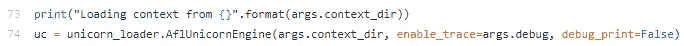

Once instantiated from a context directory, the AflUnicornEngine has all process memory mapped, register values initialized, and is ready to emulate from the instruction pointer

AflUnicornEngine 类还提供了一些额外的 API，这些 API 在模糊测试工具中很有用:

*   *dump_regs()* :将当前寄存器内容转储到标准输出
*   *force_crash(e)* :通过发出信号(SIGILL，SIGSEGV，SIGABRT 等)强制测试线束崩溃。).这让我们 AFL 检测到崩溃的发生并适当地记录日志。如果发生崩溃情况(比如 *emu_start()* 抛出异常)，你必须调用这个函数！

因为这个类是从基类 *UnicornEngine* 派生的，所以您仍然可以使用所有普通的调用，比如 *emu_start()* 、 *reg_read()* 和 *mem_write()* 。要查看在*afunicornegine*类上可用的所有 API，请通读 unicorn_loader 模块的[源代码](https://github.com/njv299/afl-unicorn/blob/master/unicorn_mode/helper_scripts/unicorn_loader.py)。

***挂钩所有堆分配(* malloc() *):*** 在仿真过程中调用 *malloc()* 会导致各种各样的问题。有可能分配器需要向内核请求更多的内存，但是在仿真期间，我们没有内核这样的东西…所以那会导致崩溃。为了防止这种情况，Unicorn 脚本将任何对 *malloc()* 的调用挂钩，转而调用一个基于 Unicorn 的实现，该实现由 *unicorn_loader.py* 模块中的 afl-unicorn 提供。下面的代码片段显示了用于 FSK_Messaging_Service 二进制文件的代码，这是一个 32 位的 Linux 二进制文件。

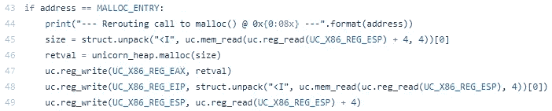

Calls to malloc() are redirected to our own internal, page-guarded, Unicorn-based implementation

在第 45 行，从堆栈中检索字节数。第 46 行调用内部的基于 Unicorn 的实现。第 47 行将返回值(分配的缓冲区地址)放入 EAX，第 48 和 49 行通过将 EIP 设置为返回地址，然后从堆栈中弹出返回地址，手动执行“返回”。所有这些都符合典型的 [x86 调用约定](https://en.wikipedia.org/wiki/X86_calling_conventions)。当将这种方法应用于您自己的二进制文件时，请确保您遵循了您给定的操作系统和架构的调用约定！

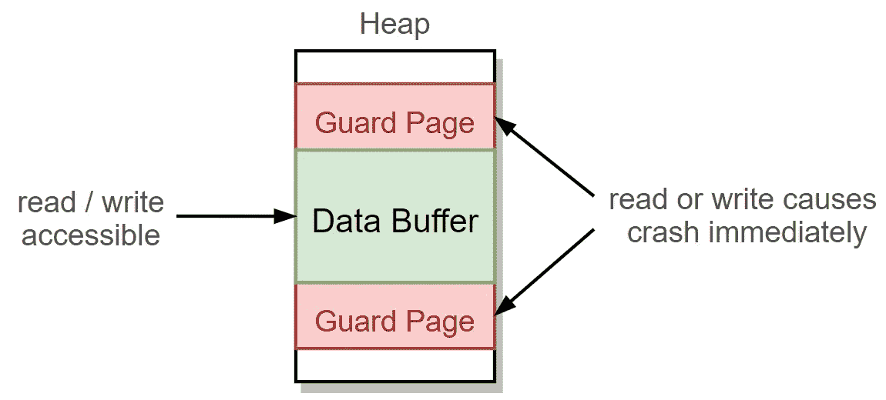

All buffers allocated by the Unicorn-based heap implementation are automatically surrounded by guard pages that will force crashes on any under/overflow

自己处理内存分配的另一个主要好处是，我们可以实现自己的基本[保护页](https://www.us-cert.gov/bsi/articles/knowledge/coding-practices/guard-pages)。基本上，所有分配的缓冲区都被没有读或写权限的“保护页”所包围。任何超出返回缓冲区边界的访问(也称为堆溢出或下溢)都会立即崩溃，并出现内存访问冲突。

注意，*UnicornSimpleHeap . py*模块中的 *UnicornSimpleHeap* 类也提供了 *free()、calloc()、*和 *realloc()* 功能，但是为了简单起见，我在本例中只选择了挂钩 *malloc()* 。为了模拟更大、运行时间更长、更复杂的代码，您可能希望或需要挂接所有与堆相关的函数。

***跳过不必要的、难以仿真的函数:*** 还有很多其他的事情显然会引起问题。*例如，Printf()* 肯定会调用内核，以便将要打印的文本发送到图形设备进行渲染。您将希望分析您试图模拟的代码，并努力识别您认为可能会破坏模拟的任何内容。在这个例子中，我已经确定 *free()* 、 *printf()* 和 *cgc_transmit()* 会因为各种原因导致仿真失败，而且我也可以跳过它们，不会对模糊结果产生任何重大影响。通过强制立即返回来跳过所有这些函数。这与上面描述的 *malloc()* 钩子的最后一部分是相同的:手动将 EIP 设置为堆栈中存储的返回地址，然后通过将 ESP 加 4 将返回地址弹出堆栈。请记住，这个确切的过程是特定于 x86 的，因此根据您的目标体系结构进行必要的调整。

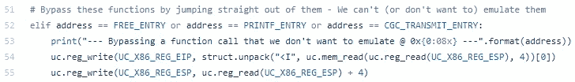

Problematic functions are immediately returned from when called. Make sure there aren’t unintended consequences to doing this!

***绕过校验和验证:*** 每个接收到的数据包都带有一个 16 位的 CRC，在验证数据包之前必须对其进行验证(请参考本文前面源代码片段中的第 27–31 行)。仅这一点就对传统的模糊化提出了重大挑战，因为任何盲目修改数据包的尝试都将导致 CRC 校验失败，并且几乎没有代码覆盖。这种类型的问题是众所周知的，但传统上它需要修补目标二进制文件或开发来为每个输入正确地生成有效的校验和。

Afl-unicorn 使得绕过这一点变得相当简单。对于本例，校验和验证在 IDA 中非常容易识别:

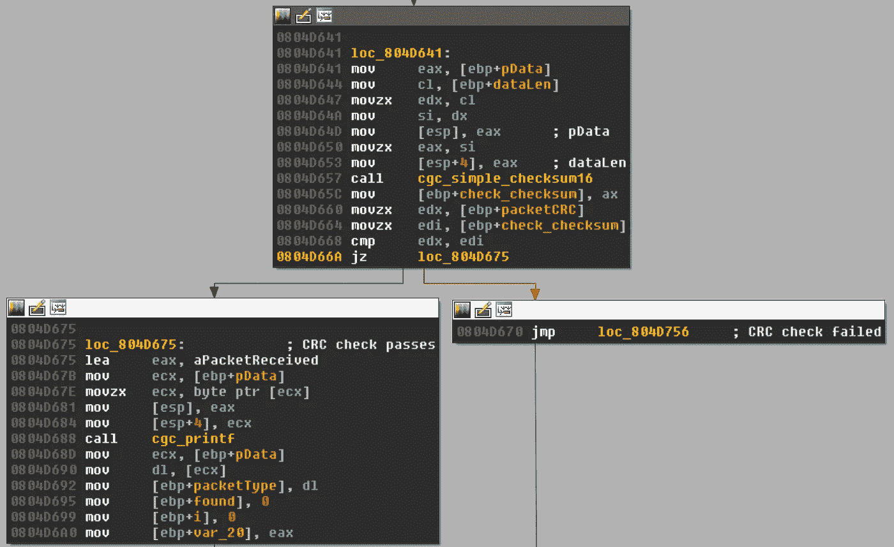

We want to make sure that when emulation fuzzing we always go down the path to the left

我们简单地将调用挂接到*cgc _ simple _ checksum 16()*，每当执行到达那里时，EIP 被手动设置为“CRC 校验通过”路径:

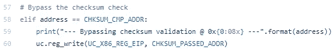

Bypassing the CRC check is really simple with Unicorn

这并不妨碍我们为了开发一个完整的工作漏洞而不得不在以后找出如何计算 CRC，但是它让我们将这项工作向前推进，而不是首先专注于发现漏洞。

***在加载变异的输入之前仿真一条指令:*** 这是最奇怪的部分，它实际上只是我如何将 AFL 植入 Unicorn 的一个工件，因为我[还没有想出真正内部问题的解决方案](https://github.com/njv299/afl-unicorn/issues/3):为了确保 AFL 的 forkserver 在正确的时间启动，在从磁盘加载变异的输入之前，你必须仿真至少一条指令。如果不这样做，那么 AFL 创建的每一个 fork 都将使用相同的输入来执行。在示例脚本中，这在第 82 行和第 87 行之间完成:

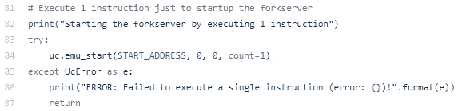

Yep, this is a hack…just accept it for now, and hopefully it will be fixed in the near future

所以基本上，在加载变异输入之前，您只需要在测试工具中的某个地方放上这段代码。不过，有一个细微差别:你需要问问自己，重新执行第一条指令是否会有任何负面后果。在这个例子中，执行的第一条指令是无害的“mov [esp]，ecx”，所以重新执行它不会有任何负面影响。如果您不想或负担不起重新执行第一条指令，只需在第二次启动仿真时适当调整起始地址( *uc.emu_start()* )。

## 用 afl-unicorn 对仿真二进制进行模糊处理

随着独角兽线束完成，唯一要做的事情就是在 afl-unicorn 下运行它，并希望它能找到一些崩溃。关于如何运行 afl-unicorn 的详细说明，请务必阅读我之前的博客文章，但是对于这个特定的实例，我们只运行典型的 afl-unicorn 命令行:

```
afl-fuzz -U -m none -i /path/to/inputs/ -o /path/to/results/ -- python fsk_message_service_test_harness.py /path/to/context_dir/ @@
```

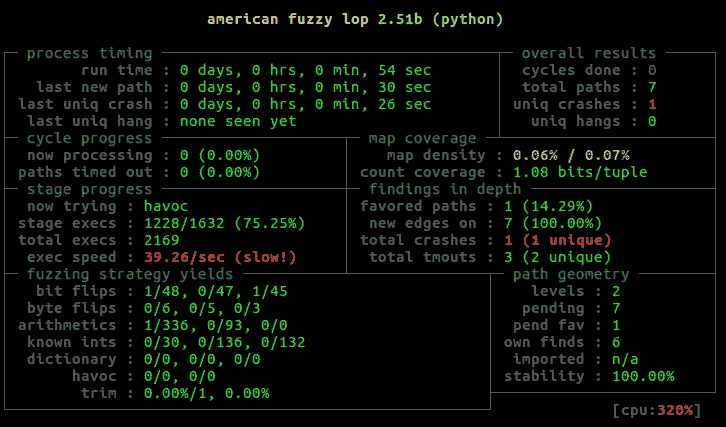

A crash is found in just a few seconds!

果然，它在挑战的[自述](https://github.com/trailofbits/cb-multios/blob/master/challenges/FSK_Messaging_Service/README.md)中描述的 *cgc_packet_receive()* 函数中发现了漏洞:

> 在接收到超过 64 字节最大分组大小的分组时，对新分配的分组结构的 memcpy 进行不正确的长度检查。这允许在堆上发生内存覆盖。该数据结构具有指向分组处理器的函数指针，该指针可以被重写，并且一旦服务执行该函数指针，就有机会通过重写该函数指针来执行控制流。

从转储崩溃的输入文件可以明显看出，对于在 *tSinglePacketData* 结构中分配的 *packetData* 缓冲区来说，数据包太大(> 48 字节):

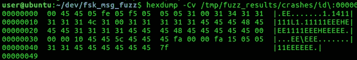

The crashing packet is larger than 48 bytes (the size of the buffer that the packet data is copied into during parsing)

然后，我们可以通过运行带有崩溃输入的 Unicorn 脚本来验证这一点:

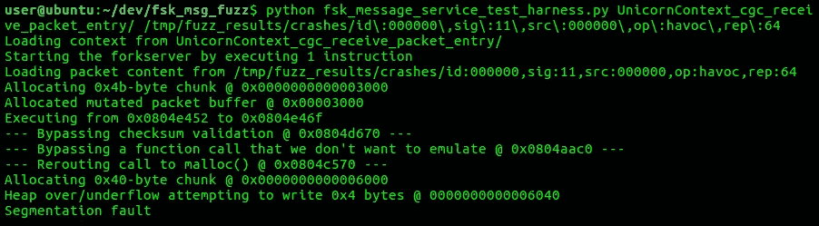

Run the crashing input through the Unicorn script to verify it and debug it more thoroughly

下一步是弄清楚如何将这个崩溃输入发送到实际的(非仿真的)应用程序中，并证明这是一个真实的、有效的崩溃，并且不是由仿真错误引起的。

## 调试基于仿真的模糊问题

我遇到的一些常见问题包括:

*   *没有发现路径*:确保在加载变异输入之前至少仿真了一条指令。如果不这样做，每个分支都会得到相同的不变输入。在 afl-unicorn 外部运行您的测试工具，并确保它从开始到结束地址没有任何问题。如果这不能解决问题，请确保变异的输入被正确地写入仿真内存和寄存器上下文。
*   *太多的崩溃被发现*:要么你发现了一些真正有问题的代码(头奖！)，或者有仿真问题。遵循仿真调试跟踪输出，并寻找中断仿真的东西，例如基于段寄存器的解引用、内核中的系统调用或动态模块加载。

如果情况看起来不错(新的路径被发现得相当有规律)，那么其他一切都遵循典型的 AFL 使用模式。确保您的样本输入很好地覆盖了目标代码，并模糊了您的核心内容。

# 我们在哪里，我们要去哪里

在这篇文章中，我展示了一个例子，说明我们如何使用 afl-unicorn 来模糊现实世界应用程序中难以触及的接口。我们发现这种方法在 Windows、Linux、Android 和 iOS 应用程序上非常有效，我认为它可以很容易地移植到嵌入式系统上。

未完成的任务主要是继续使用使这种方法可用的脚本，并将它们扩展到其他操作系统和体系结构。例如，模拟 Windows 应用程序会引入一长串问题，因为对 PEB 和 TIB 的引用会因为对 GS 段寄存器的引用而导致错误的崩溃。可以创建特定于操作系统的实用程序(以类似于已经在*UnicornSimpleHeap 模块中的 UnicornSimpleHeap 类的方式)来用最少的工具处理这些已知的情况。这将非常类似于 [usercorn](https://github.com/lunixbochs/usercorn) 项目所采取的路线。此外, [ripr](https://github.com/pbiernat/ripr) 项目非常有趣，我相信他们的代码生成方法很有可能被修改或扩展，以生成一个非常容易模糊化的模板测试工具。*

在以后的博客文章中，我计划针对从嵌入式系统中检索的平面运行时内存映像演示使用 afl-unicorn。该用例是创建 afl-unicorn 的原始灵感，我仍然相信它是理想的环境，因为它避免了在更复杂的多线程操作系统中模拟用户应用程序时引入的大多数问题。

# 信用

我与俄亥俄州哥伦布市[巴特尔](https://www.battelle.org/cyber)的[帕克·维克塞尔](https://medium.com/u/e5fb3c97cd06?source=post_page-----bea8de3540a5--------------------------------)合作开发了 afl-unicorn 和[方法论](https://hackernoon.com/tagged/methodology)，此处描述为内部研究项目。巴特尔是一个令人敬畏的工作场所，afl-unicorn 只是那里正在进行的新颖网络安全研究的众多例子之一。对于更多巴特尔赞助的项目，请查看[克里斯·多马斯](https://github.com/xoreaxeaxeax)和[约翰·托特希](https://github.com/cetfor)(又名 [cetfor](https://medium.com/u/d9f348e2859b?source=post_page-----bea8de3540a5--------------------------------) )之前的工作。有关巴特尔职业的信息，请查看他们的[职业页面](https://www.battelle.org/cyber-careers)。

当然，如果没有 AFL 的[和独角兽引擎的](http://lcamtuf.coredump.cx/afl/)和[这一切都是不可能的。许多额外的灵感来自亚历克斯·胡德为 IDA 开发的令人敬畏的 uEmu](http://www.unicorn-engine.org/) 插件，许多通用概念借鉴自 NCC 集团的 AFLTriforce 项目。许多额外的灵感来自于 usercorn 项目，因为它证明了 Unicorn 可以成功地运行用户空间应用程序。