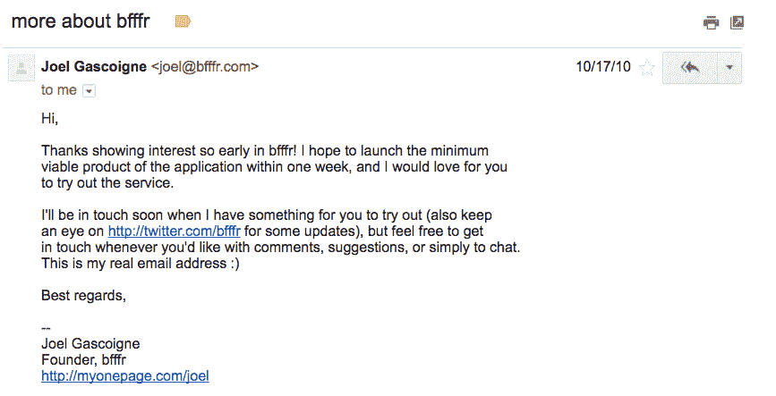
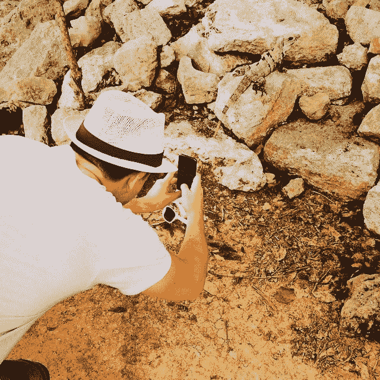
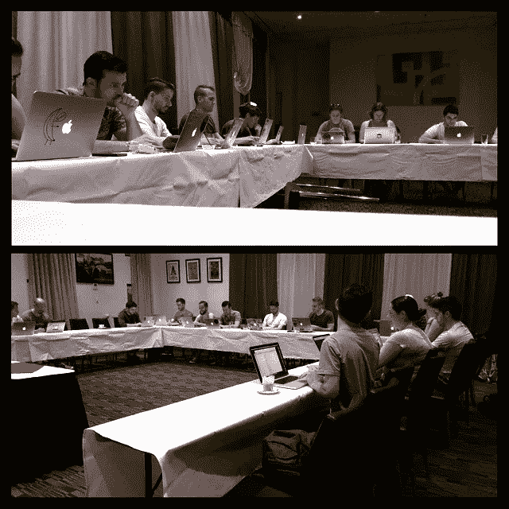
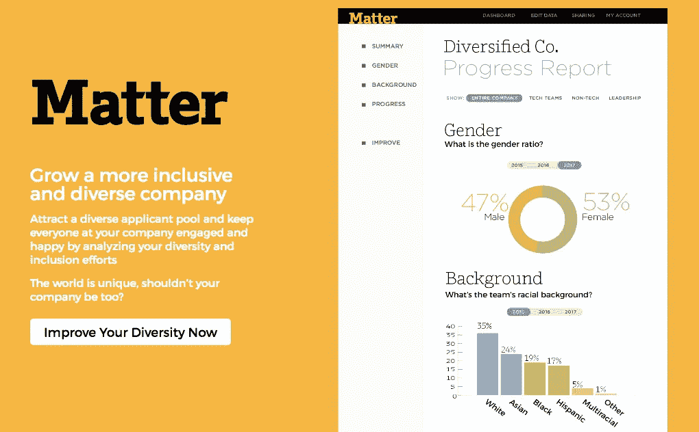

# 在 Buffer 呆了令人难以置信的 6 年后，我开始转向别的事情

> 原文：<https://medium.com/hackernoon/after-6-incredible-years-at-buffer-im-moving-on-to-something-else-e06ec40c3f16>

2011 年 1 月 3 日，我记得在 Skype 上与[乔尔](http://twitter.com/joelgascoigne)交谈。我们聊了聊生活和他的项目。我记得我曾就一个原型征求过一些建议，以创建我当时正在开发的学生测量软件。乔尔还向我介绍了他的项目“bfffr”的进展，这个项目是他几周前刚刚启动的:有 100 多人免费注册，3 人付费。我惊呆了，太不可思议了！就在几个月前，我把我的电子邮件放到了 Joel 的页面上，以跟上 bfffr 的发展:

我问他接下来的计划是什么，很快我们就结束了关于他的想法和 bfffr 未来机遇的头脑风暴。我非常兴奋，想尽我所能提供帮助，通话后，我们制定了一个行动计划:每天 30 分钟监控和发展@bfffr 的 Twitter 账户。我欣喜若狂！

接下来是长达 6 年的过山车之旅，它以一种我做梦都没想到会发生的方式改变了我的生活。在那段时间，我:

*   旅行到(而且经常有机会住进去！)遍布全球 20 多个地方，包括香港、以色列、南非、澳大利亚、东京、旧金山、柏林、圣地亚哥、纽约、尼泊尔、曼谷、夏威夷、伦敦、都柏林和其他许多地方。
*   在泰国度假时和其他 7 名队友食物中毒

*   完成 AngelPad 加速器计划
*   筹集了两轮资金
*   最近跨越了 100 万缓冲用户和 400 万缓冲用户
*   超过 65，000 名大大小小的付费客户
*   去旧金山、泰国、南非、纽约、悉尼、冰岛和夏威夷进行了 6 次缓冲静修
*   向 YCombinator 申请但被拒绝了
*   收购 1 家公司([回应](http://buffer.com/respond))以扩展客户服务和社交媒体
*   让我们的[工资完全透明](https://open.buffer.com/introducing-open-salaries-at-buffer-including-our-transparent-formula-and-all-individual-salaries/)和公开，并成为[一场透明运动的一部分](http://buffer.com/transparency)对全世界的科技公司来说闻所未闻。
*   [躲过 1 次黑客攻击](https://open.buffer.com/buffer-has-been-hacked-here-is-whats-going-on/)危及缓冲
*   在悉尼和缓冲队一起学习冲浪，然后在夏威夷变得更好
*   我们的收入增长到 1300 多万美元
*   在 3 年没有度假之后，和乔尔在墨西哥度假(坏主意！)

*   推出[业务缓冲区](http://buffer.com/business)以扩展我们的产品种类
*   将一个令人难以置信的团队发展到 80 人，以构建令人惊叹的社交媒体管理软件，并展示如何以文化第一的心态远程透明地建立一家公司

当我回想过去 6 年发生在我身上的一切时，我仍然心存敬畏。尽管随着年龄的增长，我意识到自己有很多特权，但我似乎不太可能有今天的成就，我在奥地利乡下一个 5000 人的小镇的一个普通家庭中长大，几乎不想放弃小城镇的生活，并在那里的“大城市”也就是维也纳上高中。我很感激在那段时间里从这么多朋友、家人、顾问和支持者那里得到的所有帮助，我认为自己有很大的责任去回报这些帮助，并把我学到的东西传递给其他正在寻找自己创业之路的人。

# 详细介绍我最喜欢的两个缓冲集

有许多故事要讲，我想挑出我们已经做的两件事，我认为它们产生了有意义的影响:

## 薪资透明度

对我来说特别突出的倡议是公开 Buffer 的工资结构以及从技术社区获得的令人难以置信的反应。关于这一计划的一些背景故事:我们刚刚在 2013 年初完成了缓冲值初稿的定稿，进行了一些困难的团队变更，并阐明了透明度是我们希望关注的一个关键问题。从那时起，我们不断思考我们在哪里，我们在哪里没有实现我们的价值观。在整个 2013 年夏天，我记得在不同的时候与 Joel 讨论过在内部和外部公开工资的潜在价值，其潜在想法是增加一个强大的工资公式来公平地确定工资，对每个人都没有偏见。我们越来越觉得，完全公开我们的薪酬将消除谈判和薪酬不平等方面潜在的不必要冲突。最重要的是，这将使我们能够向我们的客户和整个世界展示，我们是如何考虑我们团队的薪酬的，并有可能帮助其他正在努力为自己解决这个问题的创业公司的创始人。

所有这一切也感觉像一个巨大的禁忌，我记得在 12 月下旬宣布这一点的前夕，我和乔尔坐在一起讨论。我们讨论并预测了潜在的强烈反对，或者说，对一家小公司发布他们的工资信息的事实不感兴趣。当我们在 2013 年 12 月 19 日宣布这一消息时，当我们看到回应时，简直不敢相信自己的眼睛。在不到 24 小时内，我们有超过 100，000 人查看了我们的工资公式和公开的工资数据。然而，最让我震惊的是人们对我们发起透明运动表达的真诚感谢，当时我们不知道，一些人认为这进一步缩小了性别薪酬差距，并普遍减少了科技公司之间的薪酬不平等。在其中扮演一个小角色对我来说意义重大。

这是我们当时的原始帖子，我注意到已经有超过 400 条评论。

## 悉尼的休息时间和集会

另一个我很怀念的插曲，真的是一个相当小的插曲。那是 2015 年初，我们和大约 25 名爱好者在悉尼进行第四次缓冲静修。我们一起工作，在悉尼歌剧院看音乐会，一起冲浪等等，度过了一段神奇的时光。有一天，我们去悉尼动物园实地考察，这是一次非常棒的经历，只是在中途，我们遇到了一个大问题，导致我们的一个社交媒体服务中断。我们在动物园的餐厅坐下来，大家团结起来解决问题，重新开始运营。

之后，我们还一起来到酒店会议室，作为一个团队一起处理客户服务单:

事后看来，这只是一个短暂的现象，但不知何故，它代表了更多的东西。这种难以置信的凝聚力和共同努力的感觉比你更重要。这是一个特殊的结合时刻，我知道这使我们作为一个团队更加紧密地团结在一起，并使我们更好地应对[未来的](https://hackernoon.com/tagged/future)挑战和问题。

# 为什么要继续前进？

正如 Joel 在他的博客中概述的那样，我们发现运营一家伟大的公司自然有不同的方式。在过去的几年里，特别是在过去的 6 个月里，我们注意到乔尔和我在不同情况下的执行方式之间慢慢出现了一些差异。当我们讨论新产品供应、培养新团队成员的范围与绩效、以客户为中心与以团队为中心等话题时，我们往往会陷入范围的不同部分。就我个人而言，我认为这很自然。乔尔和我都有机会了解如何建立一家公司，并弄清楚什么样的风格让我们每天都感到兴奋。了解到我们之间的一些动机不同，这是一种积极的认识，也是我们分道扬镳的一个重要原因。至于上面的例子，我自然更倾向于传统的成长道路，也更倾向于行动。对于以前可能和我一起工作过的人来说，这并不奇怪。

另一个原因出现在乔尔和我就过去 6 个月左右我们作为首席执行官和首席运营官的结构进行了坦率的交谈，并认识到 it 领域的一些挑战。[乔尔与我分享了这篇文章](http://organizationalphysics.com/2015/02/18/organizational-design-why-you-should-not-have-a-president-and-coo/)，我认为它很好地解释了正在发生的一些斗争。Joel 告诉我，在他目前的角色和一些讨论中，一个巨大的真空为他打开了，让他感到真正的满足和与团队的联系。我完全认识到这一点，并希望全力支持 Joel 在这里实现他的抱负，在未来的日子里，他将更多地扮演运营角色。这让我思考我今后的角色应该是什么，以及我如何才能最大限度地帮助缓冲。

鉴于这两个原因，我得出的结论是，我在 Buffer 的位置不是未来的运营角色。在离开我的日常职责时，我想让 Joel 完全回到日常管理中，为他充分发展和执行他为 Buffer 设定的愿景腾出空间。

因此，我认为自己是 Buffer 最大的啦啦队长，尽管我在运营方面并不活跃，但 Joel 和我都很高兴我能担任顾问和董事会成员的非执行角色。我对这个角色的计划是继续成为乔尔、我们的投资者和团队的传声筒，特别是在我们共同开创 Buffer 的新篇章时的执行团队。

就我个人而言，我真的为 Buffer 的下一步感到兴奋，并对 Joel 充满信心，尤其是现在他可以完全向他认为对 Buffer 最有利的方向倾斜。Joel 长期以来一直受到 Basecamp、Mailchimp、Patagonia、Union Square Hospitality group 等公司的启发，我知道这些公司将成为 Buffer 公司的伟大榜样。

# 特别感谢和感激

我特别感谢 Joel，他从一开始就支持我天真的方法，并不断指导我，向我提供反馈，告诉我如何变得更好，如何改善与客户、合作伙伴和团队成员的关系。我特别记得的一些亮点是我在 Twitter 上与潜在新客户的争论，Joel 帮助我从他们的角度看待问题，并帮助我扭转局面。同样的道理也适用于我们与新公司建立合作伙伴关系，以整合 Buffer，坚持我们的价值观，并始终保持礼貌，尝试真正从他人的角度看待问题。我记得这些年来，我和乔尔坐在许多电子邮件旁，花了许多时间来真正掌握正确的语气和体验，尽可能真实地理解人们。我认为这让 Buffer 取得了巨大的成功，也让我个人学会了如何与人友好相处，并推动公司向前发展。这是一种我不知道我是否能在生活中的其他地方学到的知识，我非常珍惜这种知识。

我还要特别感谢今天组成 Buffer 团队的一群了不起的人，感谢卡罗、凯旺、阿萨和卡林，他们已经成为 Buffer 真正的中流砥柱，是公司很大一部分人所依赖的。这些年来，我从你们身上学到了很多。我很感谢 Courtney，她让我看到了多样性及其重要性，以及我生命中大部分时间对它的无知，这真的改变了我今天看待世界的方式。

还要特别感谢 Buffer 的 to Sunil，他也是 Buffer 的前任，多年来不知疲倦地工作，帮助 Buffer 成为今天这样一个坚实的平台，每天处理数百万条社交媒体帖子。自从决定离开后，Sunil 和我讨论了继续在我们的新想法 Matter 上合作，我很高兴在下面分享更多。

我很感谢所有其他的巴弗鲁，马克斯，妮可，史蒂文，凯蒂，汤姆，丹，玛丽，布莱恩，迈克尔，达沃，尼尔和许多其他人(我知道我在这里忘记了一些！)，在过去的几年里我有机会和它一起工作。我反思得越多，就越感激我们能够将这样一群富有同情心的人聚集在一起，他们真正思考我们如何对待彼此和我们的顾客。

2017 年我为 Buffer 激动！为新的水域和探索干杯！

# 我的下一步是什么？

经过过去几周的大量思考，并得出了和乔尔一起离开的结论，我再次冒险进入这个世界，寻找下一步该做什么。我很快开始做一些策划，并发现了一个非常令人满意的领域，我想深入其中:科技领域的多样性和包容性。我有一些深刻的个人经历，我对许多代表性不足的少数群体和边缘化群体面临的困难了解甚少，我相信那里有令人难以置信的积极的前进势头，也有如此多的伟大工作要做，我很高兴能有所贡献。你可以在这里了解更多关于我新公司的事情: [matterapp.io](http://matterapp.io)

我也非常兴奋地宣布 [Sunil Sadasivan](https://medium.com/u/892628a3c87c?source=post_page-----e06ec40c3f16--------------------------------) 将加入我与 Matter 的新努力，致力于我们的使命，帮助改变技术领域的多样性和包容性，我相信在这个领域有很多重要的工作要做。如果你有兴趣，你可以在这里了解更多[！在接下来的几周里，我会分享更多的细节。](https://www.matterapp.io/)

谢谢你们所有人的支持和跟随我的旅程！

Joel and me on our way to lunch in San Francisco

> [黑客中午](http://bit.ly/Hackernoon)是黑客如何开始他们的下午。我们是 [@AMI](http://bit.ly/atAMIatAMI) 家庭的一员。我们现在[接受投稿](http://bit.ly/hackernoonsubmission)并乐意[讨论广告&赞助](mailto:partners@amipublications.com)机会。
> 
> 如果你喜欢这个故事，我们推荐你阅读我们的[最新科技故事](http://bit.ly/hackernoonlatestt)和[趋势科技故事](https://hackernoon.com/trending)。直到下一次，不要把世界的现实想当然！

