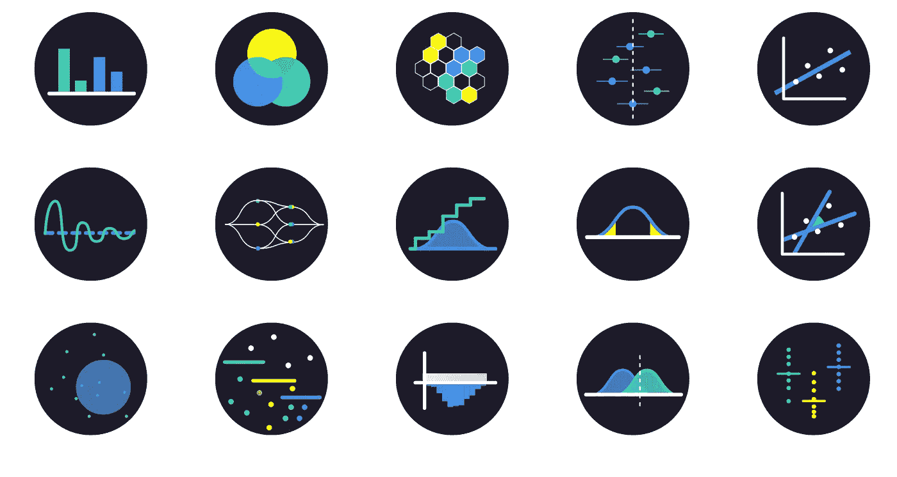

# 🔮继优步之后，Snapchat 的繁荣与科技伦理第 103 位

> 原文：<https://medium.com/hackernoon/after-uber-snapchats-boom-tech-ethics-103-40aaf468766e>

## 🚀这是指数视图的第 102 期。在此注册订阅时事通讯。

Visualising probability and statistics

Snapchat pops。即使优步崩溃，拼车仍将存在。对公司指数增长的关注是如何导致腐败的。贸易和保护主义。提前预测自杀。与杰夫·萨克斯的对话。

希望这能引发伟大的对话！

😍**喜欢这个吗？**一定要通过**Twitter**、[LinkedIn](https://www.linkedin.com/shareArticle?mini=true&url=http://azeem.io/s&title=Azeem%27s%20Exponential%20Digest%20-%20highly%20recommended&summary=&source=)、[脸书](https://www.facebook.com/sharer/sharer.php?u=http://azeem.io/s)分享给[。](https://twitter.com/intent/tweet?text=Love%20Exponential%20View%20from%20@azeem%20Great%20weekly%20newsletter%20Sign%20up%20http://azeem.io/s)

# 近期发展部

👻Snapchat 真的价值 330 亿美元吗？(还有，*《经济学人》* [解释 Snapchat](http://www.economist.com/blogs/economist-explains/2017/03/economist-explains-0) 。)

🚗[优步之后。优步可能会内爆。Kevin Maney 认为“运输即服务”在 T21 仍有美好的未来。**精彩阅读**(注:本文发表于三年前](http://europe.newsweek.com/uber-turn-silicon-valley-spectacular-crash-563716?rm=eu)[揭露比特币](http://europe.newsweek.com/face-behind-bitcoin-247957?rm=eu)创造者的《新闻周刊》。)

🔥大卫·海涅迈尔·汉森认为指数增长会吞噬和腐蚀。我们需要为指数增长逻辑提供现实的、道德的替代方案。不仅仅对少数富人有利，对我们所有人都有利。未来真的取决于此。**驱除**

🔮播客:[杰夫·萨克斯](/tag/jeffrey-sachs)和我[就人工智能、自动化、基本收入、不平等和亚里士多德](https://soundcloud.com/exponentialview/ai-automation-the-economy-jeff-sachs-in-conversation-with-azeem-azhar)进行了一次非常棒的对话。**必须倾听。**

🙏🏼与丹尼尔·丹尼特就人工智能、机器人和宗教展开大讨论。($) **发人深省的阅读**

# 技术伦理系

我们定期在*指数视图*中讨论道德规范。理由相当简单。我们越来越多地通过技术来获取所有服务。技术早已超越了它的利基地位，而是我们与世界的基本接口。

科技行业的乐观情绪(尤其是随着上世纪八九十年代互联网的兴起)是，权力将被分散和分配。互联网本应是一个去中心化的开放网络。为了在核毁灭中生存(如果 MAD 提供的防御线失败了)，互联网的第一批服务是由受 20 世纪 60 年代后期反文化运动影响的有思想的网民发起的。(例如，参见[乔恩·波斯特尔](https://www.internetsociety.org/articles/memory-jon-postel)和[斯图尔特·布兰德](https://www.edge.org/conversation/fred_turner-stewart-brand-meets-the-cybernetic-counterculture)。)

在过去的 30 年里，互联网成长起来了。互联网远非去中心化，偏向边缘和促进群体，而是被两个庞然大物脸书和谷歌所主宰。

与此同时，一个模板，称之为“零对一”，已经出现，用于建立新的垄断，新的利维坦。正如 DHH 在上文所描述的那样，这个模板就是追求极端增长的不懈优化。不惜一切代价。不惜任何代价。

领导这些公司的工程师企业家们发现自己处于权力的位置，需要更多的苏格拉底而不是计算尺，需要更多的穆勒和马克思而不是机器学习，需要更多的罗尔斯而不是回归分析，需要更多的亚里斯多德而不是人工智能，需要更多的娜斯鲍姆而不是九十天计划…

*   🎱《纽约时报》**透露，灰球是[优步逃避监管部门和执法的工具。](https://www.nytimes.com/2017/03/03/technology/uber-greyball-program-evade-authorities.html)*该公司“多年来一直参与一项全球计划，在一些市场欺骗当局，在这些市场，其低成本叫车服务受到执法部门的抵制，或者在某些情况下被禁止。”*
*   *昆西·拉森(Quincy Larson)讲述了优步、大众和 Zenefits 如何以可疑的方式使用代码来规避当局。*
*   *EV reader，Vivek Wadhwa: [学生能从优步的麻烦中学到什么。](https://www.washingtonpost.com/news/innovations/wp/2017/03/04/what-students-should-learn-from-ubers-recent-troubles/)*
*   *硅谷性别歧视的惊人规模。*
*   *亚当·帕西克:脸书谈论它如何影响选举。(本上 FB 的[页)。)](https://www.facebook.com/business/success/toomey-for-senate)*
*   *🐈伊莎贝拉·卡明斯卡 : [病毒猫视频的真实碳成本](https://www.ft.com/content/68b38ac2-fced-11e6-8d8e-a5e3738f9ae4)*

# *人工智能系*

*如果算法可以在你周围的人之前发现自杀风险，会怎么样？或者可能在你知道之前。在一篇即将发表的论文中，一名研究人员声称[能够提前两年以 80%的准确率发现自杀风险](https://news.fsu.edu/news/health-medicine/2017/02/28/how-artificial-intelligence-save-lives-21st-century/)。*

*类似的同行评议工作已经[将机器学习应用于身体症状的长期观察](https://www.ncbi.nlm.nih.gov/pmc/articles/PMC4960407/)以提高自杀风险的早期识别。该模型实现了 0.71 的 AUC 性能，比 0.56 的临床医生 AUC 有了显著改善。(完美预测的 AUC 为 1.0)。*

*就连脸书也开发了[一种算法，可以根据你的状态更新发现自杀风险](http://www.bbc.co.uk/news/technology-39126027)。谷歌搜索数据似乎也能做到这一点。*

*这让我想起了[我和尤瓦尔·赫拉利](https://soundcloud.com/exponentialview/homo-deus-a-conversation-between-yuval-harari-and-azeem-azhar)关于算法何时比我们自己更了解我们的讨论。无论是来自状态更新的脸书，还是来自定期公共健康监测的身体症状模式，我们比以往任何时候都更能预测个人行为。*

*   ***💡优秀:**[经济学家是否应该更担心人工智能](https://bankunderground.co.uk/2017/03/01/should-economists-be-more-concerned-about-artificial-intelligence/)？“就其更广泛的工业和职业应用及其传播速度而言，目前正在发展的技术进步具有非常不同的性质”，这意味着我们以前的模型可能不适用。*
*   *[布拉德福德克罗斯:](https://medium.com/@bradfordcross/latest) [五次 AI 启动预测](http://www.bradfordcross.com/blog/2017/3/3/five-ai-startup-predictions-for-2017) **超级**(TL；dr:全栈运行)*
*   *[Medha Agarwal](/@medhaa) : [关于机器学习](/@medhaa/three-things-you-need-to-know-about-machine-learning-99e6f5815aee#.uea0t7nnj)及其对产品影响的不错的入门书。*
*   *Tensorflow (以及更广义的现代机器学习)中的[张量有哪些？**不错的介绍**](https://hackernoon.com/learning-ai-if-you-suck-at-math-p4-tensors-illustrated-with-cats-27f0002c9b32#.frkkcgxcq)*
*   *合成数据集如何推动人工智能的发展*
*   *网飞使用[机器学习来动态增强视频质量](https://qz.com/920857/netflix-nflx-uses-ai-in-its-new-codec-to-compress-video-scene-by-scene/)*
*   *苹果可能有大约[1000 名 AR 工程师在以色列工作](http://www.roadtovr.com/ubs-apple-could-have-over-1000-engineers-working-on-ar-in-israel/)。*
*   *播客:[用清醒梦控制电脑](http://www.cbc.ca/radio/quirks/don-t-pee-in-the-pool-bees-play-ball-and-lucid-dreaming-1.4008562/can-we-control-computers-with-our-dreams-1.4008629)*
*   *千禧一代[爱语音接口](http://readmultiplex.com/2017/03/01/survey-millennials-have-a-voice-first-love-affair/)*
*   *📜JP 摩根成功利用机器学习从根本上优化贷款评估的有趣简介[。](https://www.bloomberg.com/news/articles/2017-02-28/jpmorgan-marshals-an-army-of-developers-to-automate-high-finance)*

# *指数观点私人晚宴:特朗普时代的国际关系*

*我真的很期待我们的下一次指数视图晚宴。*

*我们的讨论将由《经济学人》前主编比尔·埃莫特主持。*

*比尔是全球商业和国际政治经济方面的世界专家，他几乎不需要进一步介绍。*

*我们将触及作为公民、企业家和投资者面临的最紧迫的问题之一。与我们这些全球行业(如科技、健康、金融、教育等)的人尤其相关。)*

*如果你想参加，请在这里登记你的兴趣。*

*我们会很高兴见到你。*

# *在晚宴上显得聪明的小点心*

*在刚果当钴矿工的儿童。*

*500 年前，[中国凿沉了它的“宝藏舰队”](http://uk.businessinsider.com/china-zhenge-he-treasure-fleet-elite-free-trade-2017-2)并反对自由贸易。(随着一个国家走向保护主义，国家贸易关税如何演变的图表。[来源文章](https://ideas.repec.org/a/sej/ancoec/v674y2001p848-868.html)。)*

*伦敦房价开始下跌。 ( [)对自由落体运动中一套豪华公寓的精彩剖析](/@danfareyjones/lets-go-fly-a-kite-2a4da0a62533#.y3p7b0gru)。)*

*利用[卫星图像预测公司业绩](https://theoutline.com/post/1169/jc-penney-satellite-imaging)*

*当工厂的工作岗位消失时，男人就不再是理想的伴侣了*

*处于缓解期的晚期癌症患者[经过一次基因疗法治疗。](http://www.telegraph.co.uk/science/2017/02/28/terminal-cancer-patients-complete-remission-one-gene-therapy/?utm_content=buffer897ec&utm_medium=social&utm_source=facebook.com&utm_campaign=buffer)此外，基因疗法[消除了患者的镰状细胞贫血。](http://edition.cnn.com/2017/03/03/health/sickle-cell-anemia/index.html)*

*[Youtube 的观看率正在赶超电视](https://www.wsj.com/articles/youtube-tops-1-billion-hours-of-video-a-day-on-pace-to-eclipse-tv-1488220851)。*

*美国消费者现在每天花 5 个小时在移动设备上。(占他们全部时间的 21%！！)*

*概率和统计的精彩互动可视化*

*[微生物群和湿疹](http://bigthink.com/robby-berman/it-may-be-your-microbiome-will-become-your-personal-pharmacy)。令人着迷。*

*为什么泛灵论可能是意识的最佳解释*

# *结束注释*

*我对微生物组越来越感兴趣，所以我准备了一些关于这个主题的书籍推荐。这可能会在某个时候导致播客或事件。一定要让我知道你的建议。*

*阿兹姆*

*如果你还没有找到我们，请花点时间在 Twitter 上找到我们。*

******

> *[黑客中午](http://bit.ly/Hackernoon)是黑客如何开始他们的下午。我们是 [@AMI](http://bit.ly/atAMIatAMI) 家庭的一员。我们现在[接受投稿](http://bit.ly/hackernoonsubmission)，并乐意[讨论广告&赞助](mailto:partners@amipublications.com)机会。*
> 
> *如果你喜欢这个故事，我们推荐你阅读我们的[最新科技故事](http://bit.ly/hackernoonlatestt)和[趋势科技故事](https://hackernoon.com/trending)。直到下一次，不要把世界的现实想当然！*

**